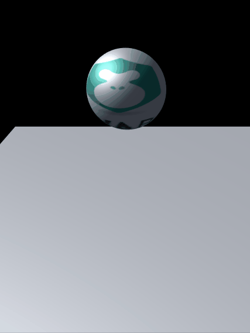

# LayaAir3D之物理入门

####Quickly Open the Journey of 3D Physics

Below we will use the LayaAir engine to start a 3D physics project quickly, and use AS language as a tutorial, a simple demonstration of using engine code to achieve a basic 3D physics application. Let's preview the effect first.




In Maine's class, we build a 3D physical world, and add the elements necessary for a simple 3D physical world (rigid body and Collider components). We will introduce these conceptual knowledge in detail in the follow-up tutorial, and gradually lead you to understand the 3D knowledge.


For this simple Demo, we just created the physical effect of a ball falling naturally by gravity and colliding with another ball. We can tap the code manually to experience the effect, or we can copy the code directly, and learn the knowledge points in detail in subsequent documents.

The main class code is as follows:


```typescript

import GameConfig from "./GameConfig";
import SceneScript from "./script/SceneScript"; 
class Main {
         constructor() {
            //初始化引擎
            Laya3D.init(0, 0);
            //适配模式
            Laya.stage.scaleMode = Laya.Stage.SCALE_FULL;
            Laya.stage.screenMode = Laya.Stage.SCREEN_NONE;
            //开启统计信息
            Laya.Stat.show();
           	Laya.loader.load("res/layabox.png",Laya.Handler.create(this,this.loadComplete));
        }        
        private loadComplete():void{
            var _scene:Laya.Scene3D = new Laya.Scene3D();
            Laya.stage.addChild(_scene);
            _scene.addComponent(SceneScript);
        }
    }

//激活启动类
new Main();
```

Scenario script code:

```typescript


export default class SceneScript extends Laya.Script3D{
        private scene:Laya.Scene3D
        constructor(){
            super();
        }

        onAwake():void{
            this.scene = this.owner as Laya.Scene3D;
        }
    
        onStart():void{
            var camera:Laya.Camera = (this.scene.addChild(new Laya.Camera( 0, 0.1, 100))) as Laya.Camera;

            camera.transform.translate(new Laya.Vector3(1, 6, 10));
            camera.transform.rotate(new Laya.Vector3( -30, 0, 0), true, false);
            camera.clearColor = null;
            
			var directionLight:Laya.DirectionLight = this.scene.addChild(new Laya.DirectionLight()) as Laya.DirectionLight;
            directionLight.diffuseColor = new Laya.Vector3(0.6, 0.6, 0.6);
            directionLight.transform.worldMatrix.setForward(new Laya.Vector3(1, -1, 0));

            //添加自定义模型
            var sphere:Laya.MeshSprite3D = this.scene.addChild(new Laya.MeshSprite3D(new Laya.SphereMesh(1,100,100))) as Laya.MeshSprite3D;
            sphere.transform.rotate(new Laya.Vector3(0,90,0),false,false);
			sphere.transform.translate(new Laya.Vector3(0,3,0));
            sphere.meshRenderer.material = new Laya.BlinnPhongMaterial;
            var material:Laya.BlinnPhongMaterial = new Laya.BlinnPhongMaterial();
            Laya.Texture2D.load("res/layabox.png", Laya.Handler.create(null, function(tex:Laya.Texture2D):void {
                material.albedoTexture = tex;
            }));
            sphere.meshRenderer.material = material;
            
			//添加物理组件
			sphere.addComponent(Laya.PhysicsCollider);
			//给球添加刚体
			var rigid:Laya.Rigidbody3D = sphere.addComponent(Laya.Rigidbody3D);
			//有刚体的shape要加在刚体上
			rigid.colliderShape = new Laya.SphereColliderShape(1);
			//添加一个地板
			var floor:Laya.MeshSprite3D = this.scene.addChild(new Laya.MeshSprite3D(new Laya.PlaneMesh(10,10))) as Laya.MeshSprite3D;
			//给地板添加物理组件
			var floorCollicar:Laya.PhysicsCollider = floor.addComponent(Laya.PhysicsCollider);
			// 添加collidershape
			floorCollicar.colliderShape = new Laya.BoxColliderShape(10,0,10);
            //克隆一个球                
            Laya.timer.once(1000,this,function():void{
              //一秒之后复制一个球
                 var cloneSphere:Laya.MeshSprite3D = Laya.Sprite3D.instantiate(sphere) as Laya.MeshSprite3D;
                //设置位置偏移
                 cloneSphere.transform.translate(new Laya.Vector3(1,4,0));
                //添加到场景
                this.scene.addChild(cloneSphere);
            });
        }
    }  
```


The prite.instantiate method for object replication can be understood from the API, which is more convenient than clone method. Specific habits can be used according to personal habits and scenarios.

		


​


  **[tip: In this case, it involves adding Physics Collider and Rigid Body3D to objects using code. When an object has a rigidbody, shapes need to be added to the collidershape of the rigidbody, and if not, shapes need to be added to the collidershape of the Physics Collider. ]**

Then we add elasticity and rolling friction to the ball.


```java

.......
  //添加一个重量
  rigid.mass = 10;
  //添加弹力
  rigid.restitution = 1;
  //添加滚动摩擦力
  rigid.rollingFriction = 0.5
.......
```


Look at the effect of the modification:

