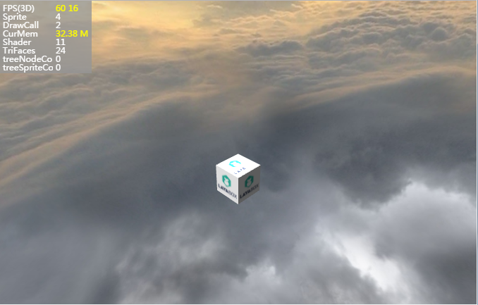

#Camera of LayaAir3D Camera

The camera in LayaAir can be interpreted as a camera when shooting a movie or TV series, which captures a three-dimensional picture of the world and then presents it on the screen. At the same time, VR cameras have been added to the LayaAir3D engine, which can be used by developers to develop VR stereo applications or games.

Of course, there are other important attributes of the camera. The functions of the camera are described below.

**(tips: The following sample code is in the`快速开启3D之旅`Modify on the basis of the code in the document)**

###Derivation of Camera from Unity

After the release of engine version 1.7.10 and unit export plug-in version 1.5.0, the camera created in unit can be exported! And the export file retains the position, perspective, background color, clipping, visual field and other parameters of the camera in the 3D space. When loading the exported scene, the display effect is exactly the same as that in Unity, which facilitates the developer's control of the camera's visual angle.

At the same time, because the LayaAir 3D engine supports multiple cameras, you can also set up multiple cameras in Unity and export them. For the view settings of multiple cameras, please see the "Multi-Camera Usage" section at the end of this lesson.

So, if the camera is created in Unity and exported, how do we get the camera after loading the exported file in the code? This can be obtained by the index or name of the sub-node of the scene. After acquisition, we can also move and rotate it, set the skybox, add scripts and other operations.

The code is as follows:


```typescript

class Main {
    constructor() {
        //初始化引擎
        Laya3D.init(0, 0);
        //适配模式
        Laya.stage.scaleMode = Laya.Stage.SCALE_FULL;
        Laya.stage.screenMode = Laya.Stage.SCREEN_NONE;
        //开启统计信息
        Laya.Stat.show();
        //加载资源
        Laya.loader.create("LayaScene_test/test.ls",Laya.Handler.create(this,this.onLoaded));
    }
    private onLoaded():void{
        //添加3D场景
        var scene:Laya.Scene3D = Laya.loader.getRes("LayaScene_test/test.ls");
      	Laya.stage.addChild(scene);
      	//从场景中获取摄像机
      	var camera:Laya.Camera = scene.getChildByName("Main Camera") as Laya.Camera;
      ......
    }
}
new Main();
```


###Camera Movement and Rotation

Camera is inherited from Sprite3D, so it can also be transformed into 3D. It can move and rotate in the 3D scene through the transformation attribute, and view from multiple angles, so that the audience or the game can get a more real space experience.

Set the rotation of the camera:


```typescript

//实例化一个相机，设置纵横比，0为自动匹配。0.1是最近看到的距离，100是最远看到的距离
var camera:Laya.Camera = new Laya.Camera(0,0.1,100);
//移动相机，设置相机向z轴移动3米，true代表的是局部坐标，false是相对世界坐标
camera.transform.translate(new Laya.Vector3(0,0,3),false);
//加载到场景
scene.addChild(camera);
```


Set the rotation of the camera:


```typescript

//欧拉角旋转相机。局部坐标，弧度制（false为角度制）
camera.transform.rotate(new Laya.Vector3(0,0,3),true,true);
```


###Camera Orthogonal Projection and Perspective Projection

When we look at the world, we see the world with "near big, far small" perspective effect. In the 3D engine, in order to better simulate the world seen by the human eye, the default camera has the effect of "perspective projection".

</br>(图1)默认透视投影


But there are a large number of games, especially the mixed games of 2D and 3D with 45-degree angle of view. The game picture can not bring perspective effect. At this time, we need to set the camera as "orthogonal projection" so that it does not produce near-large-far perspective effect.


```typescript

//正交投影属性设置
camera.orthographic = true;
//正交垂直矩阵距离，控制3D物体远近与现实大小
camera.orthographicVerticalSize = 7;
//移动摄像机位置
camera.transform.translate(new Laya.Vector3(0,26.5,45));
//旋转摄像机角度
camera.transform.rotate(new Laya.Vector3(-30,0,0),true,false);
```


</br>(图2)正交投影


###Camera Cutting and Vision

**Close and far tailoring**

The camera can also set the distance clipping to only display the scene model between the distance, and the other models will not be rendered. Its greatest advantage is to improve the performance of the game.

When a camera is created, the camera constructor is clipped by default to 0.3 m at close range and 1000 m at long range (Figure 1). Developers can set it in constructors or through camera properties.

</br> (Fig. 3)


```typescript

//创建摄像机时初始化裁剪（横纵比，近距裁剪，远距裁剪）
var camera:Laya.Camera = new Laya.Camera(0,0.1,100);
//近距裁剪
camera.nearPlane = 0;
//远距裁剪
camera.farPlane = 100;
```


Tips: generally in the game, we will use fog effect and camera cutting at the same time, fog effect beyond the distance is basically not clear, then you can set up long-distance cutting, improve the rendering performance of the game.

**Camera vision**

Camera field of view is similar to focal length. By adjusting the parameters of field of view, we can see the changes of scene range and perspective. It is adjusted by the angle value. The larger the angle, the larger the field of view, the developers can set it according to their own needs.


```typescript

//设置相机的视野范围90度
camera.fieldOfView = 90;
```


###Camera captures target

When creating a camera, we often need to adjust the position of the camera to show a three-dimensional object or display an area. For beginners, spatial thinking has not yet formed a habit, adjusting the position will take a lot of time.

The 3D transformation in LayaAir3D engine provides a lookAt () method for capturing targets and automatically adjusting 3D objects to target points. The camera can also be used to adjust our perspective. The code is as follows:

Look At (target observes target vector, up vector, isLocal is local space)


```typescript

//添加3D场景
var scene:Laya.Scene3D = new Laya.Scene3D();
Laya.stage.addChild(scene);
//添加自定义模型
var box:Laya.MeshSprite3D= scene.addChild(new Laya.MeshSprite3D(new Laya.BoxMesh(1,1,1))) as Laya.MeshSprite3D;
box.transform.rotate(new Laya.Vector3(0,45,0),false,false);
//添加摄像机
var camera:Laya.Camera = (scene.addChild(new Laya.Camera())) as Laya.Camera;
camera.transform.translate(new Laya.Vector3(0,1,5));
//摄像机捕捉模型目标
camera.transform.lookAt(box.transform.position,new Laya.Vector3(0,-1,0));
```


We set up the up of the camera in the direction of (0,-1,0). The Y direction of the camera is negative, and it will be reversed on the Y axis, so the picture becomes an inverted cube (Figure 4). Beginners in several other directions can try more.

</br> (Figure 4) Capturing the target


###Camera Background Color and Sky Box

**Background color**

In 3D scene, background color is controlled by camera. The background color in 3D space is changed by setting clearColor attribute of camera. The color is assigned and adjusted by three-dimensional vector Vector 3 (red, green, blue), and the engine is set to pure black by default.


```typescript

//设置背景颜色
camera.clearColor = new Laya.Vector4(0.5,0.5,0.6,1);
```


**Sky box**

In most scenarios, sky vision is needed, such as blue sky, white clouds, dusk, stars, etc. In LayaAir3D engine, sky box is created by adding SkyBox to camera attributes.

However, if the camera uses orthogonal projection, skybox will not achieve the desired effect, developers can try.

Skybox is made up of a cube model and six seamless texture maps, which is somewhat similar to 360 panoramic maps. With the rotation of the viewing angle, we can see that there are prospective effects in all directions.


```typescript


//清除标记，使用天空（必须设置，否则无法显示天空）
camera.clearFlag = Laya.BaseCamera.CLEARFLAG_SKY;
//绑定天空盒对象到摄像机
camera.SkyBoxMaterial = skyBox;
//天空盒加载（测试资源会随时更新，与文档截图不一致，以实际为准）
Laya.BaseMaterial.load("https://layaair.ldc.layabox.com/demo2/h5/res/threeDimen/skyBox/DawnDusk/SkyBox.lmat", Laya.Handler.create(null, function(mat:Laya.SkyBoxMaterial):void {
			var skyRenderer = new Laya.SkyRenderer();
		    skyRenderer.mesh = Laya.SkyBox.instance;
		    skyRenderer.material = mat;
		    this.camera.skyRenderer = skyRenderer;
		    Laya.timer.frameLoop(1, this, this.onFrameLoop);
            Laya.timer.frameLoop(1, this, function():void {
				this.camera.skyRenderer.material.exposure = Math.sin(this.exposureNumber += 0.01) + 1;
		        this.camera.skyRenderer.material.rotation += 0.01;
            });
        }))

```


</br> (Fig. 5) Use Skybox


###The Use of Multi-Camera

In the same scene, multiple cameras can be used, and when loaded into the scene, they will generate their own game view pictures. In the games we have encountered before, such as the two-person 3D game, two 3D cameras are used, one player is displayed on the left half of the screen and the other on the right half of the screen, which greatly enriches the gameplay.

However, the disadvantage of multiple cameras is very performance-intensive. The number of triangles in the model and DrawCall will increase exponentially, and multiple cameras will cause several times more performance loss. Therefore, developers need to consider it as appropriate.

The display size and location of 3D scenes are different from those of 2D games. It is mainly controlled by the view ports of cameras, through which the screen is segmented.

In the following example, we load a 3D scene and separate the left and right view ports through ViewPort. The code is as follows:


```typescript

class Main {
    constructor() {
        //初始化引擎
        Laya3D.init(1280, 720, true);
        //适配模式
        Laya.stage.scaleMode = Laya.Stage.SCALE_FULL;
        Laya.stage.screenMode = Laya.Stage.SCREEN_NONE;
        //开启统计信息
        Laya.Stat.show();
        //预加载资源
        Laya.loader.create("LayaScene_loveScene/loveScene.ls", Laya.Handler.create(this, this.on3DComplete));
    }
    private on3DComplete(): void {
        //创建场景
        var scene: Laya.Scene3D = Laya.loader.getRes("LayaScene_loveScene/loveScene.ls");
        Laya.stage.addChild(scene);
        //创建摄像机1添加到场景
        var camera1: Laya.Camera = new Laya.Camera();
        scene.addChild(camera1);
        //摄像机1添加控制脚本
        camera1.addComponent(CameraMoveScript);
        //修改摄像机1位置及角度
        camera1.transform.translate(new Laya.Vector3(0, 2, 8), true);
        camera1.transform.rotate(new Laya.Vector3(-23, 0, 0), true, false);
        //设置视口为左半屏
        camera1.viewport = new Laya.Viewport(0, 0, 640, 720);
        //创建摄像机2添加到场景
        var camera2: Laya.Camera = new Laya.Camera();
        scene.addChild(camera2);
        //修改摄像机2位置及角度
        camera2.transform.rotate(new Laya.Vector3(-45, 0, 0), false, false);
        camera2.transform.translate(new Laya.Vector3(0, 0, 25), true);
        //设置视口为右半屏
        camera2.viewport = new Laya.Viewport(640, 0, 640, 720);
    }
}
new Main();
```


Compile and run the above code, the effect is shown in Figure 6. Developers can also test that DrawCall and triangles can be reduced by half under a single camera.

(Fig. 6) Dual Camera Screen Division
