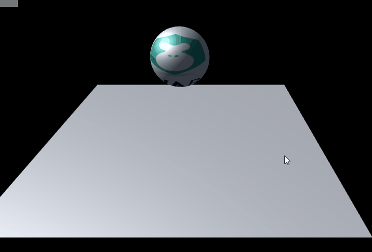
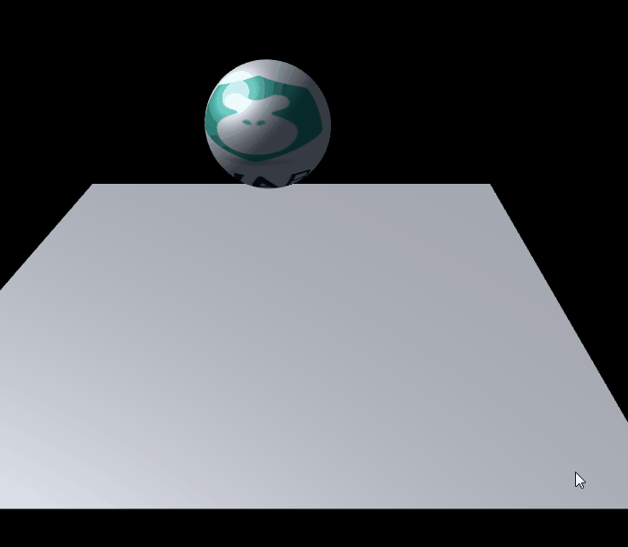

#Trigger and Collider Filter

###1. trigger

The collision range of the trigger is the same as that of the collider, but it can penetrate and act as a trigger mechanism. When the collision occurs, the onTrigger Enter method will only be triggered, and the physical collision effect will not be produced.

Adding collisions or triggers can monitor collisions or triggers in scripts, and users need to rewrite methods in Script3D.

#####Flip-flop f Writing Method


```typescript

		/**
         * 当其他碰撞器进入绑定物体碰撞器时触发（子弹进入物品时）
         * 注：如相对移动速度过快，可能直接越过
         */
        override public function onTriggerEnter(other:PhysicsComponent):void{
        }

        /**
         * 当其他碰撞器进入绑定物体碰撞器后逐帧触发（子弹在物品内时）
         * 注：如相对移动速度过快，可能直接越过
         */
        override public function onTriggerStay(other:PhysicsComponent):void{
        }

        /**
         * 当其他碰撞器退出绑定物体碰撞器时逐帧触发（子弹穿出物品时）
         * 注：如相对移动速度过快，可能直接越过
         */
        override public function onTriggerExit(other:PhysicsComponent):void{
        }
```


#####Collider


```typescript

		/**
         * 与触发器相同
         */
        override public function onCollisionEnter(collision:Collision):void{
        }
        override public function onCollisionStay(collision:Collision):void{
        }
        override public function onCollisionExit(collision:Collision):void{
        }
```


Collider and trigger are divided into`Enter`,`stay`,`Exit`Three methods.

But in LayaAir 2.0, colliders and triggers receive different collision events. The trigger receives information about another collision component that collides with it. The event received by the collider is a physical collision information.

​**The sample code used in this article is modified on the basis of the first one.**Add a new BallScript class, the main class has not been modified

#####SceneScript class

​**Some modifications have been made to the SceneScript class.**


```typescript

import { BallScript } from "./BallScript";
export default  class SceneScript extends Laya.Script3D{
    private scene:Laya.Scene3D;
        constructor(){
            super();
        }

        onAwake(){
            this.scene = this.owner as Laya.Scene3D;
        }
    
        onStart(){
            var camera:Laya.Camera = this.scene.addChild(new Laya.Camera( 0, 0.1, 100)) as Laya.Camera;

            camera.transform.translate(new Laya.Vector3(1, 6, 10));
            camera.transform.rotate(new Laya.Vector3( -30, 0, 0), true, false);
            camera.clearColor = null;
            
			var directionLight:Laya.DirectionLight = this.scene.addChild(new Laya.DirectionLight()) as Laya.DirectionLight;
            directionLight.diffuseColor = new Laya.Vector3(0.6, 0.6, 0.6);
            directionLight.transform.worldMatrix.setForward(new Laya.Vector3(1, -1, 0));


            //添加自定义模型
            var sphere:Laya.MeshSprite3D = this.scene.addChild(new Laya.MeshSprite3D(new Laya.SphereMesh(1,100,100))) as Laya.MeshSprite3D;
            sphere.transform.rotate(new Laya.Vector3(0,90,0),false,false);
			sphere.transform.translate(new Laya.Vector3(0,3,0));
            var material:Laya.BlinnPhongMaterial = new Laya.BlinnPhongMaterial();
            Laya.Texture2D.load("res/layabox.png", Laya.Handler.create(null, function(tex:Laya.Texture2D):void {
                material.albedoTexture = tex;
            }));
            sphere.meshRenderer.material = material;
            
			//添加物理组件
			sphere.addComponent(Laya.PhysicsCollider);
			//给球添加刚体
			var rigid:Laya.Rigidbody3D = sphere.addComponent(Laya.Rigidbody3D);
			//有刚体的shape要加在刚体上
			rigid.colliderShape = new Laya.SphereColliderShape(1);
            //添加一个重量
            rigid.mass = 10;
            //给球添加弹力
            rigid.restitution = 1;
            // 给球添加滚动摩擦力
            rigid.rollingFriction = 0.5;
            //给球添加脚本
            sphere.addComponent(BallScript);
            //给球一个名字 方便识别
            sphere.name = "本体球";

			//添加一个地板
			var floor:Laya.MeshSprite3D = this.scene.addChild(new Laya.MeshSprite3D(new Laya.PlaneMesh(10,10))) as Laya.MeshSprite3D;
			//给地板添加物理组件
            var floorCollicar:Laya.PhysicsCollider = floor.addComponent(Laya.PhysicsCollider);
			// 添加collidershape
			floorCollicar.colliderShape = new Laya.BoxColliderShape(10,0,10);
            //监听一次舞台mousedown事件
            Laya.stage.once(Laya.Event.MOUSE_DOWN,this,this.cloneBall,[sphere]);
        }
        /**
         * 点击克隆球体
         */
         cloneBall(sphere){
                //一秒之后复制一个球
                 var cloneSphere:Laya.MeshSprite3D  = Laya.Sprite3D.instantiate(sphere) as Laya.MeshSprite3D;
                //获取母体球的脚本
                var sphereScript = sphere.getComponent(BallScript);
                //销毁掉之前加上去的脚本
                sphereScript.destroy();
                //设置位置偏移
                 cloneSphere.transform.translate(new Laya.Vector3(1,4,0));
                //添加到场景
                this.scene.addChild(cloneSphere);
                //获取克隆球的刚体
                var rigid:Laya.Rigidbody3D = cloneSphere.getComponent(Laya.Rigidbody3D);
                //设置为触发器
                rigid.isTrigger = true;
                //给个名字方便识别
                cloneSphere.name = "克隆球";
        }
    }  

```


#####BallScript class


```typescript

export class BallScript extends Laya.Script3D{
    constructor(){
        super();
    }

     /**
      * 当其他碰撞器进入绑定物体碰撞器时触发（子弹进入物品时）
      * 注：如相对移动速度过快，可能直接越过
      */
     onTriggerEnter(other):void{
         console.log("触发器enter" + this.owner.name);
     }

     /**
      * 当其他碰撞器进入绑定物体碰撞器后逐帧触发（子弹在物品内时）
      * 注：如相对移动速度过快，可能直接越过
      */
     onTriggerStay(other):void{
         console.log("触发器stay" + this.owner.name );
     }

     /**
      * 当其他碰撞器退出绑定物体碰撞器时逐帧触发（子弹穿出物品时）
      * 注：如相对移动速度过快，可能直接越过
      */
     onTriggerExit(other):void{
         console.log("触发器exit" + this.owner.name);
     }

     /**
      * 与触发器相同
      */
     onCollisionEnter(collision):void{
         console.log("碰撞器enter" + this.owner.name);
     }
     onCollisionStay(collision):void{
         console.log("碰撞器stay" + this.owner.name );
     }
     onCollisionExit(collision):void{
         console.log("碰撞器exit" + this.owner.name);
     }

     onDisable():void{
         console.log("脚本已被移除");
     }
 }   
```

Look at the effect:



Confirm the output at the console at the same time


###2. Collider filter

In actual development, it is impossible for all objects to collide with any other objects, such as bullets fired by the protagonist himself and not allowed to collide with themselves, or bullets for teammates, which groups can collide and which groups can not collide with filters, see the code example below.


```typescript

......
//给球一个名字 方便识别
sphere.name = "本体球";
//给本体球添加碰撞组
rigid.collisionGroup = Laya.Physics3DUtils.COLLISIONFILTERGROUP_CUSTOMFILTER2;
......
//给地板添加可以碰撞的组
floorCollicar.canCollideWith = Laya.Physics3DUtils.COLLISIONFILTERGROUP_CUSTOMFILTER2;
.....

//cloneBall方法内     
//给个名字方便识别
cloneSphere.name = "克隆球";
//给克隆球添加碰撞组
rigid.collisionGroup = Laya.Physics3DUtils.COLLISIONFILTERGROUP_CUSTOMFILTER1;
......
```


In practical development, there are also requirements, such as collision with other groups except one group. Then we need to pass it.**Take inverse**Operate to set collisible groups.

Here is a relatively simple code snippet, or based on the project above.


```typescript

......
//给球一个名字 方便识别
sphere.name = "本体球";
//给本体球添加碰撞组
rigid.collisionGroup = Laya.Physics3DUtils.COLLISIONFILTERGROUP_CUSTOMFILTER2;
......
//给地板添加可以碰撞的组
floorCollicar.collisionGroup = Laya.Physics3DUtils.COLLISIONFILTERGROUP_CUSTOMFILTER2;
.....

//cloneBall方法内     
//给个名字方便识别
cloneSphere.name = "克隆球";
//给克隆球添加碰撞组
        rigid.canCollideWith = Laya.Physics3DUtils.COLLISIONFILTERGROUP_ALLFILTER^ Laya.Physics3DUtils.COLLISIONFILTERGROUP_CUSTOMFILTER1;

......
```


​**If you need to remove a collision group, you need to continue to reverse it.**


```typescript

	rigid.canCollideWith = Laya.Physics3DUtils.COLLISIONFILTERGROUP_ALLFILTER ^  Laya.Physics3DUtils.COLLISIONFILTERGROUP_CUSTOMFILTER1 ^ Laya.Physics3DUtils.COLLISIONFILTERGROUP_CUSTOMFILTER2;
```


​