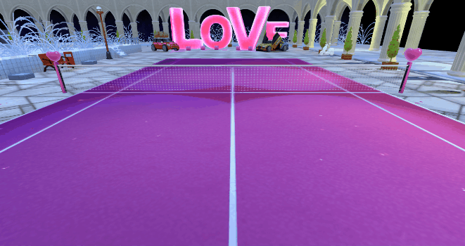

#Application examples of 3D multi-scene

###Application of multi-scene

The 3D scene can not only be mixed with 2D, but also have many 3D scenes on the stage. It can also be embedded in the 2D scene, and the size and position of the scene screen can be controlled by the camera's viewport in the scene.

In the game, we often use this method, such as the role equipment attribute interface, which shows the model and animation of 3D characters. After replacing the equipment icon in the equipment bar, the role model can also be changed.

In the following example, we simulate the equipment attribute interface (Fig. 1). The function is to double-click the screen to open the equipment interface, display the 3D character waiting animation and the equipment display on the body, click and hold the title of the interface to drag the interface, and the internal 3D scenes and roles follow the movement.

(Fig. 1) </br>


###Development Ideas and Codes

1. The background is 3D main scene, loading game scene map;

2. Create a simple Dialog type UI in the IDE (Dialog can set drags) and publish it (Figure 2). Create a RolePropView class that inherits from the UI and is set to the singleton mode (most UIs are singletons). Create another 3D scene in the interface to display roles, and set the camera viewport to be the same size or smaller as the 2D interface.

(Fig. 2) </br>

3. After the interface is added, when the mouse is pressed or moved on the interface, the camera script in the main scene fails, and the interface is removed or the mouse is not pressed on the interface. The enable property of the script component can be set.

4. Adding interface drag event monitoring, dragging interface, the camera viewport in the interface scene moves with it (otherwise the 3D scene character will be in the initial position).

The main class LayaAir3D_MultiScene code is as follows:


```typescript

class LayaAir3D_MultiScene {
    /*游戏主摄像机*/
    private camera:Laya.Camera;
    /*角色装备展示界面*/
    private roleProp:RolePropView;
    /*主摄像机控制脚本*/
    private cameraScript:CameraMoveScript;
    constructor() {
        //初始化引擎
        Laya3D.init(1280,720,true);
        //适配模式
        Laya.stage.scaleMode = Laya.Stage.SCALE_EXACTFIT;
        Laya.stage.screenMode = Laya.Stage.SCREEN_NONE;
        //开启统计信息
        Laya.Stat.show();
        //加载3D资源
        Laya.loader.create(["LayaScene_loveScene/loveScene.ls","LayaScene_girl/girl.lh"],Laya.Handler.create(this,this.on3DComplete));
    }
    private on3DComplete():void{
        //创建场景
        var scene:Laya.Scene = Laya.Scene.load("LayaScene_loveScene/loveScene.ls");
        Laya.stage.addChild(scene);
        //创建摄像机添加到场景
        this.camera = new Laya.Camera();
        scene.addChild(this.camera);
        //修改摄像机位置与方向
        this.camera.transform.translate(new Laya.Vector3(0,2,8),true);
        this.camera.transform.rotate(new Laya.Vector3(-23,0,0),true,false);
        //添加摄像机脚本并获取
        this.cameraScript = this.camera.addComponent(CameraMoveScript) as CameraMoveScript;

        //加载2D界面资源
        Laya.loader.load("res/atlas/comp.atlas",Laya.Handler.create(this,this.on2DComplete));
    }
    private on2DComplete():void{
        //双击舞台创建角色属性UI
        Laya.stage.on(Laya.Event.DOUBLE_CLICK,this,this.createRoleUI);
    }
    private createRoleUI():void{
        //创建角色属性UI（单例模型，预防打开多个）
        this.roleProp = RolePropView.getInstance();
        Laya.stage.addChild(this.roleProp);
        //界面拖动事件监听
        this.roleProp.on(Laya.Event.DRAG_MOVE,this,this.onDragMove);
        //鼠标在界面上按下时摄像机控制脚本失效
        this.roleProp.on(Laya.Event.MOUSE_DOWN,this,this.onScriptFalse);
        //界面移除或鼠标抬起后摄像机脚本启用
        this.roleProp.on(Laya.Event.RECOVERED,this,this.onScriptTrue);
        Laya.stage.on(Laya.Event.MOUSE_UP,this,this.onScriptTrue);
    }
    /*界面拖动回调*/
    private onDragMove():void{
        //摄像机控制脚本失效
        this.onScriptFalse();
        //界面中摄像机视口跟随移动
        this.roleProp.camera.viewport = new Laya.Viewport(this.roleProp.x,this.roleProp.y,this.roleProp.width,this.roleProp.height);
    }
    /*摄像机控制脚本启用*/
    private onScriptTrue():void{
        //摄像机控制脚本启用
        this.cameraScript.enable = true;
    }
    /*摄像机控制脚本失效*/
    private onScriptFalse():void{
        //摄像机控制脚本失效
        this.cameraScript.enable = false;
    }
}
new LayaAir3D_MultiScene;
```


The interface class RolePropView creates 3D scenes, roles and cameras internally. The reference code is as follows


```typescript

/*角色装备UI界面（包括3D场景与角色）*/
class RolePropView extends ui.RolePropUI{
    /*界面实例*/
    private static instance:RolePropView;
    /*界面中的3D场景*/
    private UIScene:Laya.Scene;
    /*界面中的摄像机*/
    public camera:Laya.Camera;
    /*界面中的3D角色*/
    private role:Laya.Sprite3D;
    /*界面中在舞台水平居中位置*/
    private xx:number = 0;
    /*界面中在舞台垂直居中位置*/
    private yy:number = 0;
    /*角色装备UI界面单例方法*/
    public static getInstance():RolePropView {
        if(this.instance == null){
            this.instance = new RolePropView();
        }
        return this.instance;
    }
    constructor() {
        super();
        //设置UI位置为居中显示
        this.xx = (1280 - this.width)/2;
        this.yy = (720 - this.height)/2;
        this.pos(this.xx,this.yy);

        //与UI搭配的3D场景
        this.UIScene = new Laya.Scene();
        this.addChild(this.UIScene);

        //在对话框中，鼠标可点击触发拖动的区域
        this.dragArea = "0,0,520,80";

        //创建角色
        this.role = Laya.loader.getRes("LayaScene_girl/girl.lh");
        this.UIScene.addChild(this.role);
        //修改角色位置（超出摄像机视口后将不会显示）
        this.role.transform.translate(new Laya.Vector3(0,0,0),false);

        //创建摄像机
        this.camera = new Laya.Camera();
        this.UIScene.addChild(this.camera);
        //设置摄像机视口大小与UI一致
        this.camera.viewport = new Laya.Viewport(this.xx,this.yy,this.width,this.height);
        //摄像机位置
        this.camera.transform.translate(new Laya.Vector3(0,1.2,3),false);
        //关闭按钮事件监听
        this.btn_close.on(Laya.Event.MOUSE_DOWN,this,this.onClose);
    }
    /*关闭按钮事件回调*/
    private onClose():void{
        //移除UI界面
        Laya.stage.removeChild(this);
        //恢复UI位置为居中显示
        this.pos(this.xx,this.yy);
        //恢复摄像机视口大小与位置
        this.camera.viewport = new Laya.Viewport(this.xx,this.yy,this.width,this.height);
    }
}
```


Compile and run the above code, as shown in Figure 1.