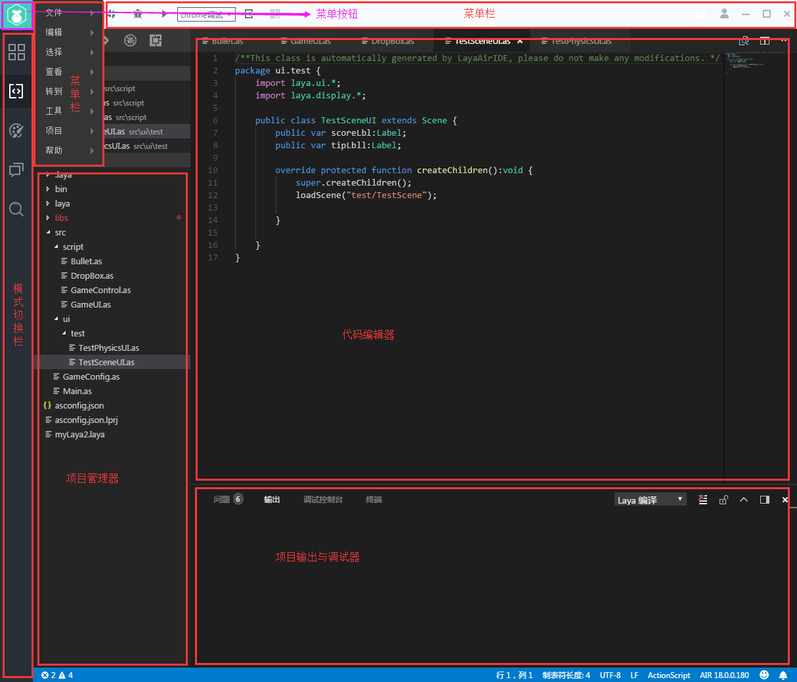

# 代码模式布局概述

 

### 一、代码编译环境

​        代码编辑环境由多个面板组成，面板可自由隐藏/显示，以适应不同项目和开发者的需要。在本章说明中将会以默认编辑环境布局为例，快速浏览各个面板及其功能作用：

 
​	图（1）LayaAirIDE主页面

### 二、项目管理器

​        项目管理器窗口里以树状结构显示了项目文件夹中的所有代码与资源结构。文件夹自动同步在操作系统中对文件夹内容的修改。同时还可以进行新建，改名，删除等常用操作功能。

 
​	图（2）创建文件的方法

 

### 三、代码编辑器

​        代码编辑窗口是用来展示和编辑项目管理器中点击选中的文档。

 
​	图（3）代码编辑页面

### 四、工具栏

​        工具栏是用来对项目及代码文档快速操作的工具集合。在代码模式工具栏介绍一节中我们会对具体使用进行详细介绍。

  
​	图（4）工具栏面板

 

### 五、菜单栏

​        菜单栏中包含了一系列编辑中需要的操作及功能集合。在代码模式菜单栏介绍一节中我们会对菜单栏进行详细介绍

 
图（5）菜单栏面板

 

### 六、模式切换按钮

​        模式切换按钮可以在设计模式、代码模式、问答社区间进行快速切换编辑。 

 
​	图（6）模式面板