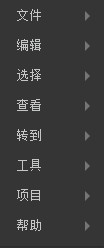

#Menu Bar Details

The Code Mode menu bar contains a set of commonly used functions and options. In this chapter, we will give a detailed introduction to the code mode menu bar.

  
(Figure 1) Menu Bar Panel

 

##I. documents

​ 
(Figure 2) List of files

​**New project**New project window pops up for users to choose the name, location and type of new project. Currently, project types support AS, JS and TS.

​**new file**New file will create a new code document in the edit view window. The location of the document can be found in the working file column in the resource view window. The new code document will be generated only when it is saved.

​**New window**New window will pop up a new code editing window for you to create new projects or open other projects for editing.

​**Open project**Opening the project will pop up a WINDOWS Explorer-style browsing window to select the location of the project. After confirmation, the IDE will switch to the new project you open.

​**open a folder**Opening a folder will pop up a WINDOWS Explorer-style browsing window to select the location of the folder. After confirmation, the folder you open will be automatically added to the Resource View window.

​**Preservation**Save the current file.

​**Save another**Save the current file as a new file.

​**Save all**Save all files once.

​**Refresh Editor**Refresh the real-time status of the editor.

  

##Two, editors

​ 
(Figure 3) Edit List

​**Revoke**Undo the current operation once.

​**redo**Resume an operation that has been revoked.

​**shear**Cut the selected paragraph or file.

​**paste**Paste copied or cut paragraphs or files.

​**copy**Copy the selected paragraph or file.

​**All election**Full selection of current file content.

​**lookup**The search function window pops up at the top right of the edit view window for keyword search.

​ 
(Figure 4) Find Panel

​**replace**Replacement function window pops up at the top right of edit view window for keyword replacement.

​**global search**The resource view window is transformed into a global search window, and the keyword is searched by the whole project, listing all the file paths containing the keyword, as well as the rows and the number of keywords. The keyword is highlighted in the code editing window.

 

##Three, view

​ 
(Figure 5) View list

​**file**If the Resource Management View is blocked, this option will reproduce the Resource Manager window.

​**search**If the global search window is blocked, this option will reproduce the global search window.

​**GIT**If the GIT window is blocked, this option will reproduce the GIT window.

​**debugging**If the debug window is blocked, this option will reproduce the debug window.

​**Command panel**This option displays the command window above the edit view window.

​ 

(Figure 6) Command Panel

​**Errors and Warnings**This option displays an error and warning window above the edit view window.

​**Output panel**This option displays the output window below the edit view window.

​**terminal**This option will start the system command line terminal.

​**Debug panel**This option displays the debug console window below the edit view window.

​**Full screen**Maximize the full-screen display of IDE.

​**Split editor**Split the edit view window into multiple screens.

​**Switch sidebar**Display/hide the sidebar.

​**Moving sidebar**Move the sidebar to the leftmost/rightmost side.

​**enlarge**: enlarges the display scale of layaairide as a whole.

​**narrow**The display proportion of LayaAirIDE will be reduced as a whole.

​**Reset zoom**Reset the display ratio of LayaAirIDE to the default.

##Four. Tools

​ 
(Figure 7) Tool Panel

##-**SWF conversion**Open the SWF Resource Conversion Tool window for users to perform SWF conversion operations. **JS compression tool**Open the JS Compression Tool window for users to compress and confuse JS files.
##-**Dragon Bone Animation Conversion**Open the keel animation conversion window for users to convert Dragon Bones skeleton animation into LayaAir recognition format. **Spine Animation Conversion**Open the Spine animation conversion window for users to convert Spine skeleton animation into LayaAir recognition format.
##-**Psd2UI**Pad files are directly converted to UI pages, and resource naming rules can be referred to.[这里](https://ask.layabox.com/question/7365) **Atlas package**Open the Atlas Packaging Window for users to do Atlas Packaging.
##-**Runner Download**Open the two-dimensional code window downloaded by the runner for users to download LayaNative's runner. **Pack APP**App packaged environment configuration and operation window for users to package LayaAir project as Android APP (apk file)
##-**App construction**Open the build function window for users to build the LayaAir engine project into three mobile-side APP project projects: Android-eclipse, Android-studio and XCode (IOS). **3D Conversion Tool**Open the URL link of the 3D conversion tool, and provide the resource conversion tools of the 3D Max and Unity3D editors in the compression package, so that the resources of the 3D Max and Unity3D become the resources supported by the LayaAir engine.

##Five. Project

​ 
(Figure 8) Project Panel

​**Class library management**Used to set the version of the class library used by the current project.

##Six, help

​         
##(Figure 9) Help panel **Developer Tools**Used to open the debug page of the editor.
##-**Official website**Open the Layabox official link. **Official website example**Open the LayaAir engine example link on the official website.
##-**Developer Center**Open the Layabox Developer Center link. **Open the Editor Local Cache Directory**Open the directory where the local cache file of the editor is located.
##-**Check update**Open the LayaAirIDE version download list link. **Update log**Open the link between the engine in gitHub and the IDE version update log.
-**Current version number**Display the current version number of LayaAirIDE.