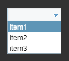
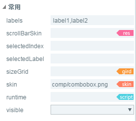
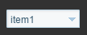
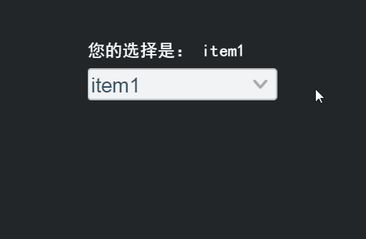

# ComboBox 组件参考


## 一、通过LayaAirIDE创建ComboBox组件
###1.1 创建ComboBox
​        ComboBox 是一个下拉列表选项框组件。
​        点击选择资源面板里的 ComboBox 组件，拖放到页面编辑区，即可添加 ComboBox 组件到页面上。
​        ComboBox 的脚本请接口参考 [ComboBox API](http://layaair.ldc.layabox.com/api/index.html?category=Core&class=laya.ui.ComboBox)。

​        ComboBox 组件的图像资源示例：

​        <br/>
​    （图1）

​        设置 ComboBox 的属性 labels 的值为 “label1,label2” 后，显示效果如下：
​        常态：

​        <br/>
​    （图2）

​        点击后显示下拉选项列表：

​        <br/>
​    （图3）

​        在下拉选项中选择 item1 后：

​        <br/>
​    （图4）


### 1.2 ComboBox 组件的常用属性

​        <br/>
​    （图5）

 

| **属性**        | **功能说明**                  |
| ------------- | ------------------------- |
| labels        | 下拉选框的标签文本内容集合字符串，以逗号分隔。   |
| visibleNum    | 下拉列表中可显示的最大行数。            |
| scrollBarSkin | 下拉列表的滚动条图像资源。             |
| selectedIndex | 表示当前选择的项的索引。              |
| sizeGrid      | 下拉列表图像资源的有效缩放网格数据（九宫格数据）。 |
| skin          | 下拉列表图像资源。                 |

 

### 1.3 ComboBox 组件下拉选项相关属性
​        <br/>
​    （图6）

​        <br/>
​    （图7）

 

| **属性**     | **功能说明**                      |
| ---------- | ----------------------------- |
| itemColors | 下拉列表项的各状态的标签文本颜色值集合。详细请参考API。 |
| itemSize   | 下拉列表项的标签文本的字体大小。              |

 

 

### 1.4 ComboBox 组件下拉按钮相关属性

​        <br/>
​    （图8）

​        <br/>
​    （图9）

 

| **属性**       | **功能说明**                    |
| ------------ | --------------------------- |
| labelBold    | 下拉按钮的标签文本是粗体显示。             |
| labelColor   | 下拉按钮的各状态下的文本颜色值集合。详细请参考API。 |
| labelFont    | 下拉按钮的文本字体。                  |
| labelPadding | 下拉按钮的文本边距。详细请参考API          |
| labelSize    | 下拉按钮的文本字体大小。                |

 

## 二、通过代码创建ComboBox组件 

 	在我们进行书写代码的时候，免不了通过代码控制UI，创建`UI_ComboBox`类，通过代码设定ComboBox相关的属性。

**运行示例效果：**
​	<br/>
​	（图10）

​	ComboBox的其他属性也可以通过代码来设置，下述示例演示了如何通过代码创建选中框中的下拉选项，并通过点击获取到自己的点击是哪一条选项。有兴趣的读者可以自己通过代码设置ComboBox，创建出符合自己需要的下拉框。

```javascript
module laya {
    import Stage = Laya.Stage;
    import ComboBox = Laya.ComboBox;
    import Handler = Laya.Handler;
    import WebGL = Laya.WebGL;

    export class UI_ComboBox {
        private skin: string = "res/ui/combobox.png";

        constructor() {
            // 不支持WebGL时自动切换至Canvas
            Laya.init(800, 600, WebGL);

            Laya.stage.alignV = Stage.ALIGN_MIDDLE;
            Laya.stage.alignH = Stage.ALIGN_CENTER;

            Laya.stage.scaleMode = Stage.SCALE_SHOWALL;
            Laya.stage.bgColor = "#232628";

            Laya.loader.load(this.skin, Handler.create(this, this.onLoadComplete));
        }

        private onLoadComplete(): void {
            var cb: ComboBox = this.createComboBox(this.skin);
            cb.autoSize = true;
            cb.pos((Laya.stage.width - cb.width) / 2, 100);
            cb.autoSize = false;
        }

        private createComboBox(skin: String): ComboBox {
            var comboBox: ComboBox = new ComboBox(this.skin, "item0,item1,item2,item3,item4,item5");
            comboBox.labelSize = 30;
            comboBox.itemSize = 25;
            comboBox.selectHandler = new Handler(this, this.onSelect, [comboBox]);
            Laya.stage.addChild(comboBox);

            return comboBox;
        }

        private onSelect(cb: ComboBox): void {
            console.log("选中了： " + cb.selectedLabel);
        }
    }
}
new laya.UI_ComboBox();
```

