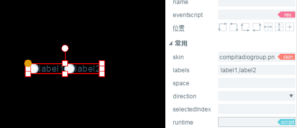

#RadioGroup Component Details

> Since many component attributes are generic, common and generic component attributes are`属性设置器`This is described in the document. Read the Property Setter document before reading this article.

##1. Understanding RadioGroup components

###1.1 Role of RadioGroup Components

RadioGroup is a radio box button group. The component options in the button group are mutually exclusive. Users can only select one radio box component at a time. As shown in Figure 1.
  (Motion 1)

###1.2 Skin Specification for RadioGroup Components

The skin of the RadioGroup component is`RadioGroup`Or to`RadioGroup_`Name the prefix. For skin design specifications, it is a bimorph or trimorph graph with vertical equivalence, as shown in Figure 2.

  (Figure 2) Trimorphic RadioGroup Skin

*Tips: The skin of RadioGroup components can't use the Nine-palace property, so it's important to determine the size of the application when designing resources.*

###1.3 Introduction to the API of RadioGroup Components

For an introduction to RadioGroup's API, please refer to[ http://layaair.ldc.layabox.com/api/index.html?category=Core&class=laya.ui.RadioGroup](http://layaair.ldc.layabox.com/api/index.html?category=Core&class=laya.ui.RadioGroup)。

##2. Creating RadioGroup Components through LayaAirIDE

###2.1 Create RadioGroup

Click on the RadioGroup component resource in Resource Manager and drag it to the Scene Editor, which successfully creates a RadioGroup component on the page. As shown in Figure 3.
​  (Motion 3)

###2.2 Add radio boxes through labels

As shown in Figure 3, there are only two radio boxes in the default radio box group. If you want to add a radio box, you just need to add a new label in the labels attribute, and modify the label content is also set in the attribute, as shown in Figure 4-1.

​  (Motion 4-1)

###2.3 Change the layout direction and spacing of RadioGroup

RadioGroup defaults to horizontal layout (* horizontal *), which implements vertical layout (* vertical *) by changing the direction attribute. Setting spacing can be achieved through the space attribute. As shown in Figure 4-2.
  (Motion 4-2)

###2.4 Set the default options for RadioGroup

The selectedIndex property is used to change the index value of the radio box group. When it is not set by default, no option is checked. If you want to set the default check of RadioGroup, you can set the attribute value of selectedIndex, 0 is the first radio box, 1 is the second radio box... And so on.

Assuming that we set the attribute value to 0, the effect is shown in Figure 4-3.
  (Motion 4-3)

### 

##3. Create a custom Radio Group component

In the previous example, we used the same radio box resource to generate three sub-item radio box groups by setting labels. However, in the actual game, there are different requirements for radio box style in the same RadioGroup component, so the way of labels setting can not achieve the effect. At this time, we need to use the way of custom RadioGroup component.

###3.1 Preparing Art Resources

We use two different ones.`radio单选框`Composition of Art Resources`自定义RadioGroup组件`Resources are shown in Figure 5.

​     （图5 ）

**Tips**:

Here's a special note about the naming rules for skin images. In the custom RadioGroup component, we can't use them.`RadioGroup`or`RadioGroup_`Name the prefix. Because you want to use the Radio radio box component as its subitem component, the image resource naming in this example uses`radio_`Prefix.

###3.2 Create Radio Components in IDE

Copy the resource to the resource manager folder of the project, then drag and drop the produced radio component from the resource manager to the scene editor one by one in the IDE, and change the name attribute of each Radio component from left to right (or from top to bottom) to item0, item1, Item2 in turn. (RadioGroup component generated without adding name attribute according to this rule) Invalid component, not working properly.)

After setting the text of label attribute, font color, size, position relationship of label label label, and adjusting the position, the effect is shown in figs. 6 and 7.

​  (Fig. 6)  (Figure 7)

​**Tips: In the name attribute of the customized Radio Group component, the naming rule is English characters + numbers. English characters can not be underlined after them. Numbers should start from 0 in sequence.**。

###3.3 Converted to RadioGroup Container

After modifying the sub-item attributes, the selected components are converted to containers by pressing the shortcut key Ctrl+B, and the RadioGroup container type is selected and determined, as shown in Figure 8.

​  (Figure 8)

After successful conversion, adjust the default index selectedIndex to 0 (the first Radio). As shown in Figure 9, the space and direction between radio boxes can be unchanged, or can be adjusted by mouse in the scene editor.

​  (Figure 9)

From the above steps, you can see that the custom RadioGroup component has been successfully produced. By default, the first check box is selected and switched to its third frame selection state, while the other check boxes are the first frame unselected state.