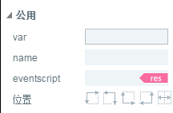

# 属性设置器

The property setter is the area where we view and edit the currently selected component properties. Selecting a component in the scene editor or hierarchical manager displays its properties in the property setter for query and editing.

The property setter panel is shown in Figure 1, which is usually: component or node name,**public**Attribute,**Commonly used**Attribute,**Width, height and position**,**Rotation and zooming**,**Other**Wait.

  
(Figure 1) Attribute Panel Grouping

##1.`公用`Attribute introduction

Usually in public attributes`var`,`name`,`renderType`。 As shown in Figure 2.

  (Figure 2)

###1.1 Set the global variable name

`Var`Name: A unique global variable name that is used to invoke the component in the code of the project based on that name.

###1.2 Setting Component Identification Name

`name`A component's identity name, usually used to distinguish other components in a hierarchical manager, whose parent container can also find the component by that name.

###1.3 Setting up Resource Skin

`eventscript`Drag the resource to the input box to replace the skin. The dot area button can quickly locate the skin resource. 　　

##2.`常用`Attribute introduction

In common attributes, some operations are common. Here we will introduce them separately.

###2.1 Scene Color

The scene color is the background color of the scene editor. It can be manually input to code to modify the color. It can also be modified from the palette as shown in Figures 3-1, 3-2.

  (Figure 3-1)

  (Figure 3-2)

###2.2 Scenario Destruction Closed

`autoDestoryAtClosed`Whether the scene is automatically destroyed (destroying nodes and resources used) after it is closed, defaults to false.

  (Fig. 3-3)

###2.3 Powerful Runtime Attributes

`runtime`It is a very powerful component extension function in attribute manager. By setting the logical class in the runtime attribute, the instance creates not the visual class of the component, but the logical class specified in the runtime attribute. In this property, you need to specify the full path of the logical class, such as "game. user. player".

###2.4 visible

`visible`Whether the default is true.

##3. Width and Height and Location Attributes

Width, height and location attributes play an important role in UI production. Mainly used to adjust position and UI screen adaptation (Figure 4).

  (Figure 4)

###3.1 x, y attributes

The X and Y attributes are the coordinates of the X and Y axes of the component in the scene editor.

The top left corner of the scene editor is the coordinate origin`（0, 0）`。  With the origin as the center, the right extension of X axis increases in positive coordinates, and the positive coordinates increase in Y axis.

stay`场景编辑器`After selecting the component, hold down the mouse to move and modify the position of the X and Y axis, or set a fixed value in the property input box.

###3.2 width and height attributes

Without changing the size of the component, the width and height of the component will be calculated automatically, but will not be displayed in the attribute panel. When the component is resized and reset through the constraint box or fixed value setting, the width and height attributes will be displayed, and the number of drag adjustments can also be made.

When no component is selected, the current width and height are page width and height.

*Tips: Some components can only change the size of the constraint box, the actual component will not be enlarged, but the mouse click area will be reduced to the size of the constraint box, such as CheckBox.*

###3.3 UI adaptation properties

`left、right、top、bottom`The four attributes are mainly used to fit the edge distance between the component and the parent container.

`centerX、centerY`The two attributes are mainly used for adapting the component to the central location of the parent container.

In game development, we can not take all screen resolutions into account, some have high resolution, some have low resolution. If full-screen adaptation is used in game project code and components are fixed in position, UI components will be misaligned under different resolution screens. We need to adjust in the following ways.

####3.3.1 edge position adaptation

**design goal**Put an avatar in the upper right corner of the game and keep the screen edge and right edge 50px at all times.

**The Implementing Effect of Errors**:

If we set a fixed value for component X and y at a certain screen resolution, the effect of moving Figure 4-1 will appear. It is inconsistent with the design objective.

 
(Motion 4-1) Different screen resolution effects when setting fixed values for component X and y.

**Correct Achievement Effect**:

`left、right、top、bottom`The four attributes are based on the left edge, the right edge, the upper edge and the lower edge of the parent container. So in order to achieve the same right-centered effect in different screen resolutions, we need to set the property values of right and top, which are set to 50 pixels. The operation effect after setting is shown in Figure 4-2.

  (动图4-2)

**The Effect of Screen Adaptation on Margin Settings**:

It is particularly important to note here that:`left、right、top、bottom`The effect of the attribute is based on the edges of the parent container (page), not the edges of the screen. The resolution of the parent container (page) must be the same as the resolution set by Laya. init () in the project. If it is not set to the same resolution, then the running effect of Motion 4-2 cannot be achieved.

####Tensile fit of 3.3.2 margin

In addition to the function of adapting to a certain edge, the attribute values of left, right, top and bottom can be set at the same time. Components can also be stretched and adapted according to different screens. For example, we set the attribute values of left, right, top and bottom to 100, and then run them as shown in Figure 4-3.

  (Motion 4-3)

*Tips: The way to set the edge of the stretch fit usually needs to be combined with the nine palaces.*

####3.3.3 Center Position Adaptation

Central adaptation is often used to start LOGO, pop-up prompt box, etc. for games based on the middle of the screen. We can use centerX and centerY to center the position, as shown in Figs. 5-1 and 5-2.

  (Fig. 5-1)

  (Fig. 5-2)

##4. Rotation and Scaling Properties

Rotation and scaling attributes are often used in game UI, especially in IDE animation.

####4.1 Modification of Axis Point

Axis Point: The rotation or scaling center of a component, default to the origin in the component`（0,0）`Point position.

The four attributes pivotX, pivotY, anchorX, anchorY are used to modify the position of the axis center.

PivotX and pivotY (pivot point) modify the position of pivot point by changing the fixed value of XY coordinate of component pivot point.

Anchor X and anchorY (anchor point) calculate the coordinate position of the axis center point by the component width or high percentage of X and Y axis. As shown in Figure 6, the coordinate calculated by 50% of the width and height is exactly the coordinate position of the center point.

  (Fig. 6)

**Tips**:*It is a very convenient and fast way to set the pivot point by anchoring. But the anchor mode can only set the pivot point for UI components, and for Graphics components and Sprite and other 2D basic components, the pivot point can only be set by setting.`pivotX与pivotY`The way to achieve.*

####4.2 Modification of Inclination Angle

SkewX and skewY incline horizontally and vertically with the axis as the center. The effect of modifying attribute values is shown in Figure 7.

 （动图7） 

####4.3 Modification Component Scale-up

ScaleX and scaleY are horizontal and vertical scaling centered on the axis.

Default is 1, no zoom; the larger the positive value, the larger the zoom size.

Scale to 0, invisible;

`-1`by**image**The effect is shown in Figure 8. The larger the negative value is, the larger the post-mirror zoom size is.

 （动图8） 

**Tips**:*If the pivot point is in the center, it can be mirrored in situ, for example, two directions of roles can be implemented with the same resource.*

##5. Introduction of other general attributes

LayaAirIDE provides a large number of components, all of which have some common properties, because they mostly inherit from the Component component base class. Here we mainly introduce the general part of other attributes, the special attributes of the component itself, which we will explain when introducing each individual component.

Common attributes include the following categories

Display related properties: alpha, visible

Cache-related properties: cacheAs, static Cache

Mouse operation related attributes: disabled, gray, htTestPrior, mouseEnabled, mouseThrough

Label related attributes: label Align, label Colors, label Bold, label Font, label Padding, label Size, label Stroke, label StrokeColor, stroke Color

###5.1 Display related attributes

Displaying related attributes is relatively easy to understand, and display objects have alpha and visible attributes.

`alpha`Adjust the transparency of the display object, the value is between 0-1, 0 is all transparent, 1 is opaque, the range belongs to different degrees of translucency.

**Tips**No matter how much alpha value of the display object is, if the mouse is added to monitor, then it supports mouse events, even if alpha is 0, mouse events will occur.

`visible`Control whether the component is displayed, the attribute is Boolean, the default value is true, normal display. When the value is false, the component is not displayed and the mouse event has no effect.

*Tips: When visible is false, it means that it is not displayed when running in the browser, and when set to false in the IDE, it will not produce hidden changes immediately.*

###5.2 Caching Related Properties

Regarding the attributes of cache optimization, cacheAs and staticCache recommend that individual components not be used, and that they be reused when complex pages do not change frequently.

**When there are a lot of UIs in the game, and a UI has more than one node and changes little, we recommend using cacheAs (most UIs can be used).**

For example, we use LayaAirIDE software, many panels in the software, such as attribute setters, resource managers, project managers, and so on. Their node subobjects are many, but not very frequently changed. Therefore, we all use cacheAs for caching to improve rendering efficiency.

**For complex UIs that are constantly changing, you can divide the UI into two layers. The less changing layer uses cacheAs, and the frequently changing layer does not use cacheAs.**For example, if there is a "countdown" UI, we can also divide it into the countdown part and other parts. The other parts are cacheAs, and the countdown part is not cacheAs.

The use of cacheAs in development requires careful learning and understanding, while incorrect understanding and use of caching mechanisms can degrade performance. The following are detailed descriptions of the two main attributes:

**CacheAs:**

Cache components, whether or not to cache static images, reasonable role can improve performance. It has three optional values: "none", "normal" and "bitmap".

**"None option":**Represents no caching.

**"Noral Options":**

Canvas mode for canvas caching: it is equivalent to caching the UI composed of multiple sub-objects into a bitmap. When the game is rendered per frame, only the cached bitmap is rendered, not all sub-objects are rendered once, thus saving rendering overhead and improving performance.

Command caching in webgl mode: it is equivalent to caching only the sub-object traversal process and program command organization, not cached as a bitmap. When the game is rendered in each frame, it does not need to traverse the sub-object again, but directly renders the sub-object according to the traversal level. It will not reduce drawcall, increase memory consumption, and render performance is moderate.

**Tips**:*The cacheAs Bitmap attribute function is the same as the normal mode of cacheAs attribute. The cacheAs Bitmap attribute is reserved for compatibility with the old version IDE. If there are relevant requirements at present, it is recommended to use the normal of cacheAs to set it.*

**"Bitmap option"**:

Canvas mode is still the canvas cache.

RenderTarget caching in webgl mode: it is equivalent to caching the UI composed of multiple sub-objects into a bitmap and submitting it to the graphics card for each frame rendering, reducing drawcall, rendering performance is the highest. It should be noted that the cache bitmap will add an additional part of the memory overhead, the larger the cache bitmap, the greater the memory overhead. The size of the cache bitmap should not exceed 2048. This mode also increases CPU overhead when redrawing continuously.

**Tips*** When cacheAs select "normal" and "bitmap", the sub-objects change, and the cache is automatically re-cached. At the same time, the reCache method can be manually called to update the cache. *

**StaticCache:**

This value is valid when cacheAs is not "none". When staticCache = true, the cache will not be automatically updated when the child object changes. It can only be refreshed manually by calling the reCache method.

For example, some UIs with more data may keep updating UI display when the UI opens and reads data. At this time, staticCache can be set to true. After reading the data, the data can be read and refreshed at one time by reCache method.

For specific examples and data analysis, please refer to "Technical Documents - 2D Advanced Chapter - CacheAs Performance Optimization"

###5.3 Mouse Operations Related Attributes

The description and demonstration of mouse operation related attributes are as follows.

A kind of**Other attributes**A kind of**Function description**A kind of
| ------------------------------------------------------------------------------------------------------------------------------------------------------------------|
| mouseEnabled | Accept mouse events. The default is false, and if the mouse event is monitored, the value of the property mouseEnable of this object and the parent node is automatically set to true (if the parent node is manually set to false, it will not change). A kind of
| Disabled | Disabled, grey after disabled, and does not receive mouse events. A kind of
| Gray | Whether it greys or not, it still accepts mouse events when it greys. A kind of

  (Fig. 9)

**MouseThrough:**

Whether the component mouseEnabled = true is penetrable when the mouse is available. The default value is false, if set to true, then click on the blank area to penetrate, only for its own validity.

**HitTest Prior:**

Whether to test oneself first or not. The default is false. Mouse collision detection is to detect the child object first, and then bubbles into the parent object. If hitTestPrior = true mouse collision detects the child object first, the child object will be detected further after it is hit. For containers of known size (especially root containers), the default value is false. Setting this value to true can reduce node collisions and improve performance.

For example, a more complex box has many sub-objects, but we only need to monitor the box itself with the mouse, so we can set hitTestPrior to true. When the mouse clicks, the process of bubbling from sub-objects to Box is omitted and mouse events are triggered directly, thus improving performance.

*Tips: The default attribute value of the View component hitTestPrior of the UI is true.*

###5.4 label-related attributes

Many components contain label tags, such as Button, CheckBox, Tab, etc. They also have the same label property settings in other attributes. See the table below for the function description.

A kind of**Attribute name**A kind of**Function description**A kind of
| ----------------------------------------------------------------------------------------------------------------------------------------------------------------------|
| label Align | Label alignment mode, default to center alignment. Note: Invalid in CheckBox|
| label Colors | represents the text color in each state of the label. Format: "upColor, overColor, downColor, disableColor". The default is "blue, green". A kind of
| labelBold | indicates whether the label text label is bold. A kind of
| labelFont | represents the font name of the text label, expressed as a string. IDE is optional. A kind of
| label Padding | represents the margin of a text label. Format: "upper margin, right margin, lower margin, left margin". A kind of
| labelSize | indicates the font size of the text label. A kind of
| label Stroke | Text stroke width (in pixels). The default value is 0, which means no edge strokes. A kind of

| labelStrokeColor | 文字描边颜色，以字符串表示。 默认值为 "#000 000 "(black);"|
| StrkeColor | represents the edge color in each state. Format: "upColor, overColor, downColor, disableColor". A kind of

*Tips: The attributes of the above table do not contain label in the label component, but they work exactly the same way, such as`labelAlign`Property and label component`align`Attributes are identical.*