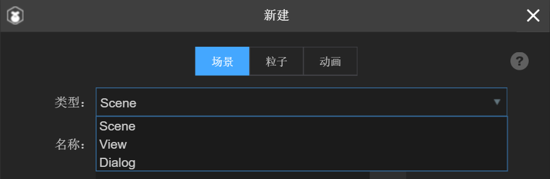

#Classification and Inheritance of UI Components

> author: Charley version: 2.0.1 update: 2019-04-02

Components are the basis of LayaAir engine game design, almost everywhere. LayaAir IDE has its own 2D basic components (2D), filter components (Filters), Graphics, physics, UI components (UI), common components, as shown in Figure 1. Developers can also customize components. This article will focus on UI components.

 

(Fig. 1)

##1. Classification of UI Components

According to the structure and function of components, UI components can be divided into three categories. They are view component, container component and basic display component.

###1.1 basic display components

The basic display component is the most commonly used UI display component in page editing. Drag and drop into the scene editor through Assets or Basics for visualization. Can be in`属性设置器`Set its property value, and then view the display directly in the Scene Editor.

Basic display components include Sprite, Button, CheckBox, Clip, ColorPicker, ComboBox, FontClip, HScrollBar, HSlider, Image, Label, TextArea, TextInput, Radio, ProgressBar, Slider, VSlider, ScrollBar, VScrollBar, WX OpenDataViewer.

>* tips: * sprite is special, that is, it is the display list node of basic display graphics, and it is also a container. In 2.0, in order to avoid abusing UI components, components not named according to component rules are no longer recognized as Image components, but as Sprite by default, which is the best way to use them.

###1.2 Container Class Components

Sprite, Box, and UI components inherited from Box belong to container class components, which are generated by one or more base components by converting them into containers instead of identifying components by resource naming. Through IDE`Ctrl+B`Shortcut keys convert one or more base components into container components. As shown in Figure 2.

 

(Fig. 2)

Container class components include Sprite, Box, List, Tab, RadioGroup, ViewStack, Panel, HBox, VBox, Tree.

###1.3 View Class Components

View class components are page-level display object containers. In LayaAir IDE's UI system, pages are used to carry all display components. LayaAir's view class components are Scene, View and Dialog, which are used to create scenes, as shown in Figure 3.

 

Scene is used by default when relative layout is not required, and View is used when relative layout is required. Dialog is used for making pop-up pages.

##2. Inheritance of Components

Sprite class is the most basic display object container class in LayaAir engine. All UI components inherit from the base class Sprite, in which the base display component and container component inherit from the subclass UIComponent of Sprite. Sprite's subclass scene is the base class of view class components. View inherits scene and Dialog inherits view. The specific component inheritance relationship is shown in Figure 4.

##3. Component Attribute Detailed Entry

To understand the naming rules of each component and the use of each component, please view the document IDE Component Attributes Detailed in 2.0 directly.

TS Version Link Address:[https://ldc2.layabox.com/doc/?nav=zh-ts-2-3-0](https://ldc2.layabox.com/doc/?nav=zh-ts-2-3-0)

The AS edition is linked to:[https://ldc2.layabox.com/doc/?nav=zh-as-2-3-1](https://ldc2.layabox.com/doc/?nav=zh-as-2-3-1)

JS Edition: https://ldc2.layabox.com/doc/?Nav=zh-js-2-3-1

##This article appreciates

If you think this article is helpful to you, you are welcome to sweep the code and appreciate the author. Your motivation is our motivation to write more high quality documents.

 