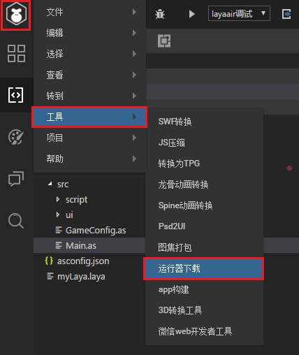
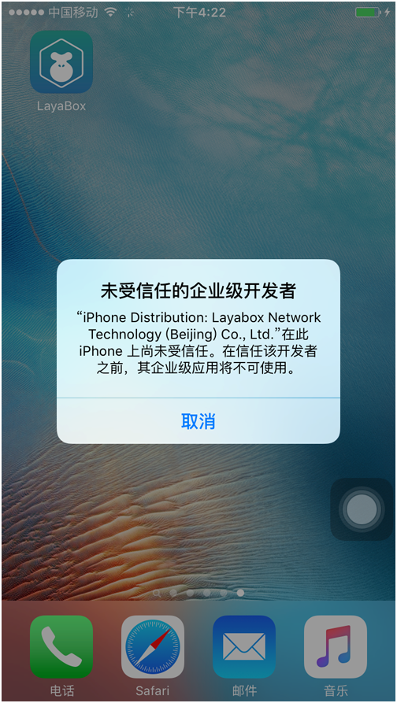

#How to Test App Running Project with LayaNative

###I. download and install the test app

####1. Display downloaded 2-D code of test App

Open LayaAirIDE and click on the top left cornerMenu button, pop-up menu bar (Figure 1).

Click Tools - > Runner Download in the menu bar to pop up the 2-D code download address of the test App (Figure 2).

   
Figure 1

​ 
Figure 2

####2. Download and Installation of Android Version

Scan code directly with Android phone and click on APK to install it.

**Tips: If you use Wechat Scan Code, because of the security settings of Wechat, you need to copy the link address to download it in the mobile browser.**    

####3. iOS version download and installation

After scanning with Wechat, click "Open in Safari" and open in Safari Browser, then click "Open in Safari".**Install**Click Install, as shown in the following figure:

**Step 1:**

​  
Figure 3

**Step 2:**

   
Figure 4

**Step 3:**

   
Figure 5

**Tips:**

Click Installation, there is no automatic jump function, you need to manually go to the system desktop to see if there are Layabox applications being installed, if it is being installed, wait for the next step after the installation.

**Step 4:**

When the installation is successful, clicking on the run will bring up "untrusted enterprise developers", which need to be set up by the developers themselves.

Click Settings - > Universal - > Device Management - > LayaBox Network Technology. > Click Trust.

Then open the LayaBox test App and you can use it properly. The specific steps are as follows:

**Step 5:**

​ 
Figure 6

**Step 6:**

​ 
Figure 7

**Step 7:**

​ 
Figure 8

**Step 8:**

​ 
Figure 9

**Step 9:**

​ 
Figure 10

###II. Testing the Project with Test App

**Step 1:**

When you open the application, you will see the interface shown in Figure 11:

 
Figure 11

**Step 2:**

Use Laya air ide to open the case project, and click the QR code icon on the far right of the menu bar., display the QR code interface of the project (as shown in Figure 12). 
Figure 12

**Step 3:**

Click on the blue two-dimensional code icon in the test APP (Figure 13) to enter the scanned interface. Scanning the layanative two-dimensional code on the right (Figure 14) opens the test.

   
Figure 13

   
Figure 14

When the scan is successful, the test App runs the case project (Figure 15).

<! - TODO: Maybe you need to change the picture of the project - >

   
Figure 15

**Tips: LayaNative is not a browser. Enter the full path for the address. Even if index. html is started by default, enter / index. js.**

* http://testgame.layabox.com/index.js is correct
* http://192.168.0.100:8899/index.js is correct
* http://testgame.layabox.com/error
* http://testgame.layabox.com error
* http://192.168.0.100:8899/error
* http://192.168.0.100:8899 error

TODO: Wait to change the connection address ** Tips: After entering the address, if you find that there is no screen on the screen, it may be because the project has not set the horizontal and vertical screen correctly, please refer to the documentation: https://github.com/layabox/layaair-doc/tree/master/Chinese/LayaNative/screen_orientation** --> www.github.com/layabox/layaair-doc/tree/master/Chinese/LayaNative/screen_orientation**

###Notes

Text format files (such as ini, xml, html, json, js, etc.) must be utf8 encoding format, because IOS devices do not yet support non-UTF8 encoding files.

###Four, suggestions

It is suggested that developers learn the basic knowledge of Android and IOS development. Mobile devices can be connected to computers during the use process, and log can be viewed at any time. There are many important information in the log, which can help developers locate problems. For example: non-UTF8 format coded file names, network errors, download errors and so on.