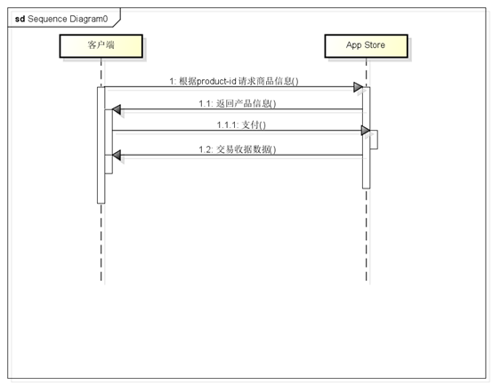

#IOS in-app purchases


In App Purchase is the in-app purchase of IOS, hereinafter referred to as IAP.

Since App Store does not support the payment of the three party like Alipay and WeChat, so no matter what engine or tool development is used, it will eventually need to complete the transaction through the IAP provided by Apple.

In order to help developers save debugging time of IAP-related interfaces, Layabox encapsulates these interfaces and provides them with direct calls or extensions through JavaScript language.

The IAP process is very simple. The client communicates with the app store directly to complete the transaction, as shown in the following figure:

​<br/>
Figure (1)


For stand-alone games, the above figure has completed an IAP process, but considering the possibility of cheating, developers can also add verification steps, as follows:

​<br/>
Figure (2)

After the above way can be a good way to prevent cheating, so it is recommended that developers must increase the verification steps!

##Reference code

###1. Coding in application-level JavaScript


```javascript

// JavaScript中 组装充值相关参数. (参数意义参见本文末尾处的附录1)
var json= '{"order_id":"OriderID_20160824_9824","amount":1,"product_id":"Laya.joychina.test","callback_uri":"http://186.152.54.225:8800/Apple.pay"}';
 
// JavaScript中 调用充值函数. (这里会调用原生开发语言中对应的LP_Login方法)
conchMarket.recharge(json,function(jsonString) {
     var pJson = JSON.parse(jsonString);
     console.log("code:"+ pJson .code);
     console.log("product_id:"+ pJson.product_id);
     console.log("amount:"+ pJson.amount);
     console.log("order_id:"+ pJson.order_id);
     console.log("desc:"+ pJson.desc);
});
```


###2. Coding in Objective-C under IOS

(Note: An example class IAPManager for consumable goods is provided in LayaNative for reference.)


```javascript

// MarketAppStore.mm文件中的LP_CZ方法中添加内购相关代码, 然后在JavaScript中调用conchMarket.recharge就会执行此方法.
//以前版本叫LP_Recharge，因为怕苹果扫描误伤，改成了不专业的拼音 充值
-(void)LP_CZ:(NSString*) jsonParam
{
    // TODO 添加内购相关代码.
}
```


Through the above steps, the IAP function in iOS can be easily completed.

###3. Filling interface and parameter description:


  `conchMarket.recharge(jsonParam,callBack);`

`jsonParam`A parameter is an input parameter. For a JSON string, the JSON object must provide the following properties

| Name | Type | Description|
| -----------------------------------------------------------------------------------------------------------------------------------------------------------------|
| Product_id | string | Apple's commodity ID (set in iTunes Connect)|
| amount | number | purchase quantity|
| Order_id | string | order ID (set empty string for stand-alone version)|
| Callback_uri | string | Server Verification Address (single version set empty string)|


`callBack`The parameter is to buy the callback function and return a JSON string parameter. The JSON attribute has the following:

| Name | Type | Description|
| ---------------------------------------------------------------------------------------------------------------------------------------------------------------|
| Code | number | Success is 0, Failure is - 1|
| Product_id | string | Apple's commodity ID (set in iTunes Connect)|
| amount | number | purchase quantity|
| order_id | string | order ID|
| desc | string | succeed in "success" and fail in "error"|

###4. Notes:

The IAP function of iOS does not belong to the core function of LayaNative engine. This part of code is also open. Developers can modify it according to their own needs. If there is a recharge problem, LayaBox is not responsible for finding bugs, and does not undertake any legal issues.
