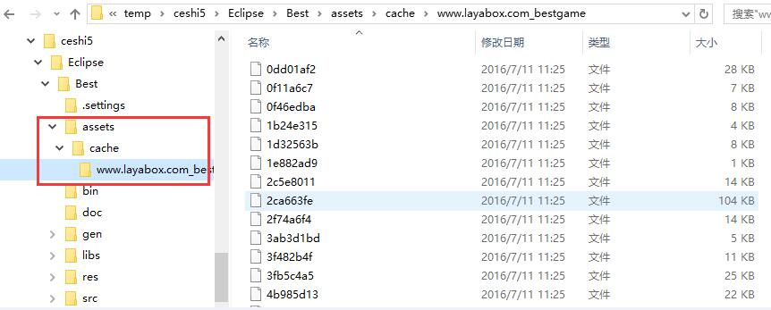

#LayaDCC Tool

##introduce
LayaDCC: Laya-Dynamic Content Check is a hot update solution provided by LayaPlayer. Its advantage is that the runtime difference updates can effectively reduce network traffic. His main data is the DCC file, which is used to describe the validation values of all the files in the project. DCC files are generated by the tool layadcc.

Laadcc traverses all project files and generates a binary file filetable. bin containing all file checks. At startup, LayaPlayer retrieves the file from the server (if necessary) to determine what files need to be updated.

Laadcc can also be used to generate resource bundles to package resources into App.

##Types of LayaPlayer resource bundles
At present, there are three resource packaging schemes.
One####App Networking Pack:

App itself carries no resources and is the smallest in size.
When LayaPlayer first runs, all the resources used are downloaded from the server and cached locally. The second and subsequent runtime will first retrieve the DCC file from the server, and then check whether the local resources need to be updated when a file needs to be downloaded. Only when the update is needed can the real download be made, and the unrenewable resources are read directly from the local cache.
The local cache will gradually increase.

Two####App Networking Pack with Resources:

App package itself contains part or all of the game resources, and the package is large.
Data can still be updated, that is, every run will still take DCC files from the server for verification. If a file in the package is found to be old, new files will be downloaded and cached locally. When running later, cached files will still be used as long as the cached files have not changed.
After several updates, most of the files in the App package may be ineffective, each time the local cache is fetched. It is recommended that the App package be updated and packaged with new resources.

Three####App offline package (stand-alone package):

Packing all resources directly into App does not require network downloads or even networking. The volume is the largest.
Because it is a stand-alone version, there is no url, so resources can not be updated dynamically. If you want to update resources, you can only update App.

##Installation and use of layadcc
Laadcc is based on Node.js, so you need Node.js environment.
###1. Install Node.js
To nodejs[官网](https://nodejs.org/en/)Download.
Node.js is not too old and does not support the 0.xx version. You can use commands to view the node version.
For example:

```bash

$ node -v
v4.2.0
```

This version is OK.
###2. Install layadcc

```bash

npm install -g layadcc
```

If installed successfully, layadcc can be executed directly from the command line.

###3. Usage


```

layadcc 资源目录 [options]
options:
    -cache 生成资源包.
    -lwr 文件路径全部转为小写。（一般不需要）
    -url url 如果要打包资源的话，对应的url.
    -cout outpath 打包资源的输出目录，如果不设置的话，就是在资源目录下。
例如:
   layadcc d:/game/wow -cache -url www.game.com
```

###4. Actual Operation
####4.1 Operating Environment
Ensure that Node.js, npm, layadcc are installed correctly
Verification method:
![] (img/2.png)
Figure 1
As long as layadcc is executed without an error.

####4.2 HTML 5 project environment
Suppose there is a game item in the F:/work/test/best game/directory (the startup page index.html is in this directory), and its directory structure is as follows:
! [] (IMG / 3. PNG)
Figure 2
The corresponding URL address after the project is released is:`http://www.layabox.com/bestgame/index.html`  
(If the URL address is not required for the stand-alone version)

####4.3 Packaging Resources
Now we need to package this HTML5 project and put it into the App project.

```

 layadcc F:/work/test/bestgame -cache -url http://www.layabox.com/bestgame/index.html
```

If it is a single package, enter:

```

 layadcc F:/work/test/bestgame -cache -url http://stand.alone.version/index.html
```


The following picture:
![] (img/2.gif)
Figure 3

Added`-cache`After parameters, all resource files are traversed and output to`-cout`Under the specified directory, if not`-cout`Parameters, create a layadccout directory under the working directory (as shown above), and the cache directory under the output directory is the resource that you need to use when packaging App.
Then copy this directory to the corresponding directory of the project being built, and you can compile and package it to generate App.
In different development environments, you need to put it in different directories (if you use LayaAirIDE or layabox command line tools, you can do this automatically).

**Android Eclipse:**  
<br / >
(Figure 4) Android's resource directory is the assets directory under the project

**Android Studio:**  
![] (img/5.png)
(Fig. 5)

**IOS XCode:**  
<br / >
(Figure 6) IOS is the resource directory

####4.4 Update Server
This is the most common operation after the release of App. Whenever the content of HTML5 project is updated and needs to be submitted to the server or local test, a new DCC is generated so that the client can update to the latest resources. The operation process is as follows:
![] (img/1.gif)
Figure 7

You can see that after layadcc is executed, an update directory is generated under the specified directory (now the current path.). Then copy the update directory to the same directory of the local or remote server.
**Tips:**   
For convenience and error-free, it is recommended that layadcc be executed directly in the directory where the server is located.

**Update Directory Introduction:**   
! [] (IMG / 4. PNG)
Figure 8

Relative paths for all resource files. txt.
Assetsid.txt Check code for the whole resource bundle of this DCC statistics.
Filetable.bin DCC main file, which is the check value of each file.
Except for the first three lines, each line represents a file and its corresponding check value, which corresponds to allfiles. txt, that is, the fourth line corresponds to the first line of allfiles. txt.
Filetable1.txt is no longer used.

**Be careful:**  
1. If there is no update directory in the directory on the web server, or there is no content in the update directory, the client's DCC update mechanism will be closed, so that all resources will be re-downloaded every time. This approach is recommended during development.
2. The example above is in the current directory. Other paths can actually be specified, either relative or absolute, for example:
   `layadcc d:/game/bin/h5`perhaps`layadcc ../bin/h5`


####4.5 test
1. Successful test of resource packaging
First of all, there are no resources in the package. In this case, all resources will be downloaded from the Internet. The log is as follows:
![] (img/7.png)
Figure 9 shows a lot of Downloads
   **Print information description:**  
The @127.0.0.1 following the URL in this file is for debugging, indicating the server address corresponding to this file. S = 0 means that the file has no DCC information, and L = XXX means the length of the downloaded file.

If you make a resource bundle, that is, something in the cache directory is copied to the directory specified above, then the most intuitive change is that the bundle becomes larger. Then run app and read the print of the resource from the resource bundle, as follows:
![] (img/8.png)
Figure 10
   **Print Information Description**  
Printing`found the file in the package:`It means that the corresponding resources are obtained from the package, and not downloaded from the network. Seeing this log means that the package resources are successful. If you type a stand-alone version, then all resources should have this print, and there should be no download.

2. Does the service have DCC testing?
Open the address in the browser: http://www.layabox.com/best game/update/filetable.txt
Note to change the address to your own. If the file exists, it means that you have typed dcc. The following picture:
![] (img/6.png)
Figure 11

3. Testing of Update Mechanism
The intuitive test is to update the resources. App has made corresponding changes, such as the modified images, which can be seen on the app. If you look at the log, it's when you get resources, everything that hasn't changed is printed.`found the file in the package:`And all that changed was printing.`download [ ] xxxurl `。
   **Be careful**  
1 Download executes only once and enters app the second time. If this resource is unchanged, it will be fetched directly from the cache.
2 DCC's mechanism is run-time updates, so it will only download when this resource is needed, instead of downloading all updates as soon as it is started.


**summary**  
* all have`download [ ] url `It means download, indicating that there is no DCC or resource update
* all have`found the file in the package:`That means the packaging resources are successful and the DCC works.


**Be careful:**  
*When layadcc executes, it will modify the modification time of all files, so as to prevent CDN from thinking that the file has not been modified when it returns to the source.
* The above address is fictitious, and there is no address at http://www.layabox.com/bestgame/index.html.


##Common problem
1. After packaging the resources, I don't feel the speed is getting faster. I doubt that all the resources are still downloaded.
1. Determine whether it's all downloads. See if the logs have the Download and find mentioned above. If there are both read caches and downloads, there's no problem, but downloads are really slow.
2. If it's all Download, there's no read cache
1. Did you forget to call dcc? Check the server for DCC information through the browser.
2. Check that the packaging resource path is correct.

2. After the release of App, some resources were modified, but not updated to App.
1. Did you forget to call dcc?
2. Called dcc, but forgot to submit it to the server (recommend calling DCC on the server)?
3. It's called DCC and submitted to the server, but because of cdn, this change hasn't been distributed to your node.

3. I confirm that the DCC process is correct, but a resource will be downloaded again every time, without caching.
1. To confirm whether the resource is in the packaged resource, i.e. in the DCC list, you can search for the file in update/allfiles.txt.
2. If. Verify that the URL requesting this resource has a search section, xxx, which, if added, cannot go through the DCC process.
3. If there is no search, it may be that the actual content of the file does not match the check value. The DCC will assume that it is the wrong file and will not cache it. Possible reasons:
1. After typing the dcc, someone changed the content of the file again, which led to the mismatch between the DCC check value and the actual content of the file. Solution: Re-call DCC
2. No one changed the content of the file, but the DCC was typed on the client side. After the file was uploaded to the server, it was modified by the uploading software. This usually happens on text files, for example, some version management tools and FTP tools will change the return line under windows into the return line of unix. Solution: zip file transfer, or DCC on the server.
3. There is no problem above, and the wrong one is the picture. Perhaps the reason is that some systems intercept HTTP requests globally. When requesting images, they cache a compressed image through their own servers to achieve so-called traffic savings. The check value of this compressed image must be different from that of the DCC record. Solution: Turn off the traffic saving function.
4. If there is no open flow savings. But when using cdn, it may also be a CDN problem. For example, the DCC file has been refreshed, but the corresponding resource file has not been refreshed. Confirmation method: Download the resource file on this node by curl command (see appendix), compare with the resource file of source station, if different, confirm. Solution: force the CDN node to refresh, or find CDN customer service.

4. During the development period, it is too troublesome to call DCC for every update.
Don't use layadcc to play dcc, if you have already.
Delete the update directory and reinstall the app to remove the internal cache so that the DCC mechanism is turned off and every file is downloaded again every time it requests.
If you hit the DCC again one time and generate the update directory on the server side, the cache will work again. If you want to turn it off, do the above again.

5. In order to reduce the size of the package, I hope to pack only part of the resources. What is the correct posture?
Whether it is the initial installation or the upgrade of app later, if only part of the resources are tapped, it is necessary to ensure that the DCC information in the resources is generated based on complete data. For example, there are 100 resources. If you want to pack only 50 resources into app, you need to first call DCC in the complete resource state, save the generated DCC information (mainly filetable. txt), then delete 50 resources, and use layadcc to generate cache files. At this time, the generated DCC information under the cache directory is incomplete, so you need to use the files generated in the previous step to cover him.
If incomplete DCC is used, it will cause problems: when updating app, native will give priority to the DCC files cached in app, resulting in the loss of some cached information, so the files not in filetable. TXT will be considered not to need caching, so they will be downloaded until the next server DCC update.

##appendix
1. LayaDCC process
![] (img/1.png)
Figure 12
The corresponding code is in index. js.

2. Download files on a CDN node.

```sh

curl -H "Host:www.layabox.com" http://182.110.238.110/bestgame/index.html >a.html
```

Represents the number of nodes on 182.110.238.110`http://www.layabox.com/bestgame/index.html`The file is downloaded and saved in a.html.
Host: Change the following content to your own domain name.`http://`How can I get the address of the node server when the IP address is changed to the address of the node server? In LayaPlayer, the node server usually does not change, so the address can be obtained by printing any download, for example:

```

Downloaded http://www.layabox.com/bestgame/bestgame.min.js@182.110.238.110 s=44216b56 l=422
```

The node address is 182.110.238.110.