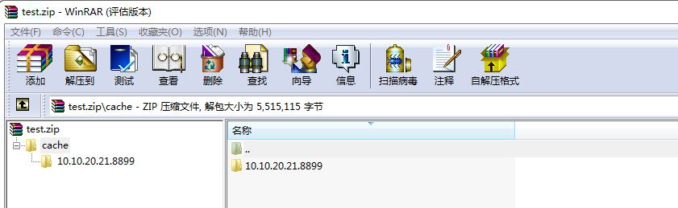

# android文件扩展机制
LayaNative不仅支持把资源打包在assets目录下，还支持把资源打包成zip文件，放到任意文件路径下。LayaNative文件系统会先在assets目录下查找文件是否存在，如果没有找到，再去指定的zip路径下查找。通过这种zip机制便可以解决GooglePlay规定APK的size超过100MB，要求增加扩展包的问题。  

## 1.机制详解
### 1.生成DCC
测试项目用DCC工具打包资源  
    
### 2.压缩文件
把资源包放到扩展文件中，压缩cache文件，文件要求zip格式，文件结构必须保持DCC工具生成的结构相同，如下图：
  
### 3.将zip文件拷贝到设备目录
在Android手机上建立目录/storage/emulated/0/Android/test/com.layabox.conch6，上传test.zip到这个目录下
### 4.修改代码中的扩展路径
修改RuntimeProxy.java中的`getExpansionMainPath`函数，设置正确的zip路径。
```   
    public String getExpansionMainPath()
    {
        return "/storage/emulated/0/Android/test/com.layabox.conch6/test.zip";
    }
    public String getExpansionPatchPath()
    {
        return "";
    } 
```
### 5.开启外部存储权限
安卓6.0以上的机器可能不能读取外部存储，需要主动请求权限。请加上如下代码或者Google相关解决方案。
```
    public static boolean isGrantExternalRW(Activity activity) {
        if (Build.VERSION.SDK_INT >= Build.VERSION_CODES.M && activity.checkSelfPermission(
                Manifest.permission.WRITE_EXTERNAL_STORAGE) != PackageManager.PERMISSION_GRANTED) {
            activity.requestPermissions(new String[]{
                    Manifest.permission.READ_EXTERNAL_STORAGE,
                    Manifest.permission.WRITE_EXTERNAL_STORAGE
            }, 1);
            return false;
        }
        return true;
    }
```
**TIPS:LayaNative中最多支持两个zip文件，第二个zip修改·getExpansionPatchPath·这个函数**

### 5.运行测试
运行APP，看见下面的日志说明从主扩展包读取资源文件成功
  
## 2. Google Play APK扩展文件机制
(https://developer.android.com/google/play/expansion-files.html)
