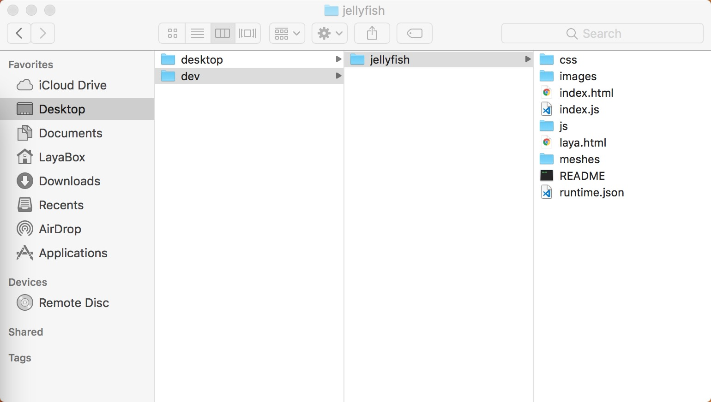
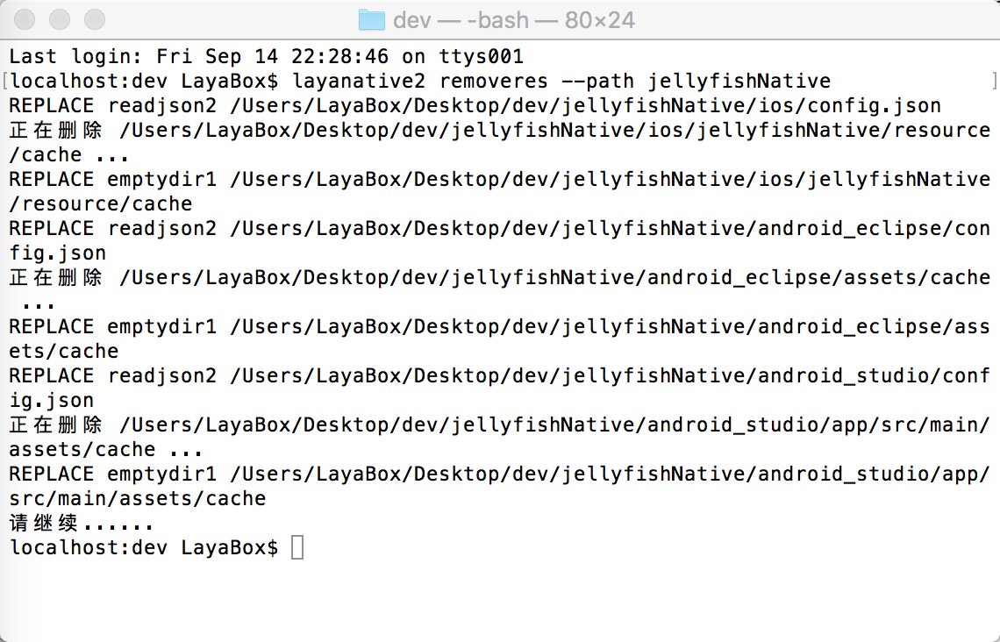

# LayaNative命令行工具
The layanative command line tool is used to generate Android and iOS native projects, as well as project resource refresh function, to facilitate resource updates during project iteration.
The functions of the generated project correspond to those in the IDE`工具/app构建`。
**Be careful:**
**LayaNative 2.0-Android, requiring the minimum version of the system to be 4.0**
**LayaNative 2.0-iOS, requiring the minimum version of the system to be 10.0**
##1. Order Details
###1. Install layanative
Windows

```

$ npm install -g layanative2  
```

Mac

```

$ sudo npm install -g layanative2  
```

###1. View SDK version information
SDK is the template for native projects. The listversion command lists all currently available SDK version information. When creating a native project below, you can specify the required version by using the parameter.

```

$ layanative2 listversions  
```

###2. Creating Native Projects
The createapp command is used to create a native project
You can first use the following command to view the help information for the command createapp

```

$ layanative2 createapp --help
```

####Usage:
Layanative2 createapp [- f res_path] [- path output_path] [- s sdk_path | - V version] [- p all | IOS | android_eclipse | android_studio | wkwebview [- T 0 | 1 | 2] [- u] [- n project_name] [- a_app_name] [- package_name]

####Description of parameters:

| keyword | description
| ----------------------------------------------------------------------------------------------------------------------------------
A kind of`--folder,-f`| Resource Path: Pack game resources into the client to reduce network downloads and select local game directories, such as starting index under d:/game/index.html. The resource path is d:/game. Do not fill in when t is 0
A kind of`--path`| Native project output directory [default: "."]
A kind of`--version，-v`| SDK version: Automatically use a specific version of SDK, the system will download SDK from the server and store it in a specific location. The -- version and -- SDK contradict each other and cannot be specified at the same time. When neither is specified, the latest version of SDK is used by default.
A kind of`--platform, -p`| Project platform [optional values: all, ios, android_eclipse, android_studio, wkwebview] [default: all]
A kind of`--type, -t`| Create a type [0: no call resource bundle 1: call resource bundle 2: stand-alone version] [default: 0]
A kind of`--url, -u`| Game Address [When t is 0 or 1, you have to fill in, when t is 2, you don't need to fill in]
A kind of`--name, -n`| Project Name: Name of Native Project [Default: LayaBox]
A kind of`--app_name, -a`| Application Name: The name that app displays when installed on the phone [default: LayaBox]
A kind of`--package_name`| Package name [default: com. layabox. game]
A kind of`--sdk,-s`| SDK local directory: Custom SDK directory, optional parameters. When the network is disconnected, it is generally recommended to use the parameter version.
When the type is 1 or 2, call the resource bundle to the native project, and when it is 0, no call. The bottom level of packaging resources is actually the method of calling dcc. Packaging resources DCC related, reference[LayaDcc工具](https://ldc.layabox.com/doc2/?nav=zh-as-6-2-0)。
The -- path parameter can be used to specify the output path of the project, which is output to the current path by default.

Using v2.0 version of SDK according to-v

```

$ layanative2 createapp -f SnowBallH5 -t 1 -n SnowBallNative -u http://10.10.20.102:8899/index.js -v v2.0
```


Neither - V nor - s is specified, using the latest version of SDK

```

$ layanative2 createapp -f SnowBallH5 -t 1 -n SnowBallNative -u http://10.10.20.102:8899/index.js
```

Networking environments are required to specify version s with -- version or - v, and SDK directories can be specified with -- SDK or - s when the network is disconnected.[SDK下载地址](https://ldc.layabox.com/layadownload/?type=layaairnative-LayaAir%20Native%20SDK%200.9.6)

```

$ layanative2 createapp -f SnowBallH5 -t 1 -n SnowBallNative -u http://10.10.20.102:8899/index.js -s D:/v2.0
```

###3. Refresh Native Project Resource Pack
The refreshres command is used to refresh the resource bundle of the native project
During the project iteration, the H5 project has been modified, and refreshres commands can be used to repackage refresh resources and code into the native project.
####Usage:
Layanative2 refreshres [-p all | IOS | android_eclipse | android_studio | wkwebview] [- path] [-u url]

####Description of parameters:

| keyword | description
| ----------------------------------------------------------------------------------------------------------------------------------
A kind of`--platform, -p`| Project platform [optional: all, ios, android_eclipse, android_studio | wkwebview] [default: all]
A kind of`--path`| Native project path [default: "."]
A kind of`--url, -u`| Game Address


If the project you create is a stand-alone version, you do not need to enter URL for refreshres. If the network version URL is input and the network version resource package is typed, then the project code needs to be changed to become the network version of the project.
If the project you create is a web version, you must enter URL when refreshres. If you enter a new address, you need to change the code that sets the URL in the project to complete the replacement of the URL. If you enter the address of the stand-alone version and type the resource bundle of the stand-alone version, then you need to change the project code to become a stand-alone version of the project.
Manual switching between stand-alone version and network version is relevant.[LayaBox 构建工具](https://ldc.layabox.com/doc2/?nav=zh-as-6-3-1)。

When creating teapp, the resource path is written in the native. JSON file under the generated native project directory. If resources are later moved elsewhere, the resource catalog will be missed. When creating teapp, if the - t parameter is specified to be zero and no resources are allocated, the resource path parameter can not be specified. The resource path written in native. JSON is empty. This project refreshres will report an error that the resource path is empty. In both cases, you can manually modify the native. JSON file to specify the correct resource path.
###4. Delete Native Project Resource Pack
The removers command is used to delete resource bundles for native projects
####Usage:
Layanative2 removeres [--path]
####Description of parameters:

| keyword | description
| ----------------------------------------------------------------------------------------------------------------------------------
A kind of`--path`| Native project path [default: "."]

##3. Application examples
1. First, the directory structure shown in the figure below is established. Jellyfish is the HTML 5 project directory

  

2. View SDK version information
  

3. Creating Native Projects
  

4. Generate the directory structure shown below.
  

5. Refresh resource packages at any time
In the dev directory, specify the directory of the native project by -- path
       

Enter the native project directory without specifying the -- path parameter
   

5. If you don't need a resource bundle, delete it
In the dev directory, specify the directory of the native project by -- path
    

Enter the native project directory without specifying the -- path parameter
  