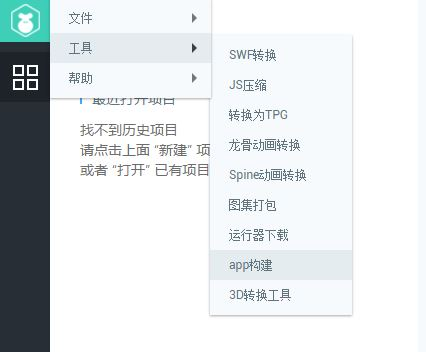

# LayaBox 构建工具
　　构建工具用来生成LayaPlayer的移动端App项目，相当于App项目向导。目前支持Android（Eclipse项目、Android studio项目）和iOS(XCode项目)。  
**注意：**
**LayaNative2.0-Android，要求系统最低版本为4.0**
**LayaNative2.0-iOS，要求系统最低版本为10.0**
## 1. 运行需求
#### 1.1 基础开发环境

​	构建项目必须要准备好开发环境。比如：构建iOS项目需要准备好Mac电脑和XCode，android需要准备好Eclipse或Android studio。

## 2. 面向用户
　　无论是构建Android还是iOS项目，则必须要有相应的Android或iOS的App开发基础。  如果不具备，请先去学习了解相关的基础知识。


## 3. 在LayaAirIDE的打开App构建

在[Layabox官网](Layabox.com)下载layaAirIDE，打开LayaAirIDE-->点击左上角LOGO图标-->工具-->app构建，如图1所示：




(图1)


　由于构建工具需的库文件比较大，因此并没有直接包含在LayaAirIDE中，在第一次使用这个工具的时候，会先下载SDK包，如下图：

  

​  (图2)

**注意**

这个文件比较大，所以下载的时候需要耐心等待。

一旦下载完成，以后再点 "app构建" 的时候就会直接弹出构建对话框。

## 4. 项目构建界面参数

在LayaAirIDE中打开项目构建的界面，如图3所示：


(图3)

* 平台

   构建生成的项目工程的类型，有Android Eclipse项目、Android studio项目、iOS 项目 三种选项，如果需要生成Android项目，可以选择Android-eclipse或Android-studio（ 由于google已经不再维护Eclipse，建议选择Android Studio项目，我们也会在以后的版本中去掉对Eclipse的支持）。 如果需要生成XCode(iOS)项目，则选择iOS选项。 


* 单机版app：

   如果勾选此选项，则构建的项目打包的App是单机版，否则就是在线版。单机版不需要联网，没有对应的url，不用提供url。但是必须提供游戏资源，否则打包之后无法运行。

* 项目名称：

   App的名称。同时也是构建项目的输出目录。

* 包名 ：

   应用的包名，这个正常情况下是不可见的。一般采用反域名命名规则（有利于分辨和避免与系统中已经有的APP冲突)。   

　　例如 : com.layabox.runtime.demo   
　　包名必须是 xxx.yyy.zzz 的格式，至少要有两级，即xxx.yyy 。否则打包会失败。

* 游戏url：

   如果要打包的应用是一个在线项目，则需要提供一个启动url，指向一个js或json文件，是应用的入口。而通过LayaAir生成的项目，会输出一个启动页面，一般是index.js。 在测试的时候，为了方便，通常是使用的本地URL地址在浏览器中测试，当打成Android App的时候，必须有一个真正的webserver的地址，

   例如：  

　　*局域网地址：*  

``` 
    http://10.10.20.19:8888/index.js
```
　　*实际地址:*  
``` 
    http://nativetest.layabox.com/layaplayer/index.js
```

* 输出路径：

   构建生成的 App 工程项目的存放地址。

* 资源路径：

   资源是脚本、图片、声音等资源。对于在线游戏，只要有游戏的url就能正常运行，但是把资源直接打进App包中的话，可以避免网络下载，加快资源载入速度。如果是单机游戏，由于没有提供游戏url，就必须给资源目录，把所需的资源全部打包进App。

   打包进App的资源依然可以通过我们的dcc工具（资源缓存管理）进行更新。
   如果这时候没有设置资源路径，在构建完项目以后，依然可以手动添加资源，添加方法参考 [LayaDcc工具](https://ldc.layabox.com/doc2/?nav=zh-as-6-2-0)。  

   **注意：**  

   　　把资源打包的缺点是会增加包体的大小。  

   　　打包资源的在线游戏，必须在server端打dcc，否则就会失去打包的优势，依然会下载所有的资源。如何打dcc，参考 [LayaDcc工具](https://ldc.layabox.com/doc2/?nav=zh-as-6-2-0)。


## ５. 构建好的项目工程的使用

构建好的 App工程，可以用对应的开发工具打开进行二次开发和打包等操作。

- Android-eclipe（android）项目可以使用 eclipse软件进行导入和开发。
- Android-studio（android）项目可以使用 android-studio软件进行导入和开发。
- XCode（ios）项目可以使用 xcode 软件进行导入和开发。打开XCode(ios)项目后需要选择真正的ios设备进行build。（注意：真正的设备是 armv7、armv7s、arm64 架构。而如果使用ios Simulator 则是 X86 架构，目前 LayaNative 在 ios 设备上尚未支持 X86 架构，如果使用模拟器编译是无法通过的。（0.9.5版开始支持模拟器）


**参考资源：**

- [Eclipse搭建Android环境](https://github.com/layabox/layaair-doc/tree/master/Chinese/LayaNative/setUpAndroidEnvironment_Eclipse)

- [Android Studio的使用和配置](https://github.com/layabox/layaair-doc/tree/master/Chinese/LayaNative/AndroidStudio_ConfigurationAndApplication)

- [IOS打包发布App详细流程](https://github.com/layabox/layaair-doc/tree/master/Chinese/LayaNative/packagingReleases_IOS)

  ​

## 6. 手动切换单机版和网络版

构建完成之后，可以通过直接在项目中修改代码来切换单机版和网络版。

1. Android 项目  

     在构建的项目中打开MainActivity.java，搜索 `mPlugin.game_plugin_set_option("localize","false");`  
     单机版需要设置为"true"，如`mPlugin.game_plugin_set_option("localize","true");`  
     如果要设置为网络版，就要修改为：`mPlugin.game_plugin_set_option("localize","false");`， 并且设置正确的地址：  
     `mPlugin.game_plugin_set_option("gameUrl", "http://你的地址/index.js");`


2. iOS 项目

   iOS项目构建完成后，项目目录下的 resource/scripts/index.js 脚本的最后有个执行loadUrl的函数，这里会加载首页地址，修改这里的地址就能切换单机版和网络版，单机版的地址固定为 `http://stand.alone.version/index.html`。

   例如一开始是网络版，地址为：  

    `loadUrl(conch.presetUrl||"http://10.10.20.19:7788/index.js");`   
   要改成单机版的话，修改这句话：  
    `loadUrl(conch.presetUrl||"http://stand.alone.version/runtime.json");`  
   反之亦然。  

   **注意**   
   一旦修改了url地址，原来打包的资源就都失效了。这时候，需要手动删除 cache目录下内容，重新用layadcc来生成打包资源，参见[《LayaDCC工具》](https://ldc.layabox.com/doc2/?nav=zh-as-6-2-0)。

## 7. 资源刷新

通过IDE构建好工程，如果选择的是单机版和打包资源版本。会在resource/cache目录下，把所有h5项目的资源（包括：脚本、图片、html、声音等）全部打包到了这个目录下。  
``android的目录： assets/cache/  ``  
``iOS的目录：  resource/cache/  ``  

但是在开发过程中，h5的项目一直在变化，为了避免每次都重新构建工程，在IDE-1.7.6-Beta版本之后，可以通过命令行进行刷新。

资源包版本调用命令：``layanative refreshres -u http://testgame.layabox.com/index.js``    
单机版本调用命令：``layanative refreshres`` 

***Tips***  
**1、必须在构建的app工程目录下，执行命令。最明显的标志就是要在navtie.json的目录下，如下图所示：**
    

关于layanative命令行如何安装使用，请参考[layanative命令行工具使用](https://ldc.layabox.com/doc2/?nav=zh-as-6-3-0)


## 8. 其他注意问题
　　android studio构建完成后，需要根据自己的环境修改android sdk的版本号，现在设置的是23，需要修改的
文件是 app/build.gradle。