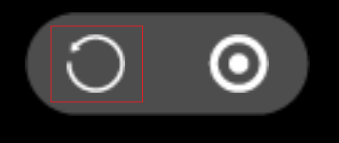

#Debugging JavaScript code on an Android real machine

##Be careful:
Due to the recent update of the chrome version to 69, it is impossible to set breakpoint debugging manually in LayaNative environment due to debugging JS on the real machine.
1. Developers can debug by writing debuggers in their code.
2. Install a version of Chrome 68 for debugging.
Our engine group will solve this problem as soon as possible, causing inconvenience to you, please understand.

##I. Principle of debugging

JavaScript code debugging is done using Chrome browser on the debugger. When LayaNative starts up on the Android tester, it starts a WebSocket server at the same time. Chrome browser communicates with LayaNative via WebSocket to debug JavaScript for the project using Chrome.

When debugging JavaScript code in a project, there are two debugging modes to choose from:

1. Debug/Normal mode

In this mode, the project on Android tester can start and run directly, and Chrome browser can connect and debug after the project runs.

2. Debug/Wait model

In this mode, the project on the Android tester starts and waits for a connection to the Chrome browser. When the Chrome connection is successful, JavaScript scripts will continue to be executed.
When you need to debug JavaScript scripts loaded at startup, choose this mode first.

**Note: Make sure that the debugger is on the same network as the Android tester in the debugging project.**

##2. Debugging Android Project Built by Lalaya AirIDE

###Step 1:

Use LayaAirIDE to build the project and generate Android projects.

<! - TODO: Add a link address. Specifically, you can refer to "Building Engineering with IDE". >

###Step 2: Modify debugging mode

Open the built project using Android Studio.

Open android_studio/app/src/main/assets/config.ini, modify the value of JSDebugMode, and set the required debugging mode. As shown in Figure 1:

![] (img/android_debugmode.png)

Figure 1

The value and meaning of jsdebugmode are as follows:

| Value | Meaning|
F: -:::
| 0 | Turn off debugging|
| 1 | Debug / Normal mode|
| 2 | Debug / Wait mode|

**Tips:**

When the project is officially released, set the value of JSDebugMode to 0, which will affect the performance of the project at runtime.

###Step 3: Compile and run the project

Compile the project using Android Studio.

If you choose Debug/Normal mode, wait for the Android tester to succeed**Start and run**Project.

![] (img/android_app_run.png)

Figure 2 Android tester successfully starts and runs the project

If you choose Debug/Wait mode, wait for the Android tester to succeed**start-up**Project.

![] (img/android_app_boot.png)

Figure 3 Successful startup of Android tester

###Step 4: Use Chrome Connection Engineering

Open the Chrome browser on the debugger and enter the following address:

> chrome-devtools://devtools/bundled/inspector.html? Experiments = true & v8only = true & WS = 10.10.82.142:5959

**Be careful:**Ws = 10.10.82.142: 10.10.82.142 in 5959 is the IP address of Android tester, 5959 is the port number value set by JSDebugPort in the config.ini file in Step 2. Please change it according to the actual situation and requirements of your device.

###Step 5: Debugging

Once the connection is successful, you can use Chrome to debug JavaScript in your project. As shown in Figure 2:

![] (img/debug_connected.png)

Figure 4

##3. Debugging with Test App

###Step 1: Confirm the IP address and port number

Open the test App to see the IP address of the Android device and the port number required for debugging in the upper left corner.

As shown in Figure 1, the IP address of the device is 10.10.82.142 and the port number is 5959.

Figure 5

###Step 2: Select debugging mode

Click on the middle button at the bottom of the screen to select the debug mode.

Figure 6

Figure 7

###Step 3: Scan the 2-D code of the item

Click on the blue two-dimensional code icon in the middle of App to scan the layanative two-dimensional code address of the project.

If you choose Debug/Normal mode, wait for the project to succeed**Start and run**。

Figure 8 Case Project Running Successfully

If you choose Debug/Wait mode, wait for the test App to pop up the following interface:

Figure 9

###Step 4: Connect to Test App in Chrome Browser

Open the Chrome browser and enter the following address:

> chrome-devtools://devtools/bundled/inspector.html? Experiments = true & v8only = true & WS = 10.10.82.142:5959

**Be careful:**Ws = 10.10.82.142:5959 is the IP address and port number in step 1. Please change it according to the actual situation of your device.

###Step 5: Debugging

Once the connection is successful, you can use Chrome to debug JavaScript in your project. As shown in Figure 7:

![] (img/debug_connected.png)

Figure 10

**Tips:**Test the shortcut buttons in App

After testing App successfully running the project, two buttons are displayed on the screen. The functions of the two buttons are as follows:

**1. Refresh button**

When you change the code of the project, click the refresh button to reload the changed project without re-scanning the code.

**Be careful:**In the case of Chrome connection, the test App crashes when it clicks the refresh button. This problem will be solved in later versions. Please forgive me.

**2. Return button**

Click on the return button to return to the scanner interface and re-scanner.

##IV. Problems in the Current Version

**The following problems will be solved in future versions, please forgive me.**

In the debugging process of the debugger, there is a probability of debugging confusion when using the breakpoints added manually by the debugger (non-debugger breakpoints).
If you encounter this situation, please follow the following steps to deal with it:

Step 1: Set breakpoints as follows

![] (img/7.png)

Figure 11

Step 2: Cancel all breakpoints

![] (img/8.png)

Figure 12

Step 3: Restart the project and use Chrome to connect the project.

![] (img/9.png)

Figure 13

Step 4: Recovery the breakpoints needed

![] (img/7.png)

Figure 14