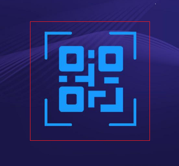
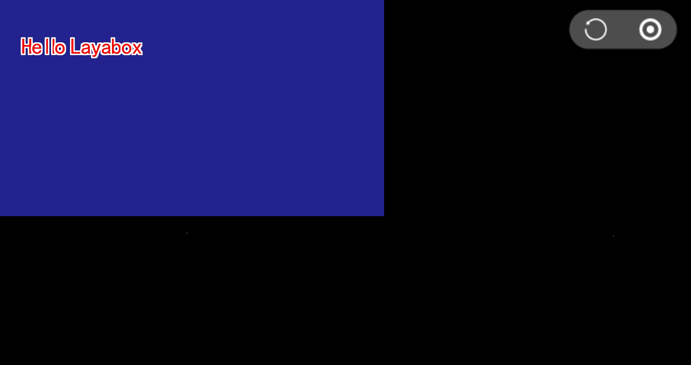

#Running the LayaAir project using LayaNative

I believe that when you look at this document, you have mastered LayaAir or have some knowledge of LayaAir. In LayaAir's document, you have described in detail how to use LayaIDE to create the first program "Hello LayaBox".

TODO: Change Link Address ** Tips: If no screen is displayed on the screen after entering the project address, it may be because the project has not set the horizontal and vertical screen correctly, please refer to the documentation: https://github.com/layabox/layaair-doc/tree/master/Chinese/LayaNative/screen_orientation**->.

Step 1: Now I have created a simple project for Hello LayaBox, as shown in Figure 1:

 
The operation effect is shown in Figure 2.

 
Figure 2

Step 2: Click on the menu button of "two-dimensional code" in the upper right corner of LayaIDE to display the two-dimensional code interface. On the left side of the interface, an HTTP address is displayed below the two-dimensional code. The address in the example is`http://10.10.20.50:8900/bin/h5/index.html`As shown in Figure 3:

 
Figure 3

Step 3: Click on the "Browser Open" button in the two-dimensional code interface, and it will be used in the browser.`http://10.10.20.50:8900/bin/h5/index.html`The way to open, open the screen as shown in Figure 4:

 
Figure 4

Step 4: Open the LayaBox test App that has been installed on the mobile phone, and then open it as shown in Figure 5.

 
Figure 5

Step 5: Click on the blue two-dimensional code icon on App and scan the two-dimensional code layaNative on the right side of Step 2.

 

Figure 6

 
Figure 7

Step 6: After the scan is successful, the test App loads and runs the Hello LayaBox project instance, as shown in Figure 7:

 
Figure 8