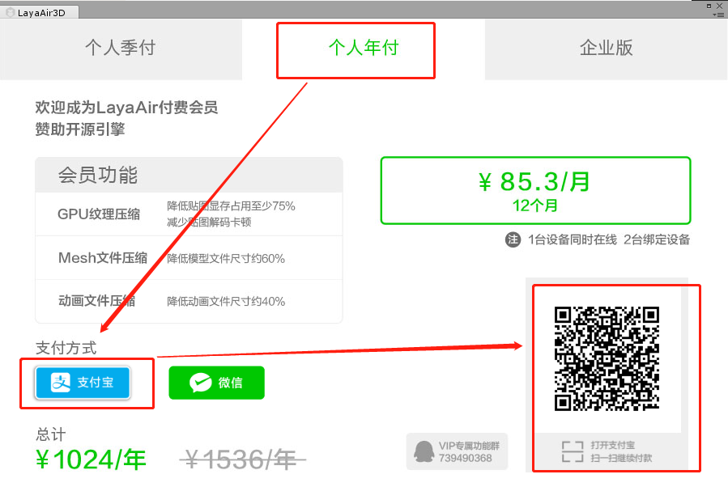
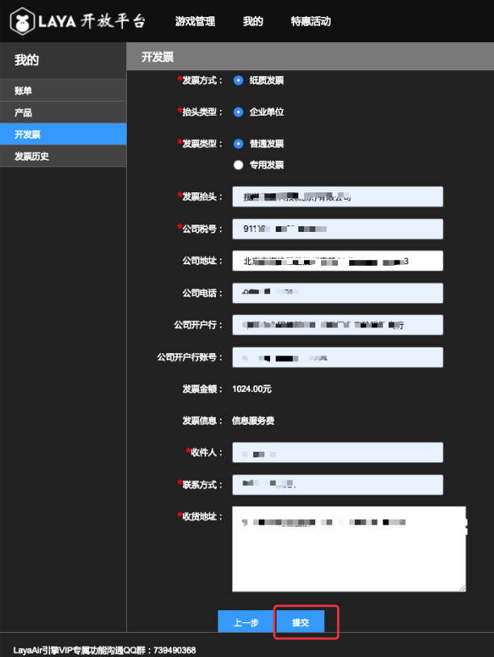

#Introduction to VIP-specific functions of LayaAir engine

> Author: Charley Text Engine and Tool Version: LayaAir 2.0.2 Text Update Time: 2019-04-15

Click on the following directory to jump directly:

[TOC]

##1. Why LayaAir 2.0 Pushes VIP-specific Functions

At LayaAir 1.0, there was no profit model for free engines, which put pressure on the survival of the engine team. In order to alleviate the pressure of the engine team, we can only shrink the human input of the surrounding services such as documents, communities and so on. However, this is not the way of engine sustainable development. If the engine business is free forever, it will only make the engine in trouble. If the engine companies can not survive, it will be bad news for most game companies that do not have the ability to develop and maintain the engine.

So before the launch of 2.0, we had been thinking about a balance point, that is, to reduce development costs for developers, free use of engines and low threshold efficient development of games, and to find a way to make the engine survivable and sustainable development.

Therefore, on the premise that the basic functions of LayaAir 2.0 engine continue to be free, we continue to enhance the high performance of the engine, enhance the ease of use of the engine, and constantly improve the engine functions, especially the maturity of the 3D engine on the free 2.0 engine and tools. But it also decided to try charging for several value-added services around the engine to make the engine sustainable.

The current charge for VIP exclusive functions is one of the attempts. The charge for VIP functions is relatively low, even for individuals. And the use of VIP functions will not affect the online game. Of course, the use of the game will certainly make the effect of better or optimized.

Finally, we hope that the value-added charging business around the engine can be understood and supported by developers. Only after the engine enterprise has solved the pressure of survival, can it better invest human and energy in the documentation and other basic free services. Make the ecology of engine sustainable development more prosperous.


##II. What services are included in the exclusive functions of VIP

Since it is a proprietary function, VIP members naturally have unique functions that non-VIP developers do not have. Functions are currently available in the following areas:

###1. 3D model file compression:

Effect: Reduce the size of model file by about 60%.

Function Introduction: Models in 3D games are an important part of the volume of game resources. So reducing the size of the model file can shorten the loading time of the game and accelerate the speed of players entering the game. In the current network speed environment, reducing the size of the game is still an important value-added function.

###2. Texture Compression (2D+3D):

Effect: Reduce the display memory by about 75%, reduce the image decoding cartoon phenomenon.

In order to save memory, texture compression is not used in the game. The usual approach is to design the original image as a low-resolution model, and then stretch it to fit the high-resolution model in the game. This will lead to the mosaic phenomenon of the game (many small games have this problem on some Android HD resolution models, which must be the result of this problem), and the texture compression mode even if designed according to high resolution occupies less memory, so in the case of the same memory occupancy, in the high resolution model, the compression effect and stretching effect of 2D images are right. As shown in Figure 1. The effect of 3D mapping is better after compression, and the loss of the original image by compression is almost negligible in visual effect.

 


(Fig. 1)

> Reminder: 3D texture compression, the basic visual can not see, so it is recommended to use. However, the use of texture compression in 2D should be careful, static images (such as UI) should not use texture compression function as far as possible, while dynamic images (such as 2D character animation) will not be too obvious, there is no need to use high-definition image quality performance requirements.

Functional Profile:

The common formats of picture files in games are usually PNG and JPG. These pictures need to be decoded by CPU and then transmitted to GPU for use. Texture compression format is a format that can be read and displayed directly by GPU without decoding. Therefore, on the one hand, it saves a lot of memory, on the other hand, it can also reduce the CPU pressure brought by image decoding.

What needs the developer's attention is that. Texture compression is only available in webGL mode because it relies on hardware acceleration of graphics cards. In addition, even different platforms (operating systems) have different formats. For example, we have KTX format on Android platform and PVR format on iOS platform.

> Because the formats of different platforms are different, cross-platform games use texture compression to reduce the memory, at the same time, the cost is to increase the size of the file, so ultimately it is necessary to find a balance point according to the situation of the project.

###3. Compression of 3D Animation Files:

Effect: Reduce the size of 3D animation files by about 40%.

Function Description: 3D animation file compression and model compression, the same role is to reduce the size of file download, used to speed up players to enter the game.

###4. File merge (JSON + binary):

Effect: JSON type text files can be merged, greatly reducing the number of file download interaction, and improving the efficiency of game loading;

Functional Profile:

When there are more small files in the game, HTTP requests will be increased greatly, which will slow down the loading. The merge file function can merge Json-type files, which will reduce the number of HTTP requests for files and improve the loading efficiency. Of course, if you merge blindly, you will also increase the one-time download time of files after packaging. Therefore, developers should use it according to the actual situation of the project, especially when there are many small files.

###5. Other:

More expansion modules will continue to be added in the future (we will continue to collect members'badly needed functions, and increase more VIP modules through the number of votes).

###Special description

####1. The VIP function does not include the technical service of non-VIP function.

Often some developers will ask such questions, after purchasing VIP, can you help us solve some engine problems? Here I am very sorry to reply that the rights and interests provided by purchasing VIP are mainly the exclusive functions themselves. Secondly, I also provide relevant answers to the questions about the use of the exclusive functions of VIP, such as the exclusive functions of VIP will not be used, or the suspected BUG in the process of use, and suggestions and opinions on the exclusive functions of VIP, which can be directly added to the exclusive functions of VIP engine to communicate with QQ group. The QQ group number is:`739490368`

If there is a demand for technical services, because of the high demand for human costs, it is not affordable for the current price of VIP exclusive functions. If there is a demand for technical service procurement, it can be searched by Wechat.`399050`Contact the person in charge of business cooperation of technical services for communication or understanding.

####2. Service Difference between Personal VIP and Enterprise VIP

Enterprise VIP and individual VIP are identical in the use of their functions, and there is no difference in their functions.

The only difference is that a personal VIP account can only bind two terminals, and at the same time, the account can only log on to one terminal. Enterprise VIP can bind 20 terminals to the same account, and can log on to 10 terminals at the same time. This can facilitate the management and maintenance of enterprise accounts and avoid the problems arising from the turnover of employees.


##Pricing and Purchasing Method of VIP Function and Invoice Acquisition

###1. VIP Function Pricing

####Personal VIP:

1024 yuan/year/maximum binding 2 terminal/simultaneous login 1 terminal

####Enterprise VIP:

10240 yuan/year/maximum binding 20 terminals/simultaneous login 10 terminals

###2. Purchasing Method

####Official Web Page Surface Purchase

The link address is:[https://www.layabox.com/vip/](https://www.layabox.com/vip/)

Step 1: Click on the VIP introduction page of the official website to become a member. As shown in Figure 1-1, you can enter the purchase page.


(Fig. 1-1)

Step 2: Select the login mode on the purchase page. The account number is in common with the account number in the community. Click on the one shown in Figure 1-2.`手机或用户名登录`Enter the phone number or username and password, confirm the login, you can buy.


(Fig. 1-2)

Step three: after login, first select individual members or business member types, then choose the payment method (WeChat or Alipay), and click click to buy immediately, as shown in Figure 1-3. After the final payment is completed, the account previously logged in becomes the VIP member account. Before using the VIP function, you can log in to the account and enjoy the VIP exclusive function.

 


(Fig. 1-3)

####Purchase in LayaAirIDE

Step one:

Download the latest version of Laaya AirIDE and click on the lower right corner ad map or the personal center button in the upper right corner. After login (also the account number and password in the community), you can see the button for purchasing members, as shown in Figure 2-1. Click the button directly to enter the purchase interface.

 


(Fig. 2-1)

Step two:

In the recharge page, select the type of VIP member, click the button of payment mode (Alipay or Wechat), and the corresponding payment two-dimensional code will pop up. As shown in Figure 2-2, sweep-code payment can become a VIP member. You can enjoy the exclusive function of VIP by logging in the account before using the VIP function.


(Fig. 2-2)

####Purchase in LayaAir Unity Export Plug-in

Step one:

Check if it's the latest version of Unity3D plug-in, and if it's not, it's recommended to update (at least 2.0.1). And check whether the engine and plug-in version number one to one, otherwise the old version engine is unable to identify the new version of the plug-in, which will lead to some functions unavailable.

Download the latest version of Unity export plug-in（[点击进入插件下载地址](https://ldc2.layabox.com/layadownload/?type=layaairide)As shown in Figure 3-1.


(Fig. 3-1)

Step two:

After installation, clicking on any VIP function will require login account authentication rights. As shown in Figure 3-2.

 


(Fig. 3-2)

Step three:

If you have logged in and are VIP, you can use the function of VIP directly.

If you haven't purchased VIP yet, click on the VIP functions on the right side of Figure 3-2, and you will jump directly to the VIP purchasing interface. Or by clicking on the plug-in`Account`In (account number)`Recharge`(recharge) button to enter the VIP purchase interface. As shown in Figure 3-3.

 


(Fig. 3-3)

In the VIP purchase interface, select the type of VIP member, click the payment button (Alipay or WeChat), the right scan code can be paid to become a VIP member, as shown in Figure 3-4. Before using the VIP function, you can log in to the account and enjoy the VIP exclusive function.

 


(Fig. 3-4)

###3. Invoice-related

####Invoice Entrance

Invoice website:[https://developers.masteropen.layabox.com/dist/recharge_succ_list.html](https://developers.masteropen.layabox.com/dist/recharge_succ_list.html)

####Selection of Invoice Records

In the background of the invoice, select the paid consumption record, check it, and click Next. As shown in Figure 4-1.


(Fig. 4-1)

####Fill in Invoice Information and Express Receiving Information

Choose the consumption record for the invoice and click`下一步`After that, you will go to the invoice information filling page and fill in the true and correct information according to the options and input boxes in Figure 4-2.`提交`Please check the accuracy of the information by yourself. The filler is responsible for the invoice error caused by the error in providing the information.


  


(Fig. 4-2)

####Invoice reminder:

Due to the tax periodicity of invoices,

If the application for invoice is submitted before 20th of each month, the paper invoice will be issued and sent out within this month (usually about one week after the application is submitted).

If the application for invoice is submitted after 20 days, the paper invoice should be issued and sent after 10 days of the next month (about a week from 10 days).

These cycles will be postponed in case of holidays.

Finally, if there is a special emergency, you can join the VIP exclusive function to communicate QQ group (group number).`739490368`) Contact the administrator for consultation.


##IV. Usage of VIP Function

The VIP function of 2D needs to be used in LayaAirIDE, and the VIP function of 3D needs to be used in LayaAir Unity export plug-in. Let's have a brief look first.

As shown in Figure 5-1. The VIP function of 2D can be found and used through the toolbar of navigation menu.

  


(Fig. 5-1)

As shown in Fig. 5-2, the 3D VIP function is intuitively visible, but only after login to verify the VIP can it be used.


(Fig. 5-2)
In the use of VIP functions, most of the 3D functions are easy to understand. In addition to texture compression, the current model compression and animation file compression are only changes in file size. You can use them directly after checking out the functions, and you don't need to explain how to use them, while the 2D VIP functions need some attention. Next, we will give a detailed description of some functions that need to be noticed.

###1. Texture Image Conversion (Texture Compression)

Open LayaAirIDE`纹理图片转换`Functional interface,

click`浏览`Select the folder where the image to be converted is located (if it is a single image, you don't want to select the folder, you can only drag and drop it into the function panel).

However, specify the output directory and choose the compressed platform (Android or iOS), as shown in Figure 6-1.

 


(Fig. 6-1)

####Texture compression of JPG single image

It is important to note that the use of texture compression distinguishes platforms, and the file suffixes of compressed Android and iOS are different. So follow Figure 6-1 and click`确定`Will see`.ktx`and`.pvr`Two files with different suffixes are shown in Figure 6-2.

 


(Fig. 6-2)

The two files are used for different system platforms, among which KTX is used for Android platform. PVR is used on Apple's iOS platform.

We can put these two different suffixes in the file.`bin/res`Under the catalogue. There is no difference between using JPG and PNG resources. When using JPG and PNG resources, add a judgment to distinguish the platform and call different suffixes. Simply refer to the code as follows:


```typescript

//以下代码片段仅作参照
.......
    if (Browser.onAndroid) {
		this.extension = "ktx";
    } else if (Browser.onIOS) {
        this.extension = "pvr";
    }

    var sp:Sprite = new Sprite();
    sp.loadImage("res/1."+this.extension);
.......	
//以上代码片段仅作参照
```


####PNG Texture Compression

Because the Android platform does not support the conversion of PNG format to texture compression format (png format can continue to be used in Android platform), so the image in PNG format can only use texture compression in iOS platform.

As for the use process of the tool, it is not very different from the jpg chart. On the one hand, it should be noted that Android platform can not transform texture compression, but can only continue to use PNG format resources. On the other hand, it should be noted that the width and height of PNG graphs must be the power of 2.

#####Atlas compression

For the compression of PNG suffix, the usage is the same as that of single graph, but for the processing of atlas, the column of picture path, dragging in. PNG suffix picture or. atlas atlas atlas atlas atlas file can be recognized, and then compressed successfully. The flow chart is shown in Figure 6-3.

 


(Fig. 6-3)

###2. File Packaging (JSON File + Binary File)

This function is to merge multiple scattered files into one file, support JSON format text file merge and binary file merge, as shown in Figure 7.

 


(Fig. 7)

####JSON format file merging operation

open`文本文件打包`VIP functional interface, as shown in Figure 7-1, click on the color block area, you can select the JSON format file under bin directory to merge (atlas, scene scene, prefab, etc. are all JSON format).

 


(Fig. 7-1)

Merge rules can be set multiple, click and add`(+)`A merge rule can be created in the new panel. The flow chart is shown in Figure 7-2.
  


(Fig. 7-2)

Note that the file name in Figure 7-2`.plf`It's a pseudo suffix, at first it's a true suffix, but considering that the local package of wechat games doesn't recognize the. PLF file suffix, in order to be different from the binary type, just remember the type (PLF). The final generated file, as shown in Figure 7-3, will be a file suffixed with. json.

When all merge rules are set, click OK. You can see the package compilation results of Figure 7-3, click Open`打开发布文件夹`Button to view the merged file.

 


(Fig. 7-3)

####Operation of binary file merging

The operation flow of binary file merging is basically the same as that of JSON format file merging. Just JSON merges JSON format file and binary merges binary file. The other is that the JSON file merge type is plf, and the output is JSON suffix file. The binary file merge type is plfb, and the output is the file with. zip suffix. Therefore, the operation process will not be described in detail, through two diagrams, roughly describe the use process and differences.

 


(Figure 7-4) The type of attention is plfb

 


(Fig. 7-5)

A file merge rule corresponds to a zip file, such as the 3D scene. plfb rule, and the generated file is the 3D scene. zip file.

Here's a reminder that this zip suffix is not a standard zip format, but a binary file with zip suffix. It's to deal with Wechat games that don't recognize rare suffixes, so it can only be used in common suffixes. Don't try to decompress the zip file after synthesizing the output. It can't be decompressed successfully.

####Use of merged files

Whether it's a collection or a scene, the usage before and after merging is not different, including the opening of the original collection or scene name, which is the same as the original. The only thing to note is that in order to use the pre-merged atlas or scenarios, it is necessary to ensure that the merged files are loaded first, so the pre-merged loading logic should be placed in the merged file loading callback.

The JSON example reference code is as follows:


```typescript

//先加载plf类型的合并后文件Image.json
Laya.loader.load([{url: "res/Image.plf", type: "plf"}], Handler.create(this, function():void {
	
    //在回调里，正常使用原来的图集
	Laya.loader.load("res/atlas/comp.atlas", Handler.create(this, function():void {
		var img:Texture = Laya.loader.getRes("comp/comp.png");
		var sp:Sprite = new Sprite();
		sp.graphics.drawTexture(img);
		Laya.stage.addChild(sp);
		}));
    
	Laya.loader.load("res/atlas/test.atlas", Handler.create(this, function():void {
		var img:Texture = Laya.loader.getRes("test/test.png");
		var sp:Sprite = new Sprite();
		sp.graphics.drawTexture(img);
		Laya.stage.addChild(sp);
		}));
}));
```


The binary example reference code is as follows:


```typescript

//先加载plfb类型的合并后二进制文件bone.zip
Laya.loader.load([{url: "res/bone/bone.zip", type: "plfb"}], Laya.Handler.create(this, function() {
            // 模板
            let template = new Laya.Templet();
            template.on(Laya.Event.COMPLETE, this, function() {
                let skeleton = template.buildArmature(0);
                Laya.stage.addChild(skeleton);
                skeleton.pos(300, 300);
                skeleton.scale(.5, .5);
                skeleton.play(0, true);
            });
            template.loadAni("res/bone/alien.sk");
        }));
```


It's important to note that the type of text file loaded after packaging is plf（`type: "plf"`The type of binary package loading is plfb（`type: "plfb"`)


###VIP Functional Problem Communication

Finally, if you are a developer who has purchased the VIP function and encounters problems with the VIP function, you are welcome to communicate in the VIP function communication group.

QQ group number: 739490368

It should be noted that the official engine staff only answers the questions, suggestions and BUG related to the use of VIP functions in the group. Non-VIP functional questions do not provide answering services.

