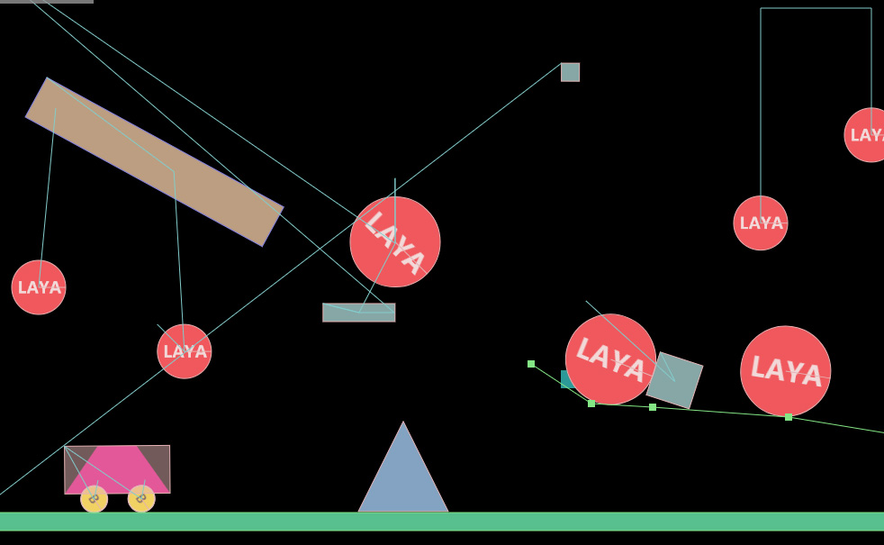
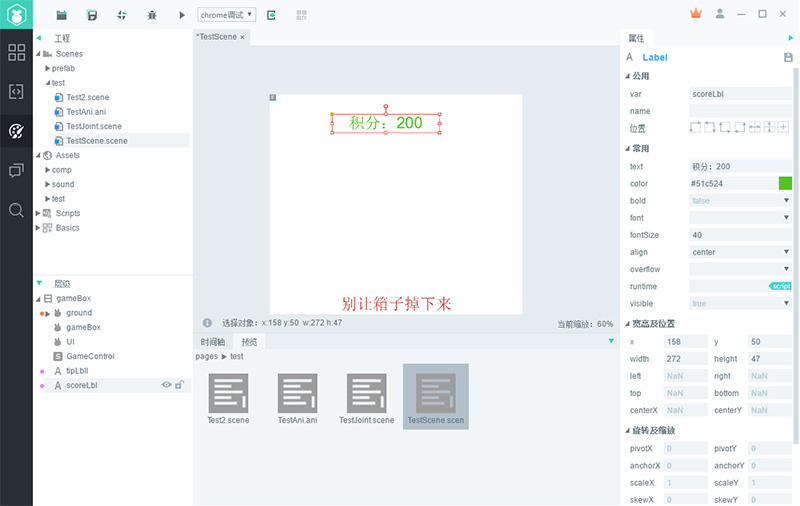
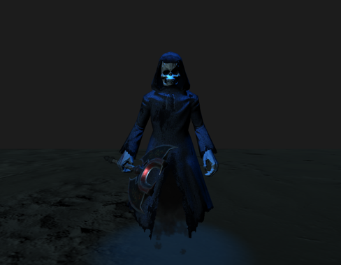

​	​	经过一年的准备，终于迎来了2.0测试版，从2.0开始，除了继续注重性能外，我们在引擎功能完善，易用性，扩展性等方面进一步发力：2D进行大量改进，增加了组件化支持，内置了物理系统，实现可视化物理编辑，3D进行了较大的升级，性能和功能都得到大幅提升，Native运行时也带来了性能的飞跃，同时支持3D加速，还有其他200多项细节改进。其中主要改进如下：

# 2D

1. **内置物理系统**

   ​	LayaAir1.0支持Matter物理引擎，但只是简单的支持，没有深度整合，在使用时不够方便直观。随着小游戏的开放，越来越多的游戏需要物理引擎的支持，所以从2.0开始，我们内置了box2d物理引擎，封装了物理组件，提供了IDE物理属性的可视化编辑，让制作物理游戏更加方便快捷。物理引擎从Matter更换到box2d，是因为Matter精度不是很高，并且没有防穿透支持，在制作一些类型的游戏时会出现莫名其妙的问题，而box2d相比而言更加完善。

   ​	

   ​

2. **组件化支持**

   ​	1.0我们提供了简单的脚本扩展支持，随着用户越来越广，需求越来越复杂，扩展成为常见需求。为了改进这一需求的体验，我们增加了组件化脚本的支持，官方提供的默认组件，如果满足不了需求，可以通过脚本扩展的方式来改进组件功能，从而实现个性化需求。组件化开发在功能抽象，复用及开发效率提升上也有帮助。同时我们保留了页面基类继承的处理方式，在处理UI逻辑时非常方便。

   ​	【小提示】脚本和页面继承相比，如果是页面级的逻辑，需要频繁访问页面内多个元素，使用继承式写法，如果是独立小模块，功能单一复用，建议用脚本方式实现。

   ​	更多组件化支持文档详见：https://ldc2.layabox.com/doc/?nav=zh-as-2-4-0

   ​	

   ​

3. **基于场景管理**

   ​	2.0我们提供了基于场景的管理方式，开发者只需要关注场景的创意设计，剩下的场景加载，切换，资源加载，图集使用，资源销毁等等，引擎都提供了完整的方案，原来需要主程做的事情，现在引擎也提供了，简化了开发成本，让大家把更多时间花在游戏设计上。

   ​	

   ​

4. **可定化编译调试**

   ​	2.0我们采用gulp自动化脚本来构建编译和测试流程，整个编译和调试过程，可通过脚本任务的方式串联，如果想在编译和调试中间插入自定义的新流程，比如copy;压缩等，只需用gulp文件内增加一个新任务即可，这样就能做到每个项目自定义化，智能化。

   ​	同时引擎默认支持了require，这样大量的第三方nodejs库就可以在引擎内直接使用了。

   ​	同时改进了微信小游戏调试方式，可以边开发边调试，无需再发布后调试。

   ​	后续的版本，发布面板也会采用脚本化定制方式重构，这样发布个性化需求就不愁了。

   

   ​

5. **3D编辑器**

   ​	2.0 开始，IDE增加对3D项目编辑支持，可以在IDE编辑3D场景，材质，物理等功能

   ​	由于目前还在改进中，测试版本暂时不开放使用

   ​	

   ​

6. **全新layacloud项目**

   ​	LayaCloud 游戏服务器集群基于快速开发多人对战类游戏进行设计，以高可靠性、易扩展为首要目标搭建，简化服务器开发成本。更多信息请参考https://wiki.cloud.layabox.com/

   

   ​

7. **全新的IDE**

   ​	2.0我们重新设计了IDE皮肤及布局，使其更加简洁漂亮，同时做了大量功能改进，进一步提高易用性，提高开发效率，可以在实际使用中进行提会。

   ​	

   ​

   ​

   ​

# 3D

1. **性能**
  ​     众所周知,LayaAir始终以性能著称,本次LayaAir3D2.0除了对功能、易用性进行了诸多增强和改进，对性能依然做出了大幅提升。对底层进行了大量重构升级,对静态模型和动态模型均做了大量优化,尤其大幅提升了静态场景性能。同时采用更先进的机制来减少JS和WebGL本地接口的调用次数以提升性能。

2. **材质系统**
   ​     LayaAir2.0对材质进行了诸多改进和提升，并在引擎中提供更多的官方材质 以及开放了更多自定义材质相关的功能,新增的主要官方材质包括PBRStandardMaterial、PBRSpecularMaterial以及UnlitMaterial材质等。PBR材质也就是近几年比较流行的基于物理渲染材质，采用更科学的shader算法表现更为真实的材质感。UnlitMaterial是简化版的无光照材质,一般用于技能特效等，通过加色法或者透明混合结合刚体动画可以实现诸多特殊效果。自定义Shader方面我们主要增加了多pass功能，比如实现卡通渲染需要的描边效果等，多pass会在shader渲染时渲染多次。材质开放了renderQueue接口，renderqueue是渲染精灵时的排序依据,开发者可通过指定renderQueue值来修改材质所属精灵的渲染顺序。

   1) 增加Shader多pass渲染
   2) 开放renderQueue,开发者可自定义渲染顺序
   3) 新增UnlitMaterial材质
   4) 新增Effect材质
   5) 新增PBRStandardMaterial材质
   6) 新增PBRSpecularMaterial材质

 

3. **纹理系统**
  ​     LayaAir2.0对纹理功能进行了提升和改进,增加了纹理的灵活性和可控性。 mipmap为是否生成多级理,format为纹理格式(例如R8G8B8和R8G8B8A8等),wrapModeU和wrapModeV为纹理寻址模式，filterMode为纹理过滤器模式、anisoLevel为各向异性过滤。增加了纹理上传像素的接口,开发者可自行上传自定义像素颜色来生成纹理。支持GPU纹理压缩(Android、IOS),具体为ETC、PVR，可大幅减少显存占用，增加游戏资源总量，提升游戏品质。

  1) 增加多种纹理参数配置(mipmap、format、wrapModeU、wrapModeV、filterMode、anisoLevel)
  2) 增加纹理上传像素接口
  3) GPU纹理压缩

4. **动画系统**
  ​     LayaAir2.0具备更完善的Animator动画系统,可支持更多的动画属性，支持动画过渡融合,动过切换更自然，避免两个非连贯的动作切换时出现闪切现象。Animator支持动画多层混合,可实现动画上下半身分离等功能，每一层均可独立控制某些骨骼。Animator动画调整为实时插值，可大幅减少内存并且在相同帧率下提升动画流畅度表现。

  1) 新增Animator动画融合功能crossFade
  2) 新增动画多层混合播放
  3) 动画更新机制调整为实时插值，大幅减少内存和动画流畅度表现
  4) 新增多种材质属性动画

 

5. **物理系统**
    ​     LayaAir1.0物理功能非常匮乏,2.0重点对物理系统进行了重构设计。新增多种物理组件，包括RigidBody、PhysicsCollider、CharacterController，开发者可根据项目需求选择不同的物理组件。新增多种Shape，开发者可任意添加一个或多个Shape进行物理组件的轮廓描述。

    1)新增刚体:RigidBody
    2)新增碰撞器:PhysicsCollider
    3)新增角色控制器:CharacterController
    4)新增碰撞器形状:BoxColliderShape、CapsuleColliderShape、CompoundColliderShape、ConeColliderShape、CylinderColliderShape、SphereColliderShape、MeshColliderShape
    5)新增辅助检测功能:shapeCast、shapeCastAll等

6. **精灵**
     ​     新增了拖尾精灵，用于实现拖尾的拉伸特效,三维特效中比较常用的几个精灵分别为粒子、Mesh加刚体动画，还有就是本次2.0中新增的拖尾。同时我们又新增了像素线精灵用于绘制像素线框，这个一般再游戏或一些开发过程中的调试模式都比较有用。

     1) 新增TrailSprite3D
     2) 新增PixelLineSprite3D
     

7. **脚本系统**
    ​     LayaAir2.0对引擎易用性的提升十分注重,脚本中增加了多种回调函数，包括碰撞反馈的回调、三维模型的鼠标拾取更加简单方便,具体onCollisonXX为物理碰撞时触发，包括进入碰撞,保持碰撞和退出碰撞，我们在1.0后期的版本中就有提供过onTriiggerXX函数。

    ​	1) 增加onCollisionEnter、onCollisionStay、onCollisionExit、onMouseDown、onMouseDrag、onMouseClick、onMouseUp、onMouseEnter、onMouseOver、onMouseOut碰撞回调函数。

8. **其它**
    ​     对于资源释放,在LayaAir1.0中一直是开发者比较头疼的事情。在LayaAir2.0中我们官方采用destroyUnusedResources()来模拟GC释放当前场景树种没有被使用资源。LayaAir2.0对光照贴图进行了优化显示,使得光照贴图可以显示大于1.0的HDR颜色显示效果更逼真。

    1) 新增批量资源释放功能
    2) 增加HDR光照贴图格式

其他主要改进：

- 重构WebGL底层实现
- 重构HTMLDivElement实现，由原先的节点模式改为Graphic模式，减少节点创建，提高渲染性能
- 颜色滤镜增加亮度，对比度，饱和度，色调的设置，使用更加方便
- Graphics增加命令行cmd的返回，方便修改调整cmd命令
- Graphics的drawTexture函数增加color和blendMode的支持
- Graphics新增drawImage，实现简化版本的drawTexture
- Graphics新增drawTriangles，能根据顶点信息绘制三角形
- Loader增加对WorkderLoader的支持
- 改进了Sprite的Texture实现，提高Texture渲染性能，建议多用
- 优化了Sprite获取bounds的性能
- 所有颜色值增加了Alpha通道的支持
- 节点增加offAllCaller接口，方便注销某个对象身上的所有事件，提高方便性
- 改进大部分UI组件，支持资源异步加载
- 引擎去掉了大图合集的支持，减少使用者的理解成本和引擎的复杂度
- 去掉所有IF-Flash相关代码，减少不必要的分支，减少代码大小
- 解决其他已知bug

IDE

- 新增物理系统支持，可视化编辑物理属性，更加方便制作物理小游戏
- 新增组件化扩展支持，所有节点均可通过组件方式扩展，快速实现个性化需求
- 新增资源缩略图预览面板，方便定位管理资源
- 调整IDE可视化界面结构，融合资源面板和页面面板，增加脚本及基本组件的展示，提高实用性
- 新增Prefab制作及使用支持，方便组件复用
- 新增插件项目创建，完善插件扩展机制，方便扩展IDE
- 改进调试功能，一键发布编译调试，新增运行功能，运行能跳过链接VScode调试，直接使用chrome的调试
- 增加小图及图集自动映射，加载小图的时候，会自动判定是否有图集存在，如果有则优先使用图集
- 增强场景切换调试，方便调试某个特定场景（比如当前打开的场景）
- 层级支持双击节点修改名称，方便定位
- 增强可视化编辑工具，比如旋转工具，场景缩放工具，对齐工具
- 优化IDE启动速度，启动更加迅速
- 支持最新的VsCode，功能更加强大，对ts和js支持更加友好
- 使用最新的AS3代码提示插件，改进AS3语言使用体验
- 改进了ViewStack使用体验
- 增加可定制化任务流程，方便自定义流程
- 增加属性默认值显示，让属性查看更加直观
- 改进小工具位置，简化界面元素，使其更简洁
- 时间轴增加函数调用支持
- 新增项目列表页面，方便管理历史项目
- 增加模板保存按钮，方便保存为模板
- 增加页面设置按钮
- 新增游戏参数设置，起始场景设置
- 增加调试及帧率开关
- 增加脚本选择控制，方便选择使用第三方脚本
