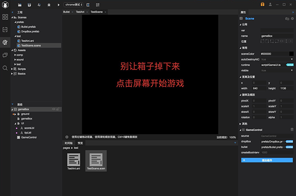

# 2D

- **新增微信开放域数据展示组件**

  ​	微信开放数据域使用一直是很麻烦的事情，需要特殊编码，并且会是性能瓶颈，还有经常发生鼠标事件对不上的问题

  ​	LayaAir2.0开始，Laya官方给出了微信开放域UI组件，一并解决上述问题，使其使用起来更简单，性能更高，详细请查看http://ldc2.layabox.com/doc/?nav=zh-as-5-0-7

  

  ​

- **LayaAirIDE2.0 Mac 版本发布**

  

  ​

- **物理**

  优化物理组件，减少对象创建开销，完善注释

  改进鼠标关节，设置控制点变为可选，如果不设置，则根据鼠标点击位置作为控制点

  修复鼠标关节多次点击失效的bug

  ​

- **核心库**

  Loader增加对sk,ani等文件后缀的自动识别

  修复微信小游戏下，特定ios10.1.1版本文字无法显示的bug

  修复声音加载过程中，不能被正确停止的bug

  修复Animation类loadAnimation逻辑错误

  调整了 drawToCanvas

  修复粒子修改错误

  ​

# 3D

​	修复物理组件销毁崩溃BUG

​	修复物理组件初始化后精灵坐标位置可能不对BUG

​	修复设置collisionGroup和canCollideWith崩溃BUG

​	修复物理事件回调不正确BUG

​	修复资源带版本加载错误BUG

​	修复CompoundColliderShape.removeChildShape()方法BUG

​	修复Rigidbody3D.clearForces方法崩溃BUG

​	修复PhysicsCollider位置可能不更新BUG

**3DUnity插件**

​	修复场景文件导出层级丢失BUG

​	修复顶点色的功能