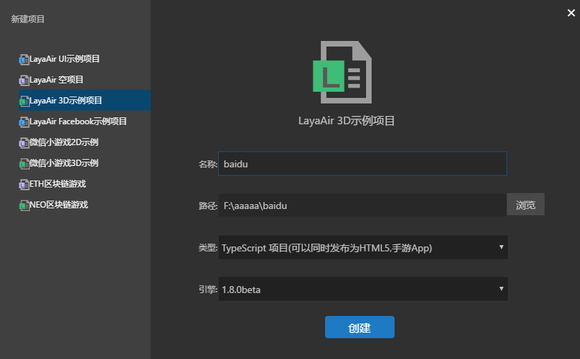
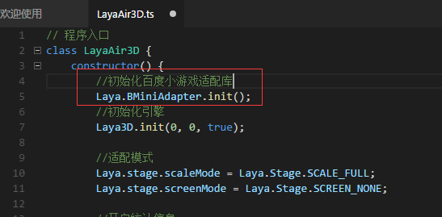

# 老项目适配百度小游戏详解

> author: Charley

####Because there are some old projects need small game adaptation, this article will introduce the steps and links of old project adaptation in detail.

**Tips:**Starting with the creation of a 3D project, this article does not mean that it is only an adaptation of a 3D project. The adaptation schemes in this paper are universal for both 2D and 3D, but there are slight differences in language versions, which have been explained in this paper.

####Mandatory tips:

> 1. Before reading this article, please read "Creating Baidu Games" first. This article will not repeat the basic content of the configuration environment.
>
> 2. New small game project. It is suggested to create the sample project of small game directly. If the project is an ordinary project, you can adapt it by learning the small game adaptation process in this article.


###Step 1: create a sample project (skip this step if you have an old project)

First, open LayaAirIDE and enter the new project interface. Select the LayaAir 3D sample project.

> Tips: This step is to demonstrate the old project adaptation process, and deliberately create a common 3D sample project.
>

 


Enter the project name, path, and choose the language type and engine version.

> (Since the process is basically the same, this article is for language developers, but the TS project process screenshots, if the other language versions, there will be differences in additional instructions.)

OK, go on.

Click Create to complete the creation of a 3D project.


###Step 2: Adapt to Baidu Games

####1. Prerequisite preparation for small game adaptation

Engines and IDEs use the latest beta or stable version. LayaAirIDE only supports one-click release of old projects from 1.8.0 beta. So don't forget to upgrade with old IDE and engine libraries.


####2. Reference to Game Adaptation Library

#####Adaptation Method of TS and JS

Starting with 1.8.0 beta, when creating a sample project, TS and JS projects automatically introduce the mini-game adapter library JS.`“libs/laya.wxmini.js”`As shown in the figure below.

 


The code in the figure:


```html

<!--提供了百度小游戏的适配-->
<script type="text/javascript" src="libs/laya.bdmini.js"></script>
```


If it's an old TS or JS project before 1.8.0, you need a developer`bin/index.html`Manually add the code in the red box in the figure, and also make sure that the current version of the engine library is not after 1.8.0. If not, switch to the new engine library, otherwise it will be wrong because laya.bdmini.js can not be found at run time.

#####AS3 project adaptation method

AS3 project, after using the new version of engine library after 1.8.0, only need the developer to add this code manually in the entry class, that is, to complete the introduction of game adapter library.


```java

import laya.bd.mini.MiniAdapter;
```


####3. Initialization of game adapter Library

Because the old project did not initialize the adapter library at the entrance of the project when it was established, in order to ensure the successful release of Baidu mini-game version, we must initialize the adapter library at the entrance of the game.

**Tips**:*Initialization of Baidu mini-game adapter, need to initialize the engine before.*

#####The method of adapting TS to JS project is as follows:

 


The adaption code for TS or JS projects in the figure is as follows:


```typescript

//初始化小游戏适配库
Laya.BMiniAdapter.init();
```


#####The AS3 project adaptation method is shown in the following figure:

 


The adaption code for the AS3 project in the figure is as follows:


```java

//百度小游戏适配
BMiniAdpter.init(); 
```


####4. Compile the adapter code

Complete the addition of the adapter code, click on the compile or run debug button (F5), and you can see a three-dimensional cube without error warning.

 


> Tips: Make sure you compile or debug at the end of the adaptation, otherwise the adaptation code will not take effect.

Close the window that pops up when running debugging. You can enter the release of the game.

So far, the adaptation of the game has been completed.

To summarize briefly, we refer to the adapter library and initialize the adapter library after using the new version of the engine, which are the two core steps. It's still relatively simple.

Other small game release, debugging and so on are common with the new project. You can view other related documents.

If you have any questions about this document, please go to the official QQ community and ask questions. You can also send links from the community to @administrator Charley in the official QQ group.

Community Web site: https://ask.layabox.com/


##This article appreciates

If you think this article is helpful to you, you are welcome to sweep the code and appreciate the author. Your motivation is our motivation to write more high quality documents.

