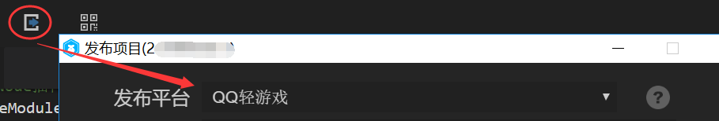

# QQ轻游戏基础介绍与游戏发布

###What is QQ light game?

For the term QQ light game, some developers may feel a little strange, in fact, this is not the new business of mobile QQ. It is upgraded from the "centimeter game open platform" and "play platform" launched in 2017, and has opened up the mobile QQ and QQ space. So many developers who have access to or know about the platform will also call it play a game.

###The main entrance of QQ light game

At present, the entry of QQ light games is only in Android version of mobile QQ (hand Q), which has exceeded 250 million users. Platform access to more than 700 games, covering more than 50 game types. At the same time, it covers a number of hand Q traffic scenarios, including sharing messages, chat windows, quick launches, centimeter shows, QQ space games, game centers, QQ wallets and so on.

 

The centimeter game entrance in the centimeter show and chat window can only be seen after opening the centimeter show function. Sharing news is a fission communication gateway, which has been the main interaction gateway since the beginning of the centimeter game era. The entrance in game center, QQ space games and QQ wallet is easy to find. Quick launch, similar to the top quick navigation entrance of Wechat games, is a list of QQ light games that have been played, but need to be set up in the background by developers.

###QQ light games support HTML5 games?

QQ light game platform is run by Bricks, a Runtime engine developed by QQ mobile phone. By providing engine-level APIs, it can be invoked by JavaScript interfaces at the upper level. Although JS can be used directly, these interfaces are not compatible with HTML5 at present, so they can not run in browsers. However, Layabox took the lead in completing full support for the Bricks engine as early as August 2017, and has been actively communicating with the Bricks engine team to promote the improvement and optimization of the Bricks engine. Therefore, the developers of LayaAir engine can directly use LayaAirIDE tools to develop and publish QQ light games.

> At present, QQ light game has a large number of LayaAir engine online products, but in the process of technology access, the threshold for QQ to play is slightly higher than other platforms. If there are problems, we can contact Layabox official for business cooperation.

###Unfully exploited QQ Light Game Opportunities

QQ Light Game Platform has two business liquidity modes: buy-in and advertising. At present, the advertising flow of the platform has exceeded the total stream purchased in the game, 80% of the active games are connected to the advertising SDK. According to some developers who have access to the QQ light game, under the same level of DAU, the advertising revenue of QQ light game is significantly higher than that of other game platforms. This may be related to QQ video advertising's no limit to the game, and the sharing policy better than other platforms.

In addition, compared with the decentralization of Wechat games, the light game platform of Hand Q is based on the idea of high-quality platform. Based on various handQ entries, the traffic of game users will naturally be more centralized and stable. At the same time, QQ light games are also very encouraging and stimulating fission. For example, the light game platform implements an innovative form of red envelope advertising: developers can attract and accumulate users through B2C advertising red envelope. It is reported that 80% of the games using this B2C red envelope function have achieved ROI of more than 100%, and some individual games have ROI of more than 300%. (For example, when red envelope advertisements invest 10,000, game revenue can reach 30,000).

At present, 250 million QQ light game users are only Android, if the entry of the future iOS version is opened, it will usher in a wave of explosive growth, so the morning shelf, early benefit, QQ light game is still a channel opportunity in high-speed growth, waiting for further excavation by developers.

###Layabox Helps Developers Access QQ Light Game Platform

At present, QQ light game is a high-quality platform route, so game submission needs to pass business review. And there is a higher threshold in the access process. Therefore, based on the advantages of QQ light game technology and commerce, Layabox proposes a distribution cooperation model to help many developers with technical pressures and confusion on the shelf, quickly solve technical and business problems, and enjoy the flow opportunities of QQ light game.

 

(Sweep, add business cooperation Wechat)

###Developing and publishing workflow

-####Development process

In the development process, development and daily debugging, the development workflow of LayaAir engine can be used directly.

-####Publishing process

In terms of project release, through the IDE built-in QQ light game release function, choose QQ light game in the options of the release platform, click release, you can release a version that adapts to QQ light game.

 

####Friendship reminder:

The Layabox engine development team will provide free engine adapters for QQ light games from time to time and update them synchronously with the version of LayaAirIDE. However, because the bottom of QQ light game is not particularly stable, there are a small number of features not yet supported, LayaAirIDE can not guarantee that each version of QQ light game can be adapted, and there is no obligation to free answer or point-to-point processing of light game adaptation issues. If developers encounter problems in the docking process and fail to get an immediate solution, you are welcome to add a Layabox Engine Business Cooperative Director with Wechat Sweep Code. Obtain VIP business technical support services (one-time payment, or co-operation by issue).

  

(Wechat on Business Cooperation)

-####Debugging in VSCode or Xcode Engineering

After releasing the version of QQ light game in LayaAirIDE, we need to debug it in the development environment of play, VScode in windows and Xcode in MAC. These tasks belong to the debugging and docking process of QQ light game. Specific debugging methods can check the official debugging documents of QQ light game:

[http://hudong.qq.com/docs/engine/debug/intro.html](http://hudong.qq.com/docs/engine/debug/intro.html)

