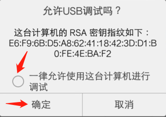

# Vivo game release and debugging guide

> update : 2019-07-01境变量的可自行百度）
>
> The release of the vivo game must use LayaAirIDE. For the download and use of the IDE, please check the related documents, which is beyond the scope of this article.

## 1、Vivo game release, debugging environment preparation

1、Vivo brand mobile phone

2、Download the installation debugger for vivo, download the page：[https://minigame.vivo.com.cn/documents/#/download/debugger](https://minigame.vivo.com.cn/documents/#/download/debugger)

Once you have entered the page, click Download Now to download and install. As for how to install the vivo debug app, it will not be introduced here.

3、Download vivo mini-game engine

The current ** debugging APP** built-in vivo engine version is 1034, this version has a known bug, we must go to the vivo game official website to download the latest version of the small game engine apk.

The download page is:

https://minigame.vivo.com.cn/documents/#/download/engine

The current recommended version is 1041. After downloading and installing, we can see that the platform version number of the vivo application debugger is also displayed as 1041.

4、PC computer chrome browser and mobile phone data cable.

5、Install the nodejs environment [Node official website：[https://nodejs.org/en/](https://nodejs.org/en/)]

It is to download and install, it is relatively simple, and it is not detailed. Being able to call the npm command on the command line is a success.

6、LayaAirIDE centralized development environment, LayaAir IDE 2.1.1beta or above [ Official website download: [https://ldc2.layabox.com/layadownload/?type=layaairide](https://ldc2.layabox.com/layadownload/?type=layaairide) ]

7、Install ADB

ADB can be used for authorization, as well as publishing push, etc. It can be downloaded and installed on ADB's official website.

 [ ADB official website download:  [http://adbshell.com/downloads](http://adbshell.com/downloads) ]

> For a quick reminder, download ADB Kits, download the compressed package, and recommend unpacking it to a directory with a simple path (eg `D:\adb`). Remember to add environment variables (I don't know how to add environment variables, you can Baidu)
>

## 2、Vivo small game release and access complete process

### 1、Release vivo game pack (xx.rpk)

LayaAirIDE's publishing function, built-in the release function of vivo games, you need to first convert the LayaAir engine project into a .rpk suffix package through the publishing function. About the use of the publishing feature. This is not repeated here. No, you can go to the official website document to view.

link：[https://ldc2.layabox.com/doc/?nav=zh-ts-3-0-6](https://ldc2.layabox.com/doc/?nav=zh-ts-3-0-6)

### 2、Keep publishing the QR code interface.

After the release is completed, there will be a QR code interface, as shown in Figure 1. This interface does not need to be closed, the back of the phone scan code needs to be used.

 

（figure 1）

### 3、Start the chrome debugging environment

####  3.1 Install and enter the fast application debugger

To start the chrome debugging environment of the computer PC, we must first install the debugging game (fast application debugger) of the vivo game, as shown in Figure 3. Then click to enter.

 

（figure 3）

#### 3.2 In the fast application debugger interface scan code to install the rpk package of vivo games

After entering the fast application debugger, we can see the APP operation interface as shown in Figure 4.

  

(figure 4)

At this time, we click on the scan code installation in Figure 4, and scan the QR code on the release interface of the LayaAir IDE (not to turn off before, and to re-release the QR code). The phone can be run in a real machine environment.

> Here to be prompted: the mobile phone network and the PC in the same LAN segment (using the 4G network to scan the LAN code is definitely not acceptable).

If you transfer the rpk package in the /dist directory to the phone in the distribution directory, it is also possible to install it by clicking the `Local Install` button. However, it is recommended to scan the code installation, because the step of scanning the code is more convenient and quick.

#### 3.3 Keep physical line connections and authorization

For developers with relevant experience, make sure that the physical line of the USB mobile phone cable is connected, and the USB debugging authorization is no problem, you can skip this step.

##### Related operations are as follows:

1、First use the phone cable to physically connect your phone to your PC.

2、In the previously opened command line, enter the adb shell, as shown in Figure 5-1. It is not authorized by the USB debug mode.

 

（figure 5-1）

At this point, we should pay attention to the mobile terminal, whether the prompt shown in Figure 5-2 appears, and if so, click OK to allow USB debugging.

 

（figure 5-2）

3、Verify the authorization again.

After the USB debug mode authorization is successful, we enter the adb shell again, as shown in Figure 5-3.

 

（figure 5-3）

In short, in this session, we must ensure that the PC has the authority to debug this mobile device.

#### 3.4 Start the chrome debugging environment

After the scan code is installed, it will automatically enter the game or DEMO just installed.

To start debugging, you must first exit.

Then, as shown in Figure 6, click ** Start Debugging** to enter the debug mode of the vivo game.

 

（figure 6）

After the real machine enters the debug mode, we then open the chrome browser on the PC.

Don't forget this time, you need to connect the USB data cable to connect the mobile device to the PC. The problem of permissions has been said above and will not be repeated.

We need to find the IP of the mobile phone (Baidu) and remember it. It is important to note that the mobile phone network and the PC network are always in the same LAN segment.

Enter in the input field of Chrome Browser:

```
chrome-devtools://devtools/bundled/inspector.html?v8only=true&ws={IP}:5086/00010002-0003-4004-8005-000600070008
```

Replace {IP} with the mobile IP address, as shown in Figure 7.

(figure 7)


So far, the complete process from release to start chrome debugging has been introduced. If you want to know more about the access process and documentation of vivo games, remember this website:

https://minigame.vivo.com.cn


## article feedback

If you find this article helpful, please scan the code to appreciate the author, your feedback is also our motivation to write more quality documents.


