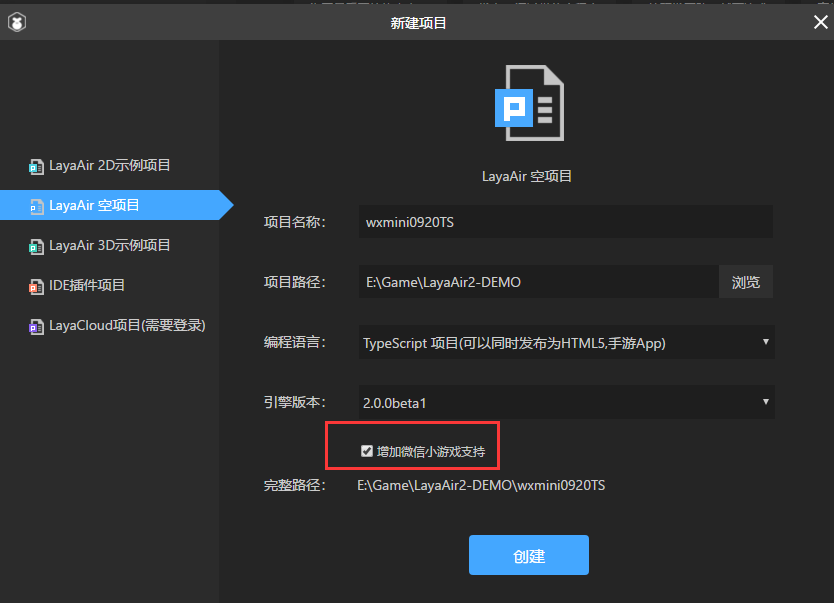

#Introduction to Wechat Games

> Author: Charley

#####First of all, we need to understand what is Wechat games?

The official explanation for the game is:

> Wechat game is a category of Wechat widget programs. It can be played on demand without downloading and installing. It can be played with friends in Wechat, such as PK, onlookers, etc.

Play on demand without downloading or installing. This should be the H5 game, right?

How to explain it? Let's start with the definition of H5...

Usually people think that H5 is short for HTML5, but in the eyes of developers, HTML5 is only a WEB technical standard, which meets the standard, and the game that can run in the browser is HTML5 game. More people do not know much about technology. For ease of understanding, the game that can be played immediately without downloading and installing is called H5 game, and some people call it mobile page tour.

The running environment of Weixin games is not browser, nor can it run in browser, but Runtime running in Weixin APP. Although the interface of Wechat games is compatible with most Canvas and Webgl, it has the ability to play on demand without downloading and installing HTML5 features. Obviously, by strict definition, Wechat games are not standard HTML5 games.

**Well,**How can the developed game run in the browser?

####Can developers only use the open API for Wechat games?

With these two questions, let's continue.

As we all know, LayaAir engine is a full platform engine based on HTML5. Since it is a full platform, of course, we can't miss the Wechat game!

So, on the day of the release of Wechat games, the LayaAir engine also launched an adapter library for developers of Wechat games. Since LayaAir 1.7.14, developers have downloaded the latest version of the engine or IDE. They can seamlessly adapt HTML5 game project to Wechat game project by initializing the adapter according to the adaptation tutorial document. LayaAirIDE 2.0 has done a lot of optimization for the development and release of Wechat games.

In this way, the project developed through the layaair engine can not only run in the browser, or package into app (IOS and Android), but also run on the platform of wechat small game.

Perhaps, developers also want to know that since wechat games are not HTML5,

####What differences should we pay attention to in the process of development?

If we use the official API of Wechat, we should pay attention to some things, such as not supporting DOM and BOM, games can only have a canvas, not supporting Eval, not supporting XML and so on.

However,

For the developers of LayaAir engine, it is not necessary to understand the differences, just follow the normal LayaAir engine development rules.

> Note: Although Wechat games are classes of widgets, they are different from widgets and APIs. LayaAir engine does not support the development of widgets.

#### **There are several points to note in developing small games:**

#####1. Check when creating an item“`增加微信小游戏支持`" As shown in Figure 1.

 

(Fig. 1)

#####2. Unlike LayaAir 1.X, LayaAir 2.X no longer requires manual writing of game adapter library code.

#####3. After the completion of development, click the project release button directly, and can be published as a Wechat game project with one key. As shown in Figure 2.

  

(Fig. 2)

The key point is that through the file extraction function, the files of 4M or 8M local package in the project can be extracted directly into the project directory of Weixin mini-games at the time of publication. Used for peeling out local packages in projects.

For other small game development considerations and relevant experience, please check other layaair small game documents.

In addition, it is strongly recommended to look at the official documents of Wechat games. The documents of LayaAir engine are more engine-related. Of course, there are also some application introductions of the game interface. But it is certainly right to look carefully at the official documents of Wechat.

The links are as follows:

[https://developers.weixin.qq.com/minigame/dev/index.html](https://developers.weixin.qq.com/minigame/dev/index.html)

