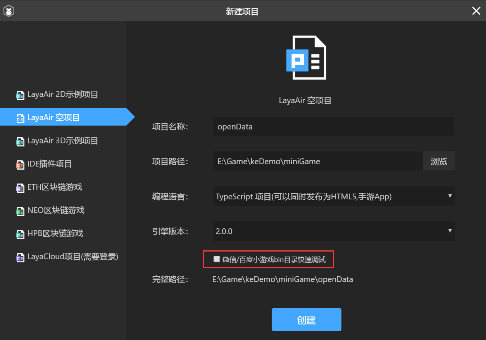
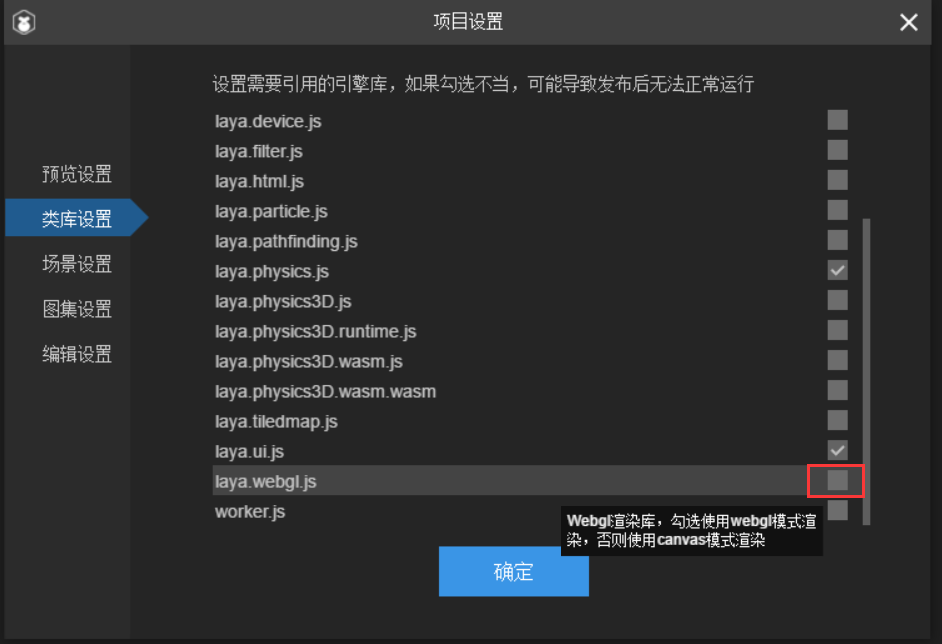

# 微信开放数据域使用指南

> *author：charley      language： typeScript   version:2.0.1  update：2019-02-15*

本文面向LayaAir 2.0引擎的开发者，阅读本文的前提是熟悉LayaAir 2.0引擎与LayaAirIDE 2.0。并对微信小游戏的基础开发流程有一定的了解。

### 一、什么是微信开放数据域？

基于对微信关系链数据的安全保护，微信小游戏中无法在主域中直接获取或存储微信的好友关系链。只能在微信小游戏设置的封闭和独立的JavaScript作用域内使用微信关系链数据或运行关系链相关的游戏逻辑代码，然后绘制到离屏的sharedCanvas（共享画布），再通过主域Canvas（画布）进行显示。流程如图1所示：

  (图1)

这个封闭而独立的JavaScript作用域，就是微信小游戏的开放数据域，通常简称为**开放域**或**子域**。在小游戏非开放域的部分都是主域。

### 二、用LayaAirIDE创建开放域项目

理解完开放域的概念，我们能明白开放域是一个封闭而独立的JavaScript（JS）作用域，也就是说开放域中没有办法去引用主域中的JS，那么，我们就**必须要创建一个完全独立的开放域项目**。

另外再多讲几句，在这个独立的项目里，由于开放域中webGL是不支持的（据说微信小游戏技术团队在支持中，反正现在还没支持），所以开放域目前的性能很差，除非是做排行必须的，我们尽量不要把游戏功能或页面放到开放域。当然，在引擎库的方面，webGL库、物理引擎库等等与排行无关的都要去掉。在1.8和2.0正式版及以前的版本，我们要手动来干这件事（删用不上的引擎库来减少本地包体大小）。而从2.0.1开始，引擎IDE团队增加了专门的开放域项目分类。创建开放域项目，会自动只使用精减之后的引擎库。

> Tips: 如果开发者不想使用精减引擎库的，也可以创建普通项目，自行删减不用的引擎库。

#### 下面我们用LayaAirIDE 2.0.1 来创建一个开放域项目：

一些常规的基础设置就不说了，参照下图2-1所示，其中红框中的选项不用勾选。因为这是用于在微信开发者工具中快速调试用的。而开放域在微信开发者工具中需要在主域中展示来调试效果，所以该功能用不上，也就不用勾选了。

 

（图2-1）


### 三、用LayaAirIDE创建开放域项目

简单理解了基础概念后，我们就通过LayaAirIDE来创建一个开放域项目。

在创建前，也许有人问，开放域项目与我们平时创建项目有什么不同吗？

是的，确实有不同！

1、


由于开放域与主域之间


### 如何启用开放数据域？

 在小游戏项目中的game.json 文件中添加配置项 `openDataContext` 并指定开放域的目录，即表示小游戏启用了开放域。game.json配置代码如下所示：

```json
{
  "deviceOrientation": "landscape",
  "showStatusBar": "false",
  "networkTimeout": {
    "request": 10000,
    "connectSocket": 10000,
    "uploadFile": 10000,
    "downloadFile": 10000
  },
  "openDataContext": "myOpenDataContext"
}
```

**关键配置说明**：上面的配置代码中`myOpenDataContext`为开放域目录，位于小游戏项目的根目录下，开放域内的代码和资源直接放到该目录内。


### 三、获取微信关系链数据内容的API

启用开放域后，开发者就可以通过微信小游戏的API获得微信用户关系链数据。这个数据包括了两部分。分别是当前游戏中，该用户好友的用户数据，和用户所在的某个群的群成员用户数据。相关API如下：

- [wx.getFriendCloudStorage()](https://developers.weixin.qq.com/minigame/dev/api/open-api/data/wx.getFriendCloudStorage.html) 获取当前用户**也玩该小游戏的好友的**用户数据
- [wx.getGroupCloudStorage()](https://developers.weixin.qq.com/minigame/dev/api/open-api/data/wx.getGroupCloudStorage.html) 获取当前用户**在某个群中也玩该小游戏的成员的**用户数据

这两个 API 的返回结果都是一个对象数组，数组的每一个元素都是一个表示用户数据的对象，其结构如下：

| 属性      | 类型   | 说明               |
| --------- | ------ | ------------------ |
| openId    | string | 用户的 openId      |
| avatarUrl | string | 用户的微信头像 url |
| nickName  | string | 用户的微信昵称     |
| data      | Object | 用户的游戏数据     |

#### 关系链的业务数据必须托管才能获取

由于关系链只能在开放域中获得，无法存储在本地或游戏数据库中。那么用户的段位、战绩等游戏业务特有的数据（data）必须要通过微信的API [wx.setUserCloudStorage()](https://developers.weixin.qq.com/minigame/dev/api/open-api/data/wx.setUserCloudStorage.html) 托管到微信后台。

因为，只有被托管过数据的用户，才会被视为 `玩过` 该小游戏的用户，才会出现在 [wx.getFriendCloudStorage()](https://developers.weixin.qq.com/minigame/dev/api/open-api/data/wx.getFriendCloudStorage.html) 和 [wx.getGroupCloudStorage()](https://developers.weixin.qq.com/minigame/dev/api/open-api/data/wx.getGroupCloudStorage.html) 返回的对象数组（data）中。

除了好友与群关系链的数据，如果要获取当前用户自己的托管数据，可以调用API [wx.getUserCloudStorage()](https://developers.weixin.qq.com/minigame/dev/api/open-api/data/wx.getUserCloudStorage.html) 

#### 删除托管的字段

如果要删除用户托管数据中指定字段的数据，开发者可以调用API [wx.removeUserCloudStorage()](https://developers.weixin.qq.com/minigame/dev/api/open-api/data/wx.removeUserCloudStorage.html) 

#### 只能在开放域中调用的关系链API

获得自己、获得好友、获得群友的关系链数据API只能在开放域中调用。分别为：

[wx.getUserCloudStorage](https://developers.weixin.qq.com/minigame/dev/api/open-api/data/wx.getUserCloudStorage.html)、[wx.getFriendCloudStorage()](https://developers.weixin.qq.com/minigame/dev/api/open-api/data/wx.getFriendCloudStorage.html) 和 [wx.getGroupCloudStorage()](https://developers.weixin.qq.com/minigame/dev/api/open-api/data/wx.getGroupCloudStorage.html) 

#### 可以同时在主域和开放数据域中调用的API

数据托管与托管数据指定字段删除的API在主域或者开放域中都可以调用，分别为：

[wx.setUserCloudStorage()](https://developers.weixin.qq.com/minigame/dev/api/open-api/data/wx.setUserCloudStorage.html) 和 [wx.removeUserCloudStorage()](https://developers.weixin.qq.com/minigame/dev/api/open-api/data/wx.removeUserCloudStorage.html) 

> **Tips：**相关API的详细用法与返回参数，请到微信公众平台官方文档中，查看微信小游戏中的API文档。


### 四、开放数据域相关的诸多限制

在正式开发之前，我们还要了解开放域与主域之前的诸多限制。这里我们介绍一些经常遇到的关键点。

1. 在开放域里，只能支持Canvas 2D渲染模式，H5开发时开发者常用的WebGL模式在开放域里是不支持的。所以，开放域项目需要在LayaAirIDE 2.0的设计模式下，按F9进入项目设置，在类库设置里，把默认勾选的`laya.webgl.js`类库勾选状态去掉。如图3所示：

    

   （图3）

   > Tips：如果去掉后微信小游戏环境中还报错提示“[GameOpenDataContext] 子域只支持使用 2D 渲染模式”，开发者则不用管这个警告。该错不影响正常开放域使用，这是引擎调用了webGL检测方法。后续版本，引擎组会在紧急任务处理完之后再进行优化。

2. 由于开放域中的JavaScript作用域是封闭的，所以开放域与主域之前的代码是不允许互相`require()`引用的。也就是说开放域项目必须是一个完整独立的项目，项目中使用不到的类库要去掉勾选状态，尽量减少引擎包体的大小。

3. 开放域中的资源不允许从网络中加载，只能加载开放域或者主域中的本地路径资源。如果要使用网络中的资源，则需要在主域中加载，然后通过LayaAir引擎提供的透传方法，传到开放域中使用。

4. 开放域不能向主域发送消息。而主域可以向开放数据域发送消息。


### 五、开发前期的准备工作

> 从实例开发开始只重点描述关键环节，如无引擎开发基础的请先阅读相关的基础文档。
>
> 本篇文档提供项目示例DEMO，可以作为本篇学习的细节对比参照。地址为：XXX

#### 1、项目结构

本篇示例，需要三个项目目录，分别为主域项目、开放域项目、微信小游戏项目。

主域项目是发布微信小游戏的源项目。

因开放域的封闭性，还要创建一个开放域项目用于发布小游戏中开放域目录的项目。

微信小游戏项目是用于微信开发者工具使用和上传到微信公众平台的。

如果开发者打开本篇示例DEMO的压缩包，会看到如图4的三个项目目录。

 （图4）

#### 2、创建主域和开放域项目，并发布为小游戏项目

首先我们创建一个微信小游戏的项目，作为主域项目。然后发布的时候将本地包


### 、搭建开发环境

### 创建主域和开放域项目


### LayaAir引擎提供的透传API


### 主域和开放数据域的通信


在图1

与主域中`game.js`为入口文件不同的是，开放域根目录下`index.js`作为开放域的入口文件。LayaAirIDE 2.0在发布微信小游戏项目时，如果勾选了`是否为微信开放数据域项目`这个选项，如图2所示。在发布成功后，会将项目代码自动生成并命名为`index.js`。

 
（图2）


## 本文赞赏

如果您觉得本文对您有帮助，欢迎扫码赞赏作者，您的激励是我们写出更多优质文档的动力。

