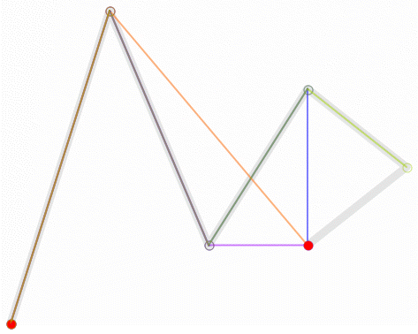

#Courbe

> la relation entre la courbe et la coordonnées est plus difficile à comprendre que la ligne droite.Etant donné que le moteur layaair dessine une courbe de Bessel, le présent document expose d 'abord la base de la courbe de Bessel, puis l' API du moteur.
]


### **Base de la courbe de Bessel**

La courbe Bessel s' appelle la courbe Bézier à Hong Kong et à Macao, et la Malaisie à Singapour et ailleurs la courbe Bézier.Le logiciel graphique vectoriel ordinaire dessine avec précision les courbes, les courbes de Bessel sont composées de lignes et de noeuds, les noeuds sont des points d 'appui pouvant être entraînés, les lignes ressemblent à des barres de cuir extensibles, et l' outil stylo que nous voyons sur l 'outil de dessin est conçu pour réaliser ces courbes vectorielles.

La courbe de Bessel est une courbe mathématique appliquée à des applications graphiques bidimensionnelles.La définition de la courbe comporte quatre points: le point de départ, le point d 'arrêt (également connu sous le nom de point d' ancrage) et deux points intermédiaires séparés l 'un de l' autre.Glisser les deux points intermédiaires et changer la forme de la courbe de Bessel.

Based on Different formulations of linear, second and three parties, the Bessel curve is also called one and Second...Cinq courbes de Bessel, dont certains ont été appelées première et deuxième rangées...C 'est une chose.Voici une illustration visuelle:

#### **1.1 courbe de Bessel primaire**

​< br / >
(Figure 1)

Note: le diagramme ci - dessus est un point continu entre p0 et P1 et décrit une courbe de Bessel linéaire.Dans la fonction de courbe de Bessel linéaire, t traverse la courbe décrite par B (t) de p0 à P1.Par exemple, lorsque t = 0,25, le point B T) représente un quart du chemin p0 - P1.Comme un t continu de 0 à 1, b t) décrit une ligne droite de P - 0 à P - 1.

#### **Courbe de Bessel secondaire**

​< br / >
(Figure 2)

​< br / >
(Figure 3)

Note: pour construire une courbe de Bessel secondaire, la figure ci - dessus décrit une courbe de Bessel linéaire à partir d 'un point continu de p0 à P1 q0.Une courbe de Bessel linéaire est décrite à partir de P1 à P2.Une courbe de Bessel secondaire est décrite à partir d 'un point B T) continu de q0 à Q1.

#### **3 courbes de Bessel**

​<br/>

(Figure 4)

​< br / >
(Figure 5)

Note: pour les trois courbes, on peut construire à partir des points intermédiaires q0, Q1 et Q2 décrits par les courbes de Bessel linéaires et à partir des points R0 et R1 décrits par les courbes secondaires.

#### **Courbe de Bessel**

**Comme la courbe de Bessel de haut niveau n 'est pas courante, le présent document ne détaillera plus les principes de la courbe de Bessel.****

​< br / >
Figure 6 courbe de Bessel quadriennale

​< br / >
Figure 7 courbes cinq fois


**###** **Dessiner la courbe de Basel secondaire avec le moteur layaair API******

Les courbes du moteur layaair sont établies sur la base de courbes secondaires qui peuvent être consultées par les concepteurs dans le document API sous la rubrique laya.display.graphics sous la rubrique "drawcurves ();" méthode de dessin de courbes.La description détaillée de la méthode est présentée dans la figure ci - après:


​        < br / >
(Figure 8)

Nous dessinons ci - après des courbes vectorielles avec le moteur layaair, dont l'exemple est le suivant:


```javascript

package
{
    import laya.display.Sprite;
    import laya.display.Stage;
    import laya.webgl.WebGL;
      
    public class Sprite_DrawShapes
    {
        private var sp:Sprite;
          
        public function Sprite_DrawShapes()
        {
            Laya.init(500, 300, WebGL);
            drawSomething();
        }
  
        private function drawSomething():void
        {
            sp = new Sprite();
            Laya.stage.addChild(sp);
            //画曲线
            sp.graphics.drawCurves(10, 58, [0, 0, 19, -100, 39, 0], "#ff0000", 3);
              
        }
    }
}
```


Après la publication, nous avons réussi à dessiner une courbe simple, comme le montre le graphique ci - dessous.

​< br / >
(Figure 9)

En ajoutant les paramètres d 'un troisième ensemble de points de points de drawcurves, on peut rendre la courbe plus complexe et modifier le Code de l' exemple comme suit:


```javascript

//增加58, 100与78, 0坐标让曲线更复杂一些
 
sp.graphics.drawCurves(10, 58, [0, 0, 19, -100, 39, 0, 58, 100, 78, 0], "#ff0000", 3);
```


Après sa publication, comme le montre la figure ci - après:


​        < br / >
(Figure 10)
Si l 'on veut dessiner une courbe plus complexe, les paramètres de drawcurves peuvent être ajustés de façon autonome et interprétés conjointement avec le principe de la courbe Bessel secondaire.

Enfin, rappelez - vous que toutes les coordonnées du troisième paramètre sont des coordonnées relatives, comme le tracé du pli, qui sont influencées par les « 10,58 » des premier et second paramètre.Une fois que le « 10,58 » aura changé, la courbe globale sera affectée.


###Dessiner une courbe de Bessel secondaire avec un contrôle de traction layaairide
****
​**Mesure 1**Ouvrez notre layaairide, cliquez sur le modèle de conception et créez une nouvelle page View****

​< br / >
(Figure 11)
****
**Mesure 2**: Si vous faites glisser l 'ensemble courbe dans le composant sur la page view, une courbe par défaut est générée automatiquement****

​< br / >
(Figure 12)
****
**Étape 3 * *: modifier (ajouter / réduire) La valeur de point dans les propriétés de l 'ensemble Curves, modifier la position de la courbe ou la courbure

​< br / >
(Figure 13)

​< br / >
(Figure 14)

Nous avons fini de dessiner la courbe à travers l 'ensemble layaairide.