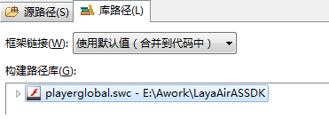
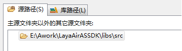

# 新手常见问题：配置环境之后点击运行报错、黑屏


###Erreur de notification résultant de la référence à l'origine de l'AS3

**Phénomène:**

Après les nouveaux projets dans le FB, configurez l 'environnement de compilation du FB, cliquez sur l' application après configuration de l 'environnement - Erreur d' exécution, comme indiqué dans la figure 1:

​< br / >
(Figure 1)

**Raisons**

L'erreur de déclaration est due à l'introduction de l'API dans le Code d'origine Flash AS3 et à la Sprite qui a succédé à l'AS3 d'origine.Le moteur layaair supporte la grammaire de base de la langue Flash AS3, mais non la citation et la succession de l 'ancien AS3 API.

​< br / >
(Figure 2)

**Recommandations**

Touche droite du projet - > Propriétés - > construire le chemin >Confirme que le fichier SWC de Laya a été introduit dans le chemin de bibliothèque et que le fichier de base de moteur de Laya a été introduit dans le trajet source.Figure 3, figure 4, figure 5.

2, le développement doit être familiarisé avec le moteur layaair API, l 'utilisation du moteur layaair API pour le développement.

​< br / >
Figure 3. Supprimer le SDK existant

​< br / >
(Figure 4) Introduction de playerglobal.swc dans le sac de compression de la Banque de moteurs layaair, le trajet indiqué dans le diagramme n 'étant utilisé qu' à titre de référence

​< br / >
Figure 5 introduction d 'une bibliothèque de moteurs


###Erreur de compilation due à l 'absence de paramètres dans la catégorie de documents (programme par défaut)

**Phénomène:**


​        < br / >
Figure 6 erreur dans la compilation des projets

**Raisons**

Lorsqu 'une erreur apparaît dans la figure 6 lors de la compilation, il est certain qu' il n 'y a pas de classe de document (programme par défaut).

**Solutions**

​< br / >
(Figure 7) dans flashbuilder, le Programme d 'entrée doit être défini comme une application par défaut

​< br / >
(Figure 8) dans flashdevelop, les procédures d 'accès doivent être classées dans la catégorie des documents

​< br / >
Figure 9 modifications apportées à layaairide dans le document relatif au projet asconfig.json


###Erreur de compilation due à des caractères redondants

**Phénomène:**

​< br / >
(Figure 10)

En cas d 'erreur dans la figure 10, cliquez pour confirmer que les erreurs sont signalées dans le console du navigateur comme indiqué dans la figure 11:

​< br / >
(Figure 11)

**Raisons**

La plupart de ces erreurs sont dues à des problèmes de grammaire illégaux tels que les caractères superflus.

**Recommandations**

Il est recommandé d 'utiliser flashbuilder pour développer le moteur layaair dans la version AS3, la fonction de contrôle de la grammaire automatique dans flashbuilder étant relativement mature, ce qui éviterait les erreurs de calcul dues à des erreurs mineures inattendues.


###Erreur de compilation due au fichier de programme non sélectionné

**Phénomène:**

Une erreur de présentation apparaît à la figure 12 lorsque vous cliquez sur le bouton ou que vous compilez avec le raccourci clavier.

​< br / >
(Figure 12)

**Raisons**

Comme aucun fichier de programme n 'a été sélectionné par la souris, l' exécution directe de la compilation peut entraîner une erreur de présentation à la figure 12.

**Solutions**

Sélectionnez un fichier de programme valide ou un dossier valide pour la reformulation.


###V. PROBLÈMES D'Écrans noirs DÉCOULANT de l'espace

**Phénomène:**

Après l 'exécution de l' élément, l 'écran noir est affiché dans le navigateur et la console affiche comme indiqué à la figure 13:

​< br / >
(Figure 13)


 


**Raisons**
Par défaut, le navigateur ne permet pas la lecture de fichiers à travers les fichiers, ce qui soulève des problèmes transversaux.

**Solutions**

Local test solution

Ajouter à la fin de la cible`--allow-file-access-frome-files`

Serveur Web:

Des modifications doivent être apportées à Webserver (la plupart des Webserver sont Apache, ginx, Tomcat, etc.) en ajoutant un identifiant de domaine transversal à la demande d 'un nom de domaine particulier, par exemple en ginx:


```nginx

http {

  ......

  add_header Access-Control-Allow-Origin *;

  add_header Access-Control-Allow-Headers X-Requested-With;

  add_header Access-Control-Allow-Methods GET,POST,OPTIONS;

  ......

}

```


Ce qui permet d 'obtenir l' appui d 'une demande transversale get, Post, options

Peut - être.`add_header Access-Control-Allow-Origin http://www.layabox.com;`- désignation de l'URL autorisé;

Dans le cas d 'une demande de données dans un domaine, la langue d' extrémité arrière doit être adaptée et l 'identificateur header doit être ajouté à la demande, par exemple dans la langue PHP:

`header("Access-Control-Allow-Origin: *");`Pas forcément.`*`Oui.`*`Vous pouvez également écrire que l 'hôte sous le nom de domaine spécifié peut y accéder;
