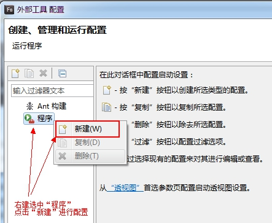
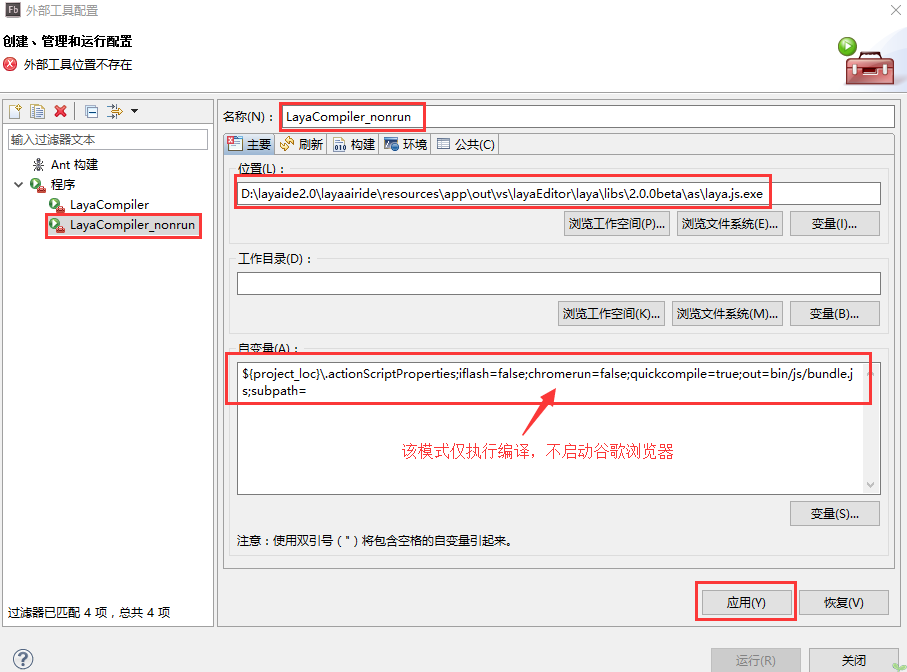

#Flash Builder Development Environmental configuration

###Première étape: layaair Engineering

####Moteur téléchargement

En utilisant le développement de layaairide, le téléchargement de layaairide apportera son propre paquet moteur.Chaque version fournit trois langues de développement AS3, ts et JS et sélectionne le paquet de langage de développement correspondant.

####1.2 Description de la structure du catalogue des paquets de moteur

Nous Téléchargeons la version AS3.Après téléchargement et décompression, on peut voir la structure de catalogue de la version AS3 comme le montre le diagramme suivant:

< br / > (Figure 1)

- "jslibs", "libs" est le catalogue des codes des moteurs, dans lequel le Code de la Bibliothèque des moteurs layaair se trouve.

- « laya.js.exe » est un compilateur de code AS3 dans le système Windows pour la traduction du Code AS3 en Code JS.

- layajsmac est un compilateur de code AS3 dans le système Mac Apple, utilisé pour compiler le Code AS3 en un code JS.

​

###Deuxième étape installation d 'un navigateur Google Chrome

Lorsqu 'une compilation de codes AS3 est effectuée, le navigateur Chrome est appelé par défaut pour ouvrir le projet d' exécution et doit être installé pour effectuer la mise en page du projet.Cette étape peut être franchie si l 'installation est installée.

###Phase 3 configuration de l 'environnement de compilation AS3 dans Flash Builder

​**Mesure 1**: Ouvrez Flash Builder, trouvez la configuration de l 'outil externe et ouvrez la fenêtre de configuration.

​< br / >
Figure 2

​**Mesure 2**: dans la fenêtre de configuration, le bouton droit sélectionne le programme, cliquez sur nouveau et ouvrez la nouvelle fenêtre de configuration.

​< br / >
Figure 3

**Mesure 3**- Oui.

Modifier d 'abord le nom du programme externe`LayaCompiler`".

Puis cliquez sur le système de fichiers de navigation pour trouver`laya.js.exe`"Ou une copie directe."`laya.js.exe`Le chemin est collé à la barre d 'entrée position.

Dernière entrée dans la barre des variables`"${project_loc}\.actionScriptProperties;iflash=false;chromerun=true;quickcompile=true;out=bin/js/bundle.js;subpath="`, cliquez sur & ‧‧; pour terminer cette configuration.

Si l 'on ne veut pas lancer un nouveau navigateur Google à chaque édition, il suffit de changer les paramètres de l' auto - variable`"${project_loc}\.actionScriptProperties;iflash=false;chromerun=false;quickcompile=true;out=bin/js/bundle.js;subpath="`Comme le montrent les figures 4 et 5.

< br / > (Figure 4)

< br / > (Figure 5)

 

**Tips: "D: < layaideride >"Userpath", "layaairide", "layajsmac"**

La configuration du compilateur AS3 dans l 'environnement Flash Builder est donc terminée.Bienvenue dans les autres chapitres.