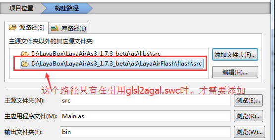

#Premier programme de flashbuiler, "Hello layabox"

]**Cet article affiche le texte Hello layabox en langue AS3 dans l 'environnement flashbuilder, après avoir étudié cet article, c' est la première procédure d 'achèvement du moteur layaair.La configuration de l 'environnement de développement Flash Builder**
]
> la première étape peut être franchie si vous avez lu layaairide pour créer le projet AS3 et avoir une structure de catalogue détaillée et si vous avez un bon projet.Nous recommandons l'adoption du projet layaairide.
]


##Première étape

**Mesure 1**- Oui.

Ouvrez Flash Builder, cliquez sur le fichier dans la barre de menu, puis sélectionnez "nouveau" pour cliquer sur le projet ActionScript et entrer dans la fenêtre de création du projet.Figure 1

< br / >
(Figure 1)


**Mesure 2**- Oui.

Saisissez le nom de l 'élément dans la barre d' entrée "nom de projet" et saisissez le Répertoire de l 'élément dans la barre d' entrée "dossier" ou cliquez sur le répertoire sélectionné "naviguer".Cliquez ensuite sur & ‧‧; prochaine étape & ‧‧; pour accéder à la fenêtre & ‧‧; chemin de construction & ‧‧; de la compilation du moteur et de la configuration de la Bibliothèque du moteur.Figure 2

< br / >
(Figure 2)


**Mesure 3**- Oui.

Supprime d 'abord le SDK compilé avec le système dans la fenêtre de configuration de chemin de bibliothèque (afin d' éviter les paquets d 'erreur de guidage),

Cliquez ensuite sur & ‧‧; Ajouter & ‧‧; SWC & ‧‧; et ajoutez & ‧‧; playerglobal.swc & ‧‧; dans le paquet moteur.

Si le projet exige la publication de la version Flash, le mot « layaairflash.swc » a été ajouté à layaairflash.Figure 3

< br / > (Figure 3)


***Tips**Liste des moteurs`LayaAirFlash/flash`Dans le dossier`glsl2agal.swc`C 'est aussi pour la publication de la version Flash, mais les références`glsl2agal.swc`La Bibliothèque de diffusion Flash doit ensuite être citée à la source du projet.La layaairflash.swc étant intégrée dans la bibliothèque, il n'est pas nécessaire de la répéter.Attention!`LayaAirFlash.swc`Et`glsl2agal.swc`Un seul fichier peut être inséré.


**Mesure 4**- Oui.

Après l 'introduction de SWC, il est recommandé que le dossier de sortie soit par défaut`bin-debug`Définir comme`bin`Voir la figure 4.Etant donné que le catalogue de diffusion par défaut après la création du projet layaairide est le répertoire Bin utilisé, et que la conception de jeux tels que l 'ui, l' animation, etc., doit normalement être utilisée pour layaairide, il est recommandé de le définir de manière uniforme au moment de la création du projet.`bin`".

 <br /> (图4)


**Mesure 5**- Oui.

Configuration de trajet de construction`源路径`"Cliquez dans la fenêtre."`添加文件夹`"Saisissez le catalogue où se trouve la Bibliothèque des moteurs" ou cliquez sur "naviguer" pour sélectionner le répertoire où se trouve la Bibliothèque des moteurs (Note: le répertoire où se trouve la Bibliothèque des moteurs est le fichier SRC dans le dossier librs), puis cliquez sur la confirmation pour achever l 'importation de la bibliothèque des moteurs.Figure 5

< br / > (Figure 5)

Si nous avons besoin de publier la version Flash, et que le chemin de Kuala Lumpur cite`glsl2agal.swc`", alors, lorsque le chemin source est cité, il est nécessaire d 'ajouter la Banque de source requise pour publier le flash (* référence layaairflash.swc sans ajout *), la Banque de source Flash se trouvant à l' endroit où se trouve le flash.`引擎库目录\as\LayaAirFlash\flash\src`Voir la figure 5 - 2.

< br / > (Figure 5 - 2)


**Enfin, cliquez sur le bouton & ‧‧; Terminer & ‧‧; en bas pour terminer le Guide du nouveau projet.**

　　


##La deuxième étape affiche le texte "Bonjour layabox".

**Mesure 1**- Oui.

Dans la barre de menu "fichier", sélectionnez "nouveau" et cliquez sur "active script type" pour ouvrir la fenêtre du nouveau type de fichier.Figure 6

< br / > (Figure 6)


*Tips: le nouveau projet ActionScript comporte une catégorie ActionScript dont le nom est identique à celui du projet et qui, s' il est nécessaire d 'utiliser cette catégorie, doit être supprimé car c' est le sac original flash qui n 'a pas été supprimé.*


**Mesure 2**- Oui.

Saisissez hellolayabox dans la barre de nom, cliquez sur Terminer pour créer une nouvelle catégorie d 'Action Script.Figure 6 - 1

< br / >
(Figure 6 - 1)


**Mesure 3**- Oui.

Définit hellolayabox.as comme une application par défaut.Figure 7

< br / >
(Figure 7)


**Mesure 4**- Oui.

Double - cliquez pour ouvrir hellolayabox.as et commencer à rédiger le Code.Ajouter un texte "Hello layabox" à la scène, avec le code suivant:


```typescript

package
{
	import laya.display.Text;
	public class HelloLayabox
	{
		public function HelloLayabox()
		{
			//初始化引擎
			Laya.init(600, 300);
			var txt:Text = new Text();
			//设置文本内容
			txt.text = "Hello Layabox";
			//设置文本颜色为白色，默认颜色为黑色
			txt.color = '#ffffff';
			//将文本内容添加到舞台 
			Laya.stage.addChild(txt);
		}
	}
}
```


**Mesure 5**- Oui.

Une fois le Code terminé, utilisez le compilateur configuré dans l 'article précédent, cliquez sur le bouton pour commencer à compiler et démarrez automatiquement le code d' exécution Chrome lorsque la compilation est terminée.Figure 8

< br / >

(Figure 8)


Les résultats de l'opération sont indiqués à la figure 9.

< br / >
(Figure 9)


**Mesure 6**- Oui.

"Bonjour layabox", bien qu'il soit déjà apparu, est trop rude, et nous allons faire en sorte que "Hello layabox" soit un peu plus beau, avec le code suivant:


```typescript

package
{
	import laya.display.Text;
	public class HelloLayabox
	{
		public function HelloLayabox()
		{
			//初始化引擎
			Laya.init(600, 300);
			var txt:Text = new Text();
			txt.text = "Hello Layabox";
			//设置文本颜色   
			txt.color = '#FF0000';
			//设置文本字体大小，单位是像素   
			txt.fontSize = 66;
			//设置字体描边   
			txt.stroke = 5;
			//描边为5像素   
			txt.strokeColor = '#FFFFFF';
			//设置为粗体   
			txt.bold = true;
			//设置文本的显示起点位置X,Y   
			txt.pos(60, 100);
			//设置舞台背景色   
			Laya.stage.bgColor = '#23238E';
			//将文本内容添加到舞台   
			Laya.stage.addChild(txt);
		}
	}
}
```


Résultats d 'exécution

< br / >
(Figure 10)


Ainsi, si vous pouvez suivre le plan ci - dessus, félicitations pour votre entrée réussie, nous avons déjà mené à bien le premier programme HTML5 en langue AS3, ce qui montre bien la configuration de l 'environnement de développement de layaair.Pour plus d 'informations sur l' utilisation de l 'API développé par le moteur layaair, consultez l' API et le Demo en ligne au centre de développement de layabox.