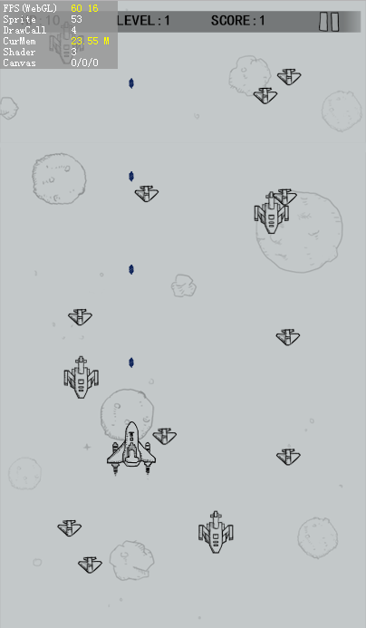

#Analyse des besoins et PRÉPARATION des ressources

> Ce programme diffère de l 'ancien programme vidéo de la guerre des microavions, qui a été développé de plus en plus à l' aide de l 'éditeur layaairide, ce qui a permis d' améliorer les fonctions et les programmes de production de l 'ui, de réduire le volume de code et d' optimiser la Structure du programme.Les développeurs qui ont étudié le programme vidéo peuvent également le réécrire selon ce programme.

###Avant - propos

Souvenez - vous de ce petit jeu de micro - lettres, la guerre d 'avion, qui peut jouer directement dans le micro - message sans téléchargement, et qui partage son classement, la Folie d' innombrables personnes, c 'est le charme de la propagation du jeu HTML5.

Dans l 'idéal de rendre hommage au classique, cet auteur montrera comment utiliser layaair pour développer rapidement et reproduire le jeu classique.Les ressources de la scène et du rôle sont entièrement à la disposition de l 'ancien développeur.

**Adresse de jeu**- Oui.[http://layabox.github.io/layaair-examples/](http://layabox.github.io/layaair-examples/)

Code source du jeu:[https://github.com/layabox/layaair-doc/tree/master/project/AS3/AirWar](https://github.com/layabox/layaair-doc/tree/master/project/AS3/AirWar)

 （图1） 

< br / > (Figure 2)

< br / > (Figure 3)

###Analyse des besoins

L'analyse des besoins du projet prend beaucoup de temps pendant la phase de démarrage de tous les projets de jeux.Une fois que les besoins du projet auront été définis, des programmeurs expérimentés établiront eux - mêmes des diagrammes de réflexion logiques qui permettront de mieux prendre en compte l'architecture du programme et d'élaborer des idées plus claires.

C'est pourquoi le présent cours fournit des diagrammes logiques de base qui servent de référence en fonction des besoins de développement.Il est recommandé que les promoteurs adoptent une pratique de planification de l'élaboration des projets.

< br / > (Figure 4)

Sur la base de l'analyse des diagrammes de réflexion ci - dessus, nous sommes parvenus à la conclusion suivante:

Production de matériaux visualisés en deux étapes: édition de l'ui, production de cartes d'effets artistiques, production de ressources d'images correspondant aux règles de désignation de l'IDE et édition de la page ui; et production d'animations visuelles, production de l'effet d'animation des rôles par l'intermédiaire de l'axe temporel de l'IDE, ce qui permet d'obtenir directement des documents d'animation et de réduire le nombre de codes.
Contrôle du déroulement du jeu, traitement des pages de flux de l 'interface de début, de fin de jeu et réalisation de sa fonction ui.
Mise au point progressive des principales fonctions logiques du jeu, cartes du jeu, rôle du jeu, manipulation du jeu, logique du jeu, mise à niveau du jeu, etc.

Quand les idées de développement de base sont disponibles, commençons par préparer le jeu!

###Nouveau projet layaair

Ouvrez layaairide et créez un nouveau projet vide dont le nom peut être personnalisé, comme le montre la figure 5.Un répertoire d 'éléments apparaît dans le gestionnaire de projets de mode Code par défaut de l' IDE après un clic sur le bouton créé.

< br / > (Figure 5)

Structure de catalogue de projets et comment créer des projets et des configurations environnementales avec layaairide, document technique de base - 2DJe ne comprends pas.

Il y a toujours un commencement pour tout, de la simplicité à la difficulté, nous commençons par gérer les ressources des beaux - arts.

 

###Préparation de ressources de jeu

Ouvrez le projet généré, cliquez sur le mode de conception et faites glisser la ressource d 'image produite par les beaux - arts dans le gestionnaire de ressources.Ou le bouton droit ouvre la table des matières et la saisit sous forme de ",", puis actualise l 'éditeur lorsque la copie est terminée (raccourcis clavier F5).

Dans le gestionnaire de ressources, chaque dossier génère automatiquement une ressource d 'ensemble lorsque l' éditeur exporte (raccourcis clavier F12).Il est recommandé que la taille de l 'Atlas ne dépasse pas 10 240 x 1024 et que, lorsque le diagramme monolithique dépasse 5 12x512, il ne soit pas recommandé de ne pas emballer.Ouvrir le menu**Paramètres du projet**"Les panneaux (raccourcis clavier F9) limitent la taille de l'ensemble de conditionnement automatique.

Le dossier de ressources de jeu et la gestion de la taille des ressources sont plus importants, si bien gérés, le chargement sera plus rapide et plus efficace.Par exemple, les ressources de production de ce jeu (fig. 6), nous sommes divisés en deux dossiers, un dossier de ressources ui et un dossier de ressources d 'animation de personnages, et un plan d' arrière - plan de plus de 512.

  （图6）

Dans le dossier de ressources gameui (fig. 7), les ressources d 'arrière - plan bj.jpg sont réduites et peuvent être agrandies par l' agrandissement de la grille de Jiujiang.

 < br / > (Figure 7)
(Figure 6)

Seules les ressources d 'animation de rôle (fig. 8) sont stockées dans le dossier gamerole pour la production d' animation dans l 'IDE.

< br / > (Figure 8)

###Ressources de jeu

Lorsque les fichiers de ressources sont prêts, on peut essayer de publier les ressources (raccourcis clavier F12) et de créer un catalogue des ressources d 'Atlas comme suit: "...

< br / > (Figure 8)

Grâce à ces mesures, nous avons clarifié l 'idée de développement de projets et nous sommes prêts à jouer des ressources artistiques.Ensuite, le processus de production de jeux commence officiellement, en commençant par la production visuelle de l 'ui et de l' animation.