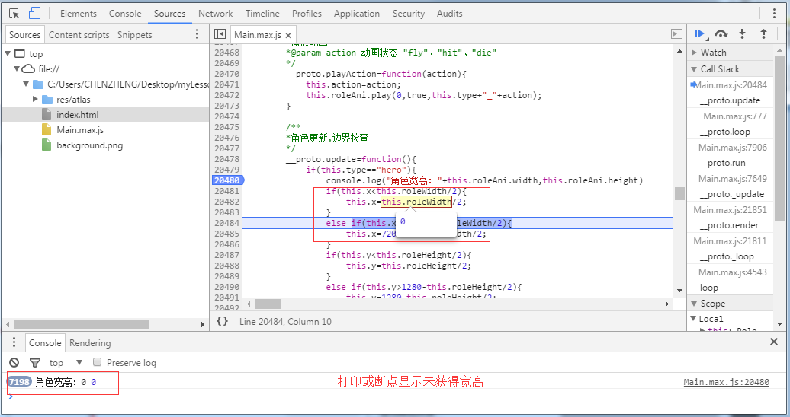

#Protagonistes et manipulations du jeu

###Rôle de jeu

Dans les cours précédents, nous avons créé l 'ui avec l' IDE et mis en oeuvre la gestion de processus de jeu et la fonction logique ui.Mais le rôle le plus important n 'a pas encore été intégré et, d' après l 'analyse diagnostique, le rôle du jeu est la véritable logique de base du jeu (fig. 1).Dans ce cours, nous allons réaliser une partie de la fonction de l 'acteur principal du jeu pour permettre à celui - ci de le manipuler.

<br />（图1）


Le cours a été conçu comme suit:

Création d'une catégorie de rôles de base permettant de classer les rôles selon une méthode d'initialisation et de reproduire différentes animations en fonction du type de rôle.
Mise à l'échelle des protagonistes principaux dans la catégorie principale et mise en œuvre de méthodes de contrôle des protagonistes afin de les déplacer.
Mise au point d'une méthode de mise à jour des protagonistes principaux et contrôle des frontières pour empêcher les protagonistes principaux de se déplacer à l'extérieur de l'écran.


###Création d 'une catégorie de personnages de base de jeu

Créer une nouvelle classe role.as sous le catalogue SRC, succédant à la classe D 'affichage Sprite (laya.display.sprite).

Dans la catégorie des personnages, nous mettons en œuvre la logique suivante:

Caractéristiques fondamentales du rôle: type de rôle type type type type, volume de sang HP, vitesse speed.

Objets d'animation personnalisés roleani: animation pour la diffusion d'animations personnalisées éditées par l'IDE.
Note: le chargement des ressources d 'Atlas des personnages est achevé dans la logique de début de page, de sorte qu' il suffit de charger les ressources d 'animation gamerole.ani éditées par IDE.

La méthode publique d'initialisation des rôles consiste à initialiser le type, le volume et la vitesse des rôles et à les classer.

Playaction (action: String) permet de changer le type de rôle et l'état de l'animation.

Code spécifique:


```

package
{
	import laya.display.Animation;
	import laya.display.Sprite;
	import laya.events.Event;
	import laya.maths.Rectangle;
	
	/**
	 * @author CHENZHENG
	 * 角色类，飞机、敌人、子弹、道具
	 */	
	public class Role extends Sprite
	{
		/***角色的类型   “hero”:玩家飞机，“enemy”：敌人飞机、“bulle”：子弹、"ufo":道具****/
		public var type:String;
		/***角色的血量***/
		public var hp:Number=0; 
		/***角色的速度***/
		private var speed:Number=0;		
		
		/***角色的动画***/
		private var roleAni:Animation;
		/***当前动画动作***/
		private var action:String;
		
		public function Role()
		{
			//实例化动画
			roleAni=new Animation();
			//加载IDE编辑的动画文件
			roleAni.loadAnimation("GameRole.ani");
		}
		
		/**
		 * 角色初始化
		 * @param type  角色类型：“hero”:玩家飞机，“enemy1-3”：敌人飞机、“bulle:1-2”：子弹、"ufo1-2":道具
		 * @param hp   血量
		 * @param speed  速度
		 */		
		public function init(type:String,hp:Number,speed:Number):void
		{
			//初始化角色属性
			this.type=type;
			this.hp=hp;
			this.speed=speed;
			//加载动画对象
			this.addChild(roleAni)
			//播放默认飞行动画
			playAction("fly");
		}
		
		/**
		 * 播放动画 
		 * @param action 动画状态："fly"、"hit"、"die"
		 */	
		public function playAction(action:String):void
		{
			this.action=action;
			//播放角色动画,name=角色类型_动画状态，如：hero_fly
			roleAni.play(0,true,this.type+"_"+action);
		} 
		
}
```


Quand on crée une bonne catégorie de personnages, on peut créer l 'avion principal dans la catégorie principale.Nous devons ajouter à la catégorie main la logique suivante:

Ajouter un nouveau récipient rolelayer séparé dans lequel tous les acteurs sont chargés afin de faciliter la gestion des rôles à un stade ultérieur, par exemple la logique de collision des rôles.Bien entendu, à la fin du jeu, il faut vider la couche de personnage de la méthode gameover pour préparer la prochaine partie.

Créer la variable Hero globale de l 'acteur principal et l' officialiser dans le jeu gameinit () et l 'afficher dans la couche de personnage.

Supprimer la couche de personnage dans la méthode gameover ().Tous les personnages seront supprimés lors de la redéfinition, en prévision du prochain jeu.

Le Code se réfère:


```

		......
		/**角色层容器***/
		private var roleLayer:Sprite;
		/**玩家主角***/
		private var hero:Role;
		......

		/**
		 游戏中，游戏初始化
		 */
		private function gameInit():void
		{
			......
			//实例化角色层并加载到舞台(如果已实例化，不需要重新new)
			roleLayer||=new Sprite();
			Laya.stage.addChild(roleLayer)
				
			//实例化游戏中UI页面(如果已实例化，不需要重新new)
			play||=new GamePlay();			
			//加载到舞台
			Laya.stage.addChild(play);
						
			//实例化主角(如果已实例化，不需要重新new)
			hero||=new Role()
			//初始化角色类型、血量，注：速度speed为0，因为主角是通过操控改变位置
			hero.init("hero",10,0);
			//主角位置修改
			hero.pos(360,800);
			//角色加载到角色层中
			roleLayer.addChild(hero);
			......
		}
		
        /**
		 游戏结束
		 */
		private function gameOver():void
		{
			......
			//清空角色层子对象
			roleLayer.removeChildren(0,roleLayer.numChildren-1);
			//移除角色层
			roleLayer.removeSelf();
			......
		}
		
```


Après avoir achevé ce code logique, nous avons découvert que l 'avion principal avait été chargé sur l' écran et que des animations de vol avaient été diffusées.


###Manipulation de l 'acteur principal du jeu

Dans le programme précédent de la guerre aérienne, les doigts glissaient et le protagoniste s' aligne automatiquement sur les doigts pour suivre le mouvement.Il y a une lacune évidente dans cette opération: si le joueur a des doigts plus gros, l 'avion est bloqué, ce qui ne facilite pas l' observation.Quand les doigts quittent pour toucher d 'autres positions, l' avion passe, ce qui n 'est pas normal.

Par conséquent, dans ce cours, nous allons modifier le mode d 'entrée de commande pour déplacer les doigts, l' avion ne se déplace pas sous les doigts, mais en fonction de sa direction et de sa vitesse.

Note: le moteur layaair n 'est pas indépendant de l' événement tactile (touchevent) comme dans le flash, et nous pouvons identifier directement l 'opération tactile du joueur par l' intermédiaire d 'un moniteur d' événements de souris.Il comprend également des propriétés tactiles multipoint.

En l 'absence d' un personnage mort, nous avons modifié la fin du jeu de simulation de 3 secondes en 30 secondes dans la méthode principale gameinit () afin de réguler la durée.


```

		//模拟游戏结束，30秒时间
		Laya.timer.once(30000,this,gameOver);
```


Les autres notions de logique de code sont les suivantes:

Ajouter deux propriétés movex, movey, pour enregistrer la position tactile de la trame précédente après chaque mouvement des doigts.

Dans la méthode gameinit () Ajouter un événement d'écoute en appuyant sur la souris de scène, en déplaçant la souris et en la soulevant.L 'écoute mobile est supprimée lorsque la souris est levée.Bien sûr, à la fin de la partie, il faut éliminer toutes les caméras.

Mise à jour de la position de l 'acteur principal dans le procédé de déplacement de la souris onmoussemove () Lorsque la position de déplacement est la position de contact actuelle déduction faite de la position du contact de la trame précédente.

Ajouter une mise à jour de la méthode Update (« Update ») dans le rôle, dans laquelle seuls les contrôles frontaliers des protagonistes principaux sont provisoirement inclus, ce qui les empêche de se déplacer à l'extérieur de l'écran.Par la suite, il y a eu d'autres ajouts logiques, tels que l'examen du volume sanguin des personnages, le traitement des avions ennemis au - delà des frontières, etc.

Modifier le Code de référence dans main:


```

		......
        /**鼠标上一帧x座标** */		
		private var moveX:Number;
		/**鼠标上一帧y座标** */	
		private var moveY:Number;
		
		......
		/**
		 游戏中，游戏初始化
		 */
		private function gameInit():void
		{
			......
			//角色加载到角色层中
			roleLayer.addChild(hero);
			
			//鼠标按下监听
			Laya.stage.on(Event.MOUSE_DOWN,this,onMouseDown);
			//鼠标抬起监听
			Laya.stage.on(Event.MOUSE_UP,this,onMouseUp);
			......			
		}
		
		/**
		 按下后开始触发移动
		 */	
		private function onMouseDown():void
		{
			//鼠标按下时的位置，用于计算手指移动量
			moveX=Laya.stage.mouseX;
			moveY=Laya.stage.mouseY;
			//开始移动监听
			Laya.stage.on(Event.MOUSE_MOVE,this,onMouseMove);
		}
		
		/**
		 主角跟随鼠标移动
		 */	
		private function onMouseMove():void
		{
			//计算角色移动量(上一帧的位置—当前移动到的位置)
			var xx:Number=moveX-Laya.stage.mouseX;
			var yy:Number=moveY-Laya.stage.mouseY;
			//更新移动位置
			hero.x-=xx;
			hero.y-=yy;
			//更新前一帧位置的座标
			moveX=Laya.stage.mouseX;
			moveY=Laya.stage.mouseY;
		}
		/**
		 鼠标抬起、关闭移动监听
		 */		
		private function onMouseUp():void
		{
			Laya.stage.off(Event.MOUSE_MOVE,this,onMouseMove) ;
		}
		
		/**
		 游戏结束
		 */
		private function gameOver():void
		{
			//移除所有舞台事件，鼠标操控
			Laya.stage.offAll();
			......
		}
```


###Mise à jour de contrôle de la frontière principale

L 'appareil se déplace également lorsque le doigt se déplace sur l' écran et ne court pas sous le doigt.Mais de nouveaux problèmes sont apparus, car l 'avion principal n' a pas été aligné de manière synchrone par ses doigts, de sorte qu 'il se déplace trop souvent pour sortir de l' écran.

Ajouter une fonction de contrôle des frontières dans le rôle et ajouter une nouvelle méthode Update () avec le code spécifique suivant:


```

		......
		
		/**
		 * 角色更新,边界检查
		 */		
		public function update():void
		{
        	//主角边界检查
			if(this.type=="hero")
			{
				//需减去角色宽或高的一半，因为在IDE中制作动画时，我们把角色的中心做为了角色对象的原点
				//判断是否左右超出
				if(this.x<roleAni.width/2)
				{
					this.x=roleAni.width/2;
				}
				else if(this.x>720-roleAni.width/2)
				{
					this.x=720-roleAni.width/2;
				}
				//判断是否上下超出
				if(this.y<roleAni.height/2)
				{
					this.y=roleAni.height/2;
				}
				else if(this.y>1280-roleAni.height/2)
				{
					this.y=1280-roleAni.height/2;
				}
			}
		}
		......
```


Après l 'ajout d' un procédé de mise à jour dans le rôle, le procédé Update () d 'exécution de l' acteur principal est appelé dans le Loop de cycle principal du Groupe principal, chaque trame détermine si elle va au - delà des limites.


```

		......
		/**
		 游戏主循环
		 */
		private function loop():void
		{
			//地图滚动更新
			map.updateMap()
			//本局游戏数据更新
			play.update(hp,level,score)
				
			//调用主角更新，边界检查等
			hero.update();
		}

		......
```


Après le travail de compilation, est - ce qu 'on a obtenu l' effet souhaité?Les camarades de classe ont - ils remarqué ou ne sont - ils pas parvenus à réaliser que le personnage se déplaçait à la frontière, en dehors du Centre de l 'animation ou au - delà de l' écran?Nous avons évidemment réduit la largeur ou la hauteur de la bande dessinée personnalisée lors des contrôles aux frontières, mais cela n'a pas marché.

Après avoir ajouté le Code trace au poste de contrôle des frontières ("grande largeur de rôle: + roleani.width, roleani.height"), on peut voir que la sortie du poste de contrôle est "grande largeur de rôle: 0 - 0" (Figure 2).

< br / > (Figure 2)

C'est quoi, ça?

Ceci s' explique par le fait qu 'après le chargement de l' animation, seule une seule animation peut être réalisée et que les propriétés élevées de l 'animation ne peuvent être obtenues qu' en obtenant la limite rectangulaire de l 'objet animé.Alors, nous traitons de la manière suivante: dans le procédé init () d 'initialisation de personnages, ajouter l' événement d 'écoute de personnages "la lecture animée est terminée" et mettre en place un procédé de retour pour obtenir une largeur!Le Code se réfère:


```

			......
			
			//加载动画对象
			this.addChild(roleAni)
						
			//监听动画播放完成事件
			roleAni.on(Event.COMPLETE,this,onComplete)
			//播放默认飞行动画
			playAction("fly");

		}
		
		/***动画完成后回调方法***/
		private function onComplete():void
		{
			//如果角色还未有宽，获得角色宽高	
			if(roleAni.width==0)
			{
				//获得动画矩形边界
				var bounds:Rectangle=roleAni.getBounds();
				//角色宽高赋值
				roleAni.size(bounds.width,bounds.height)
			}
		}
		
		......	
```


Après l 'ajout du code ci - dessus, le personnage principal du jeu est parfaitement contrôlé, plus jamais au - delà des frontières!

< br / > (Figure 1)


Tous les codes de cette section ont été modifiés comme suit:

###Main.as all Code


```

package {
	
	import laya.display.Sprite;
	import laya.display.Stage;
	import laya.events.Event;
	import laya.net.Loader;
	import laya.utils.Handler;
	import laya.webgl.WebGL;
	
	
	public class Main
	{
		/**开始页面***/
		private var start:GameStart
		/**地图页面***/
		private var map:GameMap
		/**游戏中界面***/
		private var play:GamePlay
		/**游戏结束页面***/
		private var over:GameOver
		
		/**主角血量***/
		private var hp:int=10;
		/**游戏关卡数***/
		private var level:int=1;
		/**玩家得分***/
		private var score:int=0;
		
		/**角色层容器***/
		private var roleLayer:Sprite;
		/**玩家主角***/
		private var hero:Role;
		
		
		/**鼠标上一帧x座标** */		
		private var moveX:Number;
		/**鼠标上一帧y座标** */	
		private var moveY:Number;
		
		public function Main()
		{
			//初始化引擎，建议增加WebGl模式
			Laya.init(720, 1280,WebGL);
			//全屏不等比缩放模式
			Laya.stage.scaleMode = Stage.SCALE_EXACTFIT;
			//加载游戏页面资源(如果界面资源太多太大[超过50k],建议开始页面单独建立文件夹打包)
			Laya.loader.load("res/atlas/gameUI.atlas",Handler.create(this,this.gameStart));
				
		}
		
		/**
		 资源加载完成后，加载游戏开始界面
		 */
		private function gameStart():void
		{
			//实例化开始页面
			start=new GameStart();
			//以弹出方式打开，有缓动效果。IDE中页面为Dialog才可用
			start.popup();
			//监听开始游戏开始按钮事件,点击后进入游戏中
			start.btn_start.on(Event.MOUSE_UP,this,gameInit);
		}
		
		/**
		 游戏中，游戏初始化
		 */
		private function gameInit():void
		{
			//缓动动画关闭效果。IDE中页面为Dialog才可用
			start.close();
			
			//实例化地图背景页面(如果已实例化，不需要重新new)
			map||=new GameMap();
			//加载到舞台
			Laya.stage.addChild(map);
			
			//实例化角色层并加载到舞台(如果已实例化，不需要重新new)
			roleLayer||=new Sprite();
			Laya.stage.addChild(roleLayer);
				
			//实例化游戏中UI页面(如果已实例化，不需要重新new)
			play||=new GamePlay();			
			//加载到舞台
			Laya.stage.addChild(play);
						
			//实例化主角(如果已实例化，不需要重新new)
			hero||=new Role();
			//初始化角色类型、血量，注：速度speed为0，因为主角是通过操控改变位置
			hero.init("hero",10,0);
			//主角位置修改
			hero.pos(360,800);
			//角色加载到角色层中
			roleLayer.addChild(hero);
			
			//鼠标按下监听
			Laya.stage.on(Event.MOUSE_DOWN,this,onMouseDown);
			//鼠标抬起监听
			Laya.stage.on(Event.MOUSE_UP,this,onMouseUp);
			
			
			//模拟游戏结束，15秒时间
			Laya.timer.once(15000,this,gameOver);
			//游戏主循环
			Laya.timer.frameLoop(1,this,loop);
		}
		
		/**
		  按下后开始触发移动
		 */	
		private function onMouseDown():void
		{
			//记录鼠标按下时的位置，用于计算鼠标移动量
			moveX=Laya.stage.mouseX;
			moveY=Laya.stage.mouseY;
			//
			Laya.stage.on(Event.MOUSE_MOVE,this,onMouseMove);
		}
		
		/**
		 主角跟随鼠标移动
		 */	
		private function onMouseMove():void
		{
			//计算角色移动量
			var xx:Number=moveX-Laya.stage.mouseX;
			var yy:Number=moveY-Laya.stage.mouseY;
			//更新移动位置
			hero.x-=xx;
			hero.y-=yy;
			//更新本帧的移动座标
			moveX=Laya.stage.mouseX;
			moveY=Laya.stage.mouseY;
		}
		/**
		 鼠标抬起、关闭移动监听
		 */		
		private function onMouseUp():void
		{
			Laya.stage.off(Event.MOUSE_MOVE,this,onMouseMove) ;
		}
		
		
		/**
		 游戏主循环
		 */
		private function loop():void
		{
			//地图滚动更新
			map.updateMap();
			//本局游戏数据更新
			play.update(hp,level,score);
				
			//如果主角未死亡，调用主角更新，边界检查
			if(hero.hp>0)
			{
				hero.update();
			}
		}

		/**
		 游戏结束
		 */
		private function gameOver():void
		{
			//移除所有舞台事件，鼠标操控
			Laya.stage.offAll();
			
			//移除地图背景
			map.removeSelf();
			//移除游戏中UI
			play.removeSelf();
			
			//清空角色层子对象
			roleLayer.removeChildren(0,roleLayer.numChildren-1);
			//移除角色层
			roleLayer.removeSelf();
			
			//去除游戏主循环
			Laya.timer.clear(this,loop);
			
			//实例化游戏结束页面
			over||=new GameOver();
			//游戏积分显示
			over.txt_score.text=score.toString();
			//以弹出方式打开，有缓动效果。IDE中页面为Dialog才可用
			over.popup();
			//重新开始事件监听,点击后进入游戏中
			over.on("reStart",this,gameInit);
		}
	}
}
```


###Role all Code


```

package
{
	import laya.display.Animation;
	import laya.display.Sprite;
	import laya.events.Event;
	import laya.maths.Rectangle;
	import laya.utils.Handler;
	
	/**
	 * @author CHENZHENG
	 * 角色类，飞机、敌人、子弹、道具
	 */	
	public class Role extends Sprite
	{
		/***飞机的类型   “hero”:玩家飞机，“enemy”：敌人飞机、“bulle”：子弹、"ufo":道具****/
		public var type:String;
		/***飞机的血量***/
		public var hp:Number=0; 
		/***飞机的速度***/
		private var speed:Number=0;		
		
		/***角色的动画资源***/
		private var roleAni:Animation;
		/***当前动画动作***/
		private var action:String;
		
		public function Role()
		{
			//实例化动画
			roleAni=new Animation();
			//加载IDE编辑的动画文件
			roleAni.loadAnimation("GameRole.ani");
		}
		
		/**
		 * 角色初始化
		 * @param type  角色类型：“hero”:玩家飞机，“enemy1-3”：敌人飞机、“bulle:1-2”：子弹、"ufo1-2":道具
		 * @param hp   血量
		 * @param speed  速度
		 */		
		public function init(type:String,hp:Number,speed:Number):void
		{
			this.type=type;
			this.hp=hp;
			this.speed=speed;
			//加载动画对象
			this.addChild(roleAni)
			
			//监听动画完成事件
			roleAni.on(Event.COMPLETE,this,onComplete)
			//播放默认飞行动画
			playAction("fly");

		}
		
		/***动画完成后回调方法***/
		private function onComplete():void
		{
			//如果角色还未有宽，获得角色宽高	
			if(roleAni.width==0)
			{
				//获得动画矩形边界
				var bounds:Rectangle=roleAni.getBounds();
				//角色宽高赋值
				roleAni.size(bounds.width,bounds.height)
			}
		}
		
		/**
		 * 播放动画 
		 * @param action 动画状态   "fly"、"hit"、"die"
		 */	
		public function playAction(action:String):void
		{
			this.action=action;
			//播放角色动画,name=角色类型_动画状态，如：hero_fly
			roleAni.play(0,true,this.type+"_"+action);
		} 
		
		/**
		 * 角色更新,边界检查
		 */		
		public function update():void
		{
			//主角边界检查
			if(this.type=="hero")
			{
				//需减去角色宽或高的一半，因为在IDE中制作动画时，我们把角色的中心做为了角色对象的原点
				//判断是否左右超出
				if(this.x<roleAni.width/2)
				{
					this.x=roleAni.width/2;
				}
				else if(this.x>720-roleAni.width/2)
				{
					this.x=720-roleAni.width/2;
				}
				//判断是否上下超出
				if(this.y<roleAni.height/2)
				{
					this.y=roleAni.height/2;
				}
				else if(this.y>1280-roleAni.height/2)
				{
					this.y=1280-roleAni.height/2;
				}
			}
		}
	}
}
```
