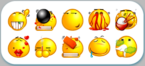

#Com / Forum.

###Analyse simple des besoins du client

Le dernier cours que nous avons donné pour développer le serveur de discussion websocket à l 'aide de l' AS3, nous avons commencé à étudier la partie client.Tout d 'abord, la demande, la réflexion!(Figure 1)

<br/>（图1） 


Selon l 'analyse de diagramme de réflexion, le contenu du client comprend les catégories principales (connexion socket et gestion de processus), les interfaces d' accès, les interfaces de discussion, les interfaces d 'expression, les lignes de dialogue de discussion, et en partie la réalisation de la logique de programmation et de production de l' interface ui.Les diagrammes de référence et la logique sont les suivants:

Interface de connexion
Le nom du joueur est saisi et vérifie si le nom a été changé en fonction de la liste d 'abonnés transmise par le serveur; cliquez sur le bouton de mise à jour pour définir l' image; cliquez sur le bouton de détermination pour connecter l 'interface de discussion et envoyer des informations de connexion au serveur.


 < br / > (Figure 2)

Interface principale
L 'utilisateur saisit le contenu d' émission, qui peut comprendre l 'identification d' expression sélectionnée; cliquez sur le bouton d 'émission et le client envoie les données au serveur; le client reçoit des messages de discussion diffusés par le serveur pour générer des bandes de dialogue mixtes dans le cadre de discussion.

< br / > (Figure 3)

Interface de sélection d 'expression
Cliquez sur l 'expression sélectionnée pour générer l' identificateur d 'expression dans la zone d' entrée de l 'interface de discussion.Les ressources utilisées sont entièrement la propriété de l 'ancien concepteur, le présent exemple ne sert qu' à l 'apprentissage de la recherche, les codes source et les ressources ne doivent pas être commercialisés.

< br / > (Figure 4)


###Création d 'un élément et connexion au serveur websocket

Ouvrez layaair IDE et créez un nouveau projet vide, choisissez le type actionscript3.0, appelé chatclient.Le projet Flash buider est ensuite importé (pour la configuration de l 'environnement Flash buider, voir la page de base du document technique - 2d).La nouvelle catégorie chatclient.as hérite de la classe Sprite du moteur Laya et est définie comme une application par défaut.

< br / > (Figure 5)

Nous commençons par l 'initialisation des moteurs et la mise en place d' un procédé socketinit qui relie les serveurs installés dans la classe précédente au port par l 'intermédiaire de l' IP.

Le socket du moteur layaair est l 'Encapsulation du navigateur websocket.

Après la systématisation de socket, nous avons écouté trois événements:

Event.open, vérifie si le serveur de connexion est connecté, puis déclenche l 'événement;

Event.message, l 'écoute de la réception d' un message est déclenchée après réception des données de message et peut faire l 'objet d' un traitement logique supplémentaire sur la base des données.

Dans le cours d 'installation de serveur, nous avons expliqué que le Forum utilisait principalement trois types de messages: message d' accès, message de dialogue et message de liste de noms d 'utilisateur.Le message d 'accès est reçu par le serveur, de sorte que, dans l' événement de réception de message par le client, nous n 'identifions que le message de dialogue et le message de liste de noms d' utilisateur.

Event. Error, on écoute si la connexion est erronée, après erreur, la connexion est déconnectée, ce qui peut être un signe de déconnexion.

Code spécifique


```

package
{
	
	import laya.display.Sprite;
	import laya.display.Stage;
	import laya.events.Event;
	import laya.net.Socket;
	import laya.webgl.WebGL;
	
	/**
	 *聊天系统客户端 
	 * @author CHENZHENG
	 * 
	 */	
	public class ChatClient extends Sprite
	{

		/***客户端webSocket****/
		public static var socket:Socket;
		
		/***是否连接上webSocket服务器****/
		public static var isConnect:Boolean=false;
		
		public function ChatClient()
		{
			//初始化引擎
			Laya.init(1280, 768,WebGL);
			//最小比例缩放
			Laya.stage.scaleMode = Stage.SCALE_SHOWALL;
			//自动横屏
			Laya.stage.screenMode = Stage.SCREEN_HORIZONTAL;
			
			//连接服务器
			socketInit();
		}
		
		/**初始化webSocket,连接服务器*/
		private function socketInit():void
		{
			//实例化客户端socket
			socket = new Socket();
			//监听是否连接服务器
			socket.on(Event.OPEN,this,socketOpen);
			//监听服务器发送的消息
			socket.on(Event.MESSAGE,this,socketMessage);
			//监听连错误
			socket.on(Event.ERROR,this,socketError);
			
			//连接服务器
			socket.connect("10.10.20.51",8999);
			//方法2：socket.connectByUrl("ws://10.10.20.51:8999");
		}
		
		/**webSocket错误,服务器断开*/
		private function socketError():void 
		{
			//服务器连接中断
			isConnect=false;
		}
		
		/**收到webSocket消息*/
		private function socketMessage(msg:String):void
		{
			//接收消息分为两类：用户昵称列表消息，对话消息
			trace("收到消息："+msg);
			//把JSON字符串转化成object
			var obj:Object=JSON.parse(msg);
			//是否用户列表类型
			if(obj.hasOwnProperty("clients"))
			{
				trace("用户昵称列表-----"+obj.clientNames);
			}//是否聊天信息
			else if(obj.hasOwnProperty("name"))
			{
				trace("用户消息-----"+obj.name+obj.head+obj.data);
			}
		}
		
		/**webSocket已连接**/
		private function socketOpen():void
		{
			trace("服务端连接成功！")
			//服务器已连接
			isConnect=true;
		}
	}
}
```


Node exécute le serveur dans le CMD, puis compile le client, et nous pouvons voir la sortie affichée sur le console CMD du serveur: "il y a un joueur en ligne!"

Cliquez sur F12 pour ouvrir l 'outil de débogage sur la page du navigateur Google du client, et nous pouvons voir que des messages de liste d' abonnés ont été reçus car aucun autre utilisateur n 'a débarqué et n' a envoyé de message de connexion au serveur, de sorte que la liste d 'abonnés est vide.

< br / > (Figure 6)


###Créer une interface visuelle

Lorsque le serveur est connecté avec succès, nous commençons à créer l 'interface ui du client de discussion, y compris l' interface d 'accès, de discussion et de sélection d' expression.

Tout d'abord, on a importé des ressources dans l'id de layaair, on les a répertoriées dans les catalogues et mises à jour dans l'IDE.On peut voir trois dossiers contenant des ressources ui stockées dans le chat, des expressions de conversation dans le visage et des images d 'utilisateur dans le icon u Head (fig. 7).

Note: les images d 'expression et d' image ne peuvent pas être emballées en images car elles doivent être utilisées pour mélanger des images.Dans le dossier, ouvrez les paramètres d 'attributs par défaut et sélectionnez "pas d' emballage" dans l 'interface de paramètres d' attributs de répertoire sortant.

< br / > (Figure 7)

L 'interface est ici pour nous présenter brièvement, sans donner de détails!Pour plus de détails, voir « Technical Paper - layaair - IDE ».

Nouveau login.ui dans le gestionnaire de projet, du type dialog (avec effet d 'animation éjecté).Les composants et les ressources correspondants sont introduits à partir du chat pour obtenir l 'effet indiqué dans le diagramme ci - dessous (fig. 8).Et nomme la variable var comme suit: txt \ \ u Warning, txt \ \ u name, icon \ \ u Head, BTN \ \ u OK, qui génère une variable publique globale après sa publication.

< br / > (Figure 8)


Nouveau chat.ui dans le gestionnaire de projet, le type de page view.Les composants et les ressources correspondants sont introduits à partir du chat pour obtenir l 'effet indiqué dans le diagramme ci - dessous (fig. 9).Les noms des variables var sont les suivants: con \ \ u Head, txt \ \ u name, chatpanel, chatinfo, BTN \ \ u face, BTN \ \ u send.

< br / > (Figure 9)


Un nouveau chatface.ui est créé dans le gestionnaire de projet pour extraire l 'image de l' expression de chat et la convertir en composant List pour obtenir l 'effet indiqué dans la figure 10 ci - dessous.La variable var s' appelle facelist.

< br / > (Figure 10)


Les raccourcis claviers F12 sont publiés, consultent le projet en mode Code et créent un dossier ui dans lequel sont affichés trois types d 'affichage ui: chatui.as, chatfaceu.as et loginui.as.Dans ces trois catégories, nous ne devons pas ajouter de code logique directement, mais nous pouvons réaliser la logique dans leur classe dérivée, car si l 'interface est modifiée dans l' IDE, la rediffusion couvrira la classe D 'origine et les codes logiques précédemment écrits disparaîtront complètement.


###Interface de connexion

La fonction principale de l 'interface d' accès est d 'obtenir un nom et de sélectionner une image pour le client et d' envoyer un "message d 'accès" au serveur, qui met à jour la liste des utilisateurs et la liste des surnoms lorsqu' il le reçoit.Loginview.as succède à loginui.
La logique concrète est la suivante:

Examen de la méthode de révocation

Il faut d 'abord obtenir une liste en ligne de noms de personnes à partir du serveur, puis en juger par les noms de personnes à saisir;

Note: lorsque le client vient de se connecter au serveur, l 'image du client dans le serveur n' a pas de pseudonymes, il n 'y a pas de "message d' accès" avant d 'interpréter l' attribution et de mettre à jour la liste des pseudonymes pour tous les utilisateurs.Ainsi, après la première connexion utilisateur, la liste des surnoms envoyés par le serveur est vide.

Détection d 'un nouveau nom: l' affichage d 'informations d' avertissement est effectué lorsque le focus est désactivé lorsque l 'entrée d' indication est terminée.

La fonction de changement d'image est relativement simple, c'est - à - dire la rotation de l'image d'une tête, et les informations d'image sont conservées sur le client avec ces informations chaque fois qu'un message de discussion est envoyé.

Envoi de messages d'accès.Le format du message est le suivant: {login ":", "nom": chatclient.clientname}

Code:


```

package view
{
	import laya.events.Event;	
	import ui.LoginUI;

	/**
	 * 登录界面及功能
	 * @author CHENZHENG
	 * 
	 */	
	public class LoginView extends LoginUI
	{
		/**是否重名*/
		private var isSameName:Boolean=false;
		
		public function LoginView()
		{
			//警告暂时隐藏
			this.txt_warning.visible=false;
			//限制字符输入
//			this.txt_name.restrict="a-zA-Z\u4e00-\u9fa5";
			//监听文本输入
			this.txt_name.on(Event.INPUT,this,onInput)
			//监听输入文本框是否焦点是否离开
			this.txt_name.on(Event.BLUR,this,onIsName)
			//确定按钮监听
			this.btn_ok.on(Event.MOUSE_DOWN,this,onLogin)
			//头像刷新按钮监听	
			this.btn_head.on(Event.MOUSE_DOWN,this,onChangeHead)
		}
		
		/**修改用户头像*/
		private function onChangeHead():void
		{
			//头像编号增加
			ChatClient.headIndex++;
			//最多到编号15，否则重新开始
			if(ChatClient.headIndex>15) ChatClient.headIndex=0
			//改变玩家头像
			this.icon_head.skin="icon_head/head"+ChatClient.headIndex+".png"
		}
		
		/**正在输入文本*/
		private function onInput():void
		{
			//输入文本时警告不显示
			this.txt_warning.visible=false;
			//初始化警告文本
			this.txt_warning.text="您的昵称已被占用，请重新输入"
			//无重名
			this.isSameName=false;
		}
		
		/**检查是否重名*/
		private function onIsName():void
		{
			//名字输入框中文本
			var txt:String=txt_name.text;
			//检测是否重名
			if(ChatClient.clientNames.indexOf(txt)!=-1)
			{
				//有重名时显示警告
				this.txt_warning.visible=true;
				this.isSameName=true;
			}else
			{
				//无重名时用户取名成功
				ChatClient.clientName=txt;
			}
		}
		
		/**登录*/
		private function onLogin():void
		{
			//注：登录时如焦点从文本输入框移动直接点击按钮，引擎会先激发失去焦点事件，然后才激发鼠标事件！
			//如果有重名且未连接服务器，不允许登录
			if(isSameName||!ChatClient.isConnect) return;
			
			//如果没有用户昵称
			if(ChatClient.clientName=="")
			{
				//修改警告信息
				this.txt_warning.text="登录前必须输入用户昵称！"
				//显示警告
				this.txt_warning.visible=true;
				//退出登录 
				return;
			}
			
			//用户登录信息数据
			var  msgLogin:Object ={"login":"","name":ChatClient.clientName};
			//发送用户登录信息给服务器
			ChatClient.socket.send(JSON.stringify(msgLogin));
			//发送可以登录事件
			this.event("loginOK");
		}
	}
}
```


Modifie la classe principale chatclient.as en ajoutant des attributs tels que la liste des noms d 'utilisateur, les pseudonymes d' utilisateur, le numéro de l 'image et des exemples d' interface d 'accès.Chargez les ressources et affichez l 'interface de connexion de manière personnalisée.Note: la connexion socket est effectuée après l 'affichage de l' interface dans l 'exemple précédent, faute de quoi la logique partielle après réception du message est erronée et l' objet est vide.

Le Code principal modifié est le suivant:


```

package
{
	import laya.display.Sprite;
	import laya.display.Stage;
	import laya.events.Event;
	import laya.net.Loader;
	import laya.net.Socket;
	import laya.utils.Handler;
	import laya.webgl.WebGL;

	import view.LoginView;
	
	/**
	 *聊天系统客户端 
	 * @author CHENZHENG
	 * 
	 */	
	public class ChatClient extends Sprite
	{
		/***登录界面****/
		private var login:LoginView;
		
		/***游戏所需资源数组****/
		private var assetArr:Array=[{url: "res/atlas/chat.atlas"}];
		/***客户端webSocket****/
		public static var socket:Socket;
		/***是否连接上webSocket服务器****/
		public static var isConnect:Boolean=false;
		
		/***用户昵称（用户昵称）****/
		public static var clientName:String="";
		/***用户昵称列表****/
		public static var clientNames:Array=[];
		/**用户头像编号*/
		public static var headIndex:int=0;
		
		public function ChatClient()
		{
			//初始化引擎
			Laya.init(1280, 768,WebGL);
			//最小比例缩放
			Laya.stage.scaleMode = Stage.SCALE_SHOWALL;
			//自动横屏
			Laya.stage.screenMode = Stage.SCREEN_HORIZONTAL;
			
			//加载引擎需要的资源
			Laya.loader.load(assetArr, Handler.create(this, onLogin));
			
		}
		/**加载完资源，实例化登录UI*/		
		private function onLogin():void 
		{
			//实例化登录界面
			login=new LoginView();
			//弹出登录界面
			login.popup();
			//监听登录成功事件
			login.on("loginOK",this,onChatUI);
			//位置居中
			login.pos(Laya.stage.width - login.width>>1,Laya.stage.height - login.height>>1);
			
			//连接服务器
			socketInit();
		}
		
		/**登录设置成功后，打开聊天界面*/
		private function onChatUI():void
		{		
        	//关闭登录界面
			login.close();
		}
		
		/**初始化webSocket,连接服务器*/
		private function socketInit():void
		{
			//实例化客户端socket
			socket = new Socket();
			//监听是否连接服务器
			socket.on(Event.OPEN,this,socketOpen);
			//监听服务器发送的消息
			socket.on(Event.MESSAGE,this,socketMessage);
			//监听连错误
			socket.on(Event.ERROR,this,socketError);
			
			//连接服务器
			socket.connect("10.10.20.51",8999);
			//socket.connectByUrl("ws://10.10.20.51:8999");
		}
		
		/**webSocket错误,可能接服务器断开*/
		private function socketError():void 
		{
			//服务器连接中断
			isConnect=false;
			//错误提示
			login.txt_warning.text="服务器断开，无法登录！！"
			//显示提示
			login.txt_warning.visible=true;
		}
		
		/**收到webSocket消息*/
		private function socketMessage(msg:String):void
		{
			//接收消息分为两类：用户昵称列表消息，对话消息
			trace(msg)
			//把JSON字符串转化成object
			var obj:Object=JSON.parse(msg);
			//是否是用户列表类型
			if(obj.hasOwnProperty("clients"))
			{
				//更新用户昵称列表
				clientNames=obj.clients;
				trace("用户昵称列表-----"+ChatClient.clientNames);
			}//是否是聊天信息
			else if(obj.hasOwnProperty("name"))
			{
				trace("用户消息-----"+obj.name+obj.head+obj.data);
			}
		}
		
		/**webSocket已连接**/
		private function socketOpen():void
		{
			//服务器已连接
			isConnect=true;
			//警告信息不显示
			login.txt_warning.visible=false;
		}
	}
}
			
```


Vous pouvez voir que l 'interface de connexion est affichée et que les fonctions d' enregistrement et de commutation de l 'image sont normales.Cliquez sur le bouton d 'accès après avoir pris votre pseudonyme, car il n' y a pas de nouveau nom, donc vous avez envoyé un message et l 'interface est désactivée.Ouvre l 'outil de débogage sous Google Browser en appuyant sur F12, et on voit sur le console que le message d' accès a été envoyé et reçu par le serveur - une nouvelle liste de noms d 'utilisateur et un message de bienvenue (fig. 11).


< br / > (Figure 11)


