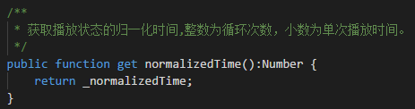
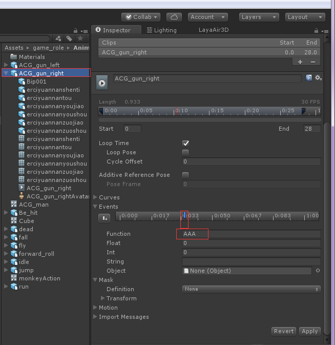

#                   Laya2.0模型动画的使用

La modification et l 'optimisation en profondeur de l' animation du modèle 3D dans laya2.0 ont conduit à des fonctionnalités différentes de celles de 1.0 ou à ajouter des interfaces de suppression, etc.This paper is a summary of Problems of Suspending Economy Events and other problems in recent developper 's feedback on the problem of the problem of the problem of the problem of the problem of the release of 3D model animation.

###Pause d 'animation

La suspension active de la diffusion d 'animations par notre aiguille 3D sur 1.0 est basée sur le procédé skinnani.player.stop (); le procédé stop suspend directement l' animation, qui, à 2.0, a été modifié pour optimiser les paramètres de vitesse de lecture d 'animations 3D!Les développeurs peuvent utiliser directement la vitesse de lecture de l'animation pour commander la pause et la lecture de l'animation, donc nous avons supprimé la méthode stop de 1.0.

2.0 pause d 'animation en 3D au lieu de animateur.speed = 0; voir fig.


```javascript

//添加蒙皮动画角色模型
Sprite3D.load("h5/LayaScene_monkey/ACG_man.lh",Handler.create(this,function(sp:Sprite3D):void{
//加载到场景
var hero:Sprite3D = scene.addChild(sp)as Sprite3D;
//让摄影机指向角色
camera.transform.lookAt(hero.transform.position,new Vector3(0,1,0))
//获取角色动画组件
var ani:Animator = hero.getChildAt(0).getComponent(Animator);
ani.speed = 0;//暂停动画播放	
}));
```


(Figure 1)

###La vidéo animée!

Dans l 'utilisation de l' animation de personnages 3D, nous sommes souvent en train d 'écouter l' état de lecture d 'un personnage pour atteindre l' effet d 'attaque ou de marche que nous voulons!Dans le 2.0, nous avons proposé deux nouvelles techniques d 'écoute pour l' animation.

#####Pourcentage d 'animations en cours

  


(Figure 2)

#####Quand l 'animation est une lecture non cyclique

Le même dessin animé**Non - circulation**Ce nomalizedtime renvoie un nombre de 0 ~ 1 qui signifie que l 'animation actuelle a été diffusée à 100%, c' est - à - dire qu 'elle a été diffusée, c' est - à - dire qu 'elle a été diffusée à 10%.

##### **Quand l 'animation est une lecture circulaire**

Cette valeur + + 1 après chaque lecture, c 'est - à - dire combien de fois le BIT entier a terminé la lecture de l' animation courante, alors que le petit nombre représente le pourcentage de l 'animation actuellement en cours de lecture.Par exemple, trois fois en cycle d'animation, ce chiffre devrait être de 3,0 quand la quatrième fois sera à la moitié.

Ainsi, nous pourrons suivre l 'état de l' animation en fonction de cette valeur de retour.

L'animation que j'ai écoutée est une animation circulatoire qui, à chaque fois qu'elle passe entre 60 et 50%, crée un box.


```javascript

	public class LayaAir3D {
		public var box :MeshSprite3D;
		public var scene:Scene3D;
		public var weaponIsClone:Boolean = false;
		public var heroAni:Animator;
		public function LayaAir3D() {

			//初始化引擎
			Laya3D.init(0, 0);
			
			//适配模式
			Laya.stage.scaleMode = Stage.SCALE_FULL;
			Laya.stage.screenMode = Stage.SCREEN_NONE;

			//开启统计信息
			Stat.show();
			
			//添加3D场景
			scene = Laya.stage.addChild(new Scene3D()) as Scene3D;
			
			//添加照相机
			var camera:Camera = (scene.addChild(new Camera( 0, 0.1, 100))) as Camera;
			camera.transform.translate(new Vector3(0, 3, 3));
			camera.transform.rotate(new Vector3( -30, 0, 0), true, false);
			camera.clearColor = null;

			//添加方向光
			var directionLight:DirectionLight = scene.addChild(new DirectionLight()) as DirectionLight;
			directionLight.color = new Vector3(0.6, 0.6, 0.6);
			directionLight.transform.worldMatrix.setForward(new Vector3(1, -1, 0));

			box = new MeshSprite3D(new BoxMesh(0.3,0.3,0.3));

			Sprite3D.load("h5/LayaScene_monkey/ACG_man.lh",Handler.create(this,function(sp:Sprite3D):void{
				var hero:Sprite3D = scene.addChild(sp)as Sprite3D;
				hero.getChildAt(0).addChild(box);
				heroAni = hero.getChildAt(0).getComponent(Animator)
				heroAni.linkSprite3DToAvatarNode("Dummy002",box);
				
				Laya.timer.frameLoop(1,this,onFrame)
			}));
		}
		private function onFrame():void{ 
		trace(heroAni.getCurrentAnimatorPlayState(0).normalizedTime);
		//当动画播放到百分之五十到六十之间时进行克隆
		if (0.6>(heroAni.getCurrentAnimatorPlayState(0).normalizedTime-Math.floor(heroAni.getCurrentAnimatorPlayState(0).normalizedTime))>0.5)
			{
				if(weaponIsClone)return;
				trace("sssssss")
				//克隆模型（位置，矩阵，等信息全被克隆）
				var weaponClone:Sprite3D = Sprite3D.instantiate(this.box);
				//为模型添加在定义脚本
				weaponClone.addComponent(WeaponScript);		
				//把克隆的武器放入场景中
				scene.addChild(weaponClone);
				weaponIsClone = true;
			}
			else if ((heroAni.getCurrentAnimatorPlayState(0)._normalizedTime-Math.floor(heroAni.getCurrentAnimatorPlayState(0)._normalizedTime))>0.98)
			{
				weaponIsClone = false;
			}
			
		}
	}
```


(Figure 3)

###événement d 'animation dans l' Unity

Dans l'animator de l'Unity, on peut ajouter une animation qui déclenche l'événement AAA comme Figure 4.

Cet événement signifie que lorsque l 'animation est mise en place dans cette position, le nom de notre AAA est déclenché.

Définissez l 'événement dans l' unité et apply, puis exportez le modèle d 'animation.

 


(Figure 4)

Dans Laya, on peut créer un script pour recevoir l'événement.

Tout d 'abord, on crée un script dans Laya, qui n' affecte pas le déclenchement de l 'événement, donc on crée un nom de méthode dans le script, qui s' appelle AAA, qui est le même nom d' événement que dans l 'Unity, comme la figure 5.

 


(Figure 5)

Il suffit d 'ajouter ce script au noeud d' animation.

 


(Figure 6)