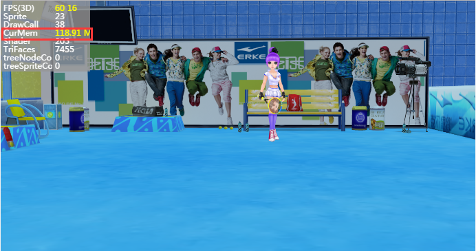

##Libération des ressources de layaair3d

###### 修改时间:2019-4-24,version:2.0.1

###Pourquoi libérer des ressources?

Dans le développement du jeu layaair 3D, la libération des ressources est très importante.Les ressources 3D comprennent des modèles, des affiches, des matériaux, des animations, etc. pour obtenir de bons résultats d 'image, le fichier sera beaucoup plus grand que le 2D, alors que les moteurs 3D seront pratiquement toutes mis en GPU pour le calcul et le rendu, ce qui absorbera une grande partie de l' affichage.Le jeu finira par s' effondrer si les ressources ne sont pas libérées.

Il n 'existe pas de mécanisme de récupération des ordures comme la mémoire, mais il faut les libérer manuellement, et il faut donc accorder une attention particulière à la libération des ressources.

Taille des outils statistiques dans les figures 1 et 2

La figure 1 présente la première scène chargée après le démarrage du jeu avec un nombre de surfaces de 30 527, avec un affichage de 85,2 m.

< br > (Figure 1)

Figure 2 Deuxième scénario chargé pour le jeu, avec 7 455 pages seulement, alors que les ressources affichées après le chargement sont de 118 91m.Pourquoi?Données à titre indicatif uniquement, elles ne sont pas intégrées dans les notes d 'hôtels Ctrip.

C 'est parce que le premier scénario n' a pas été relâché, que ses ressources sont toujours en vie et que l 'occupation apparente s' est accrue.Si le jeu n 'est pas effacé manuellement, le jeu continue de changer d' autres scènes, après avoir atteint une certaine quantité, les téléphones portables apparaîtront, les cartes de jeu sont morts, les Flash, la fièvre, etc.

< br > (Figure 2)


###Principe de traitement des ressources

L 'exemple de la figure ci - dessus montre la relation entre les ressources traitées par le moteur layaair3d et l' existence, ainsi que les principes qui doivent être pris en compte lors du chargement des ressources afin d 'optimiser les performances du jeu.

Ne chargez pas toutes les ressources en une seule fois, mais seulement les ressources nécessaires (mode de chargement segmenté).Une fois le chargement de ressources 3D effectué, l 'objet d' affichage 3D est créé directement en fonction du nom de suffixe de ressources, par exemple. LS crée scene, LH crée un objet sprite3d, etc., et les ressources d 'objet bien créées sont directement mises en mémoire, même si elles ne sont pas sur scène, ce qui permet d' obtenir une surabondance de ressources.

Une gestion rationnelle fait apparaître que les ressources fréquemment utilisées n 'ont pas besoin d' être libérées dans l 'affichage et que les ressources non utilisées sont libérées dès qu' elles ont été utilisées afin d 'économiser les dépenses de fonctionnement.Par exemple, les ressources d 'acteur principal, les ressources d' accessoires 3D, qui sont souvent utilisées par les joueurs, peuvent être stockées dans l 'affichage et la vitesse d' extraction rapide; tandis que certaines grandes scènes peuvent libérer les ressources lors d 'un transfert, les cartes de niveau de scène, les ressources de modélisation sont plus importantes, ce qui permet d' économiser des dizaines de gigabits de frais de mise en évidence.


###Procédé de libération de ressources de mémoire

L 'invention concerne deux procédés de libération de ressources de visualisation, l' un consistant à libérer des ressources de visualisation par l 'intermédiaire d' objets, sans qu 'aucune recommandation ne soit faite sur l' historique de l 'objet de ressource, et l' autre consistant à libérer des ressources de visualisation par l 'intermédiaire d' adresses de ressources qui, du point de vue de la gestion des ressources, sont plus souples et peuvent être gérées par la configuration d 'une table de données json.

####Interface de transition pour le transfert de scènes et la libération de ressources

Lors du chargement des ressources et du transfert des scènes, nous produisons une interface d 'affichage de progression dans l' IDE pour la transition, comme la figure 3.

< br > (Figure 3)

Après la publication de l'IDE, une catégorie de contrôle a été mise au point et les codes logiques sont référencés comme suit:


```java

package view {
  import ui.ProgressBarUI;

  public class loading extends ProgressBarUI {

    public function loading() {

    }
    public function setValue(num:Number):void{
      this.pro.value = num;
    }
    public function init():void{
      this.pro.value = 0;
      //进度增加帧循环
      Laya.timer.loop(20,this,loop);
    }		
    //资源加载进度模拟*（假进度）
    private function loop():void{
      //进度增加
      this.pro.value +=0.01;
      //最高进度度100%
      if(this.pro.value>=1)
      {
        this.pro.value = 100;
        Laya.timer.clearAll(this);
        this.removeSelf();
      }
    }
  }
}
```


####Libération de ressources de mémoire par l 'intermédiaire d' une table d 'adresses de ressources

Dans la catégorie principale, nous changeons de scène en double cliquant sur la scène avec une souris, en utilisant une adresse de ressource pour libérer une ressource affichée et en chargeant une nouvelle scène.

L 'ajout de ressources de suppression dans la table est également commode.Par exemple, les beaux - arts créent une nouvelle table json lors de l 'exportation de la scène, placent tous les chemins de ressources qui ne sont pas nécessaires après le passage de la scène dans la table J, les ressources utiles ne sont pas libérées sans l' entrée de la table, par exemple certaines ressources d 'éléments de jeu tels que NPC, accessoires, effets spéciaux.

Tips: les ressources comprennent: Lightmap, material, lmat, model. LM, divers types d 'affiches. Ping ou. JPG, animation. LANI, os. Lav, etc.

Nous allons maintenant présenter la méthode de la table des ressources, en commençant par établir le fichier json dans le répertoire des fichiers de ressources exportés et par éditer les ressources de trajet à libérer, en formant une matrice json dont le nom correspond au fichier.Voir les figures 5 et 6.

<br>（图5）


< br > (Figure 6)

Lorsque l 'édition de json est terminée, un outil de vérification peut être utilisé pour vérifier si le format est correct.Le Code de classe principale est alors créé comme suit:


```java

package {
  import laya.d3.core.Camera;
  import laya.d3.core.MeshSprite3D;
  import laya.d3.core.Sprite3D;
  import laya.d3.core.light.DirectionLight;
  import laya.d3.math.Vector3;
  import laya.d3.math.Vector4;
  import laya.d3.resource.models.BoxMesh;
  import laya.display.Stage;
  import laya.utils.Stat;
  import laya.d3.core.scene.Scene3D;
  import laya.d3.core.material.BlinnPhongMaterial;
  import laya.webgl.resource.Texture2D;
  import laya.utils.Handler;
  import view.loading;
  import laya.events.Event;
  import laya.resource.Resource;
  public class LayaAir3D {
    public var load:loading;
    private var scene:Scene3D;
    public function LayaAir3D() {

      //初始化引擎
      Laya3D.init(0, 0);

      //适配模式
      Laya.stage.scaleMode = Stage.SCALE_FULL;
      Laya.stage.screenMode = Stage.SCREEN_NONE;

      //开启统计信息
      Stat.show();
      //加载2D资源文件
      Laya.loader.load("h5/res/atlas/comp.atlas",Handler.create(this,Complete2D));
    }
    public function Complete2D():void{
      //实例化加载进度界面
      load = new loading();
      Laya.stage.addChild(load);
      load.init();
      //加载场景3D资源(不能全部加载，否则太占显存)
      Laya.loader.create(["h5/LayaScene_test/test.ls","h5/LayaScene_twonScene/twonScene.ls"],Handler.create(this,Complete3D))

    }	
    //加载3D资源完成的回调
    public function	Complete3D():void{
      //添加场景
      scene = Laya.stage.addChild(Laya.loader.getRes("h5/LayaScene_test/test.ls"))as Scene3D;
      Laya.stage.setChildIndex(scene,0);
      //点击游戏画面切换场景
      Laya.stage.on(Event.MOUSE_DOWN,this,ChangeScene);
    }
    //加载第二关场景资源，切换场景
    private function ChangeScene():void{
      //去除场景的点击切换事件
      Laya.stage.off(Event.MOUSE_DOWN,this,ChangeScene);
      //移出之前的场景
      scene.removeSelf();
      load.init();
      Laya.stage.addChild(load);
      scene.destroy();

      //加载第二关场景资源到游戏中
      scene = Laya.loader.getRes("h5/LayaScene_twonScene/twonScene.ls");
      Laya.stage.addChild(scene);
      //设置游戏场景层级
      Laya.stage.setChildIndex(scene,0);

      //列表释放显存资源的方法（利用资源表方式，每个场景配置资源路径表）
      assetsDispose();
    }
    private function assetsDispose():void{
      //加载释放的资源配置表
      Laya.loader.load("loveScene.json",Handler.create(this,this.onAssetOK));
    }
    //加载资源释放表完成后
    private function onAssetOK():void{
      //获取加载的数据（Json数据转换成数组）
      var arr:Array = Laya.loader.getRes("loveScene.json");
      for(var i:Number = arr.length-1;i>-1;i--)
      {
        //根据资源路径获取资源
        var resource:Resource = Laya.loader.getRes(arr[i].url)as Resource;
        //非空
        if(resource)
        {
          //销毁资源
          resource.destroy();
        }
        else
        {
          console.log(arr[i].url);
        }
      }
    }
  }
}
```


Lorsque l'on observe la méthode d'assemblage du Code susmentionné (assetsdispose: String), on obtient directement les objets générés par les ressources par l'intermédiaire de la méthode laya.loader.getres (AR [i]. URL) (la méthode getres peut être lue directement en créant différents types d'objets en fonction du nom de suffixe URL).La version officielle de layaair2.0 a été harmonisée avec la méthode resource.destroy () et les ressources peuvent être débloquées.

Une fois les ressources libérées, les ressources existantes dans le cache peuvent également être consultées par l 'intermédiaire de l' attribut loademap.

Lorsque vous compilez et exécutez le code ci - dessus, nous pouvons voir l 'effet de la figure 4 et relâcher et charger de nouvelles scènes, l' occupation apparente est beaucoup plus faible.Les ressources non libérées étaient auparavant de 118 91m, soit 56,11 m seulement.

< br > (Figure 4)

###Libération automatique de ressources

Layaair2.0 des moyens de libération plus faciles ont été ajoutés pour faciliter la mise au point par les développeurs de ressources en 3D.

Après la destruction de la scène (ou des Elfes), appelez - le.`Resource.destroyUnusedResources()`Les ressources inutilisées sont automatiquement libérées.


```typescript

//自动释放没有被使用的资源
Resource.destroyUnusedResources();
```


