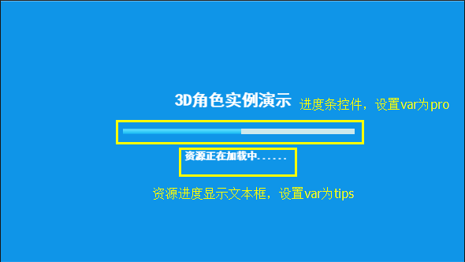

##Transfert de rôle 3D et animation

###Analyse d 'exemples 3D et préparation des ressources

Grâce à l 'apprentissage de documents techniques, nous avons acquis une connaissance fondamentale du développement de jeux 3D.On trouvera ci - après des exemples d'application intégrée de la technologie 3D.

Observez l 'exemple suivant (fig. 1), qui est semblable à l' interface de sélection de rôle 3D dans le jeu.


 < br > (Figure 1)


####Interface 2D et liaison 3D

La scène 3D est mélangée avec l 'interface 2D, dans le présent exemple, la partie ui de l' interface est éditée pour layaair - IDE et comprend une page d 'avancement de chargement de ressources et une page ui de commande dans le jeu.Leurs méthodes de fabrication sont parfaitement compatibles avec le jeu 2D et, si l 'interface d' édition de l 'IDE n' est pas familière, on peut se référer au document technique layaair - IDE.


####Scène 3D

Dans l 'exemple, le modèle de scène est produit à partir du Fbx dans 3ds Max, puis importé à l' édition dans unty, avec deux tâches principales:

Pour éditer les images d 'éclairage de scène, les images d' éclairage peuvent produire des effets statiques entre les modèles, la couleur d 'éclairage et l' atmosphère, ce qui est très important pour améliorer la qualité artistique du jeu.

Ii) Animation d 'un matériau UV mobile pour éditer des annonces publicitaires.Il convient de noter que les animations UV de matériaux dans les 3ds Max ne sont pas prises en charge dans l 'unty et doivent donc être produites dans l' unité.

Le procédé de production de l 'unité d' animation du matériel est décrit dans le document technique layaair 3D - layaair3d animation 2.


####Personnage 3D et animation osseuse

Le modèle de personnage 3D et l 'animation squelettique sont édités et exportés dans les 3ds Max, puis importés dans l' Unity pour traiter le montage d 'animation, augmenter l' ensemble d 'animation, etc.

Lorsque l 'animation squelettique d' un personnage est produite dans un max, il est préférable d 'éditer une pluralité d' actions en une seule fois sur l 'axe temporel, d' éditer l 'animation produite par l' intermédiaire d 'une connexion d' animation, ce qui entraîne des erreurs et des tremblements après l 'introduction de l' Unity.

Dans ce mode de réalisation, pour plusieurs modes de connexion animée, l 'animation après la connexion a posé de nombreux problèmes, il s' est produit des tremblements, des interactions de modèles, et il a fallu beaucoup de temps pour atteindre ces résultats.

Pour la méthode d 'édition dans l' unité d 'animation squelettique, voir document technique - moteur layaair 3D - Animation layaair3d 1.


####Effet 3D

L 'effet de l' anneau optique est l 'animation rigide (Animation transformée: rotation, déplacement, zoom), qui peut être introduite dans l' Unity dans les 3ds Max, mais il est recommandé de créer un modèle uniquement dans 3ds Max et une animation dans l 'Unity, étant donné que l' animation qui lie le matériau au corps rigide peut être produite dans l 'unty, ce qui permet d' obtenir de meilleurs résultats.

L 'animation Unity de l' anneau optique est réalisée de la même manière que l 'animation de processus et de matériaux.


Lorsque les ressources 3D ci - dessus ont été produites dans l 'unité, quatre dossiers de ressources ont été exportés par l' intermédiaire de l 'outil d' exportation layaair pour les ressources de scène layascene u scene02, les deux ressources de rôle layascene u girl et layascene u boy, et les ressources de l 'anneau optique layascene u effect.Et copie des ressources au titre du point H5.


###Mise en oeuvre de code pour une fonction d 'instance 3D

####Mise en oeuvre de l 'interface UI

Éditez l 'interface dans l' IDE et définissez les attributs var et name des éléments de l 'interface pour les appels de code, par exemple (Figure 2) (fig. 3).

Veille à ce que la résolution de l 'interface corresponde à la résolution définie dans laya.init () et à ce que l' écran soit correctement adapté.

Analyse de progressbar.ui


 < br > (Figure 2)

Analyse de contrôle de rôle


 < br > (Figure 3)

Après avoir édité l 'interface ci - dessus, les ressources sont exportées dans l' IDE et les ressources d 'emballage et les catégories ui correspondantes sont générées dans le dossier de projet.Nous avons créé deux catégories de contrôle de l'affichage ui qui leur succéderont respectivement, selon le code suivant:

Progress ui Display Control class progressview, in class we used pseudo - step Band (sinon, l 'interface s' efface si la ressource initiale est petite)


```java

package view
{
	import ui.ProgressUI;
	
  	//继承于IDE导出时产生的UI类
	public class ProgressView extends ProgressUI
	{
		private var progress:int=0;		
		public function ProgressView()
		{
			//进度增加的帧循环
			Laya.timer.loop(30,this,onLoop);
		}		
		/**
		 * 资源加载进度模拟（假进度）
		 */		
		private function onLoop():void
		{
			//进度增加
			progress++;
			//最高100%进度
			if(progress>100)
			{
				progress=100;
				this.tips.text="游戏加载完毕，即将进入游戏..."
                //清除所有事件监听，包括帧循环
				Laya.timer.clearAll(this);
                //进度100%后，自动移除界面
				this.removeSelf();				
			}else
			{
                //更新组件显示进度
				this.pro.value=progress/100;
				this.tips.text="游戏正在加载中，当前进度为："+progress+"%!"
			}
		}
	}
}
```


L 'unité de commande de rôle ui affiche la classe de commande controlview, et nous envoyons le nom de bouton actuellement cliqué à la classe principale par un événement.


```java

package view
{
	import laya.events.Event;
	
	import ui.ControlUI;
	
	public class ControlView extends ControlUI
	{
		public function ControlView()
		{
			//监听UI鼠标点击事件
			this.on(Event.MOUSE_DOWN,this,onClick);
		}		
		private function onClick(e:Event):void
		{
			//发送点击的组件名称（需在IDE中设置组件的名字）
			this.event("btn_action",e.target.name);
		}
	}
}
```


####Mise en oeuvre combinée de 2D et 3D

La classe scéne 3D est une classe Sprite d 'objets d' affichage héritée de la classe 2D, de sorte qu 'elle peut être chargée sur la scène comme un objet d' affichage 2D et ajuster son niveau par le biais de setchildindex () pour traiter sa relation avec le masquage de couche supérieure et inférieure de l 'arrière - plan et de l' interface.

Dans ce mode de réalisation, l 'interface d' avancement de chargement de ressources et l 'interface de commande de rôle doivent être disposées sur la couche supérieure de la scène 3D et peuvent être mises en oeuvre par le procédé ci - dessus, avec le Code laya.stage.setchildindex (scene, 0), le Code de chargement de l' interface et de la scène dans la classe principale étant le suivant:

```java

	public class Example_roleChange
	{
		/*****3D场景******/
		private var scene:Scene;
		/*****角色控制界面******/
		private var control:ControlView;
      	/*****角色资源名数组******/
		private var roleArray:Array=["LayaScene_girl/girl.lh","LayaScene_boy/boy.lh"];

		public function Example_roleChange()
		{
			//初始化引擎
			Laya3D.init(1280, 720,true);
			
			//适配模式
			Laya.stage.scaleMode = Stage.SCALE_EXACTFIT;
			Laya.stage.screenMode = Stage.SCREEN_NONE;
			
			//加载2D界面资源
			Laya.loader.load("res/atlas/comp.atlas",Handler.create(this,onUIComplete));
		}		
		/**
		 * 界面资源加载完成后
		 */		
		private function onUIComplete():void
		{
          	//加载3D场景与角色资源（根据资源后缀名，会创建默认3D显示对象类型）
			Laya.loader.create([{url:"LayaScene_scene02/scene02.ls"},
								{url:roleArray[0]},	{url:roleArray[1]},	
                                {url:"LayaScene_effect/effect.lh"}
							   ],Handler.create(this,onSceneOK));
          
			//创建角色控制界面
			control=new ControlView();
			Laya.stage.addChild(control);
			
			//创建资源载入界面
			var assetLoad:ProgressView=new ProgressView();
			Laya.stage.addChild(assetLoad); 
		}

		/**
		 * 场景角色加载完成后回调
		 */	
		private function onSceneOK():void
		{
			//创建加载场景
			scene=Laya.loader.getRes("LayaScene_scene02/scene02.ls");
			Laya.stage.addChild(scene);
			//设置场景在2D界面最后（最底层为第0层）
			Laya.stage.setChildIndex(scene,0);
          
          	//创建摄像机(横纵比，近距裁剪，远距裁剪)
			var camera:Camera = new Camera( 0, 0.1, 1000); 
			//加载到场景
			scene.addChild(camera);
			//移动摄像机位置
			camera.transform.position=new Vector3(-3, 1.5, 6);
			//旋转摄像机角度
			camera.transform.rotate(new Vector3( -6, 0, 0), true, false);
			//设置摄像机视野范围（角度） 
			camera.fieldOfView=33;
		}
	}
```


L 'interface de commande est au - dessus de la scène 3D.

L 'animation en 3D est automatiquement chargée et diffusée après chargement. LS. Si l' animation doit être contrôlée, l 'ensemble d' animation peut être obtenu d 'abord par l' ensemble d 'animation puis par l' ensemble d 'animation.


####Création et commande de rôle 3D

La commande d 'animation de rôle est d' autant plus importante qu 'il est nécessaire d' obtenir l 'ensemble d' animation que, dans ce cas, le préchargement est appliqué, de sorte que la création d 'un rôle peut être obtenue directement à partir d' un modèle de rôle.
Tips: si le chargement asynchrone de sprite.load () n 'est pas effectué au moyen d' un préchargement, il faudra ajouter des ressources d 'écoute pour le chargement de l' événement avant d 'obtenir l' ensemble d 'animation, faute de quoi il y aura erreur de notification.

**Créer un rôle**

Ajouter dans la catégorie principale les attributs globaux associés aux personnages, y compris les ressources de personnages actifs, l 'ensemble d' animation de personnages actifs, le nom d 'action de personnages actifs, etc., et ajouter une méthode de création de personnages dont le Code est le suivant:


```java

		/*****3D场景******/
		private var scene:Scene;
		/*****3D角色******/
		private var role3D:Sprite3D;
		/*****角色控制界面******/
		private var control:ControlView;
		/*****角色资源名数组******/
		private var roleArray:Array=["LayaScene_girl/girl.lh","LayaScene_boy/boy.lh"];
		/*****当前场景中角色资源******/
		private var currentRole:String="LayaScene_girl/girl.lh";
		/*****当前角色动画组件******/
		private var roleAni:Animator;
		/*****当前角色动作名******/
		private var currentAction:String="stand";
		/*****3D特效******/
		private var effect3D:Sprite3D;

		......
        /**
		 * 场景角色加载完成后回调
		 */		
		private function onSceneOK():void
		{
            ......
              
			//创建角色
			createRole3D();
		}
		/**
		 * 创建角色并获取动画组件
		 */
		private function createRole3D():void
		{
			//创建角色
			role3D=Laya.loader.getRes(currentRole);
			//获取角色动画组件（.lh格式会把secen当作一层Sprite3D导出，因此组件是在子对象上）
			roleAni=Sprite3D(role3D.getChildAt(0)).getComponentByType(Animator) as Animator;
			//监听动画完成事件
			roleAni.on(Event.COMPLETE,this,onAniComplete);
			//播放上个角色的当前动作
			roleAni.play(currentAction);
			//角色位置
			role3D.transform.position=new Vector3(-3,0,1);
			scene.addChild(role3D);
		}
		/**
		 * 动画播放完成后回调
		 */		
		private function onAniComplete():void
		{
			//如果当前的完成的动画剪辑名为play“击球”
			if(roleAni.currentPlayClip.name=="play")
			{
				//完成击球后播放准备动作动画
				roleAni.play("ready");
				currentAction="ready";
			}
		}
		......
```


Dans le code ci - dessus, nous ajoutons le retour de la lecture animée.`roleAni.on(Event.COMPLETE,this,onAniComplete)`Pour l 'essentiel comme pour l' animation 2d, il s' agit d 'un programme après la lecture d' un clip d 'animation qui permet de déterminer le nom Current playclip.name de l' animation, ce qui facilite l 'édition de la logique de jeu par les développeurs.


**Commande d 'animation de rôle**

La commande de rôle est commandée par un clic de bouton dans l 'ui.`control.on("btn_action",this,onBtnAction)`Pour contrôler le rôle.

La méthode de transfert de rôle consiste à remplacer les ressources de personnage et à recréer les rôles, bien que les rôles aient été créés par type lors du chargement de la ressource laya.loader.create et insérés dans la poêle d 'objets, de sorte que le transfert de rôle, lorsqu' il est fait appel à plusieurs reprises à la méthode de création de rôle createrole3d () ne pose pas de problème de performance cardiaque, peut être créé directement à partir de la poêle d 'objets.

Le transfert d 'animation se fait principalement par l' intermédiaire de l 'ensemble d' animation pour la lecture, l 'arrêt et le transfert de l' action.Modifier le Code en ajoutant le texte suivant:


```java

		/**
		 * 界面资源加载完成后
		 */		
		private function onUIComplete():void
		{
          	......
			//创建角色控制界面
			control=new ControlView();
			//监听控制界面按钮信息
			control.on("btn_action",this,onBtnAction);
			Laya.stage.addChild(control);
			......
		}
            
        /**
		 * 控制界面动作监听回调
		 * @param action 当前执行的控制名称
		 */		
		private function onBtnAction(action:String):void
		{
			if(action=="change")
			{
				//切换角色
				changeRole();
			}else if(action=="playAni")
			{
				//播放当前动作
				roleAni.play(currentAction);
			}else if(action=="stopAni")
			{
				//停止动画
				roleAni.stop();
			}else if(action=="stand"||action=="go"||action=="ready"||action=="play")
			{
				//播放动作
				roleAni.play(action);
				currentAction=action;
			}
		}

		/**
		 * 切换角色
		 */		
		private function changeRole():void
		{
			//移除角色
			role3D.removeSelf();
			//移除所有事件监听
			roleAni.offAll();
			//当前角色索引
			var index:int=roleArray.indexOf(currentRole);
			//下一个角色
			index++;
			if(index>roleArray.length-1) index=0;
			currentRole=roleArray[index];
			//创建角色
			createRole3D();
		}
```


####Création d 'animation

L 'appel d' animation à effet spécifique est assez simple, ici nous n 'avons pas besoin de le contrôler, donc il suffit de l' envoyer directement au pied du personnage, code suivant:


```java

		/**
		 * 创建特效
		 */		
		private function createEffect3D():void
		{
			//创建特效
			effect3D=Laya.loader.getRes("LayaScene_effect/effect.lh");
			scene.addChild(effect3D);
			//特效位置
			effect3D.transform.position=new Vector3(-3,0.01,1.2);
			//特效缩放
			effect3D.transform.localScale=new Vector3(0.15,0.15,0.15);
		}
```


Ajouter un procédé de création d 'effets spéciaux dans le retour terminé de chargement de scène, et après l' opération de compilation, l 'effet est indiqué dans la figure 1.


####Code final complet


```java

package 
{
	import laya.d3.component.Animator;
	import laya.d3.core.Camera;
	import laya.d3.core.Sprite3D;
	import laya.d3.core.light.DirectionLight;
	import laya.d3.core.scene.Scene;
	import laya.d3.math.Vector3;
	import laya.display.Stage;
	import laya.events.Event;
	import laya.utils.Handler;
	import laya.utils.Stat;
	
	import view.ProgressView;
	import view.ControlView;
	
	/**
	 *角色切换示例 
	 */	
	public class Example_roleChange
	{
		/*****3D场景******/
		private var scene:Scene;
		/*****3D角色******/
		private var role3D:Sprite3D;
		/*****角色控制界面******/
		private var control:ControlView;
		/*****角色资源名数组******/
		private var roleArray:Array=["LayaScene_girl/girl.lh","LayaScene_boy/boy.lh"];
		/*****当前场景中角色名******/
		private var currentRole:String="LayaScene_girl/girl.lh";
		/*****当前角色动画组件******/
		private var roleAni:Animator;
		/*****当前角色动作名******/
		private var currentAction:String="stand";
		/*****3D特效******/
		private var effect3D:Sprite3D;
			
		public function Example_roleChange()
		{
			//初始化引擎
			Laya3D.init(1280, 720,true);
			
			//适配模式
			Laya.stage.scaleMode = Stage.SCALE_EXACTFIT;
			Laya.stage.screenMode = Stage.SCREEN_NONE;
	
			//加载2D界面资源
			Laya.loader.load("res/atlas/comp.atlas",Handler.create(this,onUIComplete));
		}
		
		/**
		 * 界面资源加载完成后
		 */		
		private function onUIComplete():void
		{
            //加载3D场景与角色资源（根据资源后缀名，会创建默认3D显示对象类型）
			Laya.loader.create([{url:"LayaScene_scene02/scene02.ls"},
								{url:roleArray[0]},	{url:roleArray[1]},	
                                {url:"LayaScene_effect/effect.lh"}
							   ],Handler.create(this,onSceneOK));
			//创建角色控制界面
			control=new ControlView();
			//监听控制界面按钮信息
			control.on("btn_action",this,onBtnAction);
			Laya.stage.addChild(control);
			
			//创建资源载入界面
			var assetLoad:ProgressView=new ProgressView();
			Laya.stage.addChild(assetLoad); 
		}
		
		/**
		 * 场景角色加载完成后回调
		 */		
		private function onSceneOK():void
		{
			//创建加载场景
			scene=Laya.loader.getRes("LayaScene_scene02/scene02.ls");
			Laya.stage.addChild(scene);
			//场景在2D界面最后
			Laya.stage.setChildIndex(scene,0);
			
			//创建摄像机(横纵比，近距裁剪，远距裁剪)
			var camera:Camera = new Camera( 0, 0.1, 1000); 
			//加载到场景
			scene.addChild(camera);
			//移动摄像机位置
			camera.transform.position=new Vector3(-3, 1.5, 6);
			//旋转摄像机角度
			camera.transform.rotate(new Vector3( -6, 0, 0), true, false);
			//设置摄像机视野范围（角度） 
			camera.fieldOfView=33;
			
			//创建角色
			createRole3D();
			
			//创建特效
			createEffect3D();
		}
		
		/**
		 * 控制界面动作监听回调
		 * @param action 当前执行的控制名称
		 */		
		private function onBtnAction(action:String):void
		{
			if(action=="change")
			{
				//切换角色
				changeRole();
			}else if(action=="playAni")
			{
				//播放当前动作
				roleAni.play(currentAction);

			}else if(action=="stopAni")
			{
				//停止动画
				roleAni.stop();
			}else if(action=="stand"||action=="go"||action=="ready"||action=="play")
			{
				//播放动作
				roleAni.play(action);
				currentAction=action;
			}
		}

		/**
		 * 创建特效
		 */
		private function createEffect3D():void
		{
			//创建特效
			effect3D=Laya.loader.getRes("LayaScene_effect/effect.lh");
			scene.addChild(effect3D);
			//特效位置
			effect3D.transform.position=new Vector3(-3,0.01,1.2);
			//特效缩放
			effect3D.transform.localScale=new Vector3(0.15,0.15,0.15);
		}
		
		/**
		 * 创建角色
		 */
		private function createRole3D():void
		{
			//创建角色
			role3D=Laya.loader.getRes(currentRole);
			//获取角色动画组件
			roleAni=Sprite3D(role3D.getChildAt(0)).getComponentByType(Animator) as Animator;
			//监听动画完成事件
			roleAni.on(Event.COMPLETE,this,onAniComplete);
			//播放上个角色的当前动作
			roleAni.play(currentAction);
			//角色位置
			role3D.transform.position=new Vector3(-3,0,1);
			scene.addChild(role3D);
		}
		/**
		 * 动画播放完成后回调
		 */		
		private function onAniComplete():void
		{
			//如果当前的完成的动画剪辑名为“击球”
			if(roleAni.currentPlayClip.name=="play")
			{
				//完成击球后播放准备动作动画
				roleAni.play("ready");
				currentAction="ready";
			}
		}
		
		/**
		 * 换角色
		 */		
		private function changeRole():void
		{
			//移除角色
			role3D.removeSelf();
			//移除所有事件监听
			roleAni.offAll();
			//当前角色索引
			var index:int=roleArray.indexOf(currentRole);
			//下一个角色
			index++;
			if(index>roleArray.length-1) index=0;
			currentRole=roleArray[index];
			//创建角色
			createRole3D();
		}
	}
}
```


