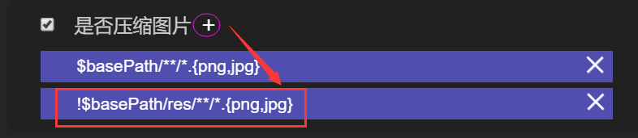
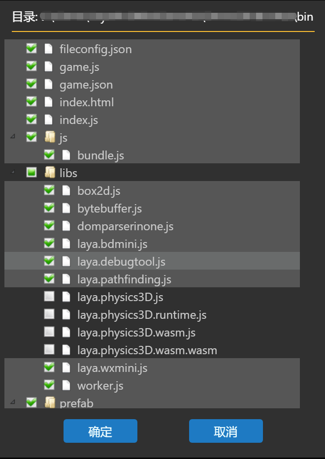
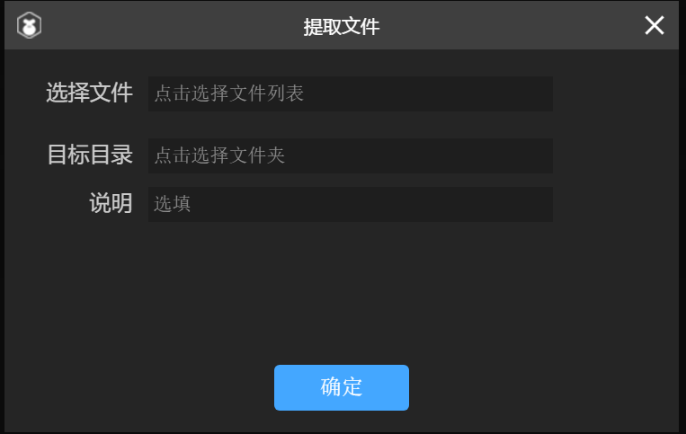
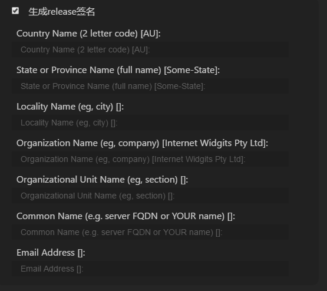
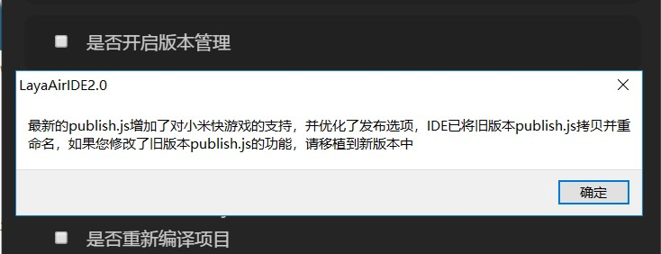

#Project Release

]*Author: Charley - version: layaair - IDE - 2.1.1 Update: 2019 - 06 - 25*

[toc]

Layaair idee a continué d 'optimiser les fonctionnalités de la publication du projet, au moyen de plusieurs versions de taille et de taille.Dans la nouvelle version, non seulement l 'auto - définition du processus de publication a été améliorée, ce qui a permis une plus grande souplesse dans le criblage de publication, mais aussi la publication d' une touche pour devenir un petit projet de jeu a amélioré l 'expérience des utilisateurs.

 


(Figure 1 - 1)

On trouvera ci - après une description détaillée de chaque fonction:

###Options de plateforme de diffusion

Au moment de la rédaction du présent document, il existe actuellement six options dans la plate - forme de publication: le petit jeu de vivo, le petit jeu oppo, le petit jeu rapide de millet, le petit jeu de cent, le petit jeu web et le petit jeu de micromessagerie.Comme le montre la figure 1 - 2.

 


(Figure 1 - 2)

Sélectionnez différents types de plates - formes, qui s' adapteront à différentes plates - formes au moment de la publication.

`Web`La version HTML 5 est publiée dans un environnement de navigateur, webview et layanative.

`微信小游戏`Un projet publié comme un jeu de micro - messagerie adapté peut être exécuté dans un outil de développement de micromessagerie (pour les jeux de micro - messagerie, les documents pertinents peuvent être lus).

`百度小游戏`Est un article publié comme étant adapté à une centaine de petits jeux, qui peut être mis en œuvre dans un outil de développement de 100 degrés (sur les documents relatifs à une centaine de petits jeux pouvant être lus).

`小米快游戏`Un projet publié comme étant adapté à un jeu rapide de millet peut être utilisé dans un outil de développement de millet (sur le jeu rapide de millet qui permet de lire les documents pertinents).

`OPPO小游戏`Les articles publiés comme étant adaptés à un petit jeu oppo peuvent être utilisés dans l 'outil de développement de l' oppo (les documents relatifs à un petit jeu oppo peuvent être lus).

`VIVO小游戏`Est un article affiché comme étant adapté à un petit jeu de vivo qui peut être utilisé dans un outil de développement de vivo (pour les documents relatifs à un petit jeu de vivo pouvant être lus).

###Application of Node - Glob Module in Compression and Edition Management

La confusion entre compression et gestion de version est une fonction plus courante lors de la publication.Mais comment gérer et contrôler avec plus de souplesse les catalogues et les documents qui doivent être comprimés, ceux qui doivent être gérés en version et ceux qui ne sont pas nécessaires?Layaairide a également été optimisée et remaniée à plusieurs reprises et, depuis la publication de la nouvelle édition, le module Node - Glob a été incorporé dans la fonction de publication, ce qui permet une plus grande souplesse dans la mise en correspondance des catalogues et des documents.

La fonction de publication de layaairide intègre par défaut les fonctions courantes d 'exclusion et d' inclusion et permet à l 'développeur de définir des règles d' adaptation de filtre de fichiers.Les fonctionnalités du panneau de distribution sont décrites ci - dessous.

####Compression Function (json, JS, image)

Ces fonctions de compression correspondantes sont activées lorsque les options fonctionnelles suivantes sont sélectionnées: compression de json, compression d 'images, compression de fichiers JS, etc.Des règles d 'adaptation de filtre de fichiers par défaut sont affichées dans la zone de blocs de couleurs et, si vous voulez modifier les règles d' adaptation de fichiers par défaut, cliquez sur la zone de blocs de couleurs.Comme le montre la figure 2 - 1.

 


(Figure 2 - 1)

Lorsque vous cliquez sur la zone dans le bloc de couleurs, vous pouvez accéder à l 'interface d' édition de règles correspondant au bloc, par exemple en cliquant sur la zone de blocs de couleurs d 'une image compressée, ce qui ouvre l' interface d 'édition de règles de l' image comprimée, comme le montre la figure 2 - 2.

 


(Figure 2 - 2)

`文件夹`Le dossier est par défaut un répertoire Bin, qui peut spécifier une plage de compression pour son Sous - répertoire ou son répertoire inférieur, mais ne permet pas de sortir du Répertoire Bin.

`后缀列表`Les valeurs par défaut de la liste de suffixe après l 'entrée varient selon le type de compression, par exemple lorsque la valeur par défaut de json est json et que la valeur par défaut de l' image comprimée est PG, JPG.La valeur par défaut du fichier JS comprimé est JS.

Bien que les modifications ou ajouts soient autorisés dans la liste de suffixe, étant donné que le mécanisme de traitement de chaque appel de classification est différent, l 'développeur ne doit pas ajouter des suffixes sans pertinence, faute de quoi il risque de se tromper.Par exemple, les règles de suffixe de json sont comprimées, et même si d 'autres noms de suffixe sont ajoutés, le fichier doit être au format json.Un suffixe JS, par exemple, est comprimé tout en détectant la grammaire et en faisant la confusion.Ceci est également différent du mécanisme de compression du format json.Compression de l 'image

`排除这些文件`Cette option est une fonction de filtrage auxiliaire basée sur un filtre de liste de suffixe et, lorsque cette option fonctionnelle est cochée, ce n 'est pas de comprimer le fichier correspondant actuellement, mais d' exclure le fichier correspondant actuellement.Ce mécanisme est généralement utilisé pour combiner plusieurs règles d'adaptation.Par exemple, nous avons accepté de comprimer tous les fichiers Ping et JPG sous le catalogue Bin.Mais je voudrais ignorer le catalogue des res de Ben.Alors, nous pouvons cliquer sur le signe plus à droite de l 'image compressée pour créer une nouvelle règle d' exclusion, comme le montre la figure 2 - 3.

 


(Figure 2 - 3)

Avec l 'ajout de cette règle d' exclusion, cliquez pour déterminer que les règles d 'appariement combinées sont indiquées dans les figures 2 à 4.

(figures 2 à 4)

`包含子文件夹`Cette option est également basée sur la fonction de filtrage auxiliaire du filtre de liste de suffixe.Si vous ne cochez pas, vous vous limiterez à l'appariement.`文件夹`Cochez le fichier de répertoire actif dans l 'option et cochez toutes les répertoires de sous - dossiers dans les règles d' appariement.

`筛选器结果`La barre de résultats du filtre affiche non seulement la fonction de filtre actuellement prévue, mais aussi les conditions de filtre plus complexes directement dans la barre, en faisant observer qu 'une fois les conditions de filtre directement éditées, cliquez d' abord sur`确定`Enregistre, sinon, lorsque d 'autres paramètres de filtre sont définis, les paramètres ici sont automatiquement remplacés.

Pour ce qui est des règles d 'adaptation Glob dans le filtre qui sont similaires à des expressions régulières, lors de l' analyse d 'un modèle de trajet, le contenu entre parenthèses séparé par plusieurs virgules peut être déployable, et la partie de l' intérieur peut contenir « / », par exemple a {B / c, BCD} est déployable en A / B / C et abcd, pour résumer brièvement les règles d 'adaptation usuelles:

".
--------------------------------------------------------------------------------------------------------------------------------------
- 124.`*`Le séparateur d 'itinéraire ne correspond pas à un séparateur d' itinéraire, sauf si le séparateur d 'itinéraire apparaît à la fin.
- 124.`**`Zéro ou plusieurs catalogues et leurs sous - catalogues dans le trajet d 'appariement ‧ ont besoin d' être seuls, c 'est - à - dire qu' ils ne peuvent rien d 'autre.Si vous apparaissez à la fin, vous pouvez également correspondre au fichier.- 124.
- 124.`?`Un caractère dans le trajet de fichier (pas de séparateur de trajet) est adapté.
- 124.`[...]`{124} correspond à n 'importe lequel des caractères apparaissant entre crochets et, lorsque le premier de ces caractères est ^ ou} correspond à n' importe lequel des autres caractères apparaissant entre crochets.Notez que vous ne pouvez pas combiner, mais seulement l 'un des caractères.Par exemple, [X Y Z]. JS ne correspond qu 'aux x.js, y.js, z.js, Y.
- 124.`!(pattern｜pattern｜pattern)`N 'importe quel mode donné entre parenthèses.
- 124.`?(pattern｜pattern｜pattern)`{\ 1ch00ffff}`(pattern｜pattern｜pattern)?`- 124.
- 124.`+(pattern｜pattern｜pattern)`{\ 1ch00ffff}`(pattern｜pattern｜pattern)+`- 124.
- 124.`*(pattern｜pattern｜pattern)`{\ 1ch00ffff}`(pattern｜pattern｜pattern)*`- 124.
- 124.`@(pattern｜pattern｜pattern)`{\ 1ch00ffff}`(pattern｜pattern｜pattern)`- 124.

Si l 'développeur veut en savoir plus sur les règles d' élaboration de Glob, il peut rechercher les documents associés à Node - Glob dans des moteurs de recherche tels que le nombre de pages.Pas de détails ici.

`说明`La barre descriptive peut contenir des informations mémorisées sur la règle qui permettent d 'avertir la règle et d' éviter qu 'elle ne soit oubliée à long terme.Par exemple, dans la figure 2 - 3, la règle est rédigée de manière à exclure la compression d'images dans le Répertoire.

####Rappel d 'utilisation

L 'activation de la fonction de compression entraîne une publication plus lente, plus le nombre de documents à comprimer augmente, plus le temps de compression consommé est long, si ce n' est le dernier montage ou le test nécessaire.La phase de mise en page en ligne ne doit pas être cochée, en particulier après la compression JS, ce qui permet de confondre le Code et de rendre le Code moins lisible et d 'influencer la mise en page.

####Mise en service de la gestion des versions

En ce qui concerne la gestion des versions, la gestion a commencé par un nombre aléatoire de liens, mais dans des environnements tels que les micromessageries, le problème de la mémoire cache est grave et les nombres aléatoires ne permettent pas de résoudre efficacement le problème de la mémoire cache ou des phénomènes comme la confusion des pages due à la Mise à jour des versions.En conséquence, layaairide a ajouté à sa publication une solution fondamentale à la question de la mémoire cache, à savoir le changement direct de nom du fichier, le changement de nom du fichier et, naturellement, le problème de la mémoire cache.

#####Mécanisme de gestion de versions

Un nom de fichier avec chaîne de caractères Hash est généré automatiquement lors de la publication lorsque l 'développeur a activé la gestion de version, et un fichier de mappage de nom de fichier de version.json est généré simultanément.Les fichiers contrôlés sont gérés par le code d 'Association automatique resourceversion de la classe de gestion de versions.Lorsque l 'utilisateur ouvre un fichier géré par la version, il met automatiquement à jour la chaîne de caractères Hash dans le nom de fichier lors de la publication, ce qui, dans un environnement de fonctionnement, équivaut à un appel à de nouveaux fichiers et ne pose pas de problème de cache.

Dans le processus de développement, le développeur n 'a pas besoin de se préoccuper du nom du fichier qui sera finalement généré par la gestion des versions.Même dans la mesure où layaairide 2.0, au moment de la création du projet, a automatiquement intégré la gestion de la version resourceversion dans le Code, les concepteurs n'ont pas à se préoccuper de l'utilisation de la catégorie resourceversion et doivent simplement sélectionner, dans l'interface d'affichage du projet, les options de gestion de la version Lorsqu'ils envisagent d'introduire la gestion de la version.

#####Gestion des versions

Les règles de sélection sont les mêmes que celles qui s' appliquent à la compression après que l 'interface de diffusion du projet a sélectionné si la gestion des versions a été activée, et les règles Glob sont utilisées pour contrôler les fichiers qui participent à la gestion des versions et ceux qui ne participent pas à la gestion des versions.Cette page HTML par défaut ne participe pas à la gestion, le développeur ne doit pas l 'enlever car les modifications HTML peuvent facilement poser des problèmes.D 'autres fichiers peuvent être contrôlés par l' utilisateur si celui - ci en a besoin.

Il convient de noter que, dans le cas de petits jeux spécifiques tels que les microjeux, les fichiers de projet et les fichiers de nom de fichier par défaut de ces petits jeux sont automatiquement ignorés et ne sont pas inclus dans la gestion de version, par exemple game.js et game.json.

 


(Figure 3)

Comme le montre la figure 3, le catalogue Bin dans l 'environnement d' exploitation, le catalogue de distribution après l 'activation de la gestion des versions, à droite, nous pouvons voir que les fichiers nécessaires à l' existence des Jeux game.js et game.json sont automatiquement ignorés, tandis que les fichiers JS dans le catalogue JS et les fichiers d 'image PNG dans le catalogue res sont ajoutés à la chaîne de caractères Hash.


###Extraire un sac local

Micro - lettre, baidu, et d 'autres petits jeux de plate - forme plus chaud.Cependant, étant donné que ces plates - formes ont le concept de paquet local et que les limites imposées à l 'emballage, la fonctionnalité et la facilité d' utilisation des paquets locaux sont très importantes, et la version actuelle est la version la plus amicale après plusieurs optimisations, optimisant les inconvénients du passé et répondant pleinement à la Demande de l 'développeur de publier en tant que paquet local pour les petits projets de jeux.Les présentations et les documents associés à des paquets locaux spécifiques peuvent être consultés directement sur les documents correspondants, en mettant l 'accent sur la manière de les extraire.

####Fichier de sélection

Clic`选择文件`La zone d 'entrée à droite émet un arbre de structure de répertoire binaire tel que la figure 4.L 'développeur coche le Code ou la ressource à utiliser dans le paquet local.Clic**Oui.**Le Répertoire et le fichier sélectionnés sont automatiquement enregistrés pour faciliter la sélection et la copie du contenu de paquet local spécifié par l 'outil de publication.

 


(Figure 4)

####Catalogue des objectifs

Lorsqu 'il n' est pas sélectionné par défaut, le Répertoire local de paquets crée un répertoire wxgame u Pack sous le répertoire release pour enregistrer le contenu du paquet local.Bien entendu, l 'développeur peut aussi, à sa discrétion, désigner un répertoire pour stocker le contenu local du paquet de jeu.

Figure 5`目标目录`La zone d 'entrée droite sélectionne le répertoire correspondant.



(Figure 5)

Fichier d 'extraction`选择文件`Et`目标目录`Ces deux fonctions de base, sans regarder les opérations simples, sont très utiles.

The First Edition can 't take local package, The Complete copied extraction is more trouble.Si le fichier d 'élément de jeu est omis lors de la réplication, il est nécessaire de le reproduire manuellement.Tous ces problèmes ont été résolus dans cette version, non seulement le catalogue local de paquets peut être sélectionné de manière personnalisée.Une fois sélectionnée la plate - forme de jeu de petite taille correspondante, le fichier de projet correspondant de la plate - forme est automatiquement extrait du passé, même si la liste de fichiers de paquets locaux n 'est pas cochée.


###Autres fonctions

 


(Figure 6)

####Open Area Project

Les fichiers d 'entrée par défaut pour les petits jeux tels que micromessagerie et Baidu ne sont pas les mêmes que les fichiers d' entrée du domaine principal.`是否为微信/百度开放数据域项目`Par la suite, la question de l 'entrée sera automatiquement réglée sans que l' développeur ait à traiter manuellement après la publication.L 'invention permet d' augmenter considérablement la facilité d 'émission de jeu de l' développeur.

> Tips: pour les plates - formes qui ne supportent pas le domaine ouvert, la sélection des différentes plates - formes est automatiquement masquée.

####Copier uniquement les bibliothèques citées dans l 'index.js

Par défaut est l 'état de sélection, après sélection, les bibliothèques citées dans l' index.js ne sont copiées que (habituellement, nous utilisons la configuration F9 pour contrôler les références des bibliothèques en mode d 'édition).Sinon, tout ce qui n 'est pas utilisé dans le système libs sera copié dans le passé, ce qui augmentera le volume de l' ensemble du paquet, et il est recommandé de ne pas bouger et de ne pas cocher la case à cocher sauf à des fins spéciales.

####Compilation avant publication

Si l 'développeur craint que le Code publié ne soit pas le plus récent parce qu' il a oublié de compiler, cochez la case`是否重新编译项目`, puis cochez la case pour compiler le projet avant d 'exécuter le processus de publication à chaque publication.Il est possible d 'éviter les erreurs de présentation après la publication d' un projet résultant d 'une compilation oubliée.


###V. Optimization of experience in Publishing Process

Étant donné que les images, JS, json, etc. sont généralement comprimées au moment de leur publication finale, il est difficile d 'éviter que plus le projet est important, plus la publication prend du temps, et en particulier la compression JS nécessite une analyse de grammaire et une confusion.

Dans le passé, il y avait beaucoup de concepteurs qui ne comprenaient pas très bien les délais de publication des réactions, qui dépendaient du contenu de la compression cochée et de la taille du projet, de sorte qu 'il ne pouvait être conseillé au promoteur que d' éviter la confusion et la compression au cours de la phase de Mise en page lorsqu 'elle n' était pas publiée définitivement.

Lors de l 'optimisation de la version 3.0, et compte tenu des besoins de l' développeur, l 'affichage de l' impression en temps réel du processus de compilation est augmenté en plus de permettre à celui - ci de choisir librement les fichiers Compressibles.L 'invention permet aux développeurs d' avoir une idée approximative de l 'état d' avancement de la compilation et de la publication du produit en cours et de réduire l 'urgence en cas d' incertitude.

"> le moteur layaair est officiellement axé sur l 'expérience des développeurs et continue d' optimiser.

 


(Figure 7)

###Configuration spéciale du millet, de l 'oppo et du vivo

Étant donné qu 'il n' y a pas d 'outils de mise au point visuels dans les jeux rapides millet, les Jeux poppo et les jeux vidéo vivo, seuls les paramètres de corrélation sont configurés dans layaairide, comme le montrent les figures 8 - 1 et 8.La publication réussie est alors directement à l 'intérieur de layaairide (pour créer un paquet RPK).En ce qui concerne le mode de mise en page, un environnement de débogage APK est installé dans le téléphone cellulaire du millet, le fichier RPK est sélectionné dans l 'APK, et les réglages sont effectués par l' intermédiaire d 'une ligne de données reliant le téléphone mobile au PC.

   


(fig. 8 - 1) l 'interface de distribution des jeux rapides de millet et des jeux vidéo vidéo vidéo est située à gauche et l' interface de distribution des jeux de petit jeu oppo à droite.


Voici les paramètres fonctionnels à remplir.

####Nom du jeu

Remplissez généralement le chinois et l 'anglais.Pour l 'application des magasins, des icônes de bureau, des fenêtres, et d' autres entrées de jeu.Un bon nom est l 'élément important que le jeu peut absorber.Il convient de noter ici que le millet et le vivo doivent être en deçà de 6 caractères chinois et que l'oppo doit être en deçà de 10 caractères chinois.Notre proposition est de ne pas dépasser six caractères chinois.

####Sac de jeu

Nom de jeu`com.company.module`Le premier com ne change pas, le deuxième est le nom de la société et le troisième est le nom du projet.Tous en anglais, par exemple:`com.layabox.demoGame`".

####Icône de jeu

L 'icône de jeu est également un important identificateur d' entrée de jeu, comme le nom du jeu, est un élément d 'absorption très important, si l' icône de jeu est bien conçue et que le nom du jeu commence bien.La même position permet d 'obtenir plus de clics que les autres jeux.Icône de jeu`192 * 192`Carré.

####Nom de la version

Le nom de la version de jeu est une version authentique, généralement utilisée pour différencier les versions fonctionnelles.J 'ai une grande version.1,0 peut être converti en 2,0, et 1,0 peut être converti en 1,1 si seulement le bug est modifié.Par analogie, nous proposons d'utiliser le nombre de points flottants.Par exemple "0,1", "1,3", "5,0"...

####Version du jeu

La version de jeu est différente de l 'utilisation du nom de la version.Chaque fois qu'un procès est en cours, il y a au moins une procédure de récusation + 1, ce qui n'a pas d'importance.Cependant, la valeur de l 'instance doit être au moins + 1 par rapport à la valeur de l' examen précédent, et + + n peut en aucun cas être égale ou inférieure à la valeur de la version précédente.Notez que la version du jeu doit être positive et entière.

####Minimal Platform

Le nombre minimum de plates - formes, le millet et l 'oppo ne sont actuellement disponibles qu' à 1050 (en fonction de la version de l 'app d' essai réel), les modifications futures ou d 'autres mises à jour.

Le numéro de version est 1034.Nous recommandons une version 1041 ou plus haut, si le numéro de version affiché sur le modem est inférieur à 1041, alors vous devez d 'abord mettre à jour le package d' installation du petit moteur de jeu sur le site Web de vivo.Ouvrir un site Web[[https://minigame.vivo.com.cn/documents/](https://minigame.vivo.com.cn/documents/#/download/engine)#[/download/engine](https://minigame.vivo.com.cn/documents/#/download/engine)] [sélectionner la nouvelle version en cliquant sur le téléchargement et l 'installer pour mettre à jour la version du moteur de la plate - forme de jeu.Lorsque l 'installation est terminée, le numéro de plate - forme minimum dans l' IDE est rempli en fonction du numéro de version de plate - forme affiché sur le modulateur.

####Direction de l 'écran

This is like the vertical Screen set of Microcredit Games, we have to attention to the Reality of the Game and the configuration of the engine.

####Démarrer la mise en service du téléphone portable une fois que le paquet est terminé

Cette option est utilisée pour démarrer la mise à l 'essai de la configuration en machine.

L 'émission de millet n' est pas nécessaire, layaairide crée un Code bidimensionnel une fois que le jeu rapide de millet a été lancé et que le développeur balaie le Code bidimensionnel généré par l 'IDE sur son téléphone portable pour démarrer la mise en service de l' ordinateur.

Lorsque l 'oppo a besoin d' un réglage en ligne, il faut cocher la sélection lors de la publication et garantir que l 'ADB est installé dans l' environnement PC[ ADB官网下载:  [http://adbshell.com/downloads](http://adbshell.com/downloads)], et de veiller à ce que les téléphones portables soient connectés à la PC et à ce que les droits USB soient ouverts.

####Utilisation des signatures officielles

Si ce n 'est qu' un test de mise en page, vous n 'avez pas à cocher ici.Il faut cocher la case avant de publier officiellement en ligne (la version à la plateforme).

Si vous cochez cette case, la signature officielle sera activée.En ce qui concerne la signature Release:

Pour les sociétés, il n 'y a généralement qu' une seule signature, et si la société a déjà signé, il est recommandé d 'utiliser la signature de l' entreprise.Si tel n 'est pas le cas, la publication dans l' IDE intègre cette fonction pour faciliter la création de signature par l 'développeur.

Pour les promoteurs individuels, une signature officielle peut être utilisée pour plusieurs projets.Il suffit de créer une seule fois.

Si elle a été sign ée, le document de signature sera placé sous le dossier du projet Laya sign / release, comme le montre la figure 8 - 2.

 


(Figure 8 - 2)

####Création de signature Release

Cette fonction permet de générer une signature en version officielle sans cocher la fonction précédente ou avoir une signature release, sans configurer ici.Après Cochez cette option, les paramètres de configuration sont les suivants`OpenSSL`Environnement

 


(figures 8 à 3)

Le contenu de la signature est proposé en anglais et traduit et illustré comme suit:


```

//国家简称，例如中国CN
Country Name (2 letter code) [AU]:
CN 

//省或直辖市名字，例如北京市BeiJing
State or Province Name (full name) [Some-State]:
BeiJing 

//区或市县的名称，例如海淀区HaiDian
Locality Name (eg, city) []:
HaiDian 

//公司或组织名,例如Layabox
Organization Name (eg, company) [Internet Widgits Pty Ltd]:
Layabox 

//单位或者是部门名称，例如游戏部门Game
Organizational Unit Name (eg, section) []:
Game 

//Email地址,例如：游戏对接合作 bd@layabox.com
Email Address []:
bd@layabox.com 
```


###Rappel spécial

####Si l 'on modifie l' ancienne version de publish.js

Au début de la version layaair 2.0.2beta, des modifications ont été apportées à publish.js (augmentation de l 'appui au jeu rapide du millet) et, si l' ancien éditeur publish.js a été modifié, il est demandé à l 'éditeur de déplacer le contenu modifié dans la nouvelle version lui - même.Comme le montre la figure 9.La version 2.1.0beta de l'oppo contient des indications similaires.

 


(Figure 9)

####Les nouveaux projets seront publiés pour la première fois plus longtemps.

Cliquez sur le bouton pour compiler et publier.Comme le montre la figure 10.

 


(Figure 10)

Étant donné que l'environnement de publication RPK (utilisé pour générer des paquets RPK) est vérifié avant la publication et que, si l'environnement de publication n'est pas disponible, le téléchargement commencera, il faudra environ 10 minutes pour que le nouveau projet soit publié pour la première fois, à des moments variables selon la rapidité du réseau.Toutefois, à la vitesse normale du réseau, il ne dépassera certainement pas 30 minutes et, si cela dure plus de 30 minutes, il faudra fermer l 'interface de publication et la rediffuser directement et, si la rediffusion n' est pas encore concluante, contacter le responsable de groupe QQ.

> Voici un plan d 'optimisation pour les versions futures.La publication en cours, c 'est chaque nouveau projet qui vérifie l' environnement de publication et tous ceux qui ne l 'ont pas encore fait doivent être téléchargés à nouveau.Plusieurs projets sont examinés et mis à jour pour chaque nouveau projet, ce qui retarde la publication initiale de chaque nouveau projet.Il n 'y a pas de problème avec les jeux Popo, le mécanisme popo est la première fois lent, pas après.
]
> dans les versions futures, les jeux rapides de millet ne seront téléchargés que lorsque le projet sera publié pour la première fois ou lorsque l 'environnement sera mis à jour.Dans le cas contraire, le nouveau projet utiliserait la reproduction environnementale déjà téléchargée.Cela réduit le temps de publication de l 'environnement de téléchargement.

####S'il n'y a pas de code 2D, pourquoi?

Avant la publication, les autres interfaces de distribution doivent être fermées, faute de quoi il ne peut y avoir de Code bidimensionnel (en raison de l 'occupation du port).

Comme le montre la figure 11.Sinon, vérifiez s' il n 'y a pas d' autres interfaces non pertinentes et rediffusez - les une fois fermées.

 


(Figure 11)

Attention: les jeux oppo n 'ont pas de Code bidimensionnel.Il n 'y a que les jeux rapides de millet et les jeux vidéo.


###Publication des ordres

Pour certains développeurs qui ont besoin d 'un outil de conditionnement automatique, la publication du projet est également disponible.`layaair2-cmd`Mode de commandeDeveloppeur`layaair2-cmd`Le projet layaair - 2.0 est comprimé sans ouvrir l 'IDE, la gestion de la version, l' adaptation des moteurs, et d 'autres opérations de compilation et de publication.Il est possible d 'éviter de lourdes procédures de transfert lors de la publication entre plusieurs articles.

####Layaair2 - cmd installation mode


```

npm install layaair2-cmd -g
```


> s' il y a des développeurs qui ne peuvent pas être installés par NPM, demandez à la paroi de face et passez par la ligne de commande pour publier le document, Publiez - le avec l 'interface layaairide.

####Quels sont les ordres appuyés par layaair2 - cmd

On entre.`layaair2-cmd -h`On peut voir des infos sur layaair2 - cmd à son retour.

Le contenu de la sortie est le suivant:


```

Usage: layaair2-cmd [command] [args]

Options:
  -v, --version  output the version number
  -h, --help     output usage information

Commands:
  compile        compile project.
  publish        publish project.
  help [cmd]     display help for [cmd]
```


####Aide - mémoire layaair2 - cmd:

L 'aide donne d' abord un exemple d 'utilisation d' une commande:


```

Usage: layaair2-cmd [command] [args]
```


Note: après layaair2 - CMD, l 'ordre correspondant est d' abord spécifique, puis les paramètres de l 'ordre.


```

Options:
  -v, --version  output the version number
  -h, --help     output usage information
```


Lorsque vous ne saisissez pas la commande`-h`Imprime la note d 'aide layaair2 - cmd qui vient d' être vue.`-v`Imprime le numéro de version layaair2 - cmd.Bien sûr, si vous saisissez une commande spécifique, alors H - et V - sont les notes d 'aide et les numéros de version de la commande correspondante.


```

Commands:
  compile        compile project.
  publish        publish project.
  help [cmd]     display help for [cmd]
```


Note: quels sont les ordres appuyés par layaair2 - cmd?

`compile`Est une commande de compilation de projet qui génère un fichier javascript compilé correspondant à la compilation F8 dans l 'IDE.Ce qu'il faut savoir, c'est que si le panneau d'affichage est coché,`是否重新编译项目`Le développeur n 'appelle plus cette commande dans son propre processus de publication de lignes de commande, sinon il risque d' être compilé deux fois et de perdre du temps de publication.

`publish`C 'est l' affichage d 'un projet, ce qui signifie que vous cliquez sur le bouton d' affichage dans le panneau d 'affichage.Celui - ci est plus important, il sera présenté séparément.

`help`C 'est la note d' aide de layaair2 - CMD, et`layaair2-cmd -h`Affiche le même résultat.

####Utilisation et prise en compte des ordonnances de publication des projets

On devrait passer en premier.`layaair2-cmd publish -h`Vérifiez l 'aide pour publier les ordres.

Après le retour, saisissez ce qui suit:


```

    Usage: layaair2-cmd publish [options]

    Options:
    -v, --version              output the version number
    -c, --config <configPlatform>  Set the publishing platform name[web|wxgame|qqw
    anyiwan|bdgame]
    -h, --help                     output usage information
```


On peut voir par l'aide que le paramètre le plus important est:`-c`, actuellement supporte les paramètres Web, wxgame, qqwanyiwan et bdgame.

`web`Est la version Web de la publication HTML5.

`wxgame`Est une plate - forme de jeu de micro - messages.

`qqwanyiwan`Est une plate - forme de jeu léger qq (également appelée QQ pour jouer).

`bdgame`C 'est une plate - forme de jeux vidéo.

#####Utilisez les exemples suivants:


```

layaair2-cmd publish -c wxgame
```


####Publication attention

La compilation des projets layaair2 - cmd (compile) et la publication des ordres de projet (publish) doivent être utilisées dans le catalogue des projets.
Avant d'appeler les ordres de publication des projets, vérifiez s'il existe un json correspondant à la plate - forme de diffusion, par exemple la version Web, le dossier de projet`.laya`Il doit y avoir du web.json.Pour lancer un petit jeu de micro - messages, il faut avoir wxgame.json.Dans le même ordre d 'idées, le jeu qq doit avoir qqwanyiwan.json, et le petit jeu doit avoir le bdgame.json.
Si tel n 'est pas le cas, la plateforme correspondante est sélectionnée une fois à l' aide de l 'outil 3.0 de diffusion layaairide (rappel spécial, il faut utiliser l' outil 3.0), qui produit automatiquement le json correspondant.Json enregistre les règles de sélection publiées dans l 'outil de publication et les informations de configuration publiées.


Le présent article est ainsi terminé.

S'il y a des questions, adressez - vous à la communauté:[https://ask.layabox.com](https://ask.layabox.com/)


##Appreciation

Si vous trouvez cet article utile pour vous, bienvenue à l 'auteur du Code de balayage, votre motivation est de nous pousser à écrire plus de documents de qualité.

