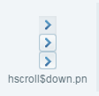
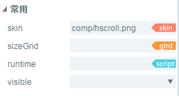

#Référence de composant hscrollbar


##Création d 'un ensemble hscrollbar par layaairide

###1.1 Création de hsrollbar

L 'ensemble hscrollbar est un ensemble barre de défilement horizontale.
L 'utilisateur final peut utiliser l' ensemble hscrollbar pour commander la partie de données affichée lorsque les données sont trop nombreuses pour que la zone d 'affichage ne soit pas acceptable.
La barre de défilement comprend quatre éléments: un diagramme d 'orbite, un bouton de glissière et deux boutons de flèche.
Cliquez sur l 'ensemble hscrollbar dans le panneau de ressource de sélection et faites glisser - le dans la zone d' édition de page pour ajouter l 'ensemble hscrollbar à la page.
Interface de script pour composants hscrollbar[HScrollBar API](http://layaair.ldc.layabox.com/api/index.html?category=Core&class=laya.ui.HScrollBar)".
Exemples de ressources d 'images d' ensembles hscrollbar:

​< br / >
(Figure 1)

​< br / >
(Figure 2)

​< br / >
(Figure 3)

​< br / >
(Figure 4)

Après avoir glissé le hscrollbar dans la zone d 'édition, affiche l' effet:

​< br / >
(Figure 5)

Définit la valeur max de l 'attribut hscrollbar, la valeur min de l' attribut, la valeur valeur valeur valeur valeur valeur valeur valeur valeur valeur valeur valeur de l 'attribut

​< br / >
(Figure 6)

Pendant l 'exécution du programme, vous pouvez glisser le curseur ou cliquer sur le bouton de la flèche pour commander la valeur de la barre de progression:

​< br / >
(Figure 7)

Définit l 'effet d' affichage des propriétés de hscrollbar lorsque la valeur de showbuttons est égale à false:

​< br / >
(Figure 8)

Effets de l'exécution dans le programme:

​< br / >
(Figure 9)


 


###1.2 caractéristiques usuelles des composants hscrollbar

​< br / >
(Figure 10)

- 124.**Attribut**- 124.**Description fonctionnelle**- 124.
$124 - - - 124, $124, $124
L 'adresse de ressource d' image de la barre de roulement.- 124.
Les données de la grille (données de la grille de la neuvième maison) sont mises à l 'échelle de manière efficace.Runtime \ \ 124
12.24.
124, visible \ \ 124.


 


##Création d 'un ensemble hscrollbar par Code

Quand on écrit un code d 'écriture, on ne peut pas forcément contrôler l' ui par le Code, créer`UI_ScrollBar`Importer dans un code`laya.ui.HScrollBar`Et définit les propriétés associées à hscrollbar par l 'intermédiaire du Code.

**Exécution de l 'exemple:**
​<br/>

(Figure 11) Création de hscrollbar par Code

D 'autres attributs de hscrollbar peuvent également être définis par un code, l' exemple suivant illustre comment le hscrollbar peut être créé par le Code, et les lecteurs intéressés peuvent définir eux - mêmes le hscrollbar par le Code pour créer un hscrollbar correspondant à leurs besoins.

**Exemple:**


```javascript

package
{
	import laya.display.Stage;
	import laya.display.Text;
	import laya.ui.HScrollBar;
	import laya.ui.ScrollBar;
	import laya.ui.VScrollBar;
	import laya.utils.Handler;
	import laya.webgl.WebGL;

	public class UI_ScrollBar
	{
		/***水平滚动条资源**/
		private var skins:Array=["../../../../res/ui/hscroll.png", 
							 	 "../../../../res/ui/hscroll$bar.png", 
								 "../../../../res/ui/hscroll$down.png",
								 "../../../../res/ui/hscroll$up.png"];

		/***提示信息文本框**/
		private var promptText:Text;		
		/****水平滚动条****/
		private var hScrollBar:HScrollBar;		
		
		public function UI_ScrollBar()
		{
			// 不支持WebGL时自动切换至Canvas
			Laya.init(800, 600, WebGL);
			//画布垂直居中对齐
			Laya.stage.alignV = Stage.ALIGN_MIDDLE;
			//画布水平居中对齐
			Laya.stage.alignH = Stage.ALIGN_CENTER;
			//等比缩放
			Laya.stage.scaleMode = Stage.SCALE_SHOWALL;
			//背景颜色
			Laya.stage.bgColor = "#232628";
			
			//加载资源
			Laya.loader.load(skins, Handler.create(this, onSkinLoadComplete));
		}

		/***加载资源完成***/
		private function onSkinLoadComplete(e:*=null):void
		{
			//创建水平滚动条
			createHScroller();
		}
		
		/***创建水平滚动条***/
		private function createHScroller():void 
		{
			//实例化垂直滚动条
			hScrollBar= new HScrollBar();
			//加载皮肤资源（其他资源根据规范命名后，会自动加载）
			hScrollBar.skin = "../../../../res/ui/hscroll.png";
			//设置宽度
			hScrollBar.width = 400;
			//设置位置
			hScrollBar.pos(150, 170);
			//最低滚动位置数字
			hScrollBar.min = 0;
			//最高滚动位置数字
			hScrollBar.max = 100;
			//滚动变化事件回调
			hScrollBar.changeHandler = new Handler(this, onChange);
			//加载到舞台
			Laya.stage.addChild(hScrollBar);
			
			//创建提示信息
			createPromptText(hScrollBar)
		}		
		
		/***创建提示信息***/
		private function createPromptText(scrollBar:ScrollBar):void
		{
			//实例化提示信息
			promptText=new Text();
			//提示框字体
			promptText.font="黑体";
			//提示框字体大小
			promptText.fontSize=26;
			//提示框字体颜色
			promptText.color="#FFFFFF";
			//提示框初始文本
			promptText.text="您的选择是： ";
			//加载到舞台
			Laya.stage.addChild(promptText);
			//设置提示框位置
			promptText.pos(scrollBar.x,scrollBar.y-50);
		}
		
		/***滚动条位置变化回调***/
		private function onChange(value:Number):void 
		{
			promptText.text= "滚动条的位置： value=" + value;
		}
	}
}
```


