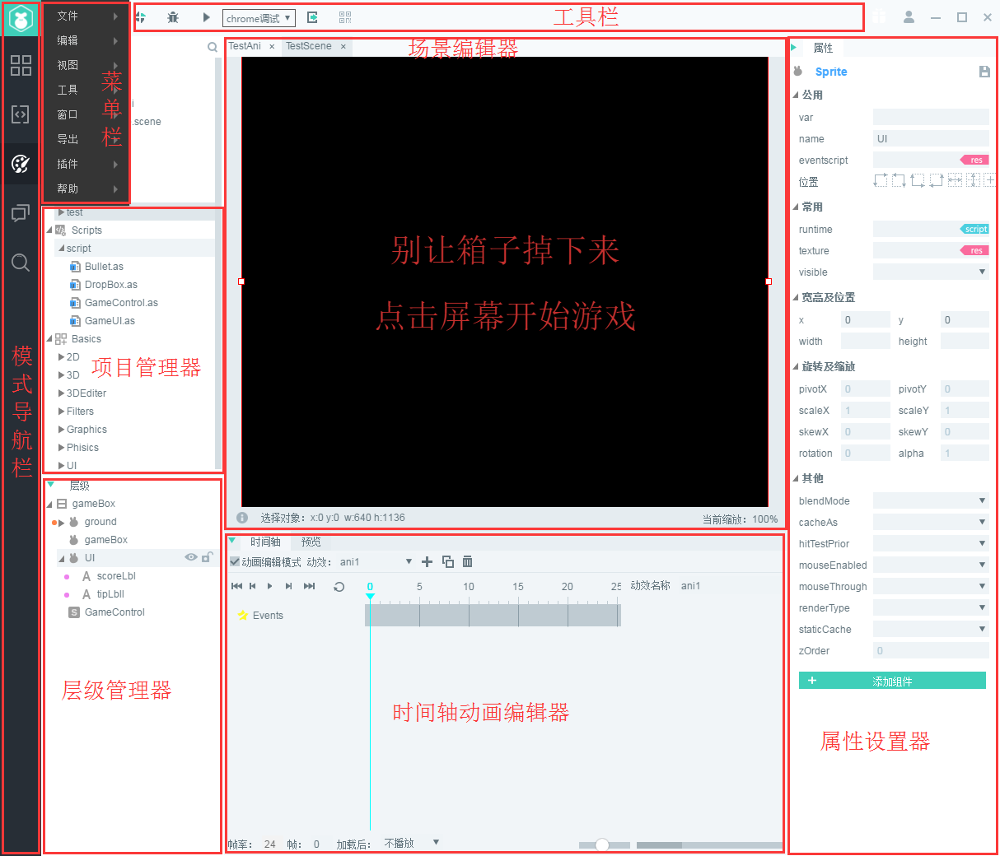

#Design Pattern interface

Layaairide est divisé en modèles de conception, de codage et d 'autres modules.La présente section décrit la configuration courante et la zone fonctionnelle du modèle de conception et permet de parcourir rapidement les noms et les fonctions des différents panneaux.

​< br / >
(Figure 1)

###Barre de navigation de mode:

La fonction bouton de conversion de mode permet un transfert facile entre le mode interface et le mode d 'édition de code

​ 

(Figure 2)

###Barre de menu:

La barre de menu contient un ensemble d 'opérations de programme, des opérations d' interface, des commandes de fonctionnement de contrôle et des ensembles d 'outils.

​	< br / >
(Figure 3)

 

###Barre d 'outils:

Pour plus de détails, lisez la section introductive de la barre d 'outils.
​< br / >
(Figure 4)

###Gestionnaire de projet:

Le gestionnaire de projet affiche toutes les pages (page) établies dans le projet, où vous pouvez afficher la structure arborescente en double cliquant sur la page à éditer dans le gestionnaire de projet.

​< br / >
(Figure 5)

 

###V. Gestion des ressources:

Toutes les ressources du dossier de ressources de projet (Assets) sont affichées dans le gestionnaire de ressources.Le contenu des ressources du dossier est affiché dans une structure arborescente.Vous pouvez ajouter des ressources en ouvrant le dossier avec le bouton droit.Pour plus de détails, veuillez lire la Section du gestionnaire de ressources.

​ 

(Figure 6)

 

###Éditeur de scène:

L 'éditeur de scène est la zone de travail utilisée pour afficher et éditer le contenu visuel de l' ui ou de l 'animation.Les travaux d 'aménagement de scénographie que l' on voit sont réalisés à partir de l 'affichage de l' éditeur de scénographie.Pour plus de détails, lisez la Section de l 'éditeur de scène.

​< br / >
(Figure 7)

  

###Attributs:

Le paramètre d 'attribut est la zone de travail dans laquelle nous voyons et éditons les attributs du noeud et du composant sélectionnés, et le panneau affiche et édite les données d' attribut du contrôle sélectionné sous la forme la plus appropriée.Veuillez lire la Section des paramètres d 'attributs.

​	< br / >
(Figure 8)

###Cadres hiérarchiques:

Le gestionnaire de niveau affiche tous les noeuds de la scène et leurs relations hiérarchiques sous la forme d 'une liste d' arbres, tous les éléments que l 'éditeur de scène voit peuvent trouver des entrées de noeuds correspondantes dans le gestionnaire de niveau, le contenu de ces deux panneaux apparaît de manière synchrone lors de l' édition de la scène et, d 'une manière générale, nous utilisons les deux panneaux simultanément pour construire la scène.Pour plus de détails, lisez la Section du gestionnaire de niveau.

​< br / >
(Figure 9)

###Éditeur d 'animation d' axe temporel:

L 'éditeur d' animation d 'arbre de temps est utilisé pour créer une animation d' arbre de temps sur la page.Le panneau d 'attributs de trame affiche les détails de trame sur l' axe temporel de réglage.Lire la Section de l 'éditeur d' animation de l 'axe temporel

​	< br / >
(Figure 10)

###Éditeur de particules:

L 'éditeur de particules est utilisé pour créer une animation de particules sur la page.Le panneau d 'attributs de particules est utilisé pour afficher les détails d' attributs des particules définies.Lisez la Section de l 'éditeur de particules.

​< br / >
(Figure 11)