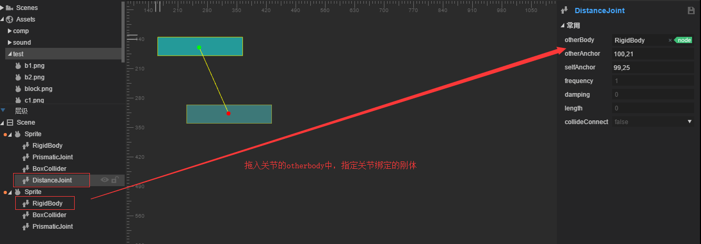
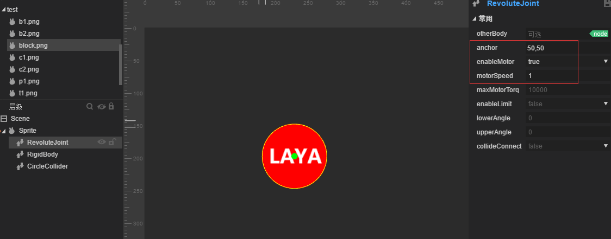
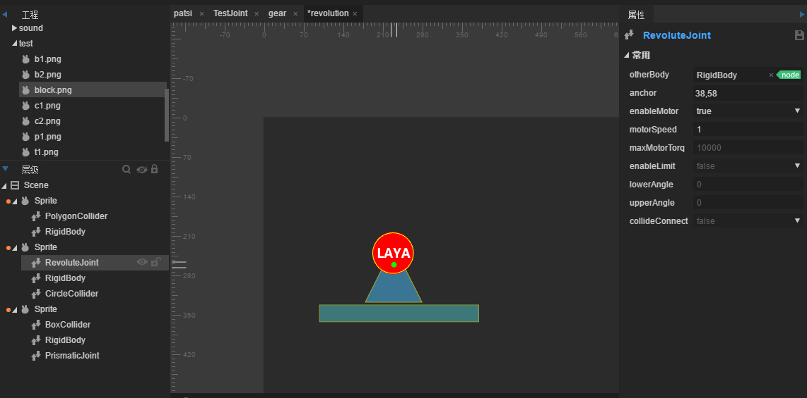
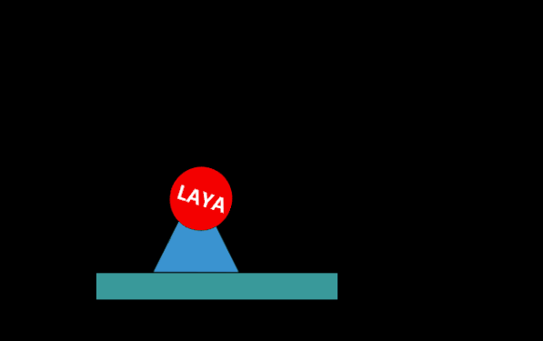
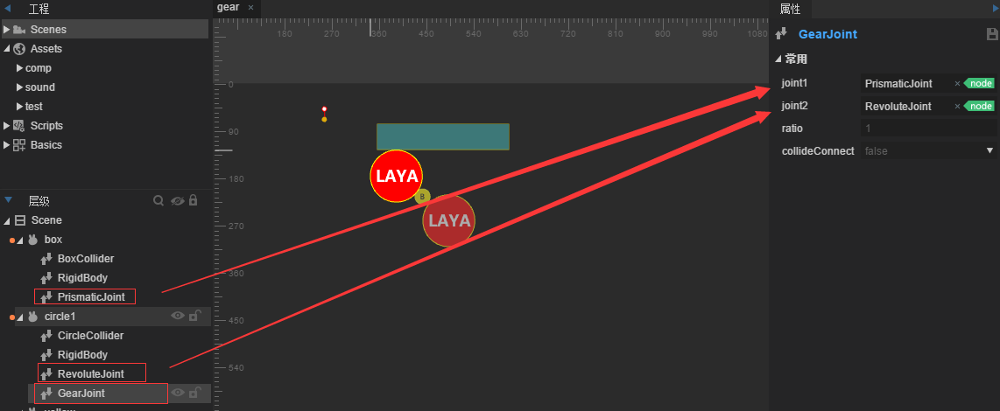

#Translation, rotation, articulation avec les engrenages

##Résumé

Dans le développement du jeu, la conception de l 'articulation nécessite une courroie de transmission, un engrenage, une plate - forme mobile, etc., et l' utilisation de la combinaison d 'articulations ci - après permet de produire rapidement un système capable de produire une relation de contrainte.

Le contenu de cet article nécessite trois articulations:

Joint transversal`PrismaticJoint`Articulation rotative`RevoluteJiont`Articulation d 'engrenage`GearJoint`".

L 'utilisation d' une combinaison d 'articulations permet de réaliser des dispositifs de mécanisme tels qu' une plate - forme transversale transversale entraînant la rotation des engrenages et soulevant les petites plaques.

​

###Présentation des articulations transversales

Joint transversal`PrismaticJoint`L 'articulation mobile permet aux deux objets de se déplacer relativement le long de l' axe spécifié, ce qui empêche la rotation relative.

#####Attributs

#####Other body

Le corps rigide de raccordement de l 'articulation [conçu pour la première fois] ne peut pas être configuré, par défaut, comme un corps rigide creux dans le coin supérieur gauche, et peut être réglé en faisant glisser l' objet rigide dans l 'objet rigide.

#####Anchor.

Le point de commande de l 'articulation est décalé par rapport à la position du coin supérieur gauche de son corps.

#####Axis

Une valeur vectorielle décrivant la direction du Mouvement, par exemple 1,0 le long de l 'axe X.

#####Enablemotor

Le moteur est - il activé pour déplacer le corps de la cible?

#####Motorspeed

Lorsque le moteur est activé, la vitesse maximale que l 'on peut atteindre est déplacée sur l' axe de coordonnées axis.

#####Maxmotorforce

Lorsque le moteur est activé, la force maximale pouvant être appliquée.

#####Enable Limit

La plage de mouvement du corps est - elle limitée?

#####Lowertranslation

Lorsque la contrainte est activée, la limite inférieure de la plage de déplacement du corps est la valeur de décalage (négative) de l 'Anchor.

#####Upper Translation

Une fois la contrainte activée, la limite supérieure de la plage de déplacement du corps est la quantité de décalage (positive) à distance d 'Anchor.

#####Collideconnected

Les deux corps rigides peuvent - ils se heurter, par défaut false?

####Exemple

Une articulation transversale de base, utilisée seule, est simple, glisse dans un carré et ajoute`boxcollider`Un corps de collision. Ajoutez - lui une articulation transversale.`PrismaticJoint`Rigide`rigidbody`Gravité`gravityScale`Réglage 0, Axis réglage 1 et démarrage du moteur à une vitesse de 1, limitant le déplacement minimal maximal, comme le montre la figure

Les effets d 'exploitation sont les suivants (la figure ci - dessous montre l' effet de l 'aide physique, présenté dans le document précédent, cochez la case F9).

​      

Pour rendre le jeu plus amusant, nous devrons utiliser la plateforme associée à la plateforme pour déplacer, glisser dans un carré, tirer en rectangle et ajouter un corps de collision, rigide`rigidbody`Gravité`gravityScale`Réglage de 0 et glisser le corps rigide dans l 'articulation transversale du premier carré`PrismaticJoint`A`otherbody`Haut, démarrez le moteur et fixez une vitesse de 1, une direction de 1,0 et une limite de déplacement de taille, comme le montre la figure.

Il y a un problème avec l 'effet de fonctionnement, car le second carré a également besoin d' un joint de translation pour ajouter un joint de translation au second carré, comme suit.

Ici, plusieurs développeurs remarquent que ce Translation ne peut se faire que dans le sens opposé ou dans le dos, c 'est - à - dire qu' elle ne peut être rapprochée ou éloignée que d 'un seul axe et ne peut pas se déplacer simultanément dans une seule direction.Les articulations transversales ne sont que des mouvements relatifs, l 'auteur consulte les documents nationaux et étrangers, et les manuels officiels ne détaillent pas les détails de l' articulation, l 'auteur a mis au point une méthode expérimentale combinatoire de fonctionnalités, nous devons donc utiliser le système physique pour concevoir et réfléchir en fonction de la pensée physique.

Reprenons l'exemple précédent, en déplaçant l'articulation transversale du bloc supérieur.`PrismaticJoint`Intérieur`otherBody`Supprimer

Et lui ajouter un joint de distance.`DistanceJoint`Et ajoute un joint transversal au carré suivant`PrismaticJoint`Ensuite, il est rigide.`RigidBody`Articulation de distance entraînée dans l 'objet supérieur`otherBody`Graphique

Une fois installés, les effets de fonctionnement sont les suivants (le bloc de traction du bloc supérieur est transversalement transversal à droite et l 'objet carré inférieur est transversalement transversal à droite par l' articulation de distance):

###Présentation de l'articulation rotative

Articulation rotative`RevoluteJiont`: obliger deux objets à partager un point d 'ancrage et deux objets à tourner par rapport à eux.

#####Attributs

#####Other body

Le corps rigide de raccordement de l 'articulation [conçu pour la première fois] ne peut pas être configuré, par défaut, comme un corps rigide creux dans le coin supérieur gauche, et peut être réglé en faisant glisser l' objet rigide dans l 'objet rigide.

#####Anchor.

Le point de commande de l 'articulation est décalé par rapport à la position du coin supérieur gauche de son corps.

#####Enablemotor

Le moteur est - il activé pour déplacer le corps de la cible?

#####Motorspeed

Lorsque le moteur est activé, la vitesse de rotation maximale peut être atteinte.

#####Maxmotortorque

Lorsque le moteur est activé, la distance de torsion maximale peut être appliquée, si le couple maximum est trop petit, ce qui entraîne une non - rotation.

#####Enable Limit

La portée de rotation du corps rigide est - elle limitée?

#####Lowerangle

Lorsque la contrainte est activée, la limite inférieure de la plage de déplacement du corps est la valeur de décalage (négative) de l 'Anchor.

#####Upperangle

Une fois la contrainte activée, la limite supérieure de la plage de déplacement du corps est la quantité de décalage (positive) à distance d 'Anchor.

#####Collideconnected

Les deux corps rigides peuvent - ils se heurter, par défaut false?

####Exemple

Crée une nouvelle scène et glisse - la dans une image circulaire pour lui ajouter un objet de collision circulaire`CircleCollider`, l 'IDE ajoute automatiquement un corps rigide`RigidBody`Et ajoute un joint rotatif.`RevoluteJoint`, le point d 'ancrage de l' articulation est situé au centre et le moteur est actionné et la vitesse de rotation est fixée à 1.Figure:

Cliquez pour voir le cercle rotatif:

Utiliser seul est très simple, nous allons ensuite utiliser une combinaison: ajouter un objet avec un bloc de collision sur cette base`BoxCollider`Rectangle long comme plateforme

Et transverse l 'articulation.`PrismaticJoint`Et un objet de collision avec un polygone ajouté.`PolygonCollider`Le triangle sert de base pour faire tourner le cercle autour du triangle (attention à ce que le noeud triangulaire soit placé au - dessus du niveau du noeud circulaire et affiché au - dessus du niveau du noeud circulaire au - dessous de celui - ci), l 'effet final étant le diagramme ci - dessous, le processus d' ajout est demandé à l 'développeur de le faire lui - même.

Cliquez sur l 'opération pour obtenir les résultats suivants:

###Présentation des articulations des engrenages

Articulation d 'engrenage`GearJoint`: pour simuler la relation de contrainte entre les deux engrenages, lorsque les engrenages tournent, le débit produit est de deux manières de sortie: la vitesse angulaire de l 'engrenage lui - même et la vitesse linéaire de la surface de l' engrenage.

#####Attributs

#####Joint1

[le premier paramètre valide] la première articulation à lier peut être de type revolutejoint ou prismaticjoint.

#####Joint2

[le premier paramétrage valide] le deuxième articulation à lier peut être de type revolutejoint ou prismaticjoint.

#####Ratio

Vitesse angulaire des deux engrenages, par défaut 1.

#####Collideconnect

Les deux corps rigides peuvent - ils se heurter, par défaut false?

####Exemple

Une fois que l 'articulation transversale et l' articulation rotative sont prises en charge, les deux articulations peuvent être associées au moyen de l 'articulation d' engrenage, de sorte que l 'articulation peut être contrôlée successivement et que l' ensemble du système puisse être réalisé.Nous allons maintenant créer une petite combinaison un peu plus complexe.

Créer une nouvelle scène vide, dénommée Gear, dans laquelle vous faites glisser les carrés, les cercles et affichez l 'effet graphique suivant:

De haut en bas est nommé: box, circle1, Yellow, circle2, Sprite.Le nom est donné pour nous aider à localiser des objets spécifiques.Chaque objet ajoute ensuite un corps de collision correspondant et l 'IDE ajoute automatiquement un corps rigide à celui - ci (cette étape nécessite la connaissance décrite ci - dessus et, si vous ne savez pas comment l' ajouter, retournez à l 'apprentissage du contenu antérieur).

Ajouter une articulation transversale au carré au - dessus de la position`PrismaticJoint`Et définissez les attributs correspondants pour les aligner sur le diagramme suivant

Ensuite, on ajoute une articulation correspondante à l 'objet circle1 et une articulation rotative à l' objet circle1.`RevoluteJoint`Articulation d 'engrenage`GearJoint`Et faites glisser l 'articulation de translation et l' articulation de rotation à la position de joint1, joint2, de sorte que les deux articulations soient associées.

Ajouter une articulation rotative au reste du cercle`RevoluteJoint`Et l 'articulation avec un engrenage`GearJoint`Connecter deux objets successivement, Yellow connecter circle1, circle2 connecter yellow, Sprite connecter circle2, Sprite joint transversal`PrismaticJoint`Attention à son axe Y:

Il convient de noter que seul le premier moteur Box carré est activé et qu 'il entraîne le mouvement ou la rotation de tous les objets dans la scène, avec pour résultat final:

Pour plus d'informations, prière de visiter la communauté à l'adresse suivante: < http: / / ask.layabox.com >.