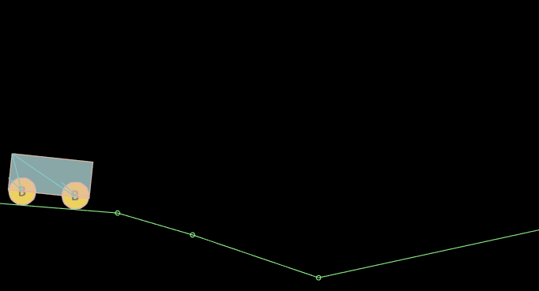

#Articulation de moteur

###Articulation du moteur

Articulation de moteur`MotorJoint`Pour limiter les deux rigides de manière à maintenir leur position et leur angle relatifs inchangés,

L 'articulation du moteur se déplace toujours vers le point cible et maintient un angle spécifique.

#####Description des propriétés

#####Other body

Rigide de connexion d 'articulation [configuré pour la première fois] efficace.

#####Linearoffset

Sur la base du décalage basé sur les coordonnées d 'autres body, il est également la position cible de selfbody.

#####Angularoffset

Based on otherbody angle deviation, also selfbody 's Target angle.

#####Maxforce

Lorsque selfbody s' écarte de la position cible, la force maximale appliquée par l 'articulation de moteur pour la ramener à la position cible.

#####Maxtorque

Lorsque l 'angle de selfbody ne coïncide pas avec l' angle de l 'objectif, la force de torsion maximale de l' articulation du moteur est appliquée pour atteindre l 'angle de l' objectif.

#####Correction facto

Facteur de ralentissement lorsque selfbody se déplace vers la position cible, valeur 0 ~ 1, plus vite la valeur est grande.

#####Collideconnect

Les deux objets peuvent - ils entrer en collision par défaut?

####Exemple

La description de l 'articulation du moteur est moins compréhensible, nous allons donner un exemple simple pour mieux comprendre l' articulation du moteur, créer une scène motor.scene, glisser un bloc dans une barre de croissance et créer un noeud Sprite au niveau du bouton droit de la souris et déplacer le point d 'ancrage du noeud (dans Le coin supérieur gauche) au centre de la longueur (car l' articulation du moteur ne fonctionne que sur le corps rigide).Le corps rigide est dans l 'angle supérieur gauche de l' objet, ne peut pas être modifié, de sorte que, de cette manière, la Sprite graphique est un noeud de rendu.

Le Sprite long est ensuite glissé sur le noeud Sprite vide, ce qui en fait un sous - noeud vide.Figure:

Ajouter un collisionneur rectangulaire au noeud père`BoxCollider`À ce moment - là, la taille du collisionneur n 'est pas aussi grande que la longueur de l' image, mais elle correspond à la taille du noeud parent Sprite, et nous devons l 'adapter à la taille et à la position de l' image longue, comme les images:

On ajoute ensuite une articulation de moteur (attributs par défaut) au noeud parent et une articulation de souris (pour le tracteur, l 'articulation de la souris ne fixe pas de point d' ancrage ou de point d 'ancrage ou, si le point d' ancrage est fixé, de position fixe).Ajoute au noeud parent un rectangle Graphic de taille égale à celle de l 'image et configure l' image rendertype en hit, de sorte que l 'image soit utilisée comme zone d' évaluation de cliquer sur la souris.Un collisionneur circulaire est ajouté à la scène en tant que point cible de l 'articulation du moteur.

Après cette étape, la position rectangulaire se superpose à une image longue, telle qu 'une figure:

Un noeud circulaire ou rigidbody est ensuite introduit dans un autre corps de l 'articulation du moteur, tel qu' un diagramme:

Après cette étape, il est très simple d 'enregistrer l' opération et de voir l 'effet de l' articulation du moteur:

###Articulation des roues

Articulation de roue`WheelJoint`: rotation autour du noeud comprenant des propriétés élastiques de sorte que le corps rigide se déplace de manière élastique à la position du noeud.

Pour la fabrication de roues physiques.

#####Description des propriétés

#####Otherbody

Rigide de connexion d 'articulation [configuré pour la première fois] efficace.

#####Anchor.

Le point de liaison de l 'articulation est décalé par rapport à la position du coin supérieur gauche de son corps.

#####Axis

Une valeur vectorielle décrivant la direction du Mouvement, par exemple 1,0 le long de l 'axe X.

#####Enablemotor

Le moteur est - il activé pour déplacer le corps de la cible?

#####Motorspeed

Lorsque le moteur est activé, la vitesse de rotation maximale peut être atteinte.

#####Maxmotortorque

Lorsque le moteur est activé, la distance de torsion maximale peut être appliquée, si le couple maximum est trop petit, ce qui entraîne une non - rotation.

#####Frequency

The Frequency of the Spring system can be considered as the Elastic coefficient of the spring.

#####Damping

L 'amortissement du corps rigide lors de son retour au noeud rapporte 0 à 1.

#####Collideconnect

Les deux corps rigides peuvent - ils se heurter, par défaut false?

####Exemple

Le noeud de roue, par définition, est une roue de fabrication, et l 'exemple est très simple et ne se répète pas.

Les effets opérationnels sont les suivants:

Nous avons vu la voiture rouler en bas à cause de la gravité, parce que nous n 'avons pas démarré le moteur de la roue.

Les propriétés enablemotor des deux articulations de roues sont définies comme vrai et motorspeed comme 3:

Ainsi, le chariot est alimenté par le moteur de la roue elle - même et conserve son fonctionnement:

La voiture à roues motrices est prête.

###Articulation de poulie

Articulation de poulie`PulleyJoint`Il met les deux objets à la terre et les relie l 'un à l' autre.Comme une plate - forme suspendue par une corde dans supermary, qui monte en marchant sur l 'autre.

#####Description des propriétés

#####Other body

Rigide de connexion d 'articulation [configuré pour la première fois] efficace.

#####Other anchor

Le point de liaison rigide est décalé par rapport à l 'angle supérieur gauche de l' autre body.

#####Other groundpoint

Un noeud relié à un autre Anchor noeud sur la poulie est décalé par rapport à l 'angle supérieur gauche de l' autre body.

#####Selfenchor

Le point de connexion rigide est décalé par rapport à l 'angle supérieur gauche de son corps.

#####Selfgroundpoint

Le noeud relié au noeud selfenchor sur la poulie est décalé par rapport à l 'angle supérieur gauche de son corps.

#####Ratio

Rapport de distance de déplacement des deux corps rigides

#####Collideconnect

Les deux corps rigides peuvent - ils se heurter, par défaut false?

####Exemple

Créer une nouvelle scène, puis glisser un carré comme planche, deux cercles comme billes, et ajouter le corps de collision correspondant, ajouter un joint de souris et un joint de poulie à ball1, faire glisser le ball2 sur l 'autre Body dans l' articulation de poulie et fixer quatre points d 'ancrage pour l' articulation, comme indiqué dans la figure:

Il suffit de relier deux cercles, la planche servant de référence d 'arrière - plan.

Pour plus d'informations, prière de visiter la communauté à l'adresse suivante: < http: / / ask.layabox.com >.