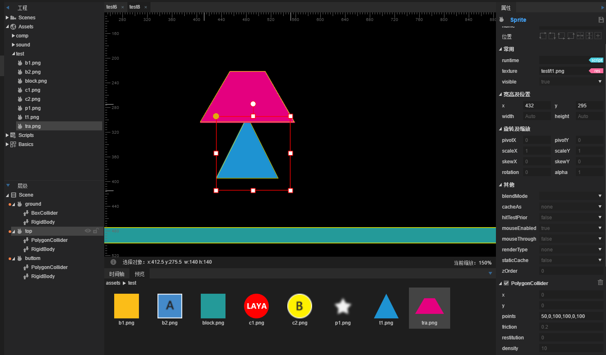
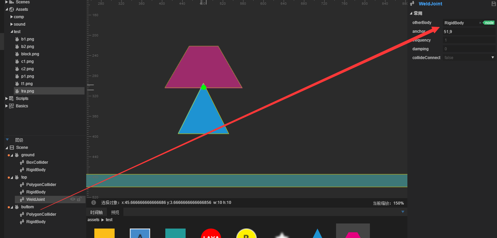
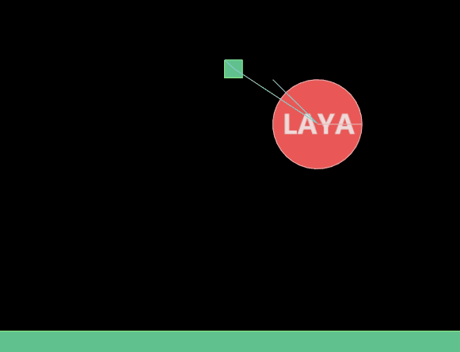
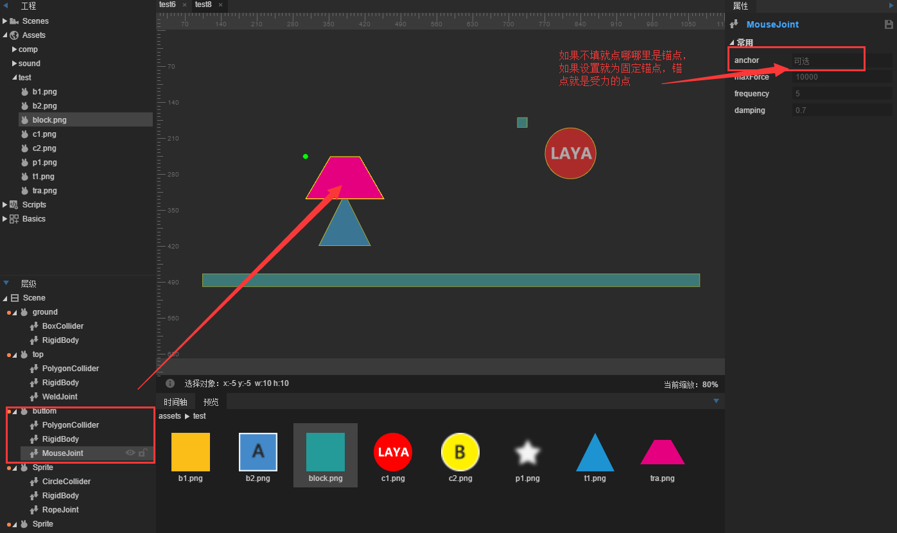
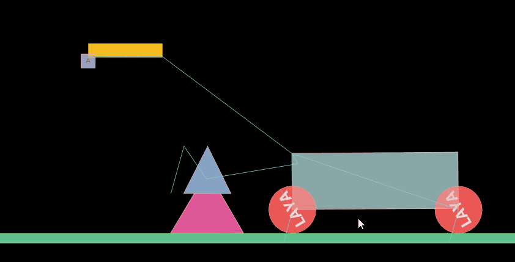

# 焊接关节，绳索关节，鼠标关节

###Articulations soudées

Joint de soudage`WeldJoint`Pour empêcher le mouvement relatif des deux corps, la position et l 'angle relatifs des deux corps restent inchangés, comme un tout.

#####Description des propriétés

#####Other body

Rigide de connexion d 'articulation [configuré pour la première fois] efficace.

#####Anchor.

Le point de liaison de l 'articulation est décalé par rapport à la position du coin supérieur gauche de son corps.

#####Frequency

The Frequency of the Spring system can be considered as the Elastic coefficient of the spring.

#####Damping

Amortissement du corps rigide lors de son retour au noeud, valeur 0 ~ 1

#####Collideconnect

Si les deux corps rigides peuvent se heurter, par défaut False

####Exemple

L 'articulation de soudage est plus simple, c' est - à - dire que les deux corps rigides sont fixés à un point, comme le soudage (attention, ce soudage est aussi élastique).

Nous construisons une nouvelle scène dans laquelle une barre de croissance de Box est introduite en tant que sol, et nous ajoutons boxcollider pour définir le type de corps rigide en tant que type statique.Faites glisser un autre triangle et un autre triangle et ajoutez un polycollider et définissez la taille de la collision (le polygone doit être configuré de manière autonome), comme suit:

Une fois la scène sauvegardée, on verra la gravité et l'impact.

Après cette étape, nous ajoutons un joint de soudure au triangle: et nous faisons glisser l 'échelle dans l' autre corps de l 'articulation.

Les deux corps rigides sont soudés ensemble, sauvegardés en fonctionnement et nous verrons les effets:

###Articulation de câble

Articulation de câble`RopeJoint`: limite la distance maximale entre les deux points.L 'étirage entre les objets connectés est bloqué même sous une lourde charge.

#####Description des propriétés

#####Otherbody

Rigide de connexion d 'articulation [configuré pour la première fois] efficace.

#####Anchor.

Le point de liaison de l 'articulation est décalé par rapport à la position du coin supérieur gauche de son corps.

#####Frequency

The Frequency of the Spring system can be considered as the Elastic coefficient of the spring.

#####Damping

L 'amortissement du corps rigide lors de son retour au noeud rapporte 0 à 1.

#####Collideconnect

Les deux corps rigides peuvent - ils se heurter, par défaut false?

####Exemple

L 'utilisation de l' articulation de câble est similaire à celle de l 'articulation de distance, l' insertion d 'un carré et dDistance

Les effets opérationnels sont les suivants:

​

###Articulation de la souris

Articulation de la souris`MouseJoint`: pour manipuler des objets par la souris.Il tente de glisser l 'objet vers la position du curseur actif de la souris.Il n'y a pas de limite à la rotation.

#####Description des propriétés

#####Anchor.

Le point de liaison de l 'articulation est décalé par rapport à la position de l' angle supérieur gauche de son corps et, à défaut, cliquez sur le point de la souris comme point de connexion.

#####Maxforce

La force maximale appliquée par l 'articulation de la souris lors de la traction du bodyb rigide.

#####Frequency

The Frequency of the Spring system can be considered as the Elastic coefficient of the spring.

#####Damping

L 'amortissement du corps rigide lors de son retour au noeud rapporte 0 à 1.

####Exemple

Si vous continuez à utiliser la scène précédente, ajoutez un joint de souris au noeud d 'échelle ou ajoutez - le à d' autres objets tels que les dessins suivants:

Le plus simple, c 'est l' articulation de la souris.

Nous pouvons voir l 'effet de la traction de la souris, les joints de soudage, les articulations de la souris sont élastiques.

Joignez un diagramme de l 'effet combiné, plus de combinaisons demandez à l' développeur de le faire lui - même.

Pour plus d'informations, prière de visiter la communauté à l'adresse suivante: < http: / / ask.layabox.com >.