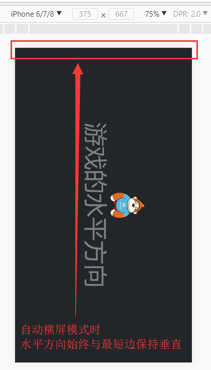

# 屏幕方向：自动横屏与自动竖屏的设置

> Author: Charley
]

###APERÇU des paramètres de direction de l 'écran

Ouvrez le fichier API du moteur et cherchez laya.display.stage.[screenMode属性](https://layaair.ldc.layabox.com/api/?category=Core&class=laya.display.Stage%3Ch1%3EscreenMode)".Comme le montre la figure 1. 


(Figure 1)

####1.1 valeur par défaut none ou propriétés screenmode non spécifiées

Lorsque aucune valeur par défaut n 'est définie ou que les attributs screenmode ne sont pas définis, la direction horizontale du jeu n' entraîne pas de changement de la rotation de l 'écran, quelle que soit la direction de l' écran.

Par exemple, les effets des figures 2 - 1 et 2 - 2:

 


(Figure 2 - 1) Lorsque les écrans verticaux des téléphones portables sont installés, aucun effet screenmode n 'est prévu

 


(Figure 2 - 2) aucun effet screenmode n 'est prévu pour les écrans transversaux des téléphones portables

####1.2 écrans transversaux automatiques lorsque la propriété screenmode est horizontal


```java

//自动横屏，游戏的水平方向始终与浏览器屏幕较短边保持垂直
Laya.stage.screenMode = "horizontal";
```


Si la valeur d 'attribut screenmode est définie comme horizontal, la direction horizontale du jeu est toujours perpendiculaire au bord le plus court de l' écran, quelle que soit la direction de l 'écran.Comme le montrent les figures 3 - 1 et 3 - 2.

 


(Figure 3 - 1) Lorsque les téléphones portables sont à l 'écran vertical, les propriétés screenmode sont l' effet horizontal

 


(Figure 3 - 2) Les caractéristiques screenmode sont les effets horizontal sur les écrans transversaux des téléphones portables.


####1.3 écrans verticaux automatiques lorsque les propriétés screenmode sont vertical


```java

//自动竖屏，游戏的水平方向始终与浏览器屏幕较长边保持垂直
Laya.stage.screenMode = "vertical";
```


Si la valeur d 'attribut screenmode est définie comme vertical, l' orientation horizontale du jeu est toujours perpendiculaire aux côtés les plus longs de l 'écran, quelle que soit la direction de l' écran.Comme le montrent les figures 4 - 1 et 4 - 2.

 


(Figure 4 - 1) Lorsque les téléphones portables sont à l 'écran vertical, les propriétés screenmode sont des effets vertigineux

  


(diagramme 4 - 2) Les propriétés screenmode sont des effets vertigineux sur les écrans transversaux des téléphones portables


##Automatic transverse Screen and Vertical Screen

La présente section donne un exemple de code source qui permet au développeur d 'expérimenter localement les différences résultant de la modification des propriétés de laya.stage.screenmode.

> pour les nouveaux développeurs, il suffit de copier directement le code source sans se préoccuper des codes qui ne sont pas liés à screenmode.L 'accent est mis sur l' expérience et la compréhension des différences de valeurs des propriétés screenmode.Les ressources d 'image impliquées dans le code source peuvent être remplacées par des ressources de Ping arbitraires stockées dans`项目根目录/bin/res`Dans la table des matières, veillez à ce que l 'itinéraire et le nom des ressources soient corrects.

####L'exemple de screenmodedemo.ts est le suivant:


```javascript

function showScreen()
{
//图片
var img = new Laya.Image();
img.centerX = 0;
img.centerY = -70;
img.skin = "res/monkey2.png";
Laya.stage.addChild(img);

//文字
var text = new Laya.Label();
text.text = "游戏的水平方向";
text.color = "gray";
text.fontSize = 100;
text.centerX = 0;
text.centerY = 50;
Laya.stage.addChild(text);
}

Laya.init(0, 0, Laya.WebGL);
Laya.stage.scaleMode = "full";
Laya.stage.bgColor = "#232628";

//自动横屏，游戏的水平方向始终与浏览器屏幕较短边保持垂直
Laya.stage.screenMode = "horizontal";
//自动竖屏，游戏的水平方向始终与浏览器屏幕较长边保持垂直
//Laya.stage.screenMode = "vertical;

showScreen();
```


####Pour la constante:

Si l 'développeur ne se souvient pas de la valeur d' attribut de screenmode, une indication de code de l 'outil peut être obtenue de manière constante.

La constante de Screen est indiquée dans la figure 5:

 


(Figure 5)

Exemples:


```java

//自动横屏，游戏的水平方向始终与浏览器屏幕较短边保持垂直
Laya.stage.screenMode = Laya.Stage.SCREEN_HORIZONTAL;;
//自动竖屏，游戏的水平方向始终与浏览器屏幕较长边保持垂直
//Laya.stage.screenMode = Laya.Stage.SCREEN_VERTICAL;
```


Ressources d 'image utilisées dans l' exemple:

 


Monkey2.ping

