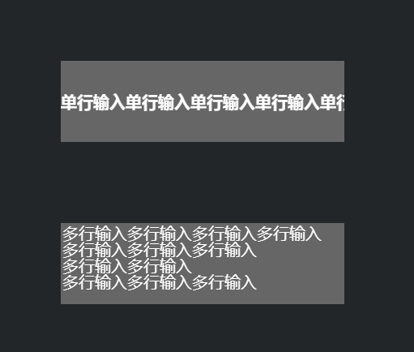

#Textinput Single - Line Input & Multi - ranging input

La boîte de saisie de texte est un composant ui qui est souvent utilisé dans le jeu et qui est utilisé dans la catégorie textinput à tout moment.

Tous les paramètres API de laya.ui.textinput:

< / BR >

Ici, nous réglons l 'entrée de texte en ligne unique et en ligne multiple, l' entrée en ligne unique ne pouvant être saisie qu 'à l' intérieur d 'une ligne, et la pluralité de lignes peut être saisie à la ligne suivante si la ligne précédente n' est pas remplie par le retour.


```javascript

//初始化引擎,不支持WebGL时自动切换到Canvas
Laya.init(640,800,Laya.WebGL);
//设置画布的背景颜色
Laya.stage.bgColor = "#efefef";
Text_InputSingleline();
Text_InputMultiline();

function Text_InputSingleline(){
    var textInput = new Laya.TextInput("单行输入");//创建一个 TextInput 类的实例对象 textInput 。
    textInput.wordWrap = true;//设置 textInput 的文本自动换行。
    textInput.fontSize = 30;//设置 textInput 的字体大小。
    textInput.x = 0;//设置 textInput 对象的属性 x 的值，用于控制 textInput 对象的显示位置。
    textInput.y = 0;//设置 textInput 对象的属性 y 的值，用于控制 textInput 对象的显示位置。
    textInput.width = 300;//设置 textInput 的宽度。
    textInput.height = 200;//设置 textInput 的高度。
    textInput.bgColor = "#aabbcc";
    Laya.stage.addChild(textInput);//将 textInput 添加到显示列表。
}
function Text_InputMultiline(){
    var textInput = new Laya.TextInput("多行输入");//创建一个 TextInput 类的实例对象 textInput 。
    textInput.fontSize = 30;//设置 textInput 的字体大小。
    textInput.wordWrap = true;//设置 textInput 的文本自动换行。
    textInput.multiline = true;//设置textInput的多行输入
    textInput.x = 0;//设置 textInput 对象的属性 x 的值，用于控制 textInput 对象的显示位置。
    textInput.y = 300//设置 textInput 对象的属性 y 的值，用于控制 textInput 对象的显示位置。
    textInput.width = 300;//设置 textInput 的宽度。
    textInput.height = 200;//设置 textInput 的高度。
    textInput.bgColor = "#aabbcc";
    Laya.stage.addChild(textInput);//将 textInput 添加到显示列表。
}
```


Résultats opérationnels:

< / BR >

L 'effet de la carte ci - dessus est obtenu en réglant la multiline pour ouvrir des entrées multilignes pour true.Les autres paramètres sont sensiblement les mêmes que le texte text, et vous pouvez modifier l 'expérience paramétrique dans l' exemple ci - dessus si vous voulez définir des polices et des styles de différentes tailles et des réglages text.