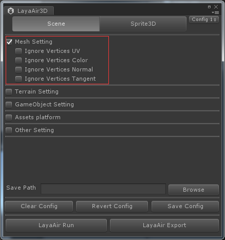

##Utilisation d 'un module Unity

]###Message important:

###Le moteur de la version layaair 1.x correspond à Unity - 5.6.x.Les développeurs sont donc priés de télécharger la version Unity - 5.6.x.Pour les autres versions, il peut y avoir une incompatibilité partielle.


###Down layaair3d Output Tool

Téléchargement: https: / / ldc2.layabox.com / layadownload /? Type = layaairde - layaair% 20ide% 2020.0% 20beta3

Ou dans le menu IDE - outils - outils - outils de conversion 3D (Figure 1).

Une fois le téléchargement terminé, on peut voir deux outils, l 'un pour convertir l' outil fbxtools en format Fbx, qui ne sera pas mis à jour pour le moment et qui propose aux concepteurs d 'utiliser un autre outil d' Export Unity pour créer un monde de jeu plus facile à utiliser et à exporter.

< br > (Figure 1)


###Insert d 'Export de montage

Démarrer Unity, créer un nouveau projet et importer les ressources et le matériel nécessaires au jeu, les maquettes, etc.Ctrl + s sauve notre scène et on garde le nom de truck.

L 'outil de conversion layaair3d est importé par le bouton droit de l' interface de gestion des ressources.La version de l 'insert sera mise à jour avec l' augmentation des fonctionnalités du moteur layaair, mais la méthode d 'importation est parfaitement cohérente.

Lorsque l 'outil d' entrée est entré avec succès, un dossier Laya plugin apparaît dans l 'interface de gestion des ressources et un menu Laya plugin exporté dans la barre de menu Unity.Figure 2

< br > (Figure 2)

​

###Paramètres de ressources d 'exportation

Nous avons créé un modèle de voiture dans l 'Unity et nous l' avons exporté avec le module layaair.Cliquez sur la barre de menu Laya plugin, vous trouverez un panneau d 'Export où nous vous expliquerons en détail.

< br > (Figure 3)


####Catégorie de ressources d 'exportation

**Catégorie scene**Il s' agit de toute la scène, qu 'elle soit exportée dans tous les modèles, matériaux, autocollants, animés ou photocollants, principalement pour la création de scène, l' extension de fichier est. LS, elle doit être chargée avec la classe scene ou ses héritiers.

**Catégorie sprite3d**Il y a moins d 'exports d' affiches d 'éclairage que de scènes, et des ressources séparées sont souvent utilisées pour l' exportation d 'objets actifs dans des rôles ou des jeux.

Ils seront chargés dans le modèle layaair3d du document technique 3D.

####Mesh Setting

Les paramètres d 'exportation des données de grille qui apparaissent après la sélection (fig. 4) peuvent servir à comprimer la taille des fichiers de grille LM du modèle.

Ignore vertices tangent néglige les informations de coupure
Ignore vertices color

< br > (Figure 4)

####Terrain Setting

Paramètres d 'exportation Unity (fig. 5)

Convert terrain to Mesh
S' il y a un modèle de terrain dans la scène, la zone de conversion est transformée en modèle de grille.
La forme terrestre d 'untiy est très commode à dessiner avec des pinceaux des altitudes telles que les montagnes, les caniveaux, etc., et à appuyer la production de plusieurs autocollants détaillés pour plusieurs types d' autocollants.Le module d 'exportation layaair transforme le sol en Mesh, ce qui facilite l' utilisation par les développeurs.Il y a une différence entre le matériau et le matériau ordinaire, qui contient des dessins détaillés.

Resolution
Optimization Parameters for export Model Grid surface number, General par défaut Medium sufficient.Le niveau d 'optimisation défini ci - dessous est égal à la précision du nombre de faces divisé par quatre.
Very height a le plus grand nombre de faces optimisées.
Le nombre de faces optimisées de height est relativement élevé.
Medium Optimized surface number
Low - faible nombre de surfaces optimisées
Very Low a le nombre de faces le plus bas après optimisation.

< br > (Figure 5)

####Gameoobject Setting

Paramètres de noeud d 'article de jeu (Figure 6)

Ignore NULL Game Objects
Les noeuds vides sont ignorés lors de l 'exportation, et les noeuds non supportés par le moteur layaair sont également considérés comme des noeuds vides, tels que les noeuds lumineux, ce qui permet de réduire le nombre de elfes.
Note: la version 1.5.0 permet l 'exportation de caméras, de sorte que le fait de ne pas tenir compte des noeuds vides n' affecte pas l 'exportation de caméras.

Ignore not active Game Objects
Les noeuds non activés dans la scène Unity sont ignorés lors de l 'exportation.

Optimize - game Objects
La suppression de tous les noeuds inutiles permet de réduire au minimum le nombre de elfes.

Batch make the first level Game Objects
Export en série (il faut sélectionner sprite3d pour avoir) export en série tous les noeuds de niveau 1 de la scène.


 < br > (Figure 6)


####Other Setting

Autres paramètres (Figure 7)

Cover original - export Files
Fichier d 'exportation d' origine

Customize - export root Directory - name
Le nom du dossier d 'exportation est personnalisé et le nom du dossier par défaut est "layascene + nom de scène".

Autonomically Save the configuration
Enregistrer automatiquement la configuration actuelle lors de l 'exportation


 < br > (Figure 7)


####Paramètres d 'exportation

Chemin de fichier enregistré par borower
Clear configurer
Revert config lit la configuration enregistrée à partir du tableau de configuration
Save config conserve la configuration actuelle et, après l 'enregistrement, la configuration antérieure sera utilisée directement après la prochaine ouverture pour faciliter le fonctionnement des développeurs.
Layaair Run clique sur le moteur layaair pour exécuter directement la scène.
Layaairrun use Notice:
Les modules d'extension Express doivent être installés dans l'environnement Node (l'outil comporte des Express et, s'il n'est pas utilisé normalement, il doit être installé lui - même);
L'objectif est d'assurer la présence d'un appareil photographique dont l'emplacement sera ajusté de manière à ce que l'effet de fonctionnement final du layaair soit conforme aux résultats de l'opération Unity.
Layaair Export les ressources courantes, puis cliquez pour exporter les données de la scène ou du modèle actuels vers le trajet spécifié.


 < br > (Figure 8)


###Ressources exportées

Lorsque la configuration de la scène de sortie est prête, cliquez sur le bouton Laya export et exportez pour créer le dossier layascene u Truck par défaut (fig. 9).


 < br > (Figure 9)

Voir les ressources de fichiers graphiques ci - dessus, qui sont générées après l 'exportation. LS, LM, lmat, et les ressources TGA d' autocollage.

Il s' agit d 'un fichier de scénario qui est généré lors de la sélection d' une catégorie de scene exportée et qui contient une variété de données, de modèles, d 'affiches d' éclairage, d 'emplacements, etc.

LH est un fichier de modèle qui est généré lors de la sélection d 'exporter la catégorie sprite3d et qui manque d' informations sur les fichiers d 'autocollants optiques, les autres étant identiques.

LM est un fichier de données de modèle qui correspond à une conversion du format Fbx et peut être chargé dans la catégorie meshsprite3d.

Lmat est un fichier de données sur le matériau, les informations sur le matériau pour le modèle sont définies dans l 'unité et chargées. LS ou LH sont automatiquement chargées. Lmat produit le matériau.Lmat peut également modifier manuellement certaines de ces propriétés.

LANI est un fichier de données d 'animation (le modèle n' est pas animé et n 'est donc pas produit au moment de l' exportation dans la figure 9) et si le modèle est animé, un fichier de configuration d 'animation, comprenant des informations d' animation osseuse ou de trame, est généré après l 'exportation.

Leur utilisation spécifique sera décrite en détail dans le dossier des cours de suivi.


###Exemple de chargement simple

Nous avons copié tout le contenu du dossier layascene u Truck à bin / H5 / sous le catalogue racine du projet.

Tips: ce chapitre ne présente que des applications de chargement simples qui, une fois exportées, génèrent des formats qui seront décrits en détail dans les documents techniques 3D intitulés "scènes de layaair3d" et "modèles de layaair3d".

Les exemples sont les suivants.


```java

var Main = (function () 
{
    
    function Main() 
    {
        //初始化引擎
        Laya3D.init(0, 0,true);
        Laya.stage.scaleMode = Laya.Stage.SCALE_FULL;
        Laya.stage.screenMode = Laya.Stage.SCREEN_NONE;
        Laya.Stat.show();

        //添加3D场景

        Laya.Scene3D.load("LayaScene_truck/truck.ls",Laya.Handler.create(null,function(scene){
             Laya.stage.addChild(scene);
             //创建摄像机(横纵比，近距裁剪，远距裁剪)
             var camera= new Laya.Camera( 0, 0.1, 1000);
             //加载到场景
             scene.addChild(camera);
              //移动摄像机位置
             camera.transform.position=new Laya.Vector3(-8, 4, 15);
             //旋转摄像机角度
             camera.transform.rotate(new Laya.Vector3( -8, -25, 0), true, false);
        }))
 
	}
 	return Main;
} ());

Main();
```


Compiler le code simple ci - dessus, nous avons constaté que le chargement de la scène a été réussi et que le modèle de la scène est affiché sur la vue 3D (Figure 9).


 < br > (Figure 10)

