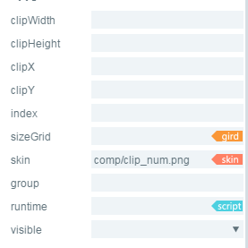

#Références de composants clip


##Création d 'un composant clip par layaairide

###1.1 Création de clip
L 'ensemble clip peut être utilisé pour afficher une animation de bitmap.Le clip peut combiner une image avec un nombre de clipx divisé horizontalement, un nombre de clipy divisé verticalement ou une largeur de clipwidth de chaque tranche transversale, et une hauteur de clipy height qui divise verticalement chaque tranche, de gauche à droite et de haut en bas en une animation de coupe.

L 'ensemble clip peut être utilisé pour reproduire une animation de tranches et pour afficher une image de trame de l' animation de tranches.
Cliquez sur l 'ensemble clip dans le panneau de ressources et faites glisser - le dans la zone d' édition de page, ce qui permet d 'ajouter l' ensemble tab à la page.
Références d 'interface de script clip[Clip API](http://layaair.ldc.layabox.com/api/index.html?category=Core&class=laya.ui.Clip)

Exemples de ressources du module clip:

​< br / >
(Figure 1)

Définit la valeur des propriétés clipx pour un effet d 'affichage après 10:

​< br / >
(Figure 2)

Définit la valeur des propriétés index comme un effet d 'affichage après 1:

​< br / >
(Figure 3)

###1.2 caractéristiques communes des composants clip

​< br / >
(Figure 4)

- 124.**Attribut**- 124.**Description fonctionnelle**- 124.
124 --------------------------------------------------------------------------------------------
La valeur \ \ \ \ \ \ \ \ \ \ \ \ \ \ \ \- 124.
La largeur de chaque lame est divisée latéralement.- 124.
Lorsque les ressources d 'image sont divisées longitudinalement, la hauteur de chaque lame.- 124.
Le nombre d 'éléments de coupe à large largeur est égal à celui des ressources d' image divisées latéralement par 124.- 124.
Lorsque la ressource d 'image est divisée longitudinalement par- 124.
L 'index de la trame d' animation active est affiché sous forme d 'animation en lames.- 124.
124 Interval \ \ \ \ \ \ \ \ \ \ \ \ \ \- 124.
Données de grille valides (données de la grille de la neuvième maison) pour les ressources d 'images.- 124.
La ressource d 'image \ \ \ \ \ \ \ \ \ \ \ \ \ \- 124.


##Création d 'un composant clip par Code

Quand on écrit un code d 'écriture, on ne peut pas forcément contrôler l' ui par le Code, créer`UI_Clip`Classe, les propriétés associées à clip sont déterminées par Code.

**Exécution de l 'exemple:**

​	< br / >
Figure 5 création de compteurs par Code

​< br / >
(Figure 6)

D 'autres attributs de clip peuvent également être définis au moyen d' un code, l 'exemple ci - dessus montre comment chaque seconde de mise à jour de clip.clipx peut être obtenue au moyen d' un minuteur, la fonction de l 'horloge peut être réalisée au moyen d' une mise à jour numérique par seconde, et le lecteur intéressé peut créer lui - même un clip correspondant aux besoins de son projet par l 'intermédiaire d' un code.

**Exemple:**


```typescript

(function()
{
	var Stage   = Laya.Stage;
	var Button  = Laya.Button;
	var Clip    = Laya.Clip;
	var Image   = Laya.Image;
	var Handler = Laya.Handler;
	var WebGL   = Laya.WebGL;

	var buttonSkin = "res/ui/button-7.png";
	var clipSkin = "res/ui/num0-9.png";
	var bgSkin = "res/ui/coutDown.png";

	var counter, currFrame, controller;

	(function()
	{
		// 不支持WebGL时自动切换至Canvas
		Laya.init(800, 600, WebGL);

		Laya.stage.alignV = Stage.ALIGN_MIDDLE;
		Laya.stage.alignH = Stage.ALIGN_CENTER;

		Laya.stage.scaleMode = Stage.SCALE_SHOWALL;
		Laya.stage.bgColor = "#232628";
		//预加载资源
		Laya.loader.load([buttonSkin, clipSkin, bgSkin], laya.utils.Handler.create(this, onSkinLoaded));
	})();

	function onSkinLoaded()
	{
		showBg();
		createTimerAnimation();
		showTotalSeconds();
		createController();
	}

	function showBg()
	{
		var bg = new Image(bgSkin);
		bg.size(224, 302);
		bg.pos(Laya.stage.width - bg.width >> 1, Laya.stage.height - bg.height >> 1);
		Laya.stage.addChild(bg);
	}

	function createTimerAnimation()
	{
		counter = new Clip(clipSkin, 10, 1);
		counter.autoPlay = true;
		counter.interval = 1000;

		counter.x = (Laya.stage.width - counter.width) / 2 - 35;
		counter.y = (Laya.stage.height - counter.height) / 2 - 40;

		Laya.stage.addChild(counter);
	}

	function showTotalSeconds()
	{
		var clip = new Clip(clipSkin, 10, 1);
		clip.index = clip.clipX - 1;
		clip.pos(counter.x + 60, counter.y);
		Laya.stage.addChild(clip);
	}

	function createController()
	{
		controller = new Button(buttonSkin, "暂停");
		controller.labelBold = true;
		controller.labelColors = "#FFFFFF,#FFFFFF,#FFFFFF,#FFFFFF";
		controller.size(84, 30);

		controller.on('click', this, onClipSwitchState);

		controller.x = (Laya.stage.width - controller.width) / 2;
		controller.y = (Laya.stage.height - controller.height) / 2 + 110;
		Laya.stage.addChild(controller);
	}

	function onClipSwitchState()
	{
		if (counter.isPlaying)
		{
			counter.stop();
			currFrame = counter.index;
			controller.label = "播放";
		}
		else
		{
			counter.play();
			counter.index = currFrame;
			controller.label = "暂停";
		}
	}
})();
```


 