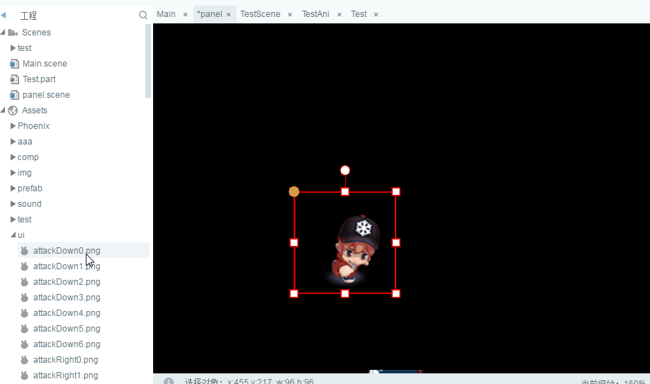

#Gestionnaire de ressources

Le gestionnaire de ressources est la zone de travail que nous utilisons pour accéder aux ressources du projet et les gérer.Des ressources supplémentaires sont nécessaires au début des travaux.On trouvera dans ce chapitre des informations sur l'utilisation fonctionnelle du gestionnaire de ressources et les règles de désignation des ressources.

##Interface

Le gestionnaire de ressources affiche le contenu du dossier de ressources du projet dans une structure arborescente, comme le montre la figure 1 ci - dessous, nous présentons les différents éléments d 'interface.

< br / > (Figure 1)

​`资源预览界面`Les ressources sélectionnées dans la liste des ressources sont directement`资源预览界面`Montre - le.

​`资源列表`- Oui.`项目根目录/laya/assets/`Les ressources du catalogue seront là.`资源列表`Affiche.Sélectionnez les ressources dans le répertoire ou dans le Répertoire, bouton droit`打开所在目录`, ouvre directement le Répertoire dans le système d 'exploitation.

​`常用功能按钮`: sous le gestionnaire de ressources sont les boutons fonctionnels usuels, y compris l 'ouverture de la table des matières, l' établissement d 'attributs par défaut, la mise à jour de la liste des ressources et la filtration des mots - clés.

##Présentation fonctionnelle

###2.1 ouverture de la table des matières

Toutes les ressources du gestionnaire de ressources, c 'est - à - dire celles qui peuvent être gérées dans l' IDE, peuvent être gérées directement dans le système.Par conséquent`选中`Lorsque le catalogue ou les ressources sont disponibles,`右键菜单`Clic`打开所在目录`Ou cliquez directement sur le Répertoire`功能按钮`Ouvre.Comme le montre la figure 2.

< br / > (Figure 2)

###Création, suppression, mise à jour

####Création de ressources et de répertoires

Lorsque vous ouvrez le Répertoire, nous pouvons faciliter la création des ressources et des répertoires.Par exemple, les ressources ou les catalogues nécessaires sont directement collés au Répertoire racine du gestionnaire de ressources (* Liste racine du projet / Laya / assets / *), et les ressources peuvent être utilisées dans le cadre de l'IDE après mise à jour de la base F5.

####Delete

Il y a deux façons de supprimer la table des matières ou les ressources.La première consiste à sélectionner la ressource ou le Répertoire à supprimer dans l 'IDE, à cliquer sur l' option supprimer dans le menu droit ou à appuyer directement sur la touche delete pour supprimer.La deuxième consiste à ouvrir la table des matières et à la supprimer directement dans la table des matières du système.La différence entre les deux est que les suppressions dans l 'IDE sont automatiquement rafraîchissantes et les suppressions dans le Répertoire du système nécessitent que l' on clique sur le bouton rafraîchissement ou sur le raccourci F5 pour rafraîchir l 'IDE.

####Rafraîchir

La mise à jour est une opération courante dans le gestionnaire de ressources.Cliquez sur le bas du gestionnaire de ressources`刷新按钮`Ou`快捷键F7`La liste des ressources du gestionnaire de ressources peut être mise à jour conformément à la liste du système.Vous pouvez également appuyer sur le raccourci F5 pour rafraîchir la liste des gestionnaires de ressources.

*Si la ressource modifiée est utilisée dans le projet ui, appuyez sur F5.*

Pour les opérations de création, de suppression et de mise à jour de ressources et de catalogues, voir la figure 3.

< br / > (Figure 3)

###2.3 Ressources de filtration

Lorsque les ressources sont plus importantes, les ressources peuvent être filtrées en saisissant des mots - clés de texte dans la zone de recherche du gestionnaire de ressources, ce qui facilite la recherche rapide des ressources.Comme indiqué dans la figure 4.

< br / > (Figure 4)

###2.4 définition des attributs par défaut

Sélectionnez la ressource ou le Répertoire, vous pouvez définir les attributs par défaut par le bouton droit ou cliquer directement sur le bouton fonctionnel situé au niveau le plus bas du gestionnaire de ressources, comme le montre la figure 5.

< br / > (Figure 5)

Clic`设置默认属性`Par la suite, les propriétés des ressources de surface de bombe sont définies sur le panneau, comme le montre la figure 6.

< br / > (Figure 6)

**Présentation du panneau**

`资源名称`: affiche le nom et l 'itinéraire des ressources dans le gestionnaire de ressources.

`组件类型`: l 'option descendante du type de composant est la totalité du type de composant (* Tous les types de composant peuvent être consultés dans le document detailed composant *) et peut être configurée ici si nous voulons modifier le type de composant identifié par défaut de l' IDE pour désigner d 'autres types de composant.

`设置九宫`: Définissez les propriétés de la grille de la neuvième maison pour les ressources, l 'effet de la fonction est identique à celui de la grille de la neuvième maison dans le paramètre de l' attribut de la propriété, et les spécifications de la grille de la neuvième maison dans le paramètre de l 'attribut de référence sont exploitées.

`默认全局属性`Cette colonne correspond également à`属性设置器`Les paramètres d 'attributs, tels que les attributs d' un composant avec l 'option 800, peuvent être définis dans cette colonne avec l' option & ‧‧; avec & ‧‧; 800 & ‧‧;.Si plusieurs attributs doivent être définis à l 'avance, la conversion directe de lignes peut suffire.Figure 7

< br / > (Figure 7)

**Tips:`设置九宫`Et`默认全局属性`Tous les paramètres sont prédéfinis pour les propriétés du composant.Lorsque la même ressource de composant est utilisée à plusieurs reprises et que les mêmes propriétés doivent être configurées, les paramètres peuvent réduire de nombreuses opérations répétitives.**

`打包类型`- Oui.`默认`Les règles d 'emballage des paramètres du projet (F9) seront appliquées.En outre, les ressources peuvent être configurées manuellement par l 'intermédiaire de cette fonction`打包`Ou`不打包`".Lorsque l 'option par défaut est définie, le type d' emballage spécifié a une priorité supérieure à celle de l 'élément.

`图片类型`Le type d 'image est défini comme étant le type d' image lorsque les deux images adjacentes de l 'IDE sont assemblées, mais qu' il y a un espace d 'assemblage (généralement une ligne noire) pendant le fonctionnement du Navigateur`Repeat`C 'est réglé.

###2.5 utilisation des ressources

Lorsque vous sélectionnez la ressource, vous pouvez l 'utiliser en maintenant la souris enfoncée dans l' éditeur de scène, comme le montre la figure 8.

< br / > (Figure 8)

###2.6 recherche de références et remplacement de texte

####Recherche de références

Après avoir sélectionné le module ressources,`右键`Clic`查找引用`, cliquez sur le panneau de remplacement dans la recherche`查找`Vous pouvez trouver les pages d 'articles dans lesquelles le composant actuellement sélectionné est cité.Comme indiqué dans la figure 9.

< br / > (Figure 9)

####Remplacer le texte

Oui.`查找替换`Dans le panneau`替换`, vous pouvez remplacer tout et`查找文本`La même valeur`skin属性`Contenu.Comme le montre la figure 10.

  (动图10)

###2.7 remplacement du composant sélectionné dans l 'éditeur de scène par une touche

Sélectionner`场景编辑器`Un composant, puis`右键`Sélectionner`资源管理器`, cliquez sur le menu droit`替换选中对象`, vous pouvez remplacer un composant de l 'éditeur de scène par une touche, comme le montre la figure 11.Cette fonction est plus utile lorsque l 'emplacement est ajusté et que l' on veut simplement changer d 'autres ressources.

< br / > (Figure 11)

 *Une touche peut remplacer non seulement le même type de composant, mais aussi différents types de composant.*

##Règles de désignation des ressources

Les ressources du gestionnaire de ressources sont identifiées dans l 'éditeur de scène comme étant utilisées pour les composants, alors que le type de composant d' identification par défaut est un préfixe de nom de ressource.Par exemple, le nom BTN ` U xxx sera identifié comme un bouton et le nom tab ` U xxx comme un composant Tab.Nous présentons ci - après les règles détaillées de la nomenclature des ressources, il est essentiel que les développeurs maîtrisent bien la mémoire.Si un développeur ne connaît pas le composant, lisez d 'abord le document detailed composant.

###3.1 règles de désignation des composants de base

On trouvera ci - après une liste des règles de désignation des ressources par défaut pour les composants de base de layaairide:

Le préfixe de ressource sphérique (en caractères complets, sans distinction de taille)
124 ---------------------------------------------------------------------------------------------------------------------------------------------------------------
124 \ \ label \ \ 124, \ \ 124, \ \ 124
124%
124 \ \ textarea \ \ 124 \ \ \ 124 \ \ 124a \ \ 124 \ \ 3A
En fait, c'est à peu près ça.
124 \ \ checkbox \ \ 124 \ \ \ \ \ \ \ \ \ \ 124 \ \ \ \\
124, & 124, & 124, & 124, & 124, & 124, & 124
"124, Tab, 124, \ \ 124, Tab, u124, \ \ 124,"
"124 Groupe radiogroup \ \ 124 Groupe de boutons de cases individuelles \ \ 124 traverse le Groupe \ \ u \ \ 124
Nos 124, vslider, 124, glissière verticale.
"124. Hslider \ \ 124 \ \ \ \ 4 \ \ 4 \ \ 4 \ \ 4
124. Clip \ \ 124 \ \ \ \ \ \ \ \ \ \ \ \ \ \ \
124 \ \ fontclip \ \ \ \ \ \ \ \ \ \ \ \ \ \ \\
124, progressbar \ \ 124 \ \ 124, \ \ 124, \ \ 124
124c4c4c4c4c4c4c4c4c4c4c4c4c4c4c4c2c4c4c4c4c4c4c4c4c4c4c4c4c4c4c4c4c4c4c4c4c4c4c4c4c4c4c4c4c4c4c4c4c4c4c
1244a vscrollbar \ \ 124 \ \ 4 vscrollbar UU \ \ 124 \ \ U
"124, hstrollbar \ \ 124, barre de roulement horizontale \ \ 124, traverse hscroll \ \ u \ \ 124
124 image \ \ 124 bitmap \ \ \ \ 124
Tout ce qui n'est pas nommé conformément aux règles du composant est considéré comme Sprite \ \ \ 124.

**Tips**: les ressources peuvent être directement indiquées en caractères complets ou abrégés par un préfixe sans soulignement.Comme...`textinput.png`Et`input.png`".Mais si vous suivez d 'autres caractères, il faut les souligner, par exemple`inputAAA.png`Ne sont pas reconnus comme des composants de cadre d 'entrée,`input_AAA.png`Vous pouvez identifier le composant de la zone d 'entrée (textinput).

###3.2 composants spéciaux

La bande autonome de l 'IDE comprend cinq composants spéciaux, à savoir: vslider, vslider, hslider, progressbar, vscrollbar, et hscrollbar, respectivement.

####Composition de composants spéciaux

Les composants spéciaux ne sont pas des images monolithiques mais des images multiples.Les règles de nom des images de ressource principale sont conformes aux règles de désignation des composants de base, et les ressources supplémentaires sont constituées de deux éléments qui sont utilisés dans les deux parties.`$`Les symboles sont reliés.`$`Auparavant, le nom de la ressource principale,`$`Puis le nom de l 'état associé.

`bar`C 'est - à - dire`滑动\移动`étatComme...`ProgressBa$bar.png`Le nom indique qu 'il appartient à l' ensemble progressbar lorsqu 'une barre de progression est générée.`bar`- emploi du temps`ProgressBa$bar.png`Ressources.

`down`C 'est - à - dire`向下`étatSi c'est une barre de défilement transversale,`down`En général.`向右`Par défaut ou au moment du clic.

`up`C 'est - à - dire`向上`étatSi c'est une barre de défilement transversale,`up`En général.`向左`Par défaut ou au moment du clic.

Le nom et la composition des composants spéciaux peuvent être comparés à ceux des ressources de la figure 12 si l 'on veut les comprendre de façon plus intuitive.

< br / > (Figure 12)

**Tips**- Oui.*En raison de`资源管理器`Les ressources supplémentaires pour les composants spéciaux ne sont pas affichées séparément et seuls les composants de ressources primaires sont affichés dans la liste.Pour manipuler des ressources de composants spéciaux, il faut passer par`打开所在目录`Cette fonction permet d 'effectuer des opérations de gestion dans le Répertoire de fichiers du système.*

###3.3 emballages

Les emballages comprennent Box, list, Tab, Radio Group, viewstack, Panel, hbox, vbox, Tree et Sprite.Sauf Tab, la liste des ressources n 'apparaît généralement pas, mais dans`场景编辑器`Changer en`场景编辑器`Raccourcis clavier lorsque vous sélectionnez un ou plusieurs composants`Ctrl + B`Les différents types de récipients peuvent être convertis en récipients, comme le montre la figure 13.

< br / > (Figure 13)

###3.4 préfixes de l 'identification de composants personnalisés

Si nous ne voulons pas utiliser le préfixe de composant par défaut IDE, comment le modifier?Modifier`laya.editorUI.xml`La configuration du composant correspondant au fichier est suffisante et toutes les informations relatives au composant de bande autonome de l 'IDE sont stockées dans le fichier.

`laya.editorUI.xml`Se trouver`LayaAirIDE根目录\resources\app\out\vs\layaEditor\renders\`Table des matières

`resName`(le nom complet du préfixe du composant ne peut être modifié)`resName`C 'est bon.Comme nous.`Button`Préfixe d 'identification de composant`resName="btn"`Par respname = "BT".L 'éditeur d' IDE est enregistré et mis à jour, et les ressources button initialement désignées sous le nom de préfixe BTN sont identifiées comme des ressources image alors que les ressources nommées sous le nom de préfixe BT sont identifiées comme des composants button.Comme le montre la figure 14.

< br / > (Figure 14)

*Tips: en l 'absence de besoins particuliers, il est recommandé de ne pas modifier le préfixe par défaut.*

###3.5 types de ressources identifiables (suffixe de ressources)

Les formats de ressources d 'images identifiés par layaair - IDE ne sont que des formats d' images standard PG et JPG.N 'utilisez pas d' autres types de ressources d 'image ou d' autres types de ressources pour changer le nom des ressources d 'image en PG et JPG.

