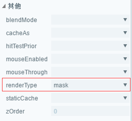

#Masque

> le masque de layaair peut comporter un objet (support de bitmap et de vecteur) et l 'afficher selon la forme de l' objet.
]


##Masque API

Propriété de masque[laya.display.Sprite](http://layaair.ldc.layabox.com/api/index.html?category=Core&class=laya.display.Sprite%3Ch1%3Emask)Dans l 'API, la description de cette propriété est indiquée dans la figure 1:

< br / > (Figure 1)


##Exemples de masques simples

###2.1 utilisons le moteur layaair pour afficher un bitmap.

Créer un`MaskDemo.ts`Catégorie d'entrée, Code établi comme suit:


```typescript

// 程序入口
class MaskDemo{
    private Res:string;
    private img:Laya.Sprite;
    constructor()
    {
        Laya.init(1336,640);
        //设置舞台背景色
        Laya.stage.bgColor = "#ffffff";
        //资源路径
        this.Res = "res/img/monkey1.png";
        //先加载图片资源，在图片资源加载成功后，通过回调方法绘制图片并添加到舞台
        Laya.loader.load(this.Res,Laya.Handler.create(this,this.graphicsImg));
    }
    private graphicsImg():void{
        this.img = new Laya.Sprite();
        //获取图片资源，绘制到画布
        this.img.graphics.drawTexture(Laya.loader.getRes(this.Res),150,50);
        //添加到舞台
        Laya.stage.addChild(this.img);
    }
}
new MaskDemo();
```


Les résultats opérationnels sont indiqués à la figure 2:

< br / > (Figure 2)

###2.2 création d 'une zone de masquage circulaire

Crée une zone de masquage circulaire avec un code.L 'effet masque peut être obtenu par l' attribut Mask.Continuez à lire le Code et les notes explicatives et changez le Code illustratif 2.1 comme suit:


```java

// 程序入口
class MaskDemo{
    private Res:string;
    private img:Laya.Sprite;
    private cMask:Laya.Sprite;
    constructor()
    {
        Laya.init(1336,640);
        //设置舞台背景色
        Laya.stage.bgColor = "#ffffff";
        //资源路径
        this.Res = "res/img/monkey1.png";
        //先加载图片资源，在图片资源加载成功后，通过回调方法绘制图片并添加到舞台
        Laya.loader.load(this.Res,Laya.Handler.create(this,this.graphicsImg));
    }
    private graphicsImg():void{
        this.img = new Laya.Sprite();
        //获取图片资源，绘制到画布
        this.img.graphics.drawTexture(Laya.loader.getRes(this.Res),150,50);
        //添加到舞台
        Laya.stage.addChild(this.img);

        //创建遮罩对象
        this.cMask = new Laya.Sprite();
        //画一个圆形的遮罩区域
        this.cMask.graphics.drawCircle(80,80,50,"#ff0000");
        //圆形所在的位置坐标
        this.cMask.pos(120,50);
        
        //实现img显示对象的遮罩效果
        this.img.mask = this.cMask;
    }
}
new MaskDemo();
```


Les résultats opérationnels sont indiqués à la figure 3:

 <br />（图3）


Grâce à un code de comparaison, nous avons découvert que le masque est simple à obtenir et que l 'effet Masque d' un objet d 'affichage IMG est réalisé en conférant à l' objet d 'affichage cmask une valeur de l' objet masqué aux propriétés Mask de l 'objet img.


##Etablissement de masques dans la layaairide

> outre la mise en place directe d 'un masque dans le Code, un masque peut également être disposé pour l' objet par layaairide.Nous suivons les étapes suivantes.

Première étape: créer une page UI`maskDemo.ui`, importer des ressources.*(si cette étape n 'est pas comprise, veuillez consulter la Section de l' IDE pour la création et l 'importation de l' ui)*


étape 2: glisser un panneau de ressources`Image`Composant dans la zone d 'édition de scène, comme le montre la figure 4

< br / > (Figure 4)


Mesure 3: Double - clic`Image`Dans l 'intérieur du composant, puis dans le panneau du composant`Sprite`Composants, comme le montre la figure 5.

< br / > (Figure 5)


Mesure 4: sélection`Sprite`Ensemble, dans le panneau d 'attributs à droite, les attributs communs`renderType`Définir comme`mask`Voir la figure 6.

< br / > (Figure 6)


Mesure 5: double clic`Sprite`Dans l 'intérieur du composant, puis dans le panneau du composant`Graphics`Ensemble circulaire, réglez la position et la taille.Les relations hiérarchiques sont présentées à la figure 7.

< br / > (Figure 7)


Mesure 6: Double - clic continu sur la zone d 'édition`Image`L 'effet du masque est visible à l' intérieur du composant, comme le montre la figure 8.

< br / > (Figure 8)


##Application des masques layaairide dans le cadre du projet

###4.1 publication de l'UI

Appuie sur l 'interface IDE`F12`Afficher la page UI pour créer un masque`src/ui`La catégorie ui est générée sous la table des matières, comme le montre la figure 9.

 <br />（图9）


###4.2 catégories et images générées à l 'aide de l' IDE pour obtenir un effet masque

Édition de l 'aperçu du moteur en mode F9 et démarrage de la scène maskdemoui


Les codes principaux sont les suivants:


```java

import GameConfig from "./GameConfig";
import { ui } from "./ui/maskDemoUI";
class Main {
	constructor() {
		//根据IDE设置初始化引擎		
		if (window["Laya3D"]) Laya3D.init(GameConfig.width, GameConfig.height);
		else Laya.init(GameConfig.width, GameConfig.height, Laya["WebGL"]);
		Laya["Physics"] && Laya["Physics"].enable();
		Laya["DebugPanel"] && Laya["Physics"].enable();
		Laya.stage.scaleMode = GameConfig.scaleMode;
		Laya.stage.screenMode = GameConfig.screenMode;

		//打开调试面板（通过IDE设置调试模式，或者url地址增加debug=true参数，均可打开调试面板）
		if (GameConfig.debug || Laya.Utils.getQueryString("debug") == "true") Laya.enableDebugPanel();
		if (GameConfig.stat) Laya.Stat.show();
		Laya.alertGlobalError = true;

		//激活资源版本控制，version.json由IDE发布功能自动生成，如果没有也不影响后续流程
		Laya.ResourceVersion.enable("version.json", Laya.Handler.create(this, this.onVersionLoaded), Laya.ResourceVersion.FILENAME_VERSION);
	}

	onVersionLoaded(): void {
		//激活大小图映射，加载小图的时候，如果发现小图在大图合集里面，则优先加载大图合集，而不是小图
		Laya.AtlasInfoManager.enable("fileconfig.json", Laya.Handler.create(this, this.onConfigLoaded));
	}

	onConfigLoaded(): void {
		//加载IDE指定的场景
		GameConfig.startScene && Laya.Scene.open(GameConfig.startScene);
	}
}
//激活启动类
new Main();

```


Comme le montre la figure 10, nous avons rapidement réalisé l 'effet masque.

< br / > (Figure 10)

