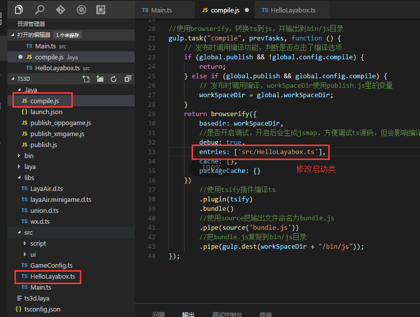

#Premier programme: afficher le texte "Allo - layabox"


 **Avant de lire ce texte, il faut d 'abord lire "Building Development Environment (ts Code Compiler) et" create the ts Project and Detailed catalogue Structure ".**


​**Mesure 1**: Sélectionnez le bouton droit du SRC, puis cliquez sur le nouveau fichier pour créer un fichier hellolayabox.ts sous le répertoire SRC.(Tips: hellolayabox.ts doit être créé sous le catalogue SRC avant d'être compilé)

​< br / >

Modifier ensuite le fichier compile.js sous le catalogue Laya et modifier la catégorie de démarrage comme hellolayabox.ts




​**Mesure 2**: cliquez sur hellolayabox.ts dans la table des matières du SRC pour commencer à rédiger le code suivant:


```typescript

//创建舞台，默认背景色是黑色的
Laya.init(600, 300); 
var txt = new Laya.Text(); 
//设置文本内容
txt.text = "Hello Layabox";  
//设置文本颜色为白色，默认颜色为黑色
txt.color = "#ffffff";  
//将文本内容添加到舞台 
Laya.stage.addChild(txt);
```


​

​**Mesure 3**Lorsque le Code est terminé, compilé à partir de F5, sur la page éjectée, on peut voir les résultats d 'exploitation du Code, comme le montre la figure suivante:

​< br / >
Figure 2


​**Mesure 4**: désactivez la fenêtre d 'affichage lorsque vous l' affichez avec succès.Nous continuons d 'élaborer des codes pour rendre le texte plus beau.Continuer à affiner le Code comme suit:


```typescript

//创建舞台，默认背景色是黑色的
Laya.init(600, 300); 
var txt = new Laya.Text(); 
//设置文本内容
txt.text = "Hello Layabox";  
//设置文本颜色
txt.color = "#FF0000";
//设置文本字体大小，单位是像素
txt.fontSize    = 66;  
//设置字体描边
txt.stroke = 5;//描边为5像素
txt.strokeColor = "#FFFFFF";  
//设置为粗体
txt.bold = true;  
//设置文本的显示起点位置X,Y
txt.pos(60,100);  
//设置舞台背景色
Laya.stage.bgColor  = '#23238E';  
//将文本内容添加到舞台 
Laya.stage.addChild(txt);
```


**Mesure 5**(En milliers de dollars des États - Unis)
​< br / >
Figure 3

**Ainsi, si vous suivez ce cours d 'initiation, complétez le plan ci - dessus, félicitations pour votre entrée réussie, nous avons déjà achevé le premier moteur layaair HTML5 développé en langue Typescript.Pour plus d 'informations sur l' utilisation de l 'API développé par le moteur layaair, veuillez visiter le Centre de développement layabox pour voir des exemples de l' API et du moteur en ligne.**

**Je vous en prie.[https://www.tslang.cn/docs/home.html](https://www.tslang.cn/docs/home.html)Ce site Web doit être enregistré en chinois.Beaucoup de problèmes peuvent être résolus en regardant ça.**