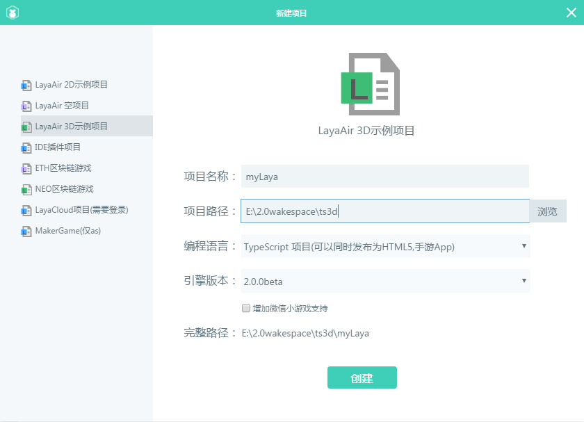

#Démarrer rapidement un projet 3D

Nous allons démarrer rapidement un projet en 3D avec le moteur layaair et suivre un cours dans la langue ts, avec une simple démonstration du Code moteur pour une application en 3D de base.

###IDE création d 'un exemple 3D

Téléchargement de layaairide pour lancer le nouveau projet de sélection 3D.Comme le montre la figure ci - après:

< / BR > (Figure 1)

Ici, nous choisissons la langue JavaScript.Après la création, nous avons découvert que l 'IDE nous a créé un modèle 3D.Les concepteurs de la présentation de la structure du projet peuvent se référer au Programme d'enseignement de la deuxième génération.Ce n 'est plus le cas.

Puis appuyez sur le raccourci F5 ou cliquez sur le bouton d 'exécution pour voir que la fenêtre de débogage affiche un cube.Comme le montre la figure ci - après:

< / BR > (Figure 2)

Ce type de lancement nous a donné un monde en 3D.Et ajoute plusieurs éléments nécessaires à un monde simple en 3D (scènes, caméras, sources de lumière, modèles 3D, matériaux).Ces concepts sont à l'appui du programme de suivi que nous allons présenter en détail et conduire progressivement l'apprentissage des connaissances 3D.

Pour ce point simple, demo, nous avons découvert que ce cube était statique et ne pouvait pas nous donner une vision stéréo de ce que nous voyons immédiatement, alors nous avons ajouté quelques lignes simples pour le faire tourner.D'abord, trouvez la classe de démarrage main.ts et modifiez le code suivant:


```typescript

// 程序入口
class Main {
    constructor() {
        //初始化引擎
        Laya3D.init(0, 0);

        //适配模式
        Laya.stage.scaleMode = Laya.Stage.SCALE_FULL;
        Laya.stage.screenMode = Laya.Stage.SCREEN_NONE;

        //开启统计信息
        Laya.Stat.show();

        //添加3D场景
        var scene: Laya.Scene3D = Laya.stage.addChild(new Laya.Scene3D()) as Laya.Scene3D;

        //添加照相机
        var camera: Laya.Camera = (scene.addChild(new Laya.Camera(0, 0.1, 100))) as Laya.Camera;
        //摄像机位置
        camera.transform.translate(new Laya.Vector3(0, 3, 3));
        //摄像机角度
        camera.transform.rotate(new Laya.Vector3(-30, 0, 0), true, false);
        //设置背景颜色
        camera.clearColor = null;

        //添加方向光
        var directionLight: Laya.DirectionLight = scene.addChild(new Laya.DirectionLight()) as Laya.DirectionLight;
        //灯光颜色
        directionLight.color = new Laya.Vector3(0.6, 0.6, 0.6);
        //灯光的方向
        directionLight.transform.worldMatrix.setForward(new Laya.Vector3(1, -1, 0));

        //添加自定义模型
       var box:Laya.MeshSprite3D = new Laya.MeshSprite3D(new Laya.BoxMesh(1,1,1));
       //将box添加到sence上
       scene.addChild(box);
       //给模型一个旋转角度
       box.transform.rotate(new Laya.Vector3(0,45,0),false,false);

       //给模型创建一个材质球
       box.meshRenderer.material = new Laya.BlinnPhongMaterial;
       //创建材质
       var  material:Laya.BlinnPhongMaterial = new Laya.BlinnPhongMaterial();
       //加载材质的漫反射贴图
       Laya.Texture2D.load("res/layabox.png",Laya.Handler.create(null,function(texture:Laya.Texture2D):void{
           //将得到的Texture2d添加给材质球
           material.albedoTexture = texture;
       }));
       //给模型添加材质
       box.meshRenderer.material = material;

       //给box添加旋转
       var vect:Laya.Vector3 = new Laya.Vector3(1,1,0);
       //每10ms旋转一次
       Laya.timer.loop(10,this,function(){
           box.transform.rotate(vect,true,false);
       });
    }
}
new Main();
```


< / BR > (Figure 3)

Nous utilisons ici un chronométreur pour faire tourner le cube tous les 10 MS, pour des explications précises, demandez à l 'développeur de lire le programme et l' API, ici nous ne sommes qu 'une simple démonstration.


```typescript

var vect:Laya.Vector3 = new Laya.Vector3(1,1,0);
//每10毫秒旋转一次
Laya.timer.loop(10,null,function(){
  box.transform.rotate(vect,true,false);
});
```


Ainsi, nous avons pu trouver un exemple simple et faire tourner le cube (fig. 3).


###Composition fondamentale du monde layaair3d

Grâce à l 'exemple du code ci - dessus, nous pouvons voir la naissance d' un monde élémentaire en 3D.Bien sûr, le code ci - dessus est plus simple, pour créer un monde de jeux varié, nous avons besoin de connaître plus de fonctionnalités du moteur.

Figure 4 Éléments visibles du monde layaair3d.Outre les images 3D, les caméras, les lumières et les modèles, l'animation est également l'un des éléments visibles.Nous allons progressivement vous présenter le cours de fin d 'études.

< / BR > (Figure 4)


###Simple application of 3D World Transformation and vector

Dans l 'exemple ci - dessus, plusieurs grands modules d' éléments relatifs à l 'affichage ont été créés, mais nous avons également vu l' application de vector Vector vector Vector vector Vector vector Vector vector Vector vector Vector vector Vector Vector 3 ou vector4, par exemple, à l 'emplacement, à la direction, à La couleur, etc.

####Système de coordonnées, position, changement de rotation

Dans le moteur 2D, nous réglons directement les coordonnées x et y pour contrôler la position et la direction de rotation de l 'objet d' affichage, le moteur 3D étant plus complexe, les coordonnées de l 'axe Z étant ajoutées, nous utilisons le vecteur 3D de Vector 3, dont les valeurs représentent respectivement X, y et Z.

Toutefois, les différents moteurs 3D et les logiciels de modélisation 3D définissent différemment la direction des coordonnées, ce qui oblige les premiers chercheurs à en comprendre les différences.

Les coordonnées du moteur layaait3d sont en termes professionnels.`右手坐标系`(fig. 5), en résumé, l 'écran est orienté à droite vers l' axe X positif, au - dessus de l 'axe Y, et vers l' observateur vers l 'axe Z positif (Direction arrière de l' écran vers l 'axe Z négatif).Certains moteurs 3D appartiennent au système de coordonnées de la main gauche, ne sont pas présentés ici, les débutants intéressés peuvent comprendre.

</br>(图5)右手系坐标


Le moteur est également divisé en un système mondial de coordonnées et de coordonnées locales, le système mondial de coordonnées est un scénario 3D, la direction des trois axes ne change jamais (fig. 5).Les coordonnées locales sont les coordonnées du modèle lui - même, qui peuvent varier en fonction de la rotation de la direction du modèle, mais on peut les identifier manuellement par l 'intermédiaire du système de coordonnées de droite (fig. 6).

< / BR > (Figure 6)

Une fois les coordonnées connues, elles peuvent être modifiées par une conversion 3D dans laquelle le Transform est un objet de conversion 3D (transform3d), qui est très important dans le monde 3D et qui est utilisé par un code qui permet d 'afficher de nombreuses commandes logiques de changement d' objet.

Dans le Code, nous utilisons un procédé de déplacement de translate et de rotation de rotate dans une conversion 3D, et nous représentons les valeurs X, y et Z avec un vecteur 3D.Collègue, les deux méthodes permettent de déterminer dans le paramètre si un mouvement spatial local est un mouvement, une rotation, et les débutants peuvent le faire dans le programme pour voir si la rotation du Mouvement est différente.


```typescript

//移动摄像机位置
camera.transform.translate(new Laya.Vector3(0, 3, 3));
//旋转摄像机方向（角度）
camera.transform.rotate(new Laya.Vector3(-30, 0, 0), true, false);
```


< / BR > (Figure 7)

L 'invention concerne un procédé de déplacement et de rotation dans l' API de transform3d ci - dessus.Bien entendu, il y a beaucoup d 'attributs et de méthodes à utiliser pour changer l' objet, et nous l 'expliquerons progressivement dans des exemples ultérieurs.

####Utilisation de vecteurs

Les vecteurs sont très souvent utilisés dans les moteurs layaair3d, et ils sont visibles depuis les vecteurs bidimensionnels jusqu 'aux vecteurs quadridimensionnels exportés.L 'utilisation la plus élémentaire est celle qui est utilisée dans cet exemple pour attribuer des valeurs.

Le déplacement, la rotation, l 'agrandissement, etc., d' objets 3D dans le Code est attribué à ses coordonnées axiales X, y et Z avec un vecteur 3D.

Ainsi, dans les différentes propriétés de couleurs de la lumière, les valeurs du vecteur tridimensionnel représentent respectivement les couleurs R, G et B, rouge, vert et bleu, et layaair3d, les trois couleurs ayant une valeur maximale de 1, calculée en pourcentage.Plus la valeur unitaire est grande, plus la couleur brille, plus la couleur est sombre, plus la valeur dépasse 1, ce qui produit un effet d 'exposition.

Pour ce qui est des couleurs que le rouge, le vert et le bleu peuvent combiner, les débutants peuvent consulter les concepteurs de jeux, tels que le rouge et le vert jaune, le rouge et le bleu violet, etc.Lors de l 'élaboration d' un projet, les programmeurs doivent ajuster à plusieurs reprises les valeurs de couleur pour tester de bons résultats.

Dans l 'exemple, le Code utilise un vecteur comme valeur de couleur:


```javascript

//灯光的漫反射颜色
directionLight.diffuseColor = new Laya.Vector3(1.6, 1.6, 1.6);
```


Dans le cadre de ce projet, il y a encore beaucoup d'applications complexes qui nécessitent l'utilisation de vecteurs pour certaines opérations mathématiques, et le cours, qui est un cours d'initiation, n'est pas présenté ici pour le moment.